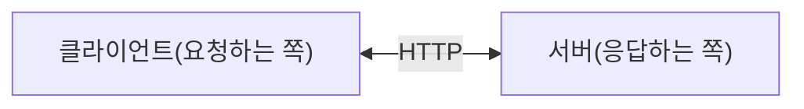
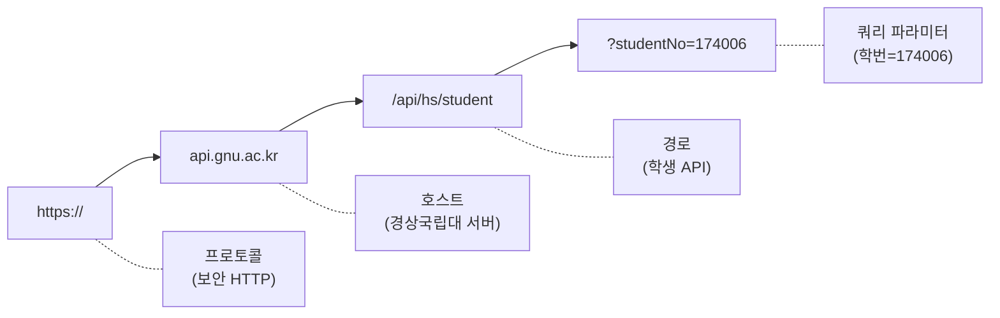
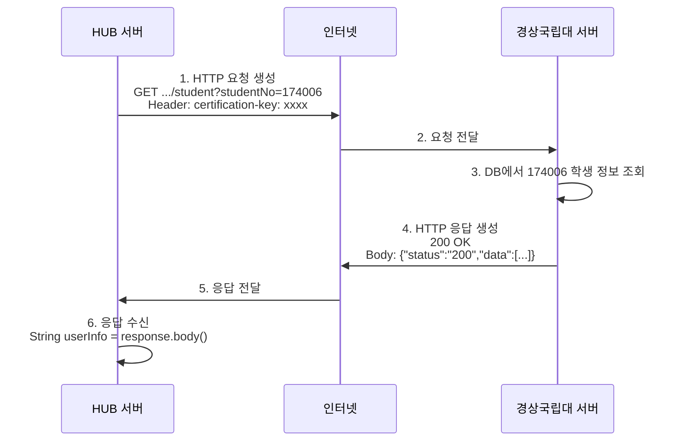
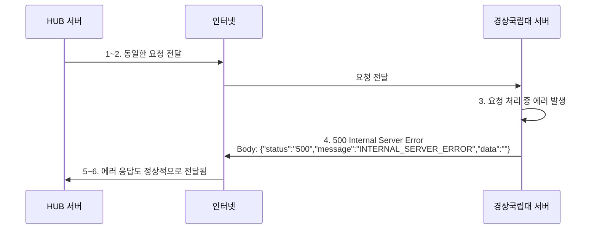

# 01. HTTP 기초 - Alpha

---

## 1. HTTP가 뭐야?

**HyperText Transfer Protocol** - 인터넷에서 데이터를 주고받는 약속(규약).

브라우저에서 네이버 열 때, 앱에서 서버에 데이터 요청할 때, 학사연동 API 호출할 때 전부 HTTP를 쓴다.



우리 HUB 시스템에서 경상국립대 API 호출하는 것도 HTTP 통신이야.
- 클라이언트 = HUB 서버
- 서버 = 경상국립대 API 서버

---

## 2. HTTP 요청 (Request)

요청은 4가지 요소로 구성된다.

### 2.1 HTTP 메서드

| 메서드 | 의미 | 예시 |
|--------|------|------|
| **GET** | 데이터 조회 (달라고 하는 거) | 학생 정보 조회 |
| **POST** | 데이터 생성 (새로 만들어달라는 거) | 회원가입 |
| **PUT** | 데이터 전체 수정 | 프로필 전체 변경 |
| **PATCH** | 데이터 일부 수정 | 이메일만 변경 |
| **DELETE** | 데이터 삭제 | 게시글 삭제 |

경상국립대 API는 **GET**만 쓴다:
```java
HttpRequest request = HttpRequest.newBuilder()
    .uri(URI.create("https://api.gnu.ac.kr/api/hs/student?studentNo=174006"))
    .header("certification-key", sync.getHeaderKey())
    .GET()    // ← GET 방식
    .build();
```

### 2.2 URL (어디로)



### 2.3 헤더 (Header)

요청에 대한 **부가 정보**. 편지의 봉투 같은 거.

```java
.header("certification-key", sync.getHeaderKey())  // API 인증키
```

주요 헤더:
| 헤더 | 의미 |
|------|------|
| `Content-Type` | 보내는 데이터 형식 (application/json 등) |
| `Authorization` | 인증 정보 (토큰, API 키) |
| `Accept` | 받고 싶은 데이터 형식 |

### 2.4 바디 (Body)

POST, PUT 등에서 보내는 **실제 데이터**. GET은 보통 바디 없음.

---

## 3. HTTP 응답 (Response)

### 3.1 상태 코드 (Status Code) - 이게 핵심

서버가 "결과가 어땠는지" 숫자로 알려주는 거야.

#### 2xx - 성공

| 코드 | 의미 | 설명 |
|------|------|------|
| **200** | OK | 정상. 요청 성공 |
| 201 | Created | 새로 만들어졌어 |
| 204 | No Content | 성공했는데 돌려줄 데이터 없어 |

#### 3xx - 리다이렉트

| 코드 | 의미 | 설명 |
|------|------|------|
| 301 | Moved Permanently | 주소 바뀜. 새 주소로 가 |
| 302 | Found | 임시로 다른 주소로 가 |

#### 4xx - 클라이언트 에러 (요청한 쪽 잘못)

| 코드 | 의미 | 설명 |
|------|------|------|
| **400** | Bad Request | 요청 형식이 잘못됐어 |
| **401** | Unauthorized | 인증 안 됐어 (로그인 해) |
| **403** | Forbidden | 권한 없어 (로그인은 됐는데 접근 불가) |
| **404** | Not Found | 그런 거 없어 (URL 틀림) |
| 405 | Method Not Allowed | GET으로 보내야 하는데 POST로 보냈어 |
| 429 | Too Many Requests | 너무 많이 요청해서 차단 |

#### 5xx - 서버 에러 (서버 쪽 잘못)

| 코드 | 의미 | 설명 |
|------|------|------|
| **500** | Internal Server Error | 서버 내부 에러. 서버가 터진 거 |
| 502 | Bad Gateway | 중간 서버(게이트웨이)가 이상한 응답 받음 |
| 503 | Service Unavailable | 서버 점검 중이거나 과부하 |
| 504 | Gateway Timeout | 중간 서버가 응답 시간 초과 |

### 3.2 핵심 구분

!!! warning "핵심 구분"
    **4xx** = 너(클라이언트)가 잘못한 거야. 요청을 고쳐.

    **5xx** = 나(서버)가 잘못한 거야. 네 잘못 아니야.

**경상국립대 API가 500을 줬다** = 경상국립대 서버 문제. 우리 요청은 정상이야.

---

## 4. HTTP 통신 전체 흐름



### 실패하는 경우



중요: **500 에러도 응답은 온다.** 연결이 끊긴 게 아니야. 서버가 "나 에러 났어"라고 응답한 거야.

---

## 5. 우리 프로젝트에서의 HTTP

### 경상국립대 API 호출 코드

```java
HttpClient client = HttpClient.newHttpClient();

String param = "?studentNo=" + sync.getStudentId();

HttpRequest request = HttpRequest.newBuilder()
    .uri(URI.create("https://api.gnu.ac.kr/api/hs/student" + param))
    .header("certification-key", sync.getHeaderKey())
    .GET()
    .build();

HttpResponse<String> response = client.send(request, HttpResponse.BodyHandlers.ofString());
return response.body();
```

한 줄씩:
1. `HttpClient` 생성 = 통신할 도구 준비
2. URL에 학번 붙임 = 어디로 보낼지 + 뭘 요청할지
3. `HttpRequest` 생성 = 요청서 작성 (URL + 인증키 + GET방식)
4. `client.send()` = 요청 보내고 응답 대기
5. `response.body()` = 응답 본문(문자열) 반환

### 정상 응답

```json
{"status":"200","data":[{"studentNo":"174006","name":"홍길동","department":"컴퓨터공학부",...}]}
```

### 에러 응답

```json
{"status":"500","message":"INTERNAL_SERVER_ERROR","data":""}
```

둘 다 **문자열**로 온다. 200이든 500이든. 그래서 파싱해서 확인해야 해.

---

## 6. 연결 자체가 안 되는 경우

500 에러와 다르게, **서버 자체에 접근이 안 되는** 경우도 있다:

```java
try {
    response = client.send(request, HttpResponse.BodyHandlers.ofString());
} catch (Exception e) {
    e.printStackTrace();  // 연결 실패, 타임아웃 등
}
```

| 상황 | HTTP 응답 | catch 발생 |
|------|----------|-----------|
| 서버 정상, 처리 성공 | 200 | X |
| 서버 정상, 내부 에러 | 500 | X |
| 서버 다운 | 없음 | O (ConnectException) |
| 네트워크 끊김 | 없음 | O (IOException) |
| 응답 시간 초과 | 없음 | O (HttpTimeoutException) |

500은 "서버가 응답은 했는데 에러"이고, catch는 "서버가 응답 자체를 못한" 거야.

---

## 확인 문제

**Q1.** HTTP 상태코드 401과 403의 차이는?

**Q2.** 경상국립대 API가 500을 반환했다. 이건 누구 잘못인가?

**Q3.** `response.body()`는 200일 때만 값이 있나?

**Q4.** 서버가 완전히 죽어있으면 500이 오나?

**Q5.** GET과 POST의 근본적인 차이는?

---

> **"상태코드도 모르면서 API 연동한다고? Not quite my tempo."**
