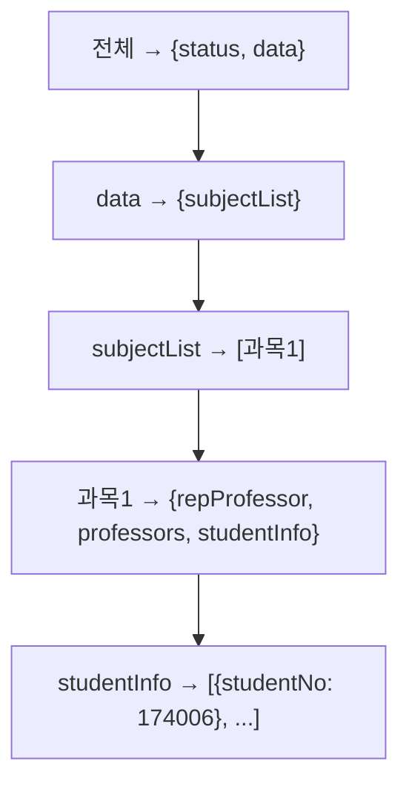

# 02. JSON 완전정복 - Alpha

---

## 1. JSON이 뭐야?

**JavaScript Object Notation** - 데이터를 주고받는 표준 형식.

사람도 읽을 수 있고, 컴퓨터도 읽을 수 있는 **텍스트 기반 데이터 형식**이야.

```json
{"name": "홍길동", "age": 25, "major": "컴퓨터공학"}
```

왜 JSON을 쓰냐? XML보다 가볍고, 거의 모든 언어에서 지원하니까. API 통신의 사실상 표준.

---

## 2. JSON 기본 문법

### 2.1 자료형 6가지

| 타입 | 예시 | 설명 |
|------|------|------|
| **문자열** | `"홍길동"` | 쌍따옴표 필수 |
| **숫자** | `25`, `3.14` | 따옴표 없음 |
| **불리언** | `true`, `false` | 참/거짓 |
| **null** | `null` | 값 없음 |
| **객체** | `{"key": "value"}` | 중괄호 `{}` |
| **배열** | `[1, 2, 3]` | 대괄호 `[]` |

### 2.2 객체 (Object) - 중괄호 `{}`

**키-값 쌍**의 모음. 순서 없음.

```json
{
  "studentNo": "174006",
  "name": "홍길동",
  "department": "컴퓨터공학부",
  "email": "hong@gnu.ac.kr"
}
```

규칙:
- 키는 반드시 **문자열** (쌍따옴표)
- 키와 값 사이는 **콜론** `:`
- 항목 사이는 **쉼표** `,`
- 마지막 항목 뒤에 쉼표 없음

### 2.3 배열 (Array) - 대괄호 `[]`

**값의 순서있는 목록**. 인덱스(순번)로 접근.

```json
[
  {"studentNo": "174006"},
  {"studentNo": "174007"},
  {"studentNo": "174008"}
]
```

규칙:
- 인덱스는 0부터 시작
- `[0]` = 첫 번째, `[1]` = 두 번째
- 서로 다른 타입도 섞을 수 있음 (비추천)

### 2.4 중첩 (Nesting)

객체 안에 객체, 배열 안에 객체 가능.

```json
{
  "status": "200",
  "data": {
    "subjectList": [
      {
        "repProfessor": "150414",
        "professors": ["150414", "150415"],
        "studentInfo": [
          {"studentNo": "174006"},
          {"studentNo": "174007"}
        ]
      }
    ]
  }
}
```

이게 **경상국립대 API 실제 응답 구조**야.

껍데기 벗기기:



---

## 3. Java에서 JSON 파싱

### 3.1 파서 준비

```java
JSONParser parser = new JSONParser();
```
→ 문자열을 JSON으로 변환할 도구.

### 3.2 파싱 (문자열 → JSON 객체)

```java
String jsonString = "{\"name\":\"홍길동\",\"age\":25}";
JSONObject jsonObject = (JSONObject) parser.parse(jsonString);
```

파서가 문자열을 한 글자씩 읽으면서:
- `{` → 객체 시작
- `"name"` → 키
- `:` → 키-값 구분
- `"홍길동"` → 값 (문자열)
- `,` → 다음 항목
- `}` → 객체 끝

### 3.3 값 꺼내기

```java
String name = (String) jsonObject.get("name");      // "홍길동"
long age = (Long) jsonObject.get("age");              // 25
```

### 3.4 중첩된 값 꺼내기

경상국립대 응답에서 학생 배열 꺼내는 과정:

```java
// 1단계: 전체 파싱
JSONObject jsonObject = (JSONObject) parser.parse(sjbRslt);

// 2단계: data 꺼내기
JSONObject dataObject = (JSONObject) jsonObject.get("data");

// 3단계: subjectList 꺼내기
JSONArray sbjArray = (JSONArray) dataObject.get("subjectList");

// 4단계: 첫 번째 과목 꺼내기
JSONObject arrObj = (JSONObject) sbjArray.get(0);

// 5단계: studentInfo 배열 꺼내기
JSONArray studentInfoArray = (JSONArray) arrObj.get("studentInfo");

// 6단계: 첫 번째 학생 학번 꺼내기
JSONObject studInfo = (JSONObject) studentInfoArray.get(0);
String studentNo = (String) studInfo.get("studentNo");  // "174006"
```

매 단계마다 **타입 캐스팅**이 필요해. 왜? `get()`은 `Object`를 반환하니까.

---

## 4. JSONObject vs JSONArray

| 구분 | JSONObject | JSONArray |
|------|-----------|-----------|
| **기호** | `{ }` | `[ ]` |
| **구조** | 키-값 쌍 | 순서있는 값 목록 |
| **접근** | `.get("키이름")` | `.get(인덱스)` |
| **예시** | `{"name":"홍길동"}` | `["홍길동","이순신"]` |
| **Java 타입** | `JSONObject` | `JSONArray` |

### 실수하기 쉬운 부분

```java
// 이거 JSONObject야? JSONArray야?
Object data = jsonObject.get("data");

// 정상 응답: JSONArray
// {"data": [{"studentNo":"174006"}]}
// → data instanceof JSONArray == true

// 에러 응답: String
// {"data": ""}
// → data instanceof JSONArray == false
// → (JSONArray) data 하면 ClassCastException!
```

이게 **경상국립대 학사연동 버그의 원인**이었어.

---

## 5. 안전한 파싱 패턴

### 5.1 나쁜 코드 (위험)

```java
JSONObject jsonObject = (JSONObject) parser.parse(userInfo);
JSONObject data = (JSONObject) jsonObject.get("data");  // 에러 응답이면 터짐!
```

### 5.2 좋은 코드 (안전)

```java
Object parsedObject = parser.parse(userInfo);  // 일단 Object로

if (parsedObject instanceof JSONObject) {      // 타입 확인
    JSONObject jsonObject = (JSONObject) parsedObject;

    if (jsonObject.get("data") instanceof JSONObject) {  // data도 타입 확인
        JSONObject data = (JSONObject) jsonObject.get("data");
        // 안전하게 사용
    }
}
```

규칙:
1. **파싱 결과는 Object로 받아라**
2. **instanceof로 타입 확인 후 캐스팅해라**
3. **중첩된 값도 매번 타입 확인해라**

---

## 6. JSON vs XML

```
JSON:
{"name": "홍길동", "age": 25}

XML:
<person>
  <name>홍길동</name>
  <age>25</age>
</person>
```

| 구분 | JSON | XML |
|------|------|-----|
| 가독성 | 좋음 | 보통 |
| 용량 | 작음 | 큼 (태그 반복) |
| 파싱 속도 | 빠름 | 느림 |
| 현재 트렌드 | 주류 | 레거시에서 사용 |

---

## 7. JSON 직렬화 / 역직렬화

| 용어 | 방향 | 설명 |
|------|------|------|
| **직렬화 (Serialize)** | 객체 → JSON 문자열 | 데이터를 보낼 때 |
| **역직렬화 (Deserialize)** | JSON 문자열 → 객체 | 데이터를 받을 때 |

우리 코드에서:
```java
// 역직렬화 (JSON 문자열 → Java 객체)
JSONObject jsonObject = (JSONObject) parser.parse(sjbRslt);

// 값 추출 후 Java 객체에 세팅
userObj.setUserName(String.valueOf(userInfoObj.get("name")));
```

---

## 확인 문제

**Q1.** `{"data": ""}` 에서 `jsonObject.get("data")`의 타입은?

**Q2.** `{"data": []}` 에서 `jsonObject.get("data")`의 타입은?

**Q3.** JSONArray에서 3번째 요소를 꺼내려면?

**Q4.** `parser.parse()`의 반환 타입을 `JSONObject`로 바로 받으면 위험한 이유는?

**Q5.** 다음 JSON에서 "174007"을 꺼내는 Java 코드를 작성하시오.
```json
{"data":{"students":[{"no":"174006"},{"no":"174007"}]}}
```

---

> **"JSON도 제대로 못 다루면서 API 연동? Were you rushing or were you dragging?"**
