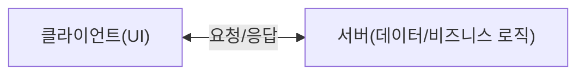
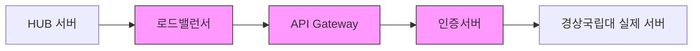
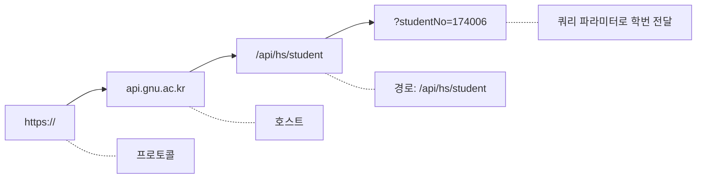
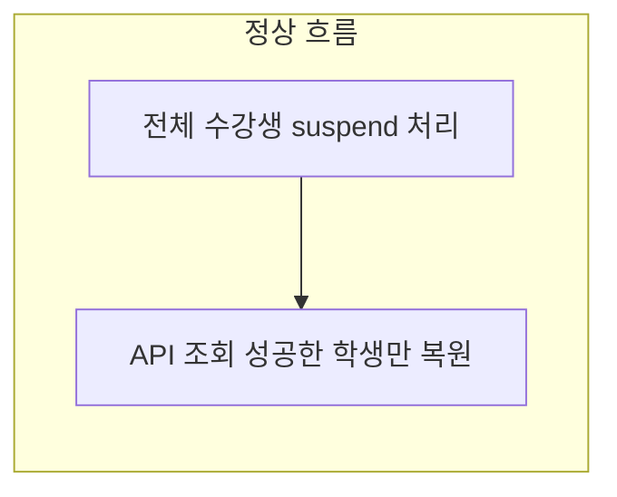
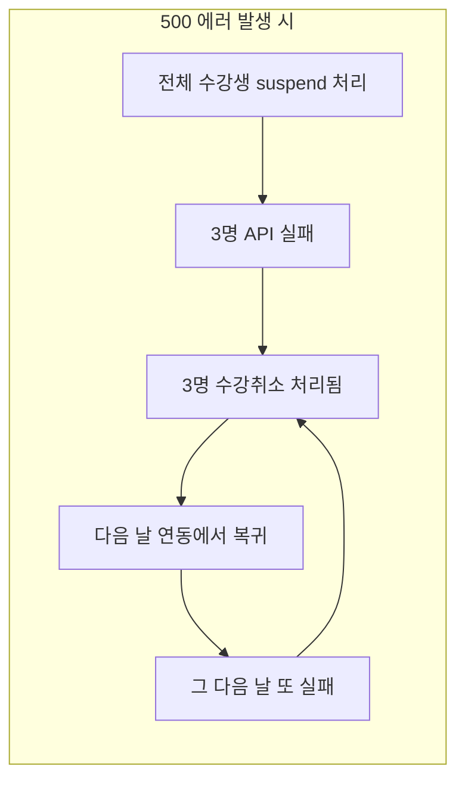

# 03. REST API 이해 - Beta

---

> **"Are you rushing or are you dragging?"**
>
> REST가 뭔지 모르면서 API 만들겠다고? 그건 악보 못 읽으면서 드럼 치겠다는 거야.
> 오늘 REST의 근본부터 실전까지 전부 알려줄 테니까, 집중해.

---

## 1. REST가 뭐야?

**RE**presentational **S**tate **T**ransfer.

직역하면 "표현 상태 전송"인데, 이렇게 외우면 멍청한 거야. 본질을 알아야 해.

### 1.1 한 줄 정의

> **웹의 자원(Resource)을 URL로 식별하고, HTTP 메서드로 조작하는 아키텍처 스타일**

"아키텍처 스타일"이지, 프로토콜이 아니야. 규약(spec)이 아니라 **설계 원칙**이야. 이거 구분 못 하면 Lv1도 안 되는 거야.

!!! abstract "핵심 개념"
    REST는 프로토콜이 아니야. 라이브러리도 아니야.
    "이렇게 설계하면 좋겠다"는 아키텍처 스타일(철학)이야.

    HTTP + REST 설계 원칙 = RESTful API

### 1.2 이름 뜯어보기

| 단어 | 의미 | 예시 |
|------|------|------|
| **Representational** | 자원의 **표현**(JSON, XML 등) | `{"studentNo":"174006","name":"홍길동"}` |
| **State** | 자원의 **상태**(현재 데이터) | 현재 학생의 학적 정보 |
| **Transfer** | 클라이언트와 서버 간 **전송** | HTTP 요청/응답 |

즉, **"자원의 상태를 표현해서 전송한다"**는 뜻이야.

### 1.3 역사

| 연도 | 사건 |
|------|------|
| 1991 | Tim Berners-Lee가 HTTP/0.9 만듦 |
| 1996 | HTTP/1.0 표준화 |
| **2000** | **Roy Fielding 박사논문에서 REST 개념 정의** |
| 2005~ | REST API가 업계 표준으로 자리잡음 |
| 현재 | 사실상 모든 웹 API가 REST 기반 |

Roy Fielding이 누구냐? HTTP/1.0, HTTP/1.1 스펙 만든 사람이야. 웹의 아키텍처를 분석해서 "왜 웹이 이렇게 잘 돌아가는가"를 정리한 게 REST야.

**핵심**: REST는 "새로 만든 기술"이 아니라 "웹이 원래 이렇게 설계되어 있었다"는 걸 체계화한 거야.

---

## 2. REST의 6가지 제약조건

REST에는 6가지 제약 조건(Constraints)이 있어. 이걸 지키면 RESTful, 안 지키면 REST "스러운 척"하는 거야.

### 2.1 Client-Server (클라이언트-서버 분리)



- 클라이언트는 데이터 저장을 모른다
- 서버는 화면 표시를 모른다
- **각자 독립적으로 발전 가능**

우리 HUB에서 경상국립대 API 호출하는 구조가 정확히 이거야:
- **클라이언트** = HUB 서버 (SyncRestTemplate)
- **서버** = 경상국립대 API 서버 (api.gnu.ac.kr)

HUB 코드를 아무리 바꿔도 경상국립대 API 서버에 영향 없고, 그 반대도 마찬가지야. 경상국립대가 DB를 Oracle에서 PostgreSQL로 바꿔도 우리 HUB 코드는 안 바꿔도 돼. 이게 Client-Server 분리의 장점이야.

### 2.2 Stateless (무상태)

> **서버는 클라이언트의 이전 요청을 기억하지 않는다**

매 요청마다 필요한 정보를 **전부** 보내야 해. "아까 보냈잖아요"는 통하지 않아.

```java
// 경상국립대 API - 매 요청마다 certification-key를 보낸다
HttpRequest request = HttpRequest.newBuilder()
    .uri(URI.create("https://api.gnu.ac.kr/api/hs/student?studentNo=174006"))
    .header("certification-key", sync.getHeaderKey())  // <- 매번 보냄
    .GET()
    .build();
```

학생 1명 조회할 때마다 인증키를 보내는 이유가 이거야. 서버가 "아 아까 인증한 사람이구나"라고 기억하지 않거든.

| 상태 유지 (Stateful) | 무상태 (Stateless) |
|----------------------|-------------------|
| "아까 로그인했잖아" | "넌 누군데? 인증 정보 줘" |
| 서버가 기억해야 함 | 요청에 필요한 정보 다 포함 |
| 서버 확장 어려움 | 서버 확장 쉬움 |

**장점**: 서버가 상태를 안 가지니까 서버 여러 대로 늘려도 됨 (수평 확장)
**단점**: 매 요청마다 인증 정보 등 부가 데이터를 보내야 하니까 데이터량이 늘어남

### 2.3 Cacheable (캐시 가능)

응답 데이터에 "이거 캐시해도 돼" 또는 "이거 캐시하면 안 돼"를 명시해야 해.

```
HTTP/1.1 200 OK
Cache-Control: max-age=3600    <- "1시간 동안 캐시해도 돼"
Content-Type: application/json
```

| 데이터 | 변경 빈도 | 캐시 적합성 |
|--------|-----------|-------------|
| 학생 목록 | 자주 안 바뀜 | 캐시 가능 |
| 실시간 출석 현황 | 자주 바뀜 | 캐시 부적합 |

경상국립대 학사연동에서 학생 정보를 매번 새로 가져오는 이유? 학적 데이터는 실시간 변경될 수 있으니까 캐시하면 안 되는 거야. 캐시했다가 휴학 처리된 학생이 수강생으로 남아있으면? 사고야.

### 2.4 Uniform Interface (일관된 인터페이스)

REST의 핵심 중의 핵심. **모든 자원에 대해 동일한 방식으로 접근한다.**

4가지 세부 원칙이 있어:

| 원칙 | 설명 | 예시 |
|------|------|------|
| **리소스 식별** | URL로 자원을 식별 | `/students/174006` |
| **표현을 통한 조작** | JSON/XML 등으로 리소스를 표현 | `{"studentNo":"174006","name":"홍길동"}` |
| **자기 서술적 메시지** | 메시지만 봐도 뭘 해야 하는지 알 수 있음 | `Content-Type: application/json` |
| **HATEOAS** | 응답에 다음 행동 링크 포함 | `"links": {"next": "/students?page=2"}` |

이게 지켜지면 한 번 배운 패턴이 모든 자원에 동일하게 적용돼:

| 자원 | 동작 | 메서드 | URL |
|------|------|--------|-----|
| 학생 | 조회 | GET | `/students/174006` |
| 학생 | 생성 | POST | `/students` |
| 학생 | 수정 | PUT | `/students/174006` |
| 학생 | 삭제 | DELETE | `/students/174006` |
| 과목 | 조회 | GET | `/courses/CS101` |
| 과목 | 생성 | POST | `/courses` |
| 과목 | 수정 | PUT | `/courses/CS101` |
| 과목 | 삭제 | DELETE | `/courses/CS101` |

학생이든 과목이든 패턴이 동일해. 이게 Uniform Interface야.

### 2.5 Layered System (계층화 시스템)

클라이언트는 서버까지 중간에 몇 개의 레이어가 있는지 모른다.



!!! info "계층 투명성"
    클라이언트(HUB 서버)는 중간의 로드밸런서, API Gateway, 인증서버의 존재를 모른다.

HUB는 그냥 `api.gnu.ac.kr`로 요청만 보낼 뿐, 뒤에서 무슨 일이 일어나는지 모르고, 알 필요도 없어.

### 2.6 Code on Demand (선택사항)

서버가 클라이언트에게 실행 가능한 코드를 보내줄 수 있다. JavaScript가 대표적이야.

```html
<!-- 서버가 보내준 코드를 클라이언트가 실행 -->
<script src="https://example.com/app.js"></script>
```

이건 REST의 유일한 **선택적** 원칙이야. 안 지켜도 RESTful이라고 할 수 있어. API 통신에서는 거의 안 쓴다고 보면 돼.

### 6가지 정리

| 제약조건 | 핵심 | 필수 여부 |
|----------|------|-----------|
| Client-Server | 역할 분리, 독립 발전 | 필수 |
| Stateless | 요청마다 독립적, 상태 안 가짐 | 필수 |
| Cacheable | 응답 캐시 여부 명시 | 필수 |
| Uniform Interface | 일관된 접근 방식 | 필수 |
| Layered System | 계층 구조 허용 | 필수 |
| Code on Demand | 실행 코드 전송 | **선택** |

---

## 3. RESTful API 설계 원칙

원칙은 알았으니, 이제 실전이야. API를 어떻게 **설계**하는지.

### 3.1 리소스 중심 설계 - 명사 사용, 동사 금지

핵심 규칙: **URL은 동사가 아니라 명사로 쓴다.**

"뭘 할지"는 HTTP 메서드가 말한다. URL은 **"무엇을"** 만 말해라.

| 잘못된 설계 (동사) | 올바른 설계 (명사) | 이유 |
|--------------------|--------------------|------|
| `GET /getStudents` | `GET /students` | 동사(get) 빼. GET이 이미 "조회"야 |
| `POST /createStudent` | `POST /students` | HTTP 메서드가 동사 역할 |
| `POST /deleteStudent/174006` | `DELETE /students/174006` | DELETE 메서드 써 |
| `GET /getStudentCourses` | `GET /students/174006/courses` | 계층 관계로 표현 |
| `POST /updateStudentEmail` | `PATCH /students/174006` | PATCH 메서드 써 |

### 3.2 HTTP 메서드 활용 (GET/POST/PUT/PATCH/DELETE)

| 메서드 | 역할 | 멱등성 | 안전성 | 예시 |
|--------|------|--------|--------|------|
| **GET** | 조회 | O | O | 학생 정보 조회 |
| **POST** | 생성 | X | X | 학생 등록 |
| **PUT** | 전체 수정 | O | X | 학생 정보 전체 변경 |
| **PATCH** | 일부 수정 | X | X | 이메일만 변경 |
| **DELETE** | 삭제 | O | X | 학생 삭제 |

**멱등성(Idempotent)** = 같은 요청을 여러 번 보내도 결과가 같다.

| 요청 | 결과 | 멱등? |
|------|------|-------|
| `GET /students/174006` | 10번 보내도 같은 학생 정보 반환 | 멱등 |
| `DELETE /students/174006` | 한 번 삭제하면 끝. 또 보내도 "없음" | 멱등 |
| `POST /students` | 보낼 때마다 새 학생 생성 | 멱등 아님 |

**안전성(Safe)** = 서버 데이터를 변경하지 않는다. GET만 안전해.

경상국립대 API는 **GET만** 쓴다. 왜? 우리는 데이터를 **조회**만 하니까. 학생 정보를 수정하거나 삭제할 권한이 없잖아.

### 3.3 URL 설계 패턴

```
/students                           -> 학생 전체 목록
/students/174006                    -> 특정 학생 (학번 174006)
/students/174006/courses            -> 특정 학생의 수강 과목 목록
/students/174006/courses/CS101      -> 특정 학생의 특정 수강 과목

/courses                            -> 과목 전체 목록
/courses/CS101                      -> 특정 과목
/courses/CS101/students             -> 특정 과목의 수강생 목록
```

URL 설계 규칙:

| 규칙 | 올바른 예 | 잘못된 예 |
|------|-----------|-----------|
| 복수형 사용 | `/students` | `/student` |
| 소문자 사용 | `/students` | `/Students` |
| 하이픈(-) 사용 | `/course-reviews` | `/courseReviews`, `/course_reviews` |
| 동사 금지 | `DELETE /students/1` | `POST /deleteStudent` |
| 계층 관계 표현 | `/students/1/courses` | `/studentCourses?id=1` |
| 슬래시 끝 금지 | `/students` | `/students/` |

### 3.4 CRUD 매핑 전체 정리

학생(Student) 자원에 대한 RESTful API 전체 설계:

| 동작 | 메서드 | URL | 응답 |
|------|--------|-----|------|
| 목록 조회 | GET | `/students` | 200 OK + [학생배열] |
| 단건 조회 | GET | `/students/174006` | 200 OK + {학생} |
| 생성 | POST | `/students` | 201 Created + {생성된 학생} |
| 전체 수정 | PUT | `/students/174006` | 200 OK + {수정된 학생} |
| 부분 수정 | PATCH | `/students/174006` | 200 OK + {수정된 학생} |
| 삭제 | DELETE | `/students/174006` | 204 No Content |

---

## 4. 경상국립대 API는 RESTful한가? 분석

이론은 끝. 이제 진짜 실전이야. 경상국립대 학사연동 API를 뜯어보자.

### 4.1 실제 API 구조



### 4.2 RESTful 체크리스트

| 원칙 | RESTful 기준 | 경상국립대 실제 | 판정 |
|------|-------------|----------------|------|
| 복수형 사용 | `/students` | `/student` (단수형) | X |
| 경로 파라미터로 식별 | `/students/174006` | `?studentNo=174006` (쿼리) | X |
| HTTP 메서드 다양화 | GET/POST/PUT/DELETE | GET만 사용 | 부분적 |
| 계층적 자원 구조 | `/students/{id}/courses` | `/api/hs/openSubjectStudents?year=...` | X |
| HTTP 상태 코드 활용 | 404, 500 등 HTTP 코드 | 항상 200 + body에 status | X |
| 도메인 분리 | 도메인별 경로 | `/api/hs/`, `/api/hr/` | O |
| 명사 기반 URL | 동사 금지 | `student`, `employee` (명사) | O |

**결론: 엄밀히 RESTful하지 않다.** 하지만 그렇다고 나쁜 API는 아니야. 현실의 API는 완벽한 REST를 지키는 경우가 드물어. 이 정도면 "REST-like" 정도야.

### 4.3 쿼리 파라미터 vs 경로 파라미터

이거 구분 못 하면 API 설계를 논할 자격이 없어.

!!! example "경로 파라미터 (Path Parameter)"
    `GET /students/174006`

    -> "174006번 학생"이라는 자원 자체를 식별

!!! example "쿼리 파라미터 (Query Parameter)"
    `GET /students?studentNo=174006`

    -> "학생 목록에서 174006을 검색/필터링"

| 구분 | 경로 파라미터 | 쿼리 파라미터 |
|------|-------------|-------------|
| **용도** | 자원 **식별** (이것을 달라) | 자원 **필터링/검색** (이 조건으로 걸러달라) |
| **필수 여부** | 필수 (없으면 다른 자원) | 선택 (없어도 동작) |
| **예시** | `/students/174006` | `/students?department=CS&year=3` |
| **의미** | "174006번 학생을 줘" | "CS학과 3학년 학생들을 줘" |
| **URL 정체성** | URL이 곧 자원의 ID | URL은 같고 조건만 다름 |

경상국립대는 자원 식별에 쿼리 파라미터를 쓰고 있어. RESTful 관점에서는 경로 파라미터가 맞아.

| 구분 | URL |
|------|-----|
| 경상국립대 현재 | `GET /api/hs/student?studentNo=174006` |
| RESTful하게 바꾸면 | `GET /api/hs/students/174006` |

쿼리 파라미터가 올바른 경우는 **필터링/정렬/페이징**:
```
GET /api/hs/students?department=CS&year=3&page=1&size=20
```

### 4.4 단건 조회만 지원하는 문제점

경상국립대의 가장 큰 문제. 학번 하나로 학생 한 명만 조회할 수 있어.

```java
// 학생 1명 조회 - 이게 전부야
public String getKsnuUserInfo(Sync sync) throws Exception {
    HttpClient client = HttpClient.newHttpClient();
    String param = "?studentNo=" + sync.getStudentId();  // 학번 1개
    HttpRequest request = HttpRequest.newBuilder()
        .uri(URI.create("https://api.gnu.ac.kr/api/hs/student" + param))
        .header("certification-key", sync.getHeaderKey())
        .GET()
        .build();
    HttpResponse<String> response = client.send(request, HttpResponse.BodyHandlers.ofString());
    return response.body();
}
```

학생 300명의 정보를 가져오려면?

```java
// 300번 반복 호출해야 한다
for (String studentNo : studentList) {
    String param = "?studentNo=" + studentNo;
    HttpRequest request = HttpRequest.newBuilder()
        .uri(URI.create("https://api.gnu.ac.kr/api/hs/student" + param))
        .header("certification-key", sync.getHeaderKey())
        .GET()
        .build();
    HttpResponse<String> response = client.send(request, ...);
    // 1명씩 처리...
}
```

**300명 = 300번 HTTP 요청.** 이게 왜 심각한 문제인지 다음 섹션에서 자세히 본다.

### 4.5 상태 코드 문제

```json
// 경상국립대 정상 응답 - HTTP 상태 코드: 200
{"status":"200","data":[{"studentNo":"174006","name":"홍길동"}]}

// 경상국립대 에러 응답 - HTTP 상태 코드: 200 (여기가 문제!)
{"status":"500","message":"INTERNAL_SERVER_ERROR","data":""}
```

HTTP 상태 코드는 200인데, body 안에 status가 500이야. 이건 REST 관점에서 잘못된 설계야. 7장에서 자세히 다룬다.

---

## 5. 리스트 조회 API vs 단건 조회 API

### 5.1 두 가지 패턴

| 패턴 | 메서드 | URL | 결과 |
|------|--------|-----|------|
| 리스트 조회 | GET | `/students` | 학생 전체 목록 (한 번에) |
| 단건 조회 | GET | `/students/174006` | 학생 1명 |

제대로 된 API는 둘 다 지원해야 해. 경상국립대는 단건만 지원한다.

### 5.2 성능 차이 - N+1 문제와의 유사성

DB에서 유명한 N+1 문제와 구조가 똑같아.

!!! example "N+1 문제 (DB)"
    1. `SELECT * FROM courses WHERE professor_id = 1` (과목 목록 조회: 1번)
    2. `SELECT * FROM students WHERE course_id = 101` (수강생 조회: N번)
    3. `SELECT * FROM students WHERE course_id = 102`
    4. `SELECT * FROM students WHERE course_id = 103`

    총 **1 + N번** 쿼리

!!! example "경상국립대 API (HTTP)"
    1. 과목 조회 API로 학번 리스트 받기 (1번)
    2. `GET /api/hs/student?studentNo=174001` (300번)
    3. `GET /api/hs/student?studentNo=174002`
    4. `GET /api/hs/student?studentNo=174003`

    총 **1 + 300번** HTTP 요청

DB의 N+1은 같은 서버 안에서 일어나서 그나마 빠르지만, HTTP의 N+1은 **네트워크를 300번 왕복**하니까 차원이 다른 문제야.

### 5.3 숫자로 보는 성능 차이

| 항목 | 리스트 조회 (이상적) | 단건 반복 조회 (현실) |
|------|---------------------|---------------------|
| HTTP 요청 수 | **1번** | **300번** |
| 네트워크 왕복 (RTT) | 1회 | 300회 |
| TCP 연결 비용 | 1회 | 300회 (또는 Keep-Alive) |
| 총 소요 시간 (추정) | **0.5초** | **30~60초** |
| 서버 부하 | 낮음 | 높음 |
| 실패 확률 | 매우 낮음 | **매우 높음** |

300번 중에 1번이라도 실패하면? 그 학생 정보가 누락되는 거야.

### 5.4 경상국립대가 리스트 조회 API가 있었다면?

!!! danger "현재 (단건만)"
    `GET /api/hs/student?studentNo=174001` -> 1명

    `GET /api/hs/student?studentNo=174002` -> 1명

    ... (300번 반복)

!!! success "이상적인 설계 A - 과목 기반 리스트 조회"
    `GET /api/hs/students?courseId=CS101` -> 300명 한 번에

!!! success "이상적인 설계 B - Batch 조회"
    `POST /api/hs/students/batch`

    Body: `{"studentNos": ["174001","174002","174003",...]}`

    -> 300명 한 번에

!!! success "이상적인 설계 C - 기존 API에 상세 옵션 추가"
    `GET /api/hs/openSubjectStudents?subjectCode=CS101&includeDetail=true`

    -> 수강생 학번 + 상세정보 한 번에 수신

코드가 어떻게 바뀌는지 보자:

```java
// 현재 코드 - 300번 반복 호출
for (int i = 0; i < studentInfoArray.size(); i++) {
    JSONObject studInfo = (JSONObject) studentInfoArray.get(i);
    String studentNo = (String) studInfo.get("studentNo");
    obj.setStudentId(studentNo);

    // 1명씩 API 호출 (300번 반복!)
    String userInfo = this.syncRestTemplate.getKsnuUserInfo(obj);

    // 실패 시 재시도 로직 (3회)
    for (int retry = 0; retry < 3; retry++) {
        if (userInfo != null && userInfo.contains("\"status\":\"200\"")) break;
        Thread.sleep(1000);
        userInfo = this.syncRestTemplate.getKsnuUserInfo(obj);
    }
    // 파싱, 매핑...
}

// 리스트 조회가 있었다면 - 1번 호출
String allStudents = this.syncRestTemplate.getKsnuStudentList(obj);
JSONArray studentArray = (JSONArray) parser.parse(allStudents);
for (int i = 0; i < studentArray.size(); i++) {
    // 이미 상세 정보가 다 들어있으니까 바로 매핑
    JSONObject student = (JSONObject) studentArray.get(i);
    userObj.setUserName(String.valueOf(student.get("name")));
    userObj.setEmail(String.valueOf(student.get("email")));
}
```

300번 요청이 1번으로 줄어. 재시도 로직도 필요 없어. **이게 리스트 조회 API의 위력이야.**

### 5.5 실제로 터진 사고





**매 실행 시 랜덤으로 3~6명이 수강취소** 되는 문제가 발생했어. 이게 API 설계가 나쁘면 생기는 현실 세계의 문제야.

### 5.6 우리가 할 수 있는 완화 전략

경상국립대 API 설계를 바꿀 수는 없어 (그쪽 서버니까). 우리가 할 수 있는 건:

| 전략 | 방법 | 효과 | 현재 구현 |
|------|------|------|-----------|
| 재시도 로직 | 실패 시 3회 재시도 | 간헐적 실패 대응 | O |
| 에러 로깅 | 실패 학생 기록 | 문제 추적 가능 | O |
| 변경분만 조회 | 기존 데이터와 diff | 요청 수 대폭 감소 | X |
| 병렬 요청 | CompletableFuture | 시간 단축 | X |
| 캐싱 | 한 번 조회한 학생 캐시 | 재조회 시 요청 안 함 | X |

!!! tip "레벨 차이"
    이건 우리 코드 문제가 아니야. API 설계 문제야.
    하지만 "API가 그래서 어쩔 수 없어요"로 끝내면 Lv1이야.
    어떻게 완화(mitigation)할 수 있는지 고민하는 게 Lv4야.

---

## 6. API 버전 관리 (/v1/, /v2/)

API는 한 번 공개하면 함부로 바꿀 수 없어. 이미 쓰고 있는 클라이언트가 있으니까.

### 6.1 왜 버전 관리가 필요한가?

!!! danger "버전 관리 없이 응답 구조가 바뀌면?"
    **v1:** `GET /api/hs/student?studentNo=174006`

    응답: `{"studentNo":"174006","name":"홍길동","department":"컴퓨터공학부"}`

    어느 날 경상국립대가 응답 구조를 바꿈:

    **v2:** `GET /api/hs/student?studentNo=174006`

    응답: `{"student":{"no":"174006","fullName":"홍길동","dept":{"code":"CS","name":"컴퓨터공학부"}}}`

    -> 기존 코드 전부 터짐! 필드명이 바뀌었으니까!

### 6.2 버전 관리 방법 3가지

| 방법 | 예시 | 장점 | 단점 |
|------|------|------|------|
| **URL 경로** (가장 일반적) | `/v1/students`, `/v2/students` | 명확, 직관적 | URL이 바뀜 |
| **쿼리 파라미터** | `/students?version=2` | URL 깔끔 | 놓치기 쉬움 |
| **헤더** | `Accept: application/vnd.api.v2+json` | URL 깔끔 | 복잡, 테스트 어려움 |

가장 많이 쓰는 건 **URL 경로 방식**이야.

!!! note "URL 경로 방식 버전 관리"
    **v1 사용자 (기존):**
    `GET /v1/students/174006` -> 기존 응답 형식 그대로

    **v2 사용자 (신규):**
    `GET /v2/students/174006` -> 새로운 응답 형식

    두 버전이 동시에 운영됨. 기존 사용자는 안 깨짐.

### 6.3 유명 API들의 버전 관리

| API | 방식 | URL/헤더 |
|-----|------|----------|
| GitHub API | URL 경로 | `https://api.github.com/v3/repos/owner/repo` |
| Google Maps API | URL 경로 | `https://maps.googleapis.com/maps/api/v1/geocode` |
| Stripe API | 헤더 방식 | `Stripe-Version: 2023-10-16` |
| Kakao API | URL 경로 | `https://dapi.kakao.com/v2/search/web` |

### 6.4 경상국립대 API에 버전이 없는 문제

!!! warning "경상국립대 API에 버전이 없는 문제"
    현재: `https://api.gnu.ac.kr/api/hs/student` - 버전 없음.

    어느 날 응답 구조가 바뀌면?

    - 우리 코드가 터진다.
    - 경상국립대에서 "바꿨어요~" 연락 올 때까지 모른다.
    - 사전에 대응할 방법이 없다.

방어 코딩의 중요성:
```java
// 나쁜 코드 - 필드가 있다고 확신
userObj.setUserName(String.valueOf(userInfoObj.get("name")));

// 좋은 코드 - 필드가 없을 수 있다는 가정
Object name = userInfoObj.get("name");
if (name != null) {
    userObj.setUserName(String.valueOf(name));
} else {
    log.warn("name 필드 없음. API 응답 구조 변경 확인 필요. studentNo={}", studentNo);
}
```

API에 버전 관리가 없으면, **클라이언트가 방어 코딩으로 자체 방어**해야 해. 이건 좋은 상황이 아니지만, 현실이야.

---

## 7. 상태 코드 활용 (REST 관점에서)

01장에서 상태 코드를 배웠어. 이번에는 **REST API 설계 관점**에서 어떻게 써야 하는지 보자.

### 7.1 CRUD별 권장 상태 코드

| 동작 | 메서드 | 성공 코드 | 응답 body |
|------|--------|----------|-----------|
| 목록 조회 | GET | **200** OK | 배열 |
| 단건 조회 | GET | **200** OK | 객체 |
| 단건 조회 (없음) | GET | **404** Not Found | 에러 메시지 |
| 생성 | POST | **201** Created | 생성된 객체 |
| 전체 수정 | PUT | **200** OK | 수정된 객체 |
| 부분 수정 | PATCH | **200** OK | 수정된 객체 |
| 삭제 | DELETE | **204** No Content | 없음 |

### 7.2 에러 상황별 상태 코드

| 상황 | 코드 | 예시 |
|------|------|------|
| 잘못된 요청 형식 | **400** Bad Request | JSON 깨짐, 필수값 누락 |
| 인증 안 됨 | **401** Unauthorized | API 키 없음, 만료 |
| 권한 없음 | **403** Forbidden | 인증은 됐는데 접근 불가 |
| 자원 없음 | **404** Not Found | 해당 학번의 학생이 없음 |
| 메서드 불일치 | **405** Method Not Allowed | GET만 되는데 POST로 보냄 |
| 요청 너무 많음 | **429** Too Many Requests | Rate Limit 초과 |
| 서버 에러 | **500** Internal Server Error | 서버 내부 오류 |

### 7.3 경상국립대 vs RESTful 상태 코드 비교

이게 핵심이야. 잘 봐.

| 상황 | 경상국립대 | RESTful |
|------|-----------|---------|
| 학생 조회 성공 | HTTP 200 + `{"status":"200","data":[...]}` | HTTP 200 + `[{"studentNo":"174006",...}]` |
| 학생 없음 | HTTP 200 + `{"status":"404","message":"NOT_FOUND","data":""}` | HTTP 404 + `{"error":"Student not found"}` |
| 인증 실패 | HTTP 200 + `{"status":"401","message":"UNAUTHORIZED","data":""}` | HTTP 401 + `{"error":"Invalid certification key"}` |
| 서버 에러 | HTTP 200 + `{"status":"500","message":"INTERNAL_SERVER_ERROR","data":""}` | HTTP 500 + `{"error":"Internal server error"}` |

차이가 보여?

RESTful 방식은 **HTTP 상태 코드만 보고** 바로 판단 가능:
```java
int statusCode = response.statusCode();
if (statusCode == 200) {
    // 성공 처리
} else if (statusCode == 404) {
    // 학생 없음
} else if (statusCode == 401) {
    // 인증 실패
} else if (statusCode >= 500) {
    // 서버 에러
}
```

경상국립대 방식은 **body를 파싱한 후에야** 판단 가능:
```java
int statusCode = response.statusCode();  // 항상 200!
// statusCode만으로는 판단 불가!

JSONObject json = (JSONObject) parser.parse(response.body());
String innerStatus = (String) json.get("status");  // 여기서야 알 수 있음
if ("200".equals(innerStatus)) {
    // 성공 처리
} else if ("500".equals(innerStatus)) {
    // 서버 에러... 인데 HTTP 자체는 200이야
}
```

### 7.4 그래서 경상국립대 방식이 완전히 나쁜 거야?

반드시 그런 건 아니야. 현실에는 이유가 있어.

| 관점 | RESTful (HTTP 상태 코드) | 경상국립대 (body 상태 코드) |
|------|-------------------------|--------------------------|
| **판단 편의성** | HTTP 코드만 보면 됨 | body 파싱 필수 |
| **프록시/로드밸런서** | 자동으로 에러 감지 가능 | 200으로 보여서 감지 불가 |
| **에러 세분화** | HTTP 코드로 대분류만 가능 | 커스텀 코드로 세분화 가능 |
| **호환성** | 표준 | 독자 규격 |

실무에서 흔한 **혼합 패턴**:
```json
// HTTP 200 OK (대분류: 성공)
{
  "code": 1001,
  "message": "Student not enrolled in this semester",
  "data": null
}
```

HTTP 상태 코드는 **대분류**(성공/실패), body의 code는 **세분류**(구체적 에러 종류)로 쓰는 패턴이야. 이건 나름 합리적인 설계야.

---

## 8. 확인 문제

### 문제 1.
다음 API URL 중 RESTful한 것을 고르고, 나머지가 왜 틀렸는지 설명하시오.
```
A. GET  /getStudentInfo?id=174006
B. GET  /students/174006
C. POST /deleteStudent/174006
D. GET  /student?studentNo=174006
```

### 문제 2.
경상국립대 API `GET /api/hs/student?studentNo=174006`에서 RESTful하지 않은 부분을 3가지 이상 찾고, 각각 어떻게 고치면 되는지 작성하시오.

### 문제 3.
수강생 500명의 정보를 가져와야 한다. 경상국립대처럼 단건 조회 API만 있을 때와, 리스트 조회 API가 있을 때의 차이를 HTTP 요청 수, 소요 시간, 실패 확률 관점에서 비교하시오.

### 문제 4.
경상국립대 API가 에러 시 HTTP 200 + body에 `{"status":"500"}`을 반환한다. RESTful API가 HTTP 500을 반환하는 것과 비교하여, 각각의 장단점을 서술하시오.

### 문제 5.
REST의 6가지 제약조건 중 "Stateless(무상태)"를 경상국립대 API 호출 코드를 예시로 들어 설명하시오. 매 요청마다 `certification-key`를 보내는 이유를 Stateless 관점에서 작성할 것.

---

> **"API 설계도 모르면서 연동한다고? URL에 동사 넣고, 상태 코드 무시하고, 단건 조회로 300번 때리는 게 설계야? 그건 설계가 아니라 주먹구구야. 자원이 뭔지, 메서드가 뭔지, 왜 그렇게 해야 하는지 근본부터 다시 생각해. Not quite my tempo."**
