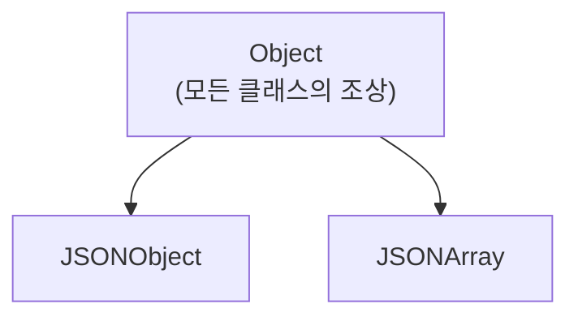
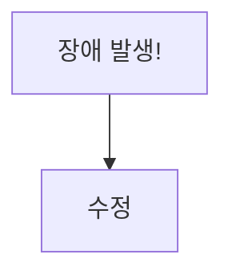

# 04. Java 타입캐스팅과 instanceof - Beta

---

## 1. 자바 타입 시스템 기초

자바의 모든 변수에는 **타입**이 있어. 타입 없이 값을 넣는 건 불가능해.

### 1.1 기본형 (Primitive Type)

값 자체를 직접 저장하는 타입. 8개 뿐이야.

| 타입 | 크기 | 예시 |
|------|------|------|
| `byte` | 1바이트 | `byte b = 127;` |
| `short` | 2바이트 | `short s = 32000;` |
| `int` | 4바이트 | `int i = 2147483647;` |
| `long` | 8바이트 | `long l = 100L;` |
| `float` | 4바이트 | `float f = 3.14f;` |
| `double` | 8바이트 | `double d = 3.14;` |
| `char` | 2바이트 | `char c = 'A';` |
| `boolean` | 1비트 | `boolean b = true;` |

### 1.2 참조형 (Reference Type)

**객체의 주소(참조)**를 저장하는 타입. 기본형 8개 빼고 전부 다.

```java
String name = "홍길동";          // String은 참조형
JSONObject json = new JSONObject(); // JSONObject도 참조형
Object obj = parser.parse(data);    // Object도 참조형
```

### 1.3 핵심 차이

| 구분 | 기본형 | 참조형 |
|------|--------|--------|
| **저장** | 값 자체 | 객체의 메모리 주소 |
| **기본값** | 0, false 등 | `null` |
| **상속** | 없음 | 있음 (Object가 최상위) |
| **캐스팅** | 자동/강제 (값 변환) | 업캐스팅/다운캐스팅 (참조 변환) |

기본형 캐스팅은 값을 바꾸는 거고, 참조형 캐스팅은 **바라보는 시각을 바꾸는 거야**.
이 차이를 모르면 뒤에 나오는 모든 내용이 안 들어와.

---

## 2. 업캐스팅 / 다운캐스팅

### 2.1 자바 클래스 계층 구조

자바의 모든 클래스는 `Object`를 상속받아.



`json-simple` 라이브러리 기준:
- `JSONObject`는 `Object`의 자식
- `JSONArray`도 `Object`의 자식
- `String`도 `Object`의 자식

**모든 게 Object의 자식이야.** 이게 핵심이야.

### 2.2 업캐스팅 (Upcasting) - 자식 → 부모

자식 타입을 부모 타입 변수에 넣는 것. **자동으로 됨.**

```java
JSONObject json = new JSONObject();
Object obj = json;  // 업캐스팅 - 자동. 캐스팅 연산자 필요 없음.
```

왜 자동이야? **자식은 부모가 가진 모든 기능을 갖고 있으니까.**
JSONObject는 Object이기도 해. 당연히 Object 변수에 담을 수 있어.

비유: 강아지는 동물이다. `동물 a = new 강아지();` 문제없어.

### 2.3 다운캐스팅 (Downcasting) - 부모 → 자식

부모 타입을 자식 타입으로 바꾸는 것. **수동으로 해야 됨.**

```java
Object obj = parser.parse(jsonString);  // parse()는 Object를 반환
JSONObject json = (JSONObject) obj;     // 다운캐스팅 - 명시적으로 (JSONObject) 필요
```

왜 수동이야? **부모가 진짜 그 자식인지 보장 못 하니까.**
Object 변수 안에 JSONObject가 들어있을 수도 있고, JSONArray가 들어있을 수도 있고, String이 들어있을 수도 있어.

비유: 동물이 강아지인가? 고양이일 수도 있잖아. **확인해야 돼.**

```java
Object obj = parser.parse(data);

// obj 안에 뭐가 있는지 모르는 상태
// JSONObject일 수도, JSONArray일 수도, String일 수도 있어
// 확인 안 하고 캐스팅하면? → ClassCastException 터져.
```

---

## 3. instanceof 연산자

### 3.1 왜 필요해?

다운캐스팅 전에 **"이 변수 안에 진짜 그 타입이 들어있어?"** 확인하는 거야.

확인 안 하고 캐스팅하면 **런타임에 프로그램이 터져.** 컴파일할 때는 안 잡혀. 실행해야 터져. 그게 제일 위험한 버그야.

### 3.2 문법

```java
변수 instanceof 타입
```

반환값: `true` 또는 `false`

```java
Object obj = parser.parse(data);

obj instanceof JSONObject   // obj 안에 JSONObject가 있으면 true
obj instanceof JSONArray    // obj 안에 JSONArray가 있으면 true
obj instanceof String       // obj 안에 String이 있으면 true
```

### 3.3 특성

```java
// 1. null은 항상 false
null instanceof JSONObject  // false

// 2. 부모 타입도 true
JSONObject json = new JSONObject();
json instanceof JSONObject  // true
json instanceof Object      // true (JSONObject는 Object이기도 하니까)

// 3. 형제 타입은 false
JSONObject json = new JSONObject();
json instanceof JSONArray   // false (JSONObject는 JSONArray가 아니야)
```

### 3.4 instanceof가 없던 시절

```java
// instanceof 없이 캐스팅하면?
Object obj = parser.parse(data);
JSONObject json = (JSONObject) obj;  // 기도하면서 캐스팅

// data가 "[]" (배열)이었으면?
// → ClassCastException 터짐
// → 프로그램 죽음
// → 새벽 3시에 전화 옴
```

---

## 4. ClassCastException

### 4.1 이게 뭐야?

타입이 안 맞는데 강제로 캐스팅하면 발생하는 **런타임 예외**.

```java
Object obj = new JSONArray();              // 실제로는 JSONArray가 들어있어
JSONObject json = (JSONObject) obj;        // JSONObject로 캐스팅?
// → ClassCastException: JSONArray cannot be cast to JSONObject
```

### 4.2 왜 위험해?

1. **컴파일 시점에 안 잡혀** - 빌드는 성공해. 배포도 돼. 실행하다가 터져.
2. **특정 조건에서만 발생** - 정상 응답일 때는 안 터지고, 에러 응답일 때만 터져.
3. **테스트에서 놓치기 쉬워** - 정상 케이스만 테스트하면 모르고 넘어감.

### 4.3 실제 발생 사례 - 경상국립대 SyncService.java

우리 코드에서 **실제로 터졌던 상황**이야.

경상국립대 API는 정상 응답과 에러 응답의 **data 타입이 다르게** 와:

```json
// 정상 응답 - data가 JSONObject
{"status": "200", "data": {"subjectList": [...]}}

// 에러 응답 - data가 String (빈 문자열)
{"status": "200", "data": ""}

// 또 다른 에러 - data 자체가 null
{"status": "200", "data": null}
```

수정 전 코드 (SyncService.java 472번째 줄 근처):

```java
JSONObject jsonObject = (JSONObject) parser.parse(sjbRslt);
JSONObject dataObject = (JSONObject) jsonObject.get("data");  // 여기서 터짐!
```

`data`가 `""`(빈 문자열)로 오면? `String`을 `JSONObject`로 캐스팅하는 꼴이야.
→ **ClassCastException** 발생.

이걸 **instanceof 체크 없이 직접 캐스팅했기 때문에** 터진 거야.

### 4.4 방지법

```java
// instanceof로 먼저 확인하고 캐스팅
if (jsonObject.get("data") instanceof JSONObject) {
    JSONObject dataObject = (JSONObject) jsonObject.get("data");
    // 안전하게 사용
}
```

단순하지? 근데 이 한 줄 안 넣어서 새벽에 장애 터진 거야.

---

## 5. Object 타입으로 받는 이유 - 다형성

### 5.1 parser.parse()가 Object를 반환하는 이유

`JSONParser.parse()` 메서드 시그니처:

```java
public Object parse(String s) throws ParseException
```

반환 타입이 `Object`야. 왜?

**파싱 결과가 뭐가 될지 모르니까.**

| 입력 문자열 | 파싱 결과 타입 |
|-------------|----------------|
| `{"name":"홍길동"}` | `JSONObject` |
| `[1, 2, 3]` | `JSONArray` |
| `"문자열"` | `String` |
| `123` | `Long` |
| `true` | `Boolean` |
| `null` | `null` |

JSON 문자열이 뭐가 올지 모르잖아. 그래서 **모든 타입의 부모인 Object로 반환**하는 거야.
이게 **다형성(Polymorphism)**이야. 부모 타입 하나로 여러 자식 타입을 다룰 수 있는 것.

### 5.2 JSONObject.get()도 마찬가지

```java
public Object get(Object key)
```

`get()`도 `Object`를 반환해. 이유는 같아.

```java
JSONObject json = ...;
json.get("name")    // → String "홍길동"
json.get("age")     // → Long 25
json.get("data")    // → JSONObject 또는 JSONArray 또는 String 또는 null
```

키마다 값의 타입이 다르니까 Object로 반환하는 거야.

### 5.3 다형성의 대가

편리한 대신 **타입 안전성을 잃어.** Object로 받으면 뭐가 들어있는지 모르니까.

!!! abstract "다형성의 트레이드오프"
    **장점:** 하나의 타입으로 여러 타입을 다룰 수 있다 (유연성)

    **단점:** 실제 타입을 모르니까 캐스팅이 필요하다 (안전성)

    **해결:** instanceof로 확인 후 캐스팅 (안전성 + 유연성)

---

## 6. 안전한 캐스팅 패턴

### 6.1 기본 패턴: instanceof 체크 후 캐스팅

```java
Object parsedObject = parser.parse(userInfo);

if (parsedObject instanceof JSONObject) {
    JSONObject jsonObject = (JSONObject) parsedObject;
    // JSONObject로 안전하게 사용
}
```

**SyncService.java 509~513번째 줄**에 이 패턴이 적용돼 있어:

```java
Object parsedObject = parser1.parse(userInfo); // 1. Object로 받아
if (parsedObject instanceof JSONObject) {      // 2. 타입 확인
    JSONObject jsonObject1 = (JSONObject) parsedObject; // 3. 안전하게 캐스팅
```

### 6.2 중첩 체크 패턴

한 번 체크로 끝이 아니야. 안에 있는 것도 체크해야 돼.

**SyncService.java 477~481번째 줄**:

```java
// 1차: data가 JSONObject인지 확인
if (jsonObject.containsKey("data") && jsonObject.get("data") instanceof JSONObject) {
    JSONObject dataObject = (JSONObject) jsonObject.get("data");

    // 2차: subjectList가 JSONArray인지 확인
    if (dataObject.get("subjectList") instanceof JSONArray) {
        JSONArray sbjArray = (JSONArray) dataObject.get("subjectList");
        // 안전하게 사용
    }
}
```

**매 단계마다 instanceof 체크.** 귀찮아? 귀찮은 거 안 하면 새벽에 장애 터져.

### 6.3 `instanceof` vs `!= null` 차이 - 중요!

**SyncService.java에 둘 다 나와.** 차이가 뭔지 알아야 돼.

654번째 줄:
```java
if (jsonObject1.containsKey("data") && jsonObject1.get("data") != null) {
```

656번째 줄:
```java
if (jsonObject1.containsKey("data") && jsonObject1.get("data") instanceof JSONArray) {
```

| 체크 방식 | 의미 | null | 빈 문자열 `""` | JSONArray | JSONObject |
|-----------|------|------|----------------|-----------|------------|
| `!= null` | 뭔가 있어? | false | **true** | **true** | **true** |
| `instanceof JSONArray` | JSONArray야? | false | false | **true** | false |
| `instanceof JSONObject` | JSONObject야? | false | false | false | **true** |

**`!= null`은 타입을 안 봐.** 뭔가 있기만 하면 true야.
빈 문자열 `""`도 null은 아니니까 `!= null`은 통과해. 그 다음에 `(JSONArray)`로 캐스팅하면? 터져.

**`instanceof`는 타입까지 확인해.** JSONArray인지, JSONObject인지 정확히 봐.

그래서 우리 코드는 **2중 체크**를 해:
1. `!= null` → 값이 있는지 먼저 확인
2. `instanceof JSONArray` → 타입이 맞는지 확인

```java
// 이 패턴이 가장 안전해
if (jsonObject1.get("data") != null) {               // 1. null 아닌지 확인
    if (jsonObject1.get("data") instanceof JSONArray) { // 2. 타입 맞는지 확인
        JSONArray userArray = (JSONArray) jsonObject1.get("data"); // 3. 캐스팅
    }
}
```

참고: `instanceof`는 null이면 자동으로 false를 반환하니까, 사실 `instanceof`만 써도 null 체크는 되긴 해. 근데 `containsKey`와 `!= null`을 먼저 쓰면 **의도가 더 명확해지고**, 키 자체가 없는 경우와 값이 null인 경우를 구분할 수 있어.

### 6.4 다중 타입 분기 패턴

API 응답이 **어떤 타입으로 올지 모를 때** 쓰는 패턴.

**SyncService.java 906~914번째 줄**:

```java
Object parsedObject = parser.parse(sjbRslt);
JSONArray jsonArray;

if (parsedObject instanceof JSONArray) {
    // 배열로 왔으면 그대로 사용
    jsonArray = (JSONArray) parsedObject;

} else if (parsedObject instanceof JSONObject) {
    // 단일 객체로 왔으면 배열에 담아서 통일
    jsonArray = new JSONArray();
    jsonArray.add((JSONObject) parsedObject);

} else {
    // 둘 다 아니면 처리 불가
    throw new ParseException(...);
}
```

이 패턴의 핵심: **어떤 타입이 와도 대응할 수 있게 분기 처리.** API가 배열로 줄 수도 있고 단일 객체로 줄 수도 있으니까.

---

## 7. 실전 예시 - 경상국립대 API 파싱 코드 총정리

전체 흐름을 한번에 보자. SyncService.java의 실제 코드야.

### 7.1 과목 정보 파싱 (477~483번째 줄)

```java
// 1단계: API 호출 결과를 파싱
JSONParser parser = new JSONParser();
JSONObject jsonObject = (JSONObject) parser.parse(sjbRslt);
//  여기는 최외곽이라 JSONObject가 확실한 경우.
//  하지만 엄밀히 말하면 여기도 Object로 받는 게 더 안전해.

// 2단계: data가 JSONObject인지 확인
if (jsonObject.containsKey("data") && jsonObject.get("data") instanceof JSONObject) {
    JSONObject dataObject = (JSONObject) jsonObject.get("data");
    //  "data"가 빈 문자열("")이면 이 블록 안 들어감 → 안전

    // 3단계: subjectList가 JSONArray인지 확인
    if (dataObject.get("subjectList") instanceof JSONArray) {
        JSONArray sbjArray = (JSONArray) dataObject.get("subjectList");
        JSONObject arrObj = (JSONObject) sbjArray.get(0);
        //  과목 정보 사용
    }
}
```

### 7.2 교수 정보 파싱 (508~517번째 줄)

```java
// 1단계: Object로 받아 (안전한 방식)
JSONParser parser1 = new JSONParser();
Object parsedObject = parser1.parse(userInfo);

// 2단계: JSONObject인지 확인
if (parsedObject instanceof JSONObject) {
    JSONObject jsonObject1 = (JSONObject) parsedObject;

    // 3단계: data가 JSONObject인지 확인 (교수 정보는 단일 객체로 옴)
    if (jsonObject1.containsKey("data") && jsonObject1.get("data") instanceof JSONObject) {
        JSONObject userInfoObj = (JSONObject) jsonObject1.get("data");
        sync.setStudentId(String.valueOf(userInfoObj.get("employeeNo")));
    }
}
```

### 7.3 학생 정보 파싱 (646~658번째 줄)

```java
// 1단계: Object로 받아
JSONParser parser1 = new JSONParser();
Object parsedObject = parser1.parse(userInfo);

// 2단계: JSONObject인지 확인
if (parsedObject instanceof JSONObject) {
    JSONObject jsonObject1 = (JSONObject) parsedObject;

    // 3단계: data가 null 아닌지 먼저 확인
    if (jsonObject1.containsKey("data") && jsonObject1.get("data") != null) {

        // 4단계: data가 JSONArray인지 확인 (학생 정보는 배열로 옴!)
        if (jsonObject1.containsKey("data") && jsonObject1.get("data") instanceof JSONArray) {
            JSONArray userArray = (JSONArray) jsonObject1.get("data");
            // 학생 목록 처리
        }
    }
}
```

교수 정보는 `data`가 **JSONObject**(단일 객체)로 오고,
학생 정보는 `data`가 **JSONArray**(배열)로 와.

**같은 API인데 응답 구조가 달라.** 그래서 instanceof 체크가 필수인 거야.
이걸 모르고 한쪽 패턴만 복붙하면? ClassCastException.

### 7.4 정리: 코드 진화 과정

!!! danger "수정 전 - 위험한 코드"
    ```java
    JSONObject jsonObject = (JSONObject) parser.parse(sjbRslt);
    JSONObject data = (JSONObject) jsonObject.get("data");
    ```
    에러 응답 오면 ClassCastException 터짐



!!! success "수정 후 - 안전한 코드"
    ```java
    Object parsedObject = parser.parse(userInfo);
    if (parsedObject instanceof JSONObject) {
        JSONObject jsonObject = (JSONObject) parsedObject;
        if (jsonObject.get("data") instanceof JSONObject) {
            JSONObject data = (JSONObject) jsonObject.get("data");
        }
    }
    ```
    어떤 응답이 와도 안 터짐

---

## 8. 제네릭과 타입 안전성 (간단히)

### 8.1 왜 json-simple은 Object를 반환할까?

`json-simple`은 **제네릭을 안 쓰는 오래된 라이브러리**야.

```java
// json-simple - 제네릭 없음
Object value = jsonObject.get("name");       // Object 반환 → 캐스팅 필요
String name = (String) jsonObject.get("name"); // 직접 캐스팅
```

### 8.2 제네릭을 쓰면?

최신 라이브러리(Jackson, Gson)는 **제네릭으로 타입을 지정**할 수 있어:

```java
// Jackson - 제네릭 사용
ObjectMapper mapper = new ObjectMapper();
UserInfo user = mapper.readValue(jsonString, UserInfo.class);
// → UserInfo 타입으로 바로 반환. 캐스팅 필요 없음!

String name = user.getName();  // 타입 안전. 캐스팅 없음.
```

| 라이브러리 | 타입 안전성 | 캐스팅 필요 |
|-----------|------------|-------------|
| json-simple | 낮음 (Object 반환) | 매번 필요 |
| Jackson | 높음 (제네릭) | 불필요 |
| Gson | 높음 (제네릭) | 불필요 |

### 8.3 그러면 왜 우리는 json-simple 써?

레거시 프로젝트라서. 이미 json-simple으로 짜여 있으니까.
전부 Jackson으로 바꾸려면 연동 코드 **전체를 리팩토링**해야 해.
현실적으로 그럴 시간이 없으니까 **instanceof 패턴으로 방어적으로 코딩**하는 거야.

이게 현실이야. 이상적인 답만 있는 게 아니라 **현실적인 트레이드오프**가 있어.

---

## 확인 문제

**Q1.** 다음 코드에서 ClassCastException이 발생하는 경우를 말해라.

```java
Object obj = parser.parse(data);
JSONObject json = (JSONObject) obj;
```

**Q2.** `instanceof`와 `!= null`의 차이를 설명해라. `data`가 빈 문자열 `""`일 때 각각 어떤 결과가 나오는지 포함해서.

**Q3.** 다음 코드에서 빈 칸을 채워라.

```java
Object parsedObject = parser.parse(response);

if (parsedObject ________ JSONObject) {
    JSONObject json = (________) parsedObject;
}
```

**Q4.** 경상국립대 API에서 교수 정보의 `data`는 JSONObject로 오고, 학생 정보의 `data`는 JSONArray로 온다. 두 경우 모두 안전하게 처리하는 코드를 작성해라.

**Q5.** 다음 중 `true`를 반환하는 것을 모두 골라라.

```java
JSONObject json = new JSONObject();

(a) json instanceof JSONObject
(b) json instanceof Object
(c) json instanceof JSONArray
(d) null instanceof JSONObject
(e) json instanceof String
```

---

> **"instanceof 한 줄 안 넣어서 새벽 3시에 장애 터지고, 전화 받고, 핫픽스 배포하고. 그게 실력이야? 그건 도박이야. 확인하고 캐스팅해. 그게 프로야. Not quite my tempo? 다시."**
