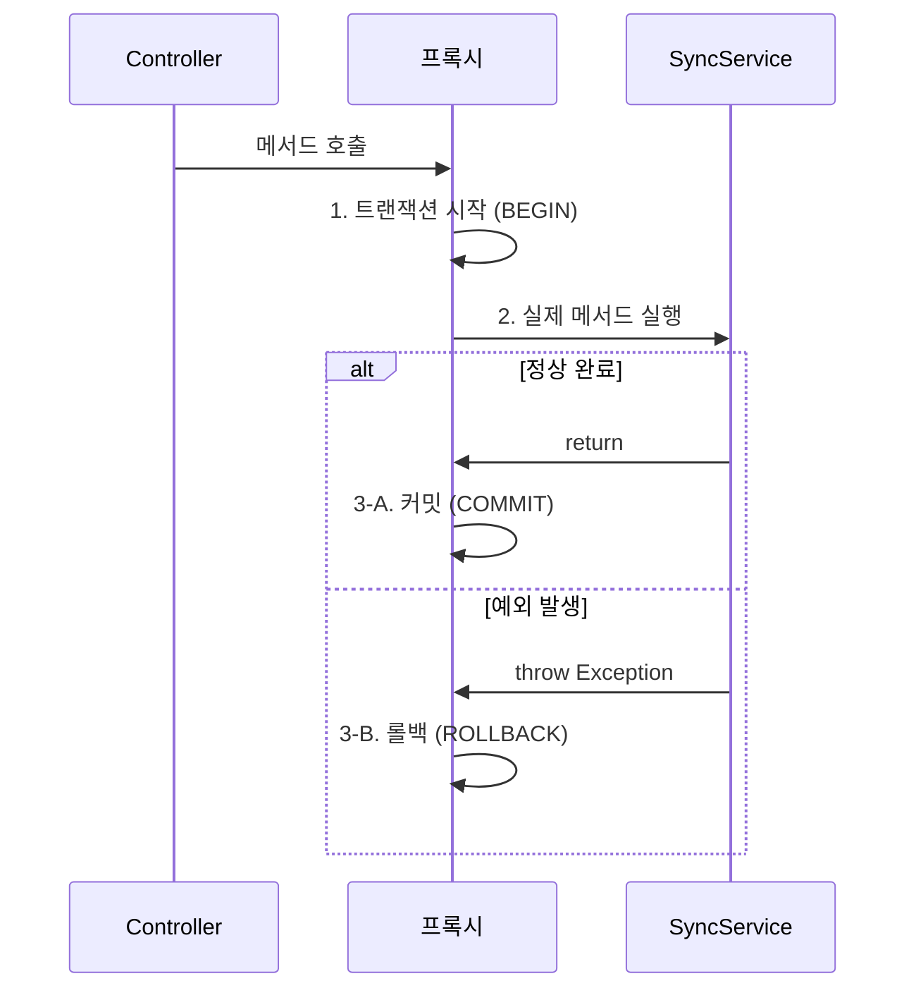
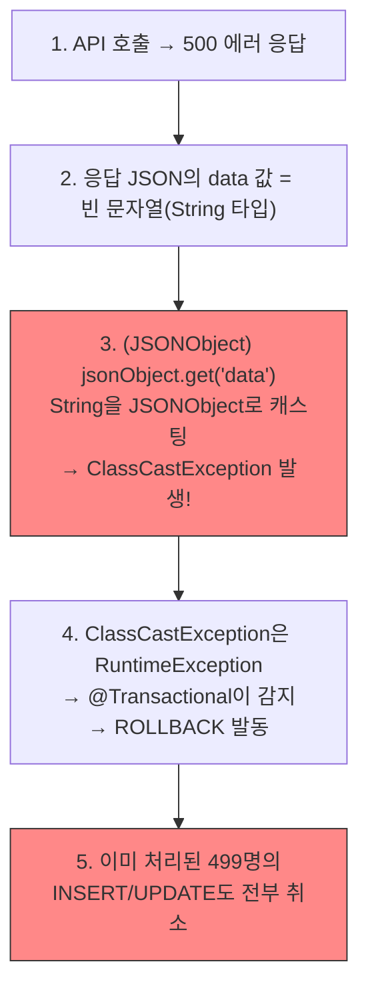
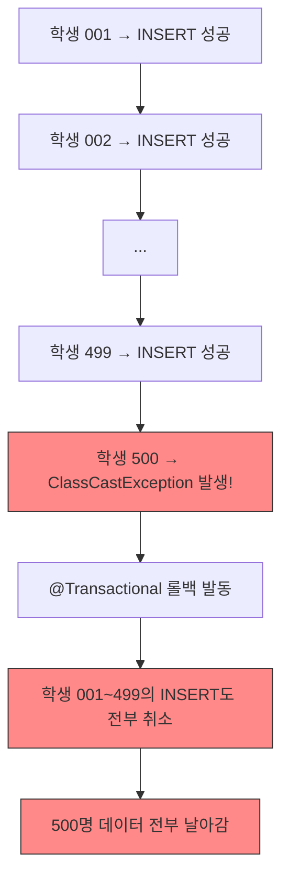
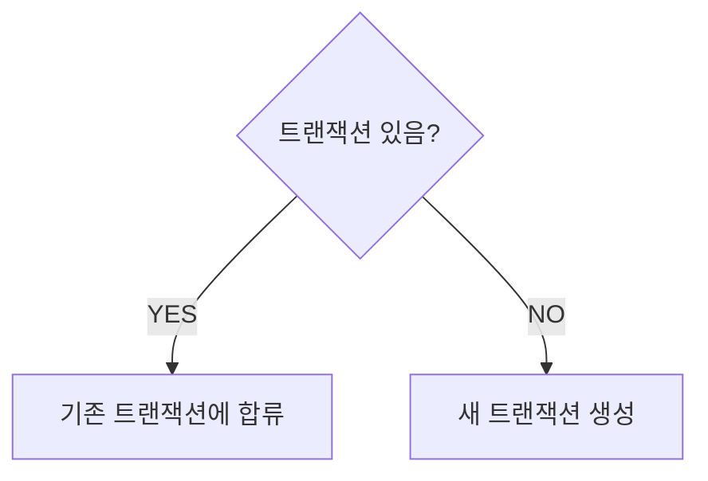
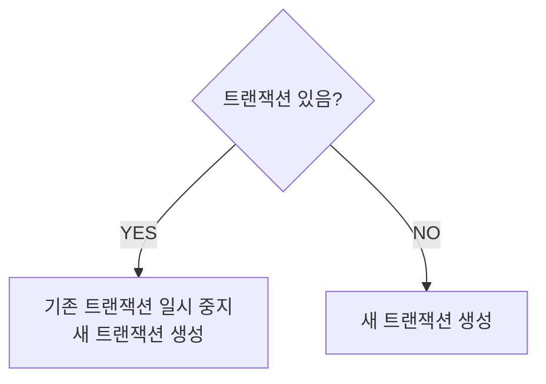
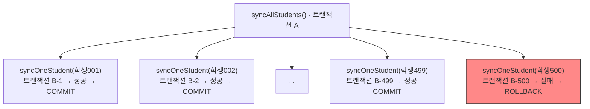
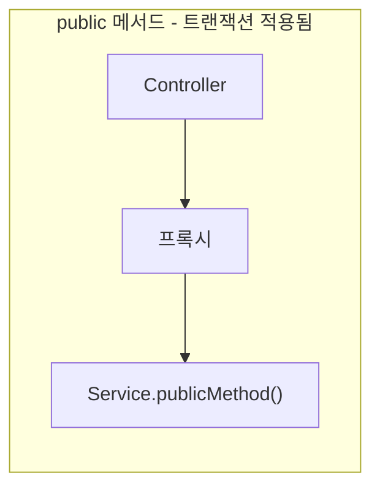
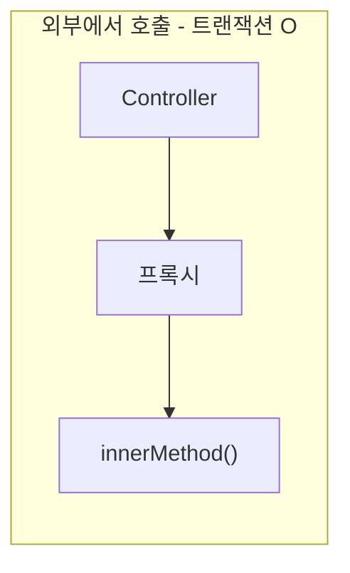
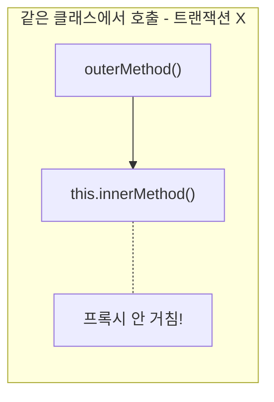
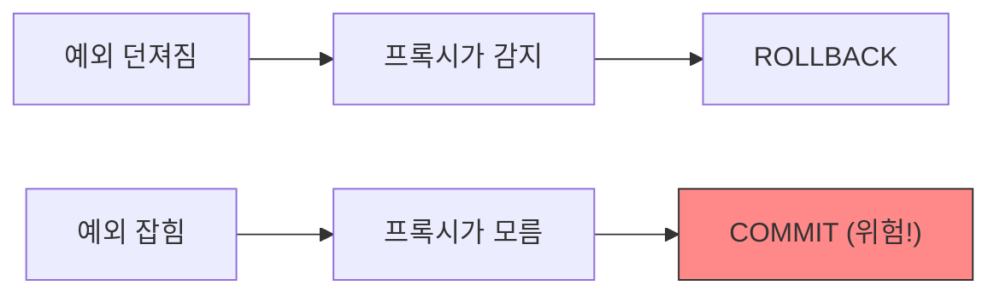

# 05. Spring @Transactional 완전정복 - Gamma

---

## 1. 트랜잭션이 뭐야?

데이터베이스에서 **여러 작업을 하나의 묶음**으로 처리하는 거야.
전부 성공하면 반영하고, 하나라도 실패하면 **전부 취소**해.

### 1.1 은행 송금 예시

A가 B한테 100만원 이체한다고 해보자.

```
1. A 계좌에서 100만원 차감
2. B 계좌에 100만원 추가
```

1번은 성공했는데 2번에서 에러 나면? A 돈은 빠졌는데 B한테 안 들어간 거야.
100만원이 증발한 거야. 이런 걸 막는 게 트랜잭션이야.

!!! success "트랜잭션 적용"
    1. A 계좌에서 100만원 차감 -- 성공
    2. B 계좌에 100만원 추가 -- 실패!

    -> 1번도 취소. A 계좌 원래대로 복구.

    -> 돈 안 사라짐. 안전.

### 1.2 ACID 원칙

트랜잭션이 보장해야 하는 4가지 성질이야. 면접에서도 나와.

| 원칙 | 영어 | 의미 | 은행 예시 |
|------|------|------|-----------|
| **원자성** | Atomicity | 전부 성공 or 전부 취소 | 이체 중 에러 나면 전체 롤백 |
| **일관성** | Consistency | 트랜잭션 전후 데이터 정합성 유지 | 이체 전후 총 금액 동일 |
| **격리성** | Isolation | 동시 트랜잭션 간 간섭 없음 | A가 이체 중에 C도 이체해도 꼬이지 않음 |
| **지속성** | Durability | 완료된 트랜잭션은 영구 반영 | 이체 완료 후 서버 꺼져도 데이터 유지 |

이 중에서 개발자가 가장 직접적으로 다루는 건 **원자성(Atomicity)**이야.
"전부 성공 or 전부 취소." 이것만 기억해.

---

## 2. @Transactional 기본

### 2.1 어노테이션 사용법

Spring에서 트랜잭션을 적용하는 방법은 간단해. 메서드에 `@Transactional` 붙이면 돼.

```java
@Service
public class SyncService {

    @Transactional
    public void syncStudentData(List<SyncVO> studentList) {
        for (SyncVO student : studentList) {
            syncMapper.insertStudent(student);   // INSERT
            syncMapper.updateStatus(student);    // UPDATE
        }
    }
}
```

이 메서드 안에서 INSERT와 UPDATE가 하나의 트랜잭션으로 묶여.
중간에 에러 나면 INSERT도 UPDATE도 전부 롤백.

### 2.2 프록시 패턴 (Spring AOP)

`@Transactional`이 어떻게 동작하는지 알아야 해. 마법이 아니야.

Spring은 **프록시(대리인)**를 만들어서 트랜잭션을 처리해.



네가 `@Transactional` 붙이면, Spring이 네 서비스 클래스를 감싸는 **프록시 객체**를 만들어.
실제 메서드 호출 전후에 트랜잭션 시작/커밋/롤백을 알아서 해주는 거야.

이게 **Spring AOP(Aspect-Oriented Programming)**의 핵심이야.
횡단 관심사(트랜잭션, 로깅 등)를 비즈니스 로직에서 분리하는 것.

프록시가 생성되는 방식은 두 가지야:

| 방식 | 조건 | 특징 |
|------|------|------|
| **JDK Dynamic Proxy** | 인터페이스가 있을 때 | 인터페이스 기반, public 메서드만 |
| **CGLIB Proxy** | 인터페이스 없을 때 (Spring Boot 기본) | 클래스 상속 기반, final 불가 |

Spring Boot는 기본적으로 CGLIB를 사용해. 인터페이스 없어도 프록시를 만들 수 있거든.
근데 어떤 방식이든 **프록시가 가로채야 트랜잭션이 동작한다**는 원리는 같아.

### 2.3 트랜잭션 경계

트랜잭션의 범위는 **메서드 시작부터 끝까지**야.

```java
@Transactional
public void syncStudentData(List<SyncVO> studentList) {
    // <- 트랜잭션 시작 (BEGIN)

    syncMapper.insertStudent(student);   // 작업 1
    syncMapper.updateStatus(student);    // 작업 2
    syncMapper.deleteOldData(student);   // 작업 3

    // <- 트랜잭션 끝 (COMMIT 또는 ROLLBACK)
}
```

메서드가 정상 종료되면 COMMIT, 예외가 던져지면 ROLLBACK.
단순하지? 근데 이 "단순한 것"을 모르면 사고가 터져.

---

## 3. rollbackFor 속성

### 3.1 기본 동작: RuntimeException만 롤백

`@Transactional`의 기본 동작을 정확히 알아야 해. **이거 모르면 사고 터져.**

```java
@Transactional  // 기본값
public void someMethod() throws Exception {
    // ...
}
```

기본 동작:

| 예외 종류 | 롤백 여부 | 예시 |
|-----------|-----------|------|
| **RuntimeException** (Unchecked) | 롤백 O | NullPointerException, ClassCastException, IllegalArgumentException |
| **Exception** (Checked) | 롤백 X | IOException, SQLException, ParseException |
| **Error** | 롤백 O | OutOfMemoryError, StackOverflowError |

"Checked Exception은 기본적으로 롤백 안 한다." 이거 모르는 사람 많아.

왜 이렇게 설계했느냐? Spring 개발자들이 생각하기에:
- RuntimeException = 프로그래밍 버그 = 복구 불가 = 롤백해야 함
- Checked Exception = 비즈니스 예외 = 복구 가능 = 롤백 안 해도 됨

근데 현실은? **Checked Exception이어도 롤백해야 하는 경우가 많아.**

이 설계 철학에 대한 논란은 지금도 있어. Spring 공식 문서에서도 "대부분의 경우 `rollbackFor = Exception.class`를 사용하는 것을 권장한다"고 써놓을 정도야. 기본값이 현실과 맞지 않는 거지.

### 3.2 rollbackFor = Exception.class: 모든 예외 롤백

```java
@Transactional(rollbackFor = Exception.class)
public void syncStudentData(List<SyncVO> studentList) throws Exception {
    // 이제 모든 Exception에서 롤백됨
}
```

`rollbackFor = Exception.class`를 쓰면:

| 예외 종류 | 롤백 여부 |
|-----------|-----------|
| RuntimeException (Unchecked) | 롤백 O |
| Exception (Checked) | 롤백 O |
| Error | 롤백 O |

**모든 예외에서 롤백.** 안전빵이야.

반대로 특정 예외에서 롤백하고 싶지 않으면 `noRollbackFor`를 쓸 수 있어:

```java
@Transactional(
    rollbackFor = Exception.class,
    noRollbackFor = DuplicateKeyException.class  // 중복 키 에러는 롤백하지 않음
)
public void syncData() { ... }
```

근데 이건 고급 사용법이야. 보통은 `rollbackFor = Exception.class` 하나로 충분해.

### 3.3 경상국립대 코드: @Transactional(rollbackFor = Exception.class)

경상국립대 학사연동 코드에서 실제로 이 패턴을 사용해.

```java
@Transactional(rollbackFor = Exception.class)
public void syncGsnu(Sync sync) throws Exception {
    // API 호출 -> IOException (Checked) 가능
    // JSON 파싱 -> ParseException (Checked) 가능
    // 타입 캐스팅 -> ClassCastException (Unchecked) 가능
    // DB 저장
}
```

왜 `rollbackFor = Exception.class`를 넣었는지 이제 알겠지?
API 호출 중에 IOException 같은 Checked Exception이 터질 수 있으니까.
그때도 롤백해야 데이터 정합성이 유지돼.

**근데 여기서 진짜 문제는 rollbackFor가 아니야. 트랜잭션 범위가 문제야.**

---

## 4. 경상국립대 사례의 교훈

이건 04장 타입캐스팅에서 배운 ClassCastException과 연결되는 내용이야.
04장 읽고 왔지? 안 읽었으면 돌아가서 읽고 와.

### 4.1 사고 시나리오: API 500에러 -> 빈 문자열 -> 캐스팅 폭발

경상국립대 학사연동. 500명의 학생 데이터를 동기화하는 상황.

```java
@Transactional(rollbackFor = Exception.class)
public void syncGsnu(Sync sync) throws Exception {
    List<Sync> subjectList = syncMapper.selectCourseCodeSyncList(sync);

    for (int i = 0; i < subjectList.size(); i++) {
        // 1. 외부 API 호출
        String sjbRslt = syncRestTemplate.getKsnuSyncList(obj);

        // 2. JSON 파싱 + 캐스팅
        JSONObject jsonObject = (JSONObject) parser.parse(sjbRslt);
        JSONObject dataObject = (JSONObject) jsonObject.get("data");  // 여기서 터짐!

        // 3. DB 저장
        syncMapper.insertOrUpdate(student);
    }
}
```

### 4.2 사고 발생 과정

500명 중 499명은 정상 응답이 왔어. 근데 1명.
그 1명의 학번으로 API를 호출했더니, **경상국립대 API 서버에서 500 에러**가 떨어졌어.

!!! note "정상 응답 (499명)"
    ```json
    {"status": "200", "data": {"studentNo": "2024001", "name": "홍길동"}}
    ```

!!! danger "에러 응답 (1명) - API 서버가 500 에러를 내면서 data에 빈 문자열을 줌"
    ```json
    {"status": "500", "data": ""}
    ```

사고 연쇄 반응:



### 4.3 피해 규모: 500명 중 1명 에러 -> 499명 정상 데이터도 롤백



**1명 때문에 499명 데이터가 날아간 거야.**

트랜잭션이 "전부 성공 or 전부 취소"니까. ACID의 원자성(Atomicity)이 정확히 동작한 거야.
트랜잭션이 잘못한 게 아니야. **트랜잭션 범위를 잘못 잡은 게 문제야.**

### 4.4 트랜잭션 범위가 너무 넓으면 위험한 이유

!!! danger "문제의 구조 - 하나의 거대한 트랜잭션"
    | 학생 | 결과 |
    |------|------|
    | 학생 001 INSERT | 성공 |
    | 학생 002 INSERT | 성공 |
    | ... | ... |
    | 학생 499 INSERT | 성공 |
    | **학생 500 INSERT** | **실패! -> 전체 롤백!!** |

이게 왜 위험한지 정리하면:

| 문제 | 설명 |
|------|------|
| **전체 롤백** | 1명 에러에 499명 데이터 증발 |
| **DB 커넥션 장기 점유** | 500명 처리하는 동안 커넥션 하나를 계속 물고 있음. 다른 요청이 커넥션 못 잡아서 대기 |
| **락(Lock) 누적** | INSERT/UPDATE마다 행 락이 걸림. 500건이면 락도 500개. 다른 트랜잭션이 해당 테이블 접근 시 대기 |
| **API 호출 중 트랜잭션 유지** | 외부 API 응답 대기(3초) 동안에도 트랜잭션이 열려 있음. 그 시간 동안 커넥션 낭비 |
| **롤백 비용** | 499건의 INSERT를 롤백하는 것도 비용. 언두 로그 기반으로 하나하나 되돌려야 함 |

500명을 하나의 트랜잭션으로 묶으면 안 돼.
근데 트랜잭션 없이 처리하면 데이터 정합성이 깨져.

**그래서 필요한 게 트랜잭션 분리야.**

!!! success "올바른 구조 - 건별 독립 트랜잭션"
    | 학생 | 트랜잭션 | 결과 |
    |------|----------|------|
    | 학생 001 | 트랜잭션 1 | INSERT 성공 -> COMMIT |
    | 학생 002 | 트랜잭션 2 | INSERT 성공 -> COMMIT |
    | ... | ... | ... |
    | 학생 499 | 트랜잭션 499 | INSERT 성공 -> COMMIT |
    | 학생 500 | 트랜잭션 500 | INSERT 실패 -> **ROLLBACK (이것만!)** |

    결과: 499명은 정상 저장, 실패한 1명만 롤백

이걸 어떻게 구현하느냐? 그게 바로 **트랜잭션 전파 속성(Propagation)**이야.

---

## 5. 트랜잭션 전파 속성 (Propagation)

"이미 트랜잭션이 있는데 또 `@Transactional` 메서드를 호출하면 어떻게 해?"에 대한 답.

### 5.1 REQUIRED (기본값)

```java
@Transactional(propagation = Propagation.REQUIRED)  // 기본값이라 안 써도 됨
public void methodA() {
    methodB();  // B도 A의 트랜잭션에 합류
}

@Transactional
public void methodB() {
    // A의 트랜잭션 안에서 실행됨
}
```

**이미 트랜잭션이 있으면 합류하고, 없으면 새로 만들어.**



대부분의 경우 이걸 써. 근데 합류한다는 건 위험한 면이 있어.
B에서 예외가 터지면 **A 전체가 롤백**된다는 거야.

더 중요한 포인트: B에서 예외를 catch해도, 이미 트랜잭션에 rollback-only 마크가 찍혀.
A가 정상 종료되어도 **UnexpectedRollbackException**이 터져.

```java
@Transactional
public void methodA() {
    try {
        methodB();  // B에서 예외 발생 -> 트랜잭션에 rollback-only 마크
    } catch (Exception e) {
        // 예외 잡았으니까 괜찮겠지? -> 아니야!
    }
    // 여기서 A가 정상 종료되어도
    // -> UnexpectedRollbackException 터짐!
    // -> 트랜잭션에 이미 rollback-only 마크가 찍혀있으니까
}
```

이게 REQUIRED의 함정이야. 합류했으면 운명 공동체라는 거지.

### 5.2 REQUIRES_NEW

```java
@Transactional
public void syncAllStudents(List<SyncVO> studentList) {
    for (SyncVO student : studentList) {
        try {
            studentSyncService.syncOneStudent(student);  // 별도 트랜잭션
        } catch (Exception e) {
            log.error("학생 {} 동기화 실패: {}", student.getStudentId(), e.getMessage());
            // 에러 나도 다음 학생 계속 진행
        }
    }
}

// 반드시 다른 클래스에 있어야 함! (프록시 우회 문제)
@Transactional(propagation = Propagation.REQUIRES_NEW)
public void syncOneStudent(SyncVO student) throws Exception {
    String result = callExternalApi(student.getStudentId());
    // 파싱, INSERT 등
}
```

**무조건 새 트랜잭션을 만들어.** 기존 트랜잭션이 있어도 일시 중지하고 새로 만들어.



### 5.3 언제 REQUIRES_NEW가 필요한가

경상국립대 사례를 REQUIRES_NEW로 해결하면:



학생 500이 실패해도 학생 001~499는 이미 COMMIT 됐어. 안전해.

**REQUIRES_NEW를 쓰는 대표적 상황:**

| 상황 | 이유 |
|------|------|
| 대량 처리에서 건별 독립 트랜잭션 | 실패한 건만 롤백, 나머지 유지 |
| 로그/이력 저장 | 메인 트랜잭션 롤백되어도 로그는 남아야 함 |
| 알림 발송 기록 | 메인 작업과 무관하게 기록 보존 |
| 외부 시스템 연동 결과 기록 | API 호출 결과는 성공이든 실패든 기록해야 함 |

**REQUIRES_NEW의 주의사항:**

| 주의점 | 설명 |
|--------|------|
| **커넥션 2개 사용** | 기존 트랜잭션 + 새 트랜잭션 = DB 커넥션 2개 점유 |
| **커넥션 풀 고갈 위험** | 대량 처리 시 동시에 여는 커넥션 수 주의 |
| **데드락 가능성** | 기존 트랜잭션이 잡고 있는 락을 새 트랜잭션이 기다리면 데드락 |
| **다른 클래스 필수** | 같은 클래스 내부 호출하면 프록시 우회로 REQUIRES_NEW 무시됨 |

마지막 주의점이 핵심이야. `syncAllStudents()`와 `syncOneStudent()`가 **같은 클래스에 있으면 REQUIRES_NEW가 안 먹혀.** 반드시 다른 서비스 클래스로 분리해야 해. 이건 7장에서 다시 나와.

### 5.4 전파 속성 정리

| 전파 속성 | 동작 | 실무 사용 빈도 |
|-----------|------|----------------|
| **REQUIRED** (기본) | 있으면 합류, 없으면 생성 | 가장 많이 씀 |
| **REQUIRES_NEW** | 항상 새로 생성 | 건별 독립 처리, 로그 기록 |
| SUPPORTS | 있으면 합류, 없으면 없이 실행 | 거의 안 씀 |
| NOT_SUPPORTED | 트랜잭션 없이 실행 | 거의 안 씀 |
| MANDATORY | 없으면 예외 | 방어적 설계 시 |
| NEVER | 있으면 예외 | 거의 안 씀 |
| NESTED | 세이브포인트 기반 중첩 | DB 지원 필요, 드물게 사용 |

실무에서 주로 쓰는 건 **REQUIRED**와 **REQUIRES_NEW** 두 개야.
나머지는 존재한다는 것만 알아두면 돼.

---

## 6. 트랜잭션과 성능

### 6.1 트랜잭션 범위 최소화

트랜잭션은 **DB 커넥션을 점유**해. 트랜잭션이 길면 커넥션도 오래 잡고 있어.
커넥션 풀이 고갈되면? 다른 요청들이 줄 서서 기다려. 서비스 전체가 느려져.

```java
// 나쁜 예: 트랜잭션 범위가 너무 넓음
@Transactional
public void process() {
    // 1. 외부 API 호출 (3초 걸림) <- 트랜잭션 안에 있을 필요 없어!
    String result = callExternalApi();

    // 2. 파싱 (0.01초) <- 이것도 트랜잭션 불필요
    JSONObject json = parse(result);

    // 3. DB 저장 (0.05초) <- 이것만 트랜잭션 필요
    mapper.insert(json);
}
// -> 3.06초 동안 DB 커넥션 점유. 실제 DB 사용은 0.05초뿐.
```

```java
// 좋은 예: 트랜잭션 범위 최소화
public void process() {
    // 1. 외부 API 호출 (트랜잭션 밖)
    String result = callExternalApi();

    // 2. 파싱 (트랜잭션 밖)
    JSONObject json = parse(result);

    // 3. DB 저장 (트랜잭션 안)
    saveToDb(json);
}

@Transactional
public void saveToDb(JSONObject json) {
    mapper.insert(json);  // DB 작업만 트랜잭션으로 감싸기
}
// -> 0.05초만 DB 커넥션 점유. 효율적.
```

**원칙: 트랜잭션 안에는 DB 작업만 넣어라.** API 호출, 파일 I/O, 파싱 같은 건 밖에 둬.

경상국립대 코드가 정확히 이 안티 패턴이야. API 호출을 트랜잭션 안에서 해.
500명이면 API 호출 500번 x 평균 응답 시간. 그 동안 커넥션 하나를 계속 물고 있어.

### 6.2 읽기 전용 트랜잭션 (readOnly = true)

조회만 하는 메서드에는 `readOnly = true`를 붙여.

```java
@Transactional(readOnly = true)
public List<SyncVO> getStudentList(String courseId) {
    return syncMapper.selectStudentList(courseId);
}
```

**readOnly = true의 효과:**

| 항목 | 효과 |
|------|------|
| **JPA 최적화** | 더티 체킹(변경 감지) 생략, 스냅샷 저장 안 함 -> 메모리/CPU 절약 |
| **DB 최적화** | 일부 DB(MySQL)는 읽기 전용 트랜잭션에 최적화된 실행 계획 사용 |
| **실수 방지** | 조회 메서드에서 INSERT/UPDATE 하면 예외 발생 (DB에 따라) |
| **의도 명시** | 코드 읽는 사람이 "이건 조회 전용"임을 바로 파악 |

MyBatis 환경에서는 JPA처럼 더티 체킹이 없으니까 성능 차이가 크진 않아.
하지만 **의도를 명시하는 것만으로도 가치가 있어.** 6개월 후에 이 코드 유지보수하는 사람이 "아, 이건 조회만 하는 메서드구나"를 바로 알 수 있으니까.

서비스 클래스 레벨에 붙이는 패턴도 있어:

```java
@Service
@Transactional(readOnly = true)  // 클래스 전체 기본값: 읽기 전용
public class StudentService {

    public List<StudentVO> getStudentList() {
        return mapper.selectList();  // readOnly = true 적용됨
    }

    @Transactional  // 쓰기 메서드만 오버라이드 (readOnly = false가 기본)
    public void insertStudent(StudentVO student) {
        mapper.insert(student);
    }
}
```

클래스 레벨에 `readOnly = true`를 걸고, 쓰기 메서드만 `@Transactional`로 오버라이드하는 거야.
조회가 대부분인 서비스에서 효과적인 패턴이야.

---

## 7. 자주 하는 실수

이건 진짜 중요해. 실무에서 **한 번 이상은 반드시 겪는** 실수들이야.
그리고 이 실수들의 공통점은 **컴파일 에러도 안 나고, 런타임 에러도 안 나.** 조용히 잘못 동작해.

### 7.1 private 메서드에 @Transactional (안 먹힘)

```java
@Service
public class SyncService {

    @Transactional
    private void syncData() {  // 트랜잭션 안 걸려!
        mapper.insert(data);
    }
}
```

왜 안 먹혀? 2장에서 배운 **프록시** 때문이야.

Spring은 프록시를 통해 트랜잭션을 적용해. 프록시는 **public 메서드만** 가로챌 수 있어.
private 메서드는 외부에서 접근 자체가 안 되니까 프록시가 오버라이드를 못 해.



!!! danger "private 메서드"
    프록시가 오버라이드 불가 -> @Transactional 무시

**규칙: @Transactional은 반드시 public 메서드에 붙여라.**

더 나쁜 건, 이거 **컴파일 에러도 안 나고 경고도 안 나.** IDE에서도 안 알려줘(최신 IntelliJ는 경고를 주긴 하지만). 그냥 조용히 트랜잭션 없이 실행돼. 데이터 정합성이 깨져도 원인을 못 찾아.

### 7.2 같은 클래스 내부 호출 (프록시 우회)

이게 **제일 많이 당하는 실수**야. 5장의 REQUIRES_NEW에서도 잠깐 언급했어.

```java
@Service
public class SyncService {

    public void outerMethod() {
        innerMethod();  // 같은 클래스 내부 호출 -> 프록시 안 거침!
    }

    @Transactional
    public void innerMethod() {
        mapper.insert(data);  // 트랜잭션 안 걸려 있음!
    }
}
```

`outerMethod()`에서 `innerMethod()`를 호출하면, **프록시를 거치지 않고 직접 호출**해.
프록시를 안 거치니까 `@Transactional`이 동작 안 해.





이건 Spring AOP의 **근본적인 한계**야. 프록시 기반이니까 발생하는 문제.

**해결 방법: 별도 클래스로 분리 (권장)**

```java
@Service
public class SyncOuterService {

    @Autowired
    private SyncInnerService innerService;

    public void outerMethod() {
        innerService.innerMethod();
        // 다른 클래스 호출 -> 프록시 거침 -> 트랜잭션 O
    }
}

@Service
public class SyncInnerService {

    @Transactional
    public void innerMethod() {
        mapper.insert(data);
    }
}
```

이 패턴은 5장의 REQUIRES_NEW에서도 필수야. `syncAllStudents()`와 `syncOneStudent()`가 같은 클래스에 있으면 REQUIRES_NEW도 무시되니까.

**자기 자신 주입(self injection)** 방법도 있긴 한데:

```java
@Service
public class SyncService {

    @Autowired
    private SyncService self;  // 자기 자신의 프록시 주입

    public void outerMethod() {
        self.innerMethod();  // 프록시를 통해 호출 -> 트랜잭션 O
    }

    @Transactional
    public void innerMethod() {
        mapper.insert(data);
    }
}
```

이건 순환 참조 문제가 생길 수 있고, 코드 의도가 불명확해져. **클래스 분리가 정답이야.**

### 7.3 catch로 예외 잡으면 롤백 안 됨

```java
@Transactional
public void syncData() {
    try {
        mapper.insert(data1);
        mapper.insert(data2);  // 여기서 예외 발생!
    } catch (Exception e) {
        log.error("에러 발생: " + e.getMessage());
        // 예외를 잡아버림 -> 메서드가 정상 종료됨 -> COMMIT됨!
        // data1은 저장되고 data2는 안 저장됨 -> 데이터 불일치!
    }
}
```

`@Transactional`은 **예외가 메서드 밖으로 던져져야** 롤백해.
catch로 예외를 잡아버리면 메서드가 정상 종료된 것으로 보고 **COMMIT** 해버려.



왜 이렇게 동작하느냐? 프록시는 메서드 바깥에서 감싸고 있어.
메서드 안에서 예외가 잡히면 프록시 입장에서는 "아, 정상 종료됐네" 하고 COMMIT 해.

**해결 방법:**

```java
// 방법 1: catch 후 다시 던지기 (가장 일반적)
@Transactional
public void syncData() {
    try {
        mapper.insert(data1);
        mapper.insert(data2);
    } catch (Exception e) {
        log.error("에러 발생: " + e.getMessage());
        throw e;  // 다시 던져야 롤백됨!
    }
}

// 방법 2: RuntimeException으로 감싸서 던지기
@Transactional
public void syncData() {
    try {
        mapper.insert(data1);
        mapper.insert(data2);
    } catch (Exception e) {
        log.error("에러 발생: " + e.getMessage());
        throw new RuntimeException("동기화 실패", e);
    }
}

// 방법 3: TransactionAspectSupport 사용 (수동 롤백)
@Transactional
public void syncData() {
    try {
        mapper.insert(data1);
        mapper.insert(data2);
    } catch (Exception e) {
        log.error("에러 발생: " + e.getMessage());
        TransactionAspectSupport.currentTransactionStatus().setRollbackOnly();
        // 예외를 던지지 않고도 롤백 가능. 근데 이건 최후의 수단이야.
    }
}
```

방법 3은 예외를 밖으로 던지기 어려운 특수한 상황에서만 써.
보통은 **방법 1(catch 후 다시 throw)**이 가장 깔끔해.

**원칙: @Transactional 메서드에서 예외를 삼키지 마라.** 로깅하고 싶으면 로깅 후 다시 던져.

### 7.4 실수 종합 정리

| 실수 | 증상 | 감지 난이도 | 해결 |
|------|------|-------------|------|
| private 메서드에 @Transactional | 트랜잭션 안 걸림 | 매우 어려움 | public으로 변경 |
| 같은 클래스 내부 호출 | 트랜잭션 안 걸림 | 매우 어려움 | 별도 클래스로 분리 |
| catch로 예외 삼킴 | 롤백 안 됨, COMMIT | 어려움 | catch 후 다시 throw |

이 3가지 실수의 공통점: **컴파일 에러 없음, 런타임 에러 없음, 테스트에서도 안 잡힘.**
데이터가 서서히 오염되다가 한참 뒤에 발견돼. 그때는 이미 복구 불가능한 상태야.

그래서 코드 리뷰에서 `@Transactional` 관련 코드는 특히 꼼꼼하게 봐야 해.

---

## 확인 문제

**Q1.** ACID 원칙 4가지를 각각 한 줄로 설명하고, 은행 송금 예시에서 원자성(Atomicity)이 왜 가장 중요한지 설명해라.

**Q2.** 다음 코드에서 `@Transactional`의 기본 동작으로, 어떤 예외는 롤백되고 어떤 예외는 롤백 안 되는지 구분하고 그 이유를 설명해라.

```java
@Transactional
public void process() throws Exception {
    mapper.insert(data);
}
```

- (a) NullPointerException
- (b) IOException
- (c) ClassCastException
- (d) ParseException

**Q3.** 경상국립대 사례에서 500명 중 1명이 에러 나면 499명 데이터도 롤백되는 이유를 설명해라. 사고 연쇄 반응을 "API 500에러 -> ... -> 전체 롤백"까지 단계별로 써라. 그리고 이걸 REQUIRES_NEW로 어떻게 개선할 수 있는지 코드 구조를 설명해라.

**Q4.** 다음 코드에서 `innerMethod()`의 `@Transactional`이 동작하지 않는 이유를 **프록시 관점에서** 설명하고, 해결 방법을 제시해라.

```java
@Service
public class MyService {

    public void outerMethod() {
        innerMethod();
    }

    @Transactional
    public void innerMethod() {
        mapper.insert(data);
    }
}
```

**Q5.** 다음 코드에서 data1은 INSERT되고 data2는 INSERT 안 되는 상황이 발생할 수 있다. (1) 왜 그런지 프록시 동작 관점에서 설명하고, (2) 올바른 코드로 수정해라. (3) 수정 후에도 의도적으로 롤백하지 않고 싶다면(예외를 던지지 않으면서 롤백) 어떤 방법이 있는지도 써라.

```java
@Transactional
public void syncData() {
    try {
        mapper.insert(data1);
        mapper.insert(data2);
    } catch (Exception e) {
        log.error("에러: " + e.getMessage());
    }
}
```

---

> **"트랜잭션 범위를 500명 통째로 잡아놓고 1명 에러에 499명 날려먹는 게 설계야? 그건 폭탄이야. 트랜잭션은 칼이야. 범위를 정확하게 잡아야 하는 거야. 넓게 잡으면 네 손을 베고, 안 잡으면 데이터가 썩어. 근데 진짜 무서운 건 뭔지 알아? private 메서드에 @Transactional 붙여놓고 '됐겠지' 하는 거야. 컴파일도 되고, 에러도 안 나고, 테스트도 통과하고. 근데 트랜잭션은 안 걸려 있어. 데이터가 조용히 썩어가는 거야. 그게 제일 위험한 버그야. Not quite my tempo? 다시."**