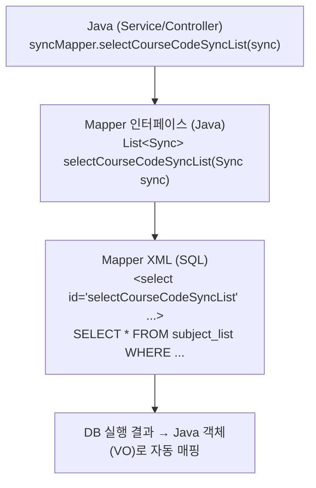
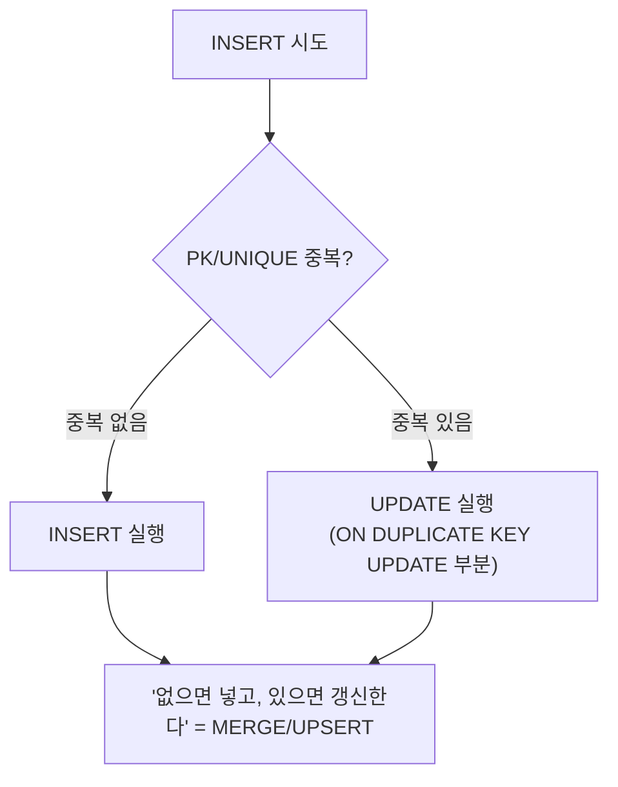
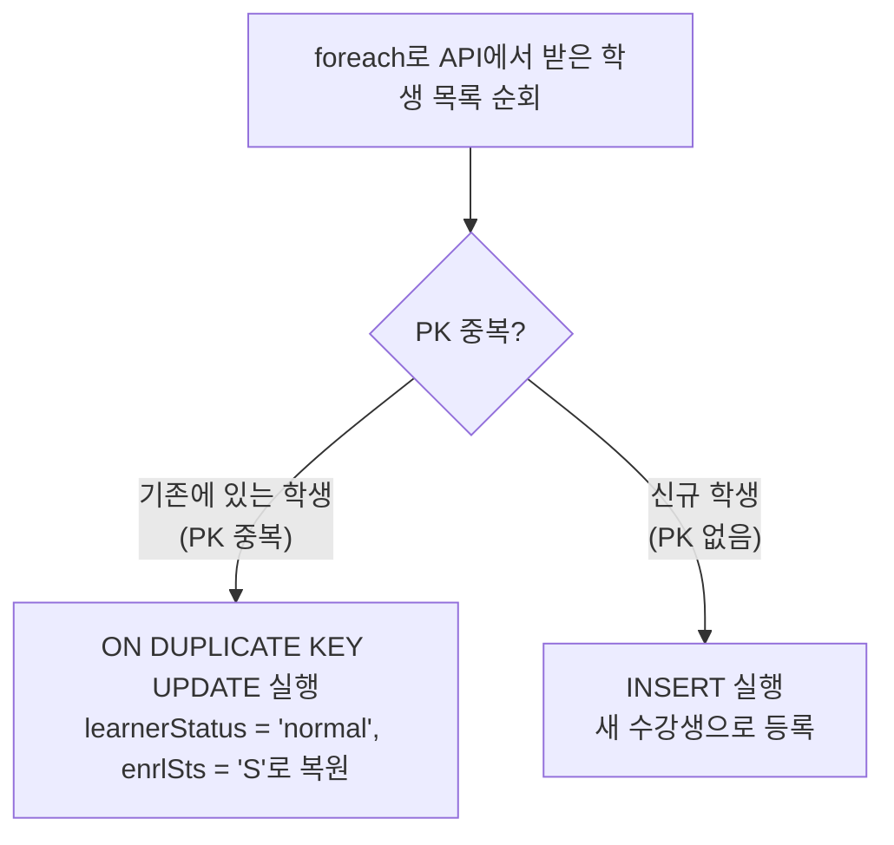

# 06. MyBatis Batch 처리 - Gamma

---

## 1. MyBatis가 뭐야?

**SQL Mapper 프레임워크**다. Java 코드에서 SQL을 직접 문자열로 짜는 대신, **XML 파일에 SQL을 분리해서 작성**하고, Java에서는 메서드만 호출하면 되게 만든 거야.

### 1.1 왜 필요한가

```java
// MyBatis 없이 (순수 JDBC)
String sql = "SELECT * FROM TB_USER WHERE USER_NO = ?";
PreparedStatement pstmt = conn.prepareStatement(sql);
pstmt.setString(1, "U001");
ResultSet rs = pstmt.executeQuery();
while (rs.next()) {
    user.setUserNm(rs.getString("USER_NM"));
    user.setEmail(rs.getString("EMAIL"));
    // ... 컬럼마다 일일이 매핑
}
rs.close();
pstmt.close();
conn.close();  // 이거 빠뜨리면 커넥션 누수
```

```java
// MyBatis 사용
User user = userMapper.selectUser("U001");
// 끝. SQL은 XML에, 매핑은 MyBatis가 자동으로.
```

**핵심:** Java 코드와 SQL을 분리한다. Java 개발자는 비즈니스 로직에 집중하고, SQL은 XML에서 관리한다.

### 1.2 MyBatis 구조



---

## 2. 기본 CRUD 매핑

### 2.1 네 가지 기본 태그

| 태그 | 용도 | 반환값 |
|------|------|--------|
| `<select>` | 조회 | resultType에 지정한 객체/리스트 |
| `<insert>` | 삽입 | 영향받은 행 수 (int) |
| `<update>` | 수정 | 영향받은 행 수 (int) |
| `<delete>` | 삭제 | 영향받은 행 수 (int) |

### 2.2 parameterType과 resultType

```xml
<!-- parameterType: Java에서 넘기는 파라미터 타입 -->
<!-- resultType: DB 결과를 매핑할 Java 타입 -->
<select id="selectUser"
        parameterType="String"
        resultType="kr.co.mediopia.coss.hub.vo.UserVO">
    SELECT USER_NO, USER_NM, EMAIL
    FROM TB_USER
    WHERE USER_NO = #{userNo}
</select>
```

- **parameterType**: 생략 가능. MyBatis가 자동 추론한다.
- **resultType**: SELECT에서는 필수. 결과를 어떤 Java 객체에 담을지 지정.

### 2.3 #{} vs ${} - 이거 모르면 보안사고 난다

!!! danger "#{} vs ${}"

    **`#{value}`**

    - PreparedStatement의 ? 파라미터로 바인딩
    - SQL Injection 방어됨
    - 값(value)에만 사용

    **`${value}`**

    - 문자열 그대로 치환 (문자열 결합)
    - SQL Injection에 취약!
    - 테이블명, 컬럼명 등 구조에 사용

**실제로 뭐가 다른지:**

```sql
-- #{userNo}로 넘기면 (userNo = "U001")
SELECT * FROM TB_USER WHERE USER_NO = ?
-- PreparedStatement가 ?에 'U001'을 안전하게 바인딩

-- ${userNo}로 넘기면 (userNo = "U001")
SELECT * FROM TB_USER WHERE USER_NO = U001
-- 문자열이 그대로 SQL에 박힘
```

**SQL Injection 공격 시나리오:**

```sql
-- 악의적 입력: userNo = "U001' OR '1'='1"

-- #{userNo} 사용 시
SELECT * FROM TB_USER WHERE USER_NO = 'U001'' OR ''1''=''1'
-- → 이스케이프 처리됨. 공격 실패.

-- ${userNo} 사용 시
SELECT * FROM TB_USER WHERE USER_NO = U001' OR '1'='1'
-- → 조건이 항상 참. 전체 사용자 데이터 유출!
```

**원칙:** 값에는 `#{}`, 구조(테이블명/컬럼명/ORDER BY)에만 `${}` 사용. `${}`를 쓸 때는 반드시 화이트리스트 검증.

---

## 3. 동적 SQL

SQL을 조건에 따라 다르게 생성하는 기능이다. Java에서 if문으로 SQL 문자열을 조립하던 지옥을 MyBatis가 해결해줬다.

### 3.1 if 태그

```xml
<select id="selectUserList" resultType="UserVO">
    SELECT * FROM TB_USER
    WHERE DEL_YN = 'N'
    <if test="userNm != null and userNm != ''">
        AND USER_NM LIKE CONCAT('%', #{userNm}, '%')
    </if>
    <if test="univCd != null and univCd != ''">
        AND UNIV_CD = #{univCd}
    </if>
</select>
```

- `test` 속성에 Java 조건식을 쓴다.
- 조건이 참일 때만 해당 SQL 조각이 포함된다.
- **주의:** `test` 안에서 문자열 비교는 `==`이 아니라 `.equals()` 또는 `!=` 사용.

### 3.2 choose / when / otherwise

Java의 if - else if - else와 같다.

```xml
<select id="selectUserList" resultType="UserVO">
    SELECT * FROM TB_USER
    WHERE DEL_YN = 'N'
    <choose>
        <when test="searchType == 'name'">
            AND USER_NM LIKE CONCAT('%', #{keyword}, '%')
        </when>
        <when test="searchType == 'email'">
            AND EMAIL LIKE CONCAT('%', #{keyword}, '%')
        </when>
        <otherwise>
            AND (USER_NM LIKE CONCAT('%', #{keyword}, '%')
                 OR EMAIL LIKE CONCAT('%', #{keyword}, '%'))
        </otherwise>
    </choose>
</select>
```

- `<choose>` 안에서 **첫 번째로 참인 `<when>`만 실행**된다.
- 아무것도 안 맞으면 `<otherwise>` 실행.

### 3.3 where 태그

```xml
<!-- where 태그 없이 (위험한 패턴) -->
<select id="selectUserList" resultType="UserVO">
    SELECT * FROM TB_USER
    WHERE 1=1  <!-- 이런 꼼수를 써야 함 -->
    <if test="userNm != null">
        AND USER_NM = #{userNm}
    </if>
</select>

<!-- where 태그 사용 (올바른 패턴) -->
<select id="selectUserList" resultType="UserVO">
    SELECT * FROM TB_USER
    <where>
        <if test="userNm != null">
            AND USER_NM = #{userNm}
        </if>
        <if test="univCd != null">
            AND UNIV_CD = #{univCd}
        </if>
    </where>
</select>
```

`<where>` 태그가 하는 일:
- 내부에 조건이 하나라도 있으면 `WHERE`를 자동 추가한다.
- 첫 번째 조건 앞의 `AND` / `OR`를 자동 제거한다.
- 조건이 하나도 없으면 `WHERE` 자체를 생성하지 않는다.

### 3.4 foreach 태그 (핵심!)

**리스트나 배열을 순회하면서 SQL을 반복 생성**하는 태그. Batch 처리의 핵심이다.

```xml
<select id="selectUserByNos" resultType="UserVO">
    SELECT * FROM TB_USER
    WHERE USER_NO IN
    <foreach collection="list" item="userNo"
             open="(" separator="," close=")">
        #{userNo}
    </foreach>
</select>
```

실행 결과:
```sql
SELECT * FROM TB_USER WHERE USER_NO IN ('U001', 'U002', 'U003')
```

**foreach 속성 상세:**

| 속성 | 설명 | 예시 |
|------|------|------|
| **collection** | 순회할 대상. List면 "list", Map의 key면 key명 | `collection="list"` |
| **item** | 각 요소를 담을 변수명 | `item="userNo"` |
| **index** | 현재 인덱스 (0부터) | `index="idx"` |
| **open** | 반복 시작 전 추가할 문자열 | `open="("` |
| **close** | 반복 끝난 후 추가할 문자열 | `close=")"` |
| **separator** | 각 반복 사이에 넣을 구분자 | `separator=","` |

---

## 4. foreach로 Batch 처리

### 4.1 단건 INSERT vs Batch INSERT

!!! example "단건 INSERT vs Batch INSERT (1000건 기준)"

    **단건 INSERT**

    ```java
    // Java 루프:
    for (User user : userList) {
        mapper.insertUser(user);  // DB 왕복 1000번
    }
    ```

    실행되는 SQL: INSERT 문이 1000개 각각 실행됨

    - DB 왕복: 1000회
    - 소요 시간: 느림 (네트워크 왕복 * 1000)

    ---

    **Batch INSERT (foreach 사용)**

    ```java
    // Java:
    mapper.insertUserBatch(userList);  // DB 왕복 1번
    ```

    실행되는 SQL: VALUES (), (), () 로 한 번에 1000건 INSERT

    - DB 왕복: 1회
    - 소요 시간: 빠름 (네트워크 왕복 * 1)

### 4.2 Batch INSERT XML 작성법

```xml
<insert id="insertUserBatch" parameterType="java.util.List">
    INSERT INTO TB_USER (USER_NO, USER_NM, EMAIL, REG_DT)
    VALUES
    <foreach collection="list" item="item" separator=",">
        (#{item.userNo}, #{item.userNm}, #{item.email}, NOW())
    </foreach>
</insert>
```

이게 실행되면:
```sql
INSERT INTO TB_USER (USER_NO, USER_NM, EMAIL, REG_DT) VALUES
('U001', '김철수', 'kim@test.com', NOW()),
('U002', '이영희', 'lee@test.com', NOW()),
('U003', '박민수', 'park@test.com', NOW())
```

**하나의 INSERT 문으로 여러 행을 한 번에 넣는다.** DB 왕복이 1회로 줄어들기 때문에 성능 차이가 극적이다.

### 4.3 INSERT ON DUPLICATE KEY UPDATE

MySQL 전용 문법이다. **INSERT 시도 → 키 중복이면 UPDATE로 전환.**

```sql
-- 기본 문법
INSERT INTO 테이블 (컬럼1, 컬럼2, 컬럼3)
VALUES ('값1', '값2', '값3')
ON DUPLICATE KEY UPDATE
    컬럼2 = VALUES(컬럼2),
    컬럼3 = VALUES(컬럼3)
```

동작 원리:



이걸 **foreach와 결합**하면 Batch UPSERT가 된다:

```xml
<insert id="mergeSyncStudBatch" parameterType="java.util.Map">
    INSERT INTO subject_stud_list
        (subjectNo, userNo, learnerStatus, enrlSts, haksaYn)
    VALUES
    <foreach collection="studList" item="item" separator=",">
        (#{item.subjectNo}, #{item.userNo}, 'normal', 'S', 'Y')
    </foreach>
    ON DUPLICATE KEY UPDATE
        learnerStatus = VALUES(learnerStatus),
        enrlSts = VALUES(enrlSts),
        haksaYn = VALUES(haksaYn)
</insert>
```

---

## 5. 경상국립대 실제 코드

이론은 여기까지. 이제 실제 프로덕션 코드에서 이게 어떻게 쓰이는지 본다.

### 5.1 수강생 동기화의 핵심 전략

경상국립대 학사연동에서 수강생 상태를 동기화하는 전략:

!!! abstract "경상국립대 수강생 동기화 전략"

    **[1단계]** 전체 수강생을 일괄 "수강취소" 처리

    - `updateSyncStudStatus`
    - `learnerStatus = 'suspend'`, `enrlSts = 'D'`

    **[2단계]** API로 확인된 학생만 "정상" 복원

    - `mergeSyncStudBatch` (foreach + ON DUPLICATE KEY)
    - `learnerStatus = 'normal'`, `enrlSts = 'S'`

    **결과:** API에 없는 학생 = 휴학/자퇴 → 자동으로 취소 상태 / API에 있는 학생 = 재학 중 → 정상 상태 복원

**왜 이 순서인가?**

이걸 이해 못 하면 아직 Lv1이야.

!!! question "확인된 학생만 정상 처리하면 안 되나?"

    **안 된다.**

    이유: 자퇴/휴학한 학생을 어떻게 알아?

    경상국립대 API는 "현재 재학 중인 학생 목록"만 준다. "자퇴한 학생 목록"을 따로 주지 않는다.

    그래서:

    1. 일단 전부 취소 (깨끗한 상태)
    2. API에서 확인된 학생만 복원
    3. API에 없는 학생 = 자연스럽게 취소 상태 유지

    이게 **"전체 리셋 → 부분 복원" 패턴**이다. Delete & Re-insert 패턴과 개념이 같다.

### 5.2 updateSyncStudStatus (1단계: 전체 취소)

```sql
UPDATE subject_stud_list
SET learnerStatus = #{learnerStatus},
    enrlSts = #{enrlSts}
WHERE subjectNo = #{item.subjectNo}
AND userNo IN (SELECT userNo FROM user WHERE univCd = #{univCd})
AND haksaYn = 'Y'
```

**SQL 분석:**

| 부분 | 의미 |
|------|------|
| `SET learnerStatus = #{learnerStatus}` | 학습자 상태를 변경 (suspend로) |
| `SET enrlSts = #{enrlSts}` | 등록 상태를 변경 (D로) |
| `WHERE subjectNo = #{item.subjectNo}` | 특정 과목의 수강생만 |
| `AND userNo IN (SELECT ...)` | 해당 대학 소속 학생만 (서브쿼리) |
| `AND haksaYn = 'Y'` | 학사연동 대상만 (수동 등록 학생 제외) |

**`haksaYn = 'Y'` 조건이 왜 있나?**

수동으로 등록한 학생(관리자가 직접 추가)은 학사연동으로 건드리면 안 된다. 학사연동 대상(`haksaYn = 'Y'`)만 상태를 변경하는 안전장치다.

### 5.3 mergeSyncStudBatch (2단계: 확인된 학생 복원)

```xml
<insert id="mergeSyncStudBatch" parameterType="java.util.Map">
    INSERT INTO subject_stud_list
        (subjectNo, userNo, learnerStatus, enrlSts, haksaYn, regDt)
    VALUES
    <foreach collection="studList" item="item" separator=",">
        (#{item.subjectNo}, #{item.userNo}, 'normal', 'S', 'Y', NOW())
    </foreach>
    ON DUPLICATE KEY UPDATE
        learnerStatus = 'normal',
        enrlSts = 'S',
        haksaYn = 'Y',
        modDt = NOW()
</insert>
```

**이 쿼리가 하는 일:**



**핵심 포인트:**

1. **foreach**로 여러 학생을 한 번의 SQL로 처리한다 (Batch).
2. **ON DUPLICATE KEY UPDATE**로 있으면 갱신, 없으면 삽입한다 (UPSERT).
3. 1단계에서 `suspend/D`로 바꿔놓은 걸 `normal/S`로 되돌린다.

### 5.4 전체 흐름 시각화

!!! example "수강생 동기화 전체 흐름"

    **DB 초기 상태:**

    | subjectNo | userNo | learnerStatus | enrlSts | 비고 |
    |-----------|--------|---------------|---------|------|
    | S001 | U001 | normal | S | |
    | S001 | U002 | normal | S | |
    | S001 | U003 | normal | S | 자퇴 예정 |

    **[1단계] updateSyncStudStatus → 전체 suspend/D**

    | subjectNo | userNo | learnerStatus | enrlSts |
    |-----------|--------|---------------|---------|
    | S001 | U001 | suspend | D |
    | S001 | U002 | suspend | D |
    | S001 | U003 | suspend | D |

    경상국립대 API 응답: [U001, U002, U004(신규)] -- U003은 목록에 없음 = 자퇴

    **[2단계] mergeSyncStudBatch → 확인된 학생 normal/S**

    | subjectNo | userNo | learnerStatus | enrlSts | 비고 |
    |-----------|--------|---------------|---------|------|
    | S001 | U001 | normal | S | 복원 |
    | S001 | U002 | normal | S | 복원 |
    | S001 | U003 | suspend | D | 자퇴! |
    | S001 | U004 | normal | S | 신규! |

    U003은 API에 없었으니 1단계 상태 그대로 = 자동 취소. U004는 새로운 학생이니 INSERT = 자동 등록

---

## 6. Batch vs 단건 처리 성능

### 6.1 성능 비교 (1000건 기준)

| 방식 | DB 왕복 | 커넥션 점유 | 상대 속도 |
|------|---------|-------------|-----------|
| 단건 INSERT | 1000회 | 길다 | 1x (기준) |
| Batch INSERT (foreach) | 1회 | 짧다 | 10~50x |

!!! note "왜 이렇게 차이 나냐?"

    - 단건: [Java] → 네트워크 → [DB] → 네트워크 → [Java] 이걸 1000번 반복
    - Batch: [Java] → 네트워크 → [DB에서 1000건 처리] → 네트워크 → [Java] 왕복 1번

    **네트워크 왕복(Round Trip)이 병목이다.** SQL 실행 자체보다 왕복 비용이 훨씬 크다.

### 6.2 DB 커넥션 효율

!!! warning "커넥션 풀 관점"

    커넥션 풀 (보통 10~20개) - 총 10개라고 가정

    **단건 처리:**

    - 스레드 A가 커넥션 1번을 물고 1000번 왕복
    - 그 동안 다른 요청은 9개 커넥션으로 버텨야 함
    - 오래 걸리면 커넥션 고갈 → 다른 서비스 장애

    **Batch 처리:**

    - 스레드 A가 커넥션 1번으로 1회 왕복 후 즉시 반환
    - 커넥션을 짧게 쓰고 빨리 돌려놓음
    - 다른 요청에 영향 최소화

---

## 7. 주의사항

### 7.1 SQL 빈 줄 금지

**이건 MyBatis에서 실제로 파싱 오류를 일으킨다. 절대 금지.**

```xml
<!-- 금지: SQL 중간에 빈 줄 -->
<update id="updateUser">
    UPDATE TB_USER
    SET USER_NM = #{userNm}

    WHERE USER_NO = #{userNo}
</update>

<!-- 올바름: 빈 줄 없이 연속 작성 -->
<update id="updateUser">
    UPDATE TB_USER
    SET USER_NM = #{userNm}
    WHERE USER_NO = #{userNo}
</update>
```

MyBatis가 XML을 파싱할 때 빈 줄이 들어가면 SQL이 잘리거나 예상치 못한 문법 오류가 발생할 수 있다. 특히 동적 SQL 태그(`<if>`, `<where>`, `<foreach>`) 사이에 빈 줄을 넣으면 더 위험하다.

### 7.2 foreach 항목이 비어있을 때 처리

```xml
<!-- 위험: list가 비어있으면 SQL 문법 오류 -->
<insert id="insertBatch">
    INSERT INTO TB_USER VALUES
    <foreach collection="list" item="item" separator=",">
        (#{item.userNo}, #{item.userNm})
    </foreach>
</insert>
```

list가 비어있으면 실행되는 SQL:
```sql
INSERT INTO TB_USER VALUES
-- 여기서 끝. VALUES 뒤에 아무것도 없으니 문법 오류!
```

**해결:**

```java
// Java에서 먼저 체크
if (studList != null && !studList.isEmpty()) {
    syncMapper.mergeSyncStudBatch(paramMap);
}
```

```xml
<!-- 또는 XML에서 if로 감싸기 -->
<insert id="insertBatch">
    <if test="list != null and list.size() > 0">
        INSERT INTO TB_USER VALUES
        <foreach collection="list" item="item" separator=",">
            (#{item.userNo}, #{item.userNm})
        </foreach>
    </if>
</insert>
```

### 7.3 대량 데이터 시 Batch Size 조절

foreach로 한 번에 너무 많은 데이터를 넣으면 문제가 생긴다.

!!! danger "Batch Size 주의사항"

    **MySQL의 max_allowed_packet 제한**

    - 하나의 SQL 패킷 최대 크기 (기본 4MB~64MB)
    - foreach로 10만 건 넣으면 이 제한 초과할 수 있음

    **PreparedStatement 파라미터 제한**

    - MySQL은 65535개 제한
    - 컬럼 10개 * 6554건 = 65540 → 초과!

    **권장: 500~1000건씩 나눠서 Batch 실행**

**실전 코드 패턴:**

```java
// 1000건씩 나눠서 Batch INSERT
int batchSize = 1000;
for (int i = 0; i < studList.size(); i += batchSize) {
    int end = Math.min(i + batchSize, studList.size());
    List<StudVO> subList = studList.subList(i, end);

    Map<String, Object> paramMap = new HashMap<>();
    paramMap.put("studList", subList);
    syncMapper.mergeSyncStudBatch(paramMap);
}
```

### 7.4 Batch UPDATE는 foreach 방식이 다르다

INSERT는 VALUES (), (), () 패턴이 있지만, UPDATE는 그런 문법이 없다. 각각 따로 실행해야 한다.

```xml
<!-- Batch UPDATE: 여러 UPDATE문을 세미콜론으로 연결 -->
<!-- JDBC URL에 allowMultiQueries=true 필요 -->
<update id="updateBatch">
    <foreach collection="list" item="item" separator=";">
        UPDATE TB_USER
        SET USER_NM = #{item.userNm}
        WHERE USER_NO = #{item.userNo}
    </foreach>
</update>
```

이 방식은 JDBC 연결 설정에 `allowMultiQueries=true`가 필요하다. 없으면 여러 SQL을 한 번에 보내지 못해서 에러가 난다.

경상국립대 코드에서 `updateSyncStudStatus`를 Batch가 아닌 단건 UPDATE로 처리하는 이유도 이것이다. WHERE 조건으로 한 번에 여러 행을 업데이트하기 때문에 foreach가 필요 없다.

---

## 8. 확인 문제

### 문제 1.
`#{}` 와 `${}`의 차이를 설명하고, SQL Injection 공격이 가능한 쪽은 어느 쪽인지, 그 이유는 뭔지 말해봐.

??? success "정답 보기"

    `#{}`는 PreparedStatement의 파라미터 바인딩을 사용한다. SQL이 먼저 파싱/컴파일된 후 값이 바인딩되므로 SQL 구조를 변경할 수 없다. SQL Injection 방어됨.

    `${}`는 문자열 그대로 치환(String Substitution)이다. SQL 파싱 전에 값이 문자열로 결합되므로, 악의적 입력이 SQL 구조 자체를 변경할 수 있다. SQL Injection에 취약.

    `${}`가 SQL Injection에 취약한 이유는 **값이 SQL의 일부로 해석**되기 때문이다. PreparedStatement의 바인딩은 값을 항상 "데이터"로만 취급하지만, 문자열 치환은 값을 "SQL 코드"로 취급한다.

---

### 문제 2.
경상국립대 수강생 동기화에서 "전체 취소 → 확인된 학생 복원" 순서로 처리하는 이유를 설명해봐. 반대로 "확인된 학생만 정상 처리"하면 안 되는 이유는?

??? success "정답 보기"

    경상국립대 API는 **현재 재학 중인 학생 목록**만 제공하고, "자퇴/휴학한 학생 목록"은 별도로 제공하지 않는다.

    "확인된 학생만 정상 처리"하면 **자퇴/휴학한 학생을 식별할 방법이 없다.** 기존에 정상이었던 학생이 자퇴했는데 API 목록에 안 나오면, 그 학생의 상태를 변경할 트리거가 없다.

    "전체 취소 → 확인된 학생 복원" 순서로 하면:

    1. 모든 학생을 취소 상태로 리셋
    2. API에 있는 학생만 복원
    3. API에 없는 학생(자퇴/휴학)은 자연스럽게 취소 상태 유지

    이것이 "전체 리셋 → 부분 복원" 패턴이다.

---

### 문제 3.
foreach에서 collection 속성에 "list"라고 쓰는 경우와 Map의 key명을 쓰는 경우의 차이를 설명해봐. `mergeSyncStudBatch`에서는 왜 `collection="studList"`로 쓰는지도 설명해.

??? success "정답 보기"

    MyBatis에서 foreach의 collection 값은 파라미터 타입에 따라 달라진다:

    - **파라미터가 List 자체**일 때: `collection="list"` (MyBatis가 List를 "list"라는 키로 자동 등록)
    - **파라미터가 Map**일 때: `collection="Map에 넣은 key명"`

    `mergeSyncStudBatch`는 parameterType이 `java.util.Map`이다. Java에서 `paramMap.put("studList", subList)`로 Map에 넣었기 때문에 `collection="studList"`로 해당 key를 지정하는 것이다.

    만약 Mapper 메서드가 `void insertBatch(List<StudVO> list)`처럼 List를 직접 받으면 `collection="list"`를 쓴다.

---

### 문제 4.
Batch INSERT 시 foreach로 한 번에 10만 건을 넣으면 어떤 문제가 발생할 수 있어? 최소 2가지 말해봐.

??? success "정답 보기"

    1. **max_allowed_packet 초과**: MySQL은 하나의 SQL 패킷 크기에 제한이 있다(기본 4MB~64MB). 10만 건의 VALUES 절이 생성되면 이 제한을 초과하여 패킷 에러가 발생한다.

    2. **PreparedStatement 파라미터 수 제한**: MySQL은 하나의 PreparedStatement에 65535개의 파라미터까지만 허용한다. 컬럼이 10개면 6554건부터 초과한다. 10만 건이면 파라미터 100만 개로 한참 초과.

    추가로:

    - **메모리 부족**: MyBatis가 SQL 문자열을 메모리에 구성하는데, 10만 건의 SQL은 거대한 문자열이 된다.
    - **트랜잭션 로그 폭발**: 하나의 트랜잭션에 10만 건이 몰리면 undo/redo 로그가 폭발적으로 증가한다.
    - **타임아웃**: SQL 실행 시간이 길어져 쿼리 타임아웃에 걸릴 수 있다.

---

### 문제 5.
아래 코드에 버그가 있다. 찾아서 설명하고, 어떻게 고쳐야 하는지 말해봐.

```java
public void syncStudents(List<StudVO> studList) {
    Map<String, Object> paramMap = new HashMap<>();
    paramMap.put("studList", studList);
    syncMapper.mergeSyncStudBatch(paramMap);
}
```

```xml
<insert id="mergeSyncStudBatch" parameterType="java.util.Map">
    INSERT INTO subject_stud_list (subjectNo, userNo, learnerStatus)
    VALUES
    <foreach collection="studList" item="item" separator=",">
        (#{item.subjectNo}, #{item.userNo}, 'normal')
    </foreach>
    ON DUPLICATE KEY UPDATE
        learnerStatus = 'normal'
</insert>
```

??? success "정답 보기"

    **studList가 비어있을(empty) 때의 처리가 없다.**

    studList가 빈 리스트(`size == 0`)이면 foreach가 아무것도 생성하지 않아서 실행되는 SQL이:

    ```sql
    INSERT INTO subject_stud_list (subjectNo, userNo, learnerStatus)
    VALUES
    ON DUPLICATE KEY UPDATE
        learnerStatus = 'normal'
    ```

    이 되어 **SQL 문법 오류**가 발생한다.

    수정 방법:

    ```java
    // Java에서 빈 리스트 체크
    public void syncStudents(List<StudVO> studList) {
        if (studList == null || studList.isEmpty()) {
            return;  // 빈 리스트면 실행하지 않음
        }
        Map<String, Object> paramMap = new HashMap<>();
        paramMap.put("studList", studList);
        syncMapper.mergeSyncStudBatch(paramMap);
    }
    ```

    또는 XML에서 `<if>` 태그로 감싸는 방법도 있다.

---

!!! tip "마무리"

    > "There are no two words in the English language more harmful than 'good job'."

    foreach 쓸 줄 아는 건 Lv1이야. VALUES (), (), () 패턴 외우는 건 Lv2고.

    ON DUPLICATE KEY UPDATE가 왜 필요한지, "전체 리셋 → 부분 복원" 패턴이 왜 이 상황에서 최선인지, 빈 리스트 들어오면 뭐가 터지는지, 10만 건 넣으면 왜 장애 나는지, 그걸 아는 게 Lv4야.

    "그냥 foreach 쓰면 되잖아요?" 이런 소리 하는 놈은 아직 프로덕션 안 겪어본 거야. 프로덕션은 빈 리스트도 오고, 10만 건도 오고, 네트워크도 끊기고, 패킷도 넘친다.

    MyBatis는 도구일 뿐이야. 도구를 잘 쓰는 놈과 도구에 쓰이는 놈의 차이가 뭔지 알아? 예외 상황을 얼마나 상상할 수 있느냐야.

    > "Were you rushing or were you dragging?"
