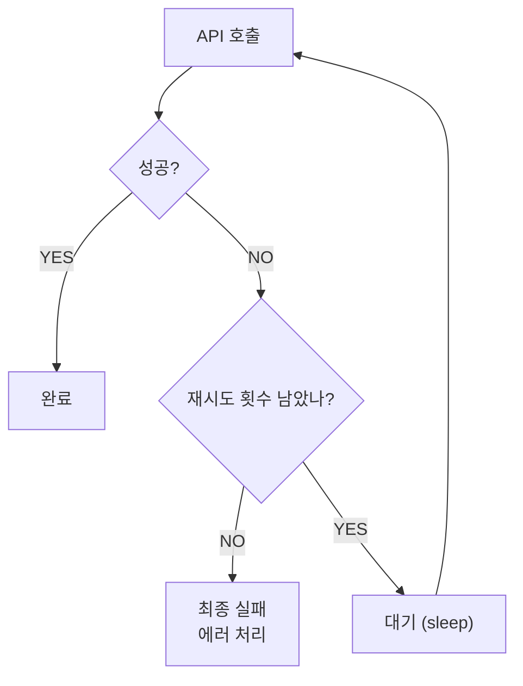
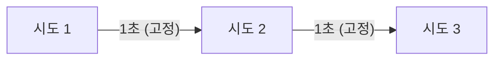
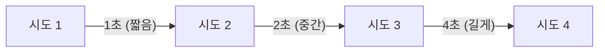
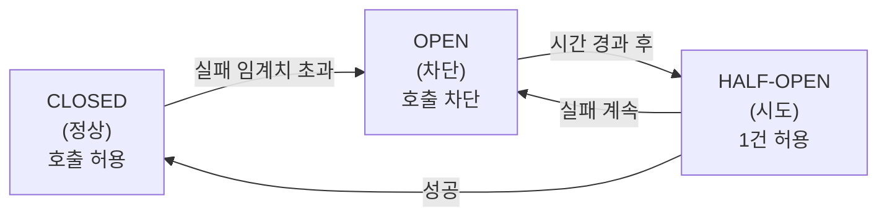
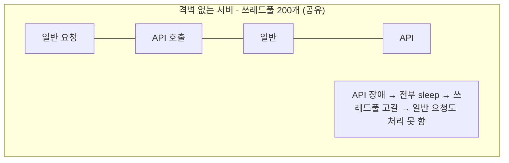
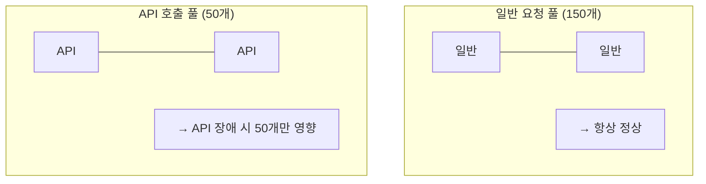

# 07. 재시도 패턴 (Retry Pattern) - Omega

---

## 1. 왜 재시도가 필요한가?

API 호출은 **반드시 성공한다는 보장이 없다.**

네트워크는 불안정하고, 서버는 과부하 걸리고, 타임아웃은 터진다. 이건 예외가 아니라 **일상**이야.

### 1.1 일시적 장애 (Transient Fault)

**일시적 장애**: 잠깐 발생했다가 저절로 사라지는 장애. 다시 시도하면 성공할 수 있다.

| 유형 | 원인 | 특징 |
|------|------|------|
| **네트워크 불안정** | 패킷 유실, DNS 지연, 라우팅 변경 | 몇 초 후 정상화 |
| **서버 과부하** | 요청 폭주, 메모리 부족, GC 발생 | 부하 빠지면 정상화 |
| **일시적 타임아웃** | 서버 응답 지연, 커넥션 풀 고갈 | 재시도 시 성공 가능 |
| **서버 재시작** | 배포, 헬스체크 실패로 인한 재기동 | 재기동 완료 후 정상 |

!!! warning "일시적 장애 vs 영구적 장애"
    **일시적:** "서버가 잠깐 바빠서 못 받았어" -> 다시 보내면 됨

    **영구적:** "URL이 틀렸어" / "인증키가 만료됐어" -> 100번 보내도 실패

    재시도는 일시적 장애에서만 의미가 있다.
    영구적 장애에 재시도하면? 시스템만 더 망가뜨린다.

### 1.2 경상국립대 사례: 간헐적 500 에러

경상국립대 학사연동에서 **실제로 발생한 문제**:

!!! example "경상국립대 간헐적 500 에러 상황"
    **상황:**

    - 새벽 1시 배치 실행
    - 학생 API 500명 순차 호출
    - 간헐적으로 HTTP 500 에러 발생 (랜덤, 불규칙)
    - 같은 학번으로 다시 호출하면 성공

    **원인 추정:**

    - 경상국립대 API 서버 과부하
    - 순간적인 커넥션 풀 고갈
    - 서버 내부 일시적 오류

    **결과:**

    - 재시도 없으면 -> 해당 학생 데이터 누락
    - 재시도 있으면 -> 2~3번째에 성공 -> 데이터 정상 동기화

이게 바로 **재시도 패턴이 필요한 현실적인 이유**야. 이론이 아니라 실제로 터진 문제다.

---

## 2. 기본 재시도 패턴

### 2.1 가장 단순한 형태

```java
// 기본 재시도 패턴
int maxRetry = 3;         // 최대 재시도 횟수
int retryDelay = 1000;    // 재시도 간격 (밀리초)

String result = null;
for (int retry = 0; retry < maxRetry; retry++) {
    result = callApi();
    if (isSuccess(result)) break;           // 성공하면 탈출
    if (retry < maxRetry - 1) {
        Thread.sleep(retryDelay);           // 마지막 시도가 아니면 대기
    }
}

if (!isSuccess(result)) {
    // 3번 다 실패 → 최종 실패 처리
    throw new RuntimeException("API 호출 3회 실패");
}
```

### 2.2 3가지 핵심 요소

| 요소 | 설명 | 잘못 설정하면? |
|------|------|----------------|
| **최대 재시도 횟수** | 몇 번까지 다시 시도할 건가 | 너무 많으면 시스템 부하, 너무 적으면 복구 실패 |
| **재시도 간격** | 실패 후 얼마나 기다릴 건가 | 너무 짧으면 서버 압박, 너무 길면 처리 지연 |
| **성공 판단 기준** | 뭘 보고 성공이라 판단할 건가 | 잘못 판단하면 실패를 성공으로, 성공을 실패로 처리 |

!!! danger "재시도 패턴의 핵심 질문"
    1. **"몇 번 재시도?"** -> 보통 3~5회. 무한은 절대 안 된다.
    2. **"얼마나 기다려?"** -> 최소 1초. 0초는 서버 폭격이다.
    3. **"성공 기준이 뭐야?"** -> HTTP 200? 응답 바디의 status 필드?

    이 3가지를 명확히 정의 못 하면 재시도 패턴 쓸 자격 없다.

### 2.3 흐름도



---

## 3. 경상국립대 실제 적용 코드

### 3.1 학생 API 재시도

```java
// 실제 코드 패턴 (SyncRestTemplate.java)
String userInfo = "";
int maxRetry = 3;

for (int retry = 0; retry < maxRetry; retry++) {
    userInfo = this.syncRestTemplate.getKsnuSyncStudentInfo(
        sync, (String) studentMap.get("studentNo")
    );

    // 성공 판단: 응답에 "status":"200" 포함 여부
    if (userInfo.contains("\"status\":\"200\"")) {
        break;  // 성공 → 탈출
    }

    // 실패 시 로그 출력
    log.info("[학생API 재시도] 학번: " + studentMap.get("studentNo")
        + " | 시도: " + (retry + 1) + "/" + maxRetry
        + " | 응답: " + userInfo);

    if (retry < maxRetry - 1) {
        Thread.sleep(1000);  // 1초 대기 후 재시도
    }
}
```

### 3.2 교수 API 재시도

```java
// 교수 API도 동일한 패턴
String profInfo = "";
int maxRetry = 3;

for (int retry = 0; retry < maxRetry; retry++) {
    profInfo = this.syncRestTemplate.getKsnuSyncProfInfo(
        sync, (String) profMap.get("profNo")
    );

    if (profInfo.contains("\"status\":\"200\"")) {
        break;
    }

    log.info("[교수API 재시도] 교번: " + profMap.get("profNo")
        + " | 시도: " + (retry + 1) + "/" + maxRetry
        + " | 응답: " + profInfo);

    if (retry < maxRetry - 1) {
        Thread.sleep(1000);
    }
}
```

### 3.3 성공 판단 기준 분석

!!! note "성공 판단 기준 분석"
    **판단식:** `userInfo.contains("\"status\":\"200\"")`

    **경상국립대 API 응답 형태:**

    - 성공 시: `{"status":"200", "data":{...학생정보...}}`
    - 실패 시: `{"status":"500", "message":"Internal Server Error"}`
    - 또는: 빈 문자열 / null / 타임아웃

    **왜 HTTP 상태코드가 아니라 응답 바디의 status를 보나?**

    - 경상국립대 API가 서버 에러여도 HTTP 200으로 응답하는 경우가 있음
    - HTTP 200인데 바디에 status:500인 경우 존재
    - 그래서 바디의 status 필드를 직접 확인하는 게 더 정확

    이게 현실이야. 이상적인 API는 HTTP 상태코드를 정확히 쓰지만,
    현실의 API는 그렇지 않다. 방어적으로 코딩해야 한다.

### 3.4 로그의 중요성

재시도 패턴에서 **로그는 생명줄**이다.

```
실제 로그 출력 예시:

[INFO] [학생API 재시도] 학번: 174006 | 시도: 1/3 | 응답: {"status":"500","message":"Internal Server Error"}
[INFO] [학생API 재시도] 학번: 174006 | 시도: 2/3 | 응답: {"status":"200","data":{...}}
→ 2번째 시도에서 성공

[INFO] [학생API 재시도] 학번: 182015 | 시도: 1/3 | 응답: {"status":"500"}
[INFO] [학생API 재시도] 학번: 182015 | 시도: 2/3 | 응답: {"status":"500"}
[INFO] [학생API 재시도] 학번: 182015 | 시도: 3/3 | 응답: {"status":"500"}
→ 3번 다 실패 → 이 학생 데이터 누락 → 별도 처리 필요
```

로그가 없으면:
- "왜 이 학생 데이터가 없지?" → 원인 파악 불가
- "API가 몇 번이나 실패했지?" → 모름
- "재시도가 효과 있긴 한 거야?" → 증명 불가

로그가 있으면:
- "174006은 2번째에 성공했구나" → 일시적 장애였음
- "182015는 3번 다 실패했구나" → 이건 일시적 장애가 아닐 수 있음
- "전체 500명 중 5명이 재시도 발생" → 1% 실패율, 대부분 1회차에 성공

---

## 4. 재시도 전략 종류

### 4.1 고정 간격 (Fixed Delay)

**우리가 사용한 방식.** 매번 같은 시간만큼 기다린다.

```java
// 고정 간격: 매번 1초
Thread.sleep(1000);  // 1초
Thread.sleep(1000);  // 1초
Thread.sleep(1000);  // 1초
```



| 장점 | 단점 |
|------|------|
| 구현이 단순하다 | 서버가 과부하 상태면 고정 간격으로는 부족 |
| 예측 가능한 지연 시간 | 모든 클라이언트가 동시에 재시도 (Thundering Herd) |
| 로그 분석이 쉽다 | 서버 복구 시간을 고려하지 않음 |

### 4.2 지수 백오프 (Exponential Backoff)

**간격을 점점 늘린다.** 서버에 숨 쉴 시간을 준다.

```java
// 지수 백오프: 1초 → 2초 → 4초 → 8초
for (int retry = 0; retry < maxRetry; retry++) {
    result = callApi();
    if (isSuccess(result)) break;

    long delay = (long) Math.pow(2, retry) * 1000;  // 2^retry * 1000ms
    Thread.sleep(delay);
}
```



| 장점 | 단점 |
|------|------|
| 서버 복구 시간 확보 | 총 대기 시간이 길어질 수 있음 |
| 과부하 완화에 효과적 | 구현이 조금 더 복잡 |
| 대부분의 클라우드 서비스 권장 방식 | 최대 대기 시간 제한(cap) 필요 |

### 4.3 지수 백오프 + 지터 (Jitter)

**랜덤 요소를 추가한다.** 여러 클라이언트가 동시에 재시도하는 것을 방지한다.

```java
// 지수 백오프 + 지터
Random random = new Random();
for (int retry = 0; retry < maxRetry; retry++) {
    result = callApi();
    if (isSuccess(result)) break;

    long baseDelay = (long) Math.pow(2, retry) * 1000;
    long jitter = random.nextLong(baseDelay);  // 0 ~ baseDelay 사이 랜덤
    Thread.sleep(baseDelay + jitter);
}
```

| 클라이언트 | 시도1 -> | 대기 | 시도2 -> | 대기 | 시도3 |
|-----------|---------|------|---------|------|-------|
| A | 호출 | 1.3초 | 호출 | 2.7초 | 호출 |
| B | 호출 | 0.8초 | 호출 | 3.1초 | 호출 |
| C | 호출 | 1.5초 | 호출 | 1.9초 | 호출 |

각각 다른 타이밍에 재시도 -> 서버 부하 분산

### 4.4 전략 비교

| 전략 | 간격 예시 (3회) | 최적 상황 |
|------|-----------------|-----------|
| **고정 간격** | 1초, 1초, 1초 | 클라이언트 적고, 부하 낮을 때 |
| **지수 백오프** | 1초, 2초, 4초 | 서버 과부하 가능성 있을 때 |
| **지수 백오프 + 지터** | 랜덤, 랜덤, 랜덤 | 다수 클라이언트가 동시 재시도할 때 |

!!! tip "경상국립대에서 고정 간격(1초)을 쓴 이유"
    1. 클라이언트가 HUB 서버 1대뿐 (동시 재시도 문제 없음)
    2. 새벽 1시 배치 -> 서버 부하 거의 없음
    3. 500명 순차 호출 -> 동시 요청 아님
    4. 구현 단순성 -> 유지보수 용이

    만약 실시간 서비스에서 수천 명이 동시 호출한다면?
    -> 지수 백오프 + 지터가 필수다.

    상황에 맞는 전략을 고르는 게 설계야.
    "어디서 봤으니까 지수 백오프 쓸게요"는 Lv1이다.

---

## 5. 재시도의 위험

재시도는 **양날의 검**이다. 잘못 쓰면 장애를 더 악화시킨다.

### 5.1 무한 재시도 - 시스템 마비

```java
// 절대 하면 안 되는 코드
while (true) {
    result = callApi();
    if (isSuccess(result)) break;
    Thread.sleep(1000);
}
// → API 서버가 영구적으로 죽었으면?
// → 이 루프는 영원히 안 끝난다
// → 쓰레드 하나가 영원히 잠긴다
// → 서버 리소스 먹으면서 아무것도 안 한다
```

!!! danger "무한 재시도의 공포"
    **시나리오:**

    1. API 서버 죽음 (영구 장애)
    2. 무한 재시도 시작
    3. Thread.sleep(1000) x 무한 = 해당 쓰레드 영원히 점유
    4. 다른 요청도 같은 API 호출 -> 또 무한 재시도
    5. 쓰레드 풀 고갈
    6. HUB 서버도 죽음

    API 서버 하나 죽었을 뿐인데 우리 서버까지 죽인 거야.
    이걸 **"장애 전파(Fault Propagation)"**라고 한다.

    재시도 횟수에 상한선 없으면 범죄다.

### 5.2 재시도 폭풍 (Retry Storm)

```
상황: 서버가 과부하로 일부 요청 실패

정상 트래픽:    ████████                      100 req/s
재시도 포함:    ████████████                  150 req/s  (50% 증가)
재시도 더 발생: ████████████████████          300 req/s
전부 재시도:    ████████████████████████████  1000 req/s
```

!!! danger "재시도 폭풍 (Retry Storm)"
    서버가 과부하로 일부 요청 실패 -> 재시도 발생 -> 서버 더 힘들어짐 -> 더 많이 실패 -> 재시도 더 발생 -> 서버 완전히 죽음 -> 전부 재시도 -> 시스템 전체 마비

재시도가 서버를 **더 죽이는** 악순환. 이걸 **재시도 폭풍(Retry Storm)** 이라고 한다.

**대응법:**
- 지수 백오프로 재시도 간격 늘리기
- 지터로 동시 재시도 분산
- 최대 재시도 횟수 제한
- Circuit Breaker 패턴 (5.4에서 설명)

### 5.3 멱등성 (Idempotency)

**멱등성**: 같은 요청을 여러 번 보내도 결과가 같은 성질.

!!! success "GET - 멱등한 요청"
    `GET /api/student?studentNo=174006`

    - 1번 호출: 학생 정보 조회 (결과: 학생 데이터)
    - 2번 호출: 학생 정보 조회 (결과: 같은 학생 데이터)
    - 3번 호출: 학생 정보 조회 (결과: 같은 학생 데이터)

    GET은 멱등하다. 몇 번을 호출해도 서버 상태가 안 변한다. 재시도해도 안전하다.

!!! danger "POST - 멱등하지 않은 요청"
    `POST /api/order` (주문 생성)

    - 1번 호출: 주문 1건 생성 (주문번호: 001)
    - 2번 호출: 주문 1건 또 생성 (주문번호: 002) -- 중복 주문!
    - 3번 호출: 주문 1건 또 생성 (주문번호: 003) -- 중복 주문!

    POST는 멱등하지 않다. 호출할 때마다 서버 상태가 변한다. 재시도하면 위험하다!

| HTTP 메서드 | 멱등성 | 재시도 안전성 |
|-------------|--------|---------------|
| **GET** | 멱등 | 안전 - 마음껏 재시도 |
| **PUT** | 멱등 | 안전 - 전체 덮어쓰기니까 |
| **DELETE** | 멱등 | 안전 - 이미 없으면 무시 |
| **POST** | **비멱등** | **위험** - 중복 생성 가능 |
| **PATCH** | **비멱등** | **위험** - 부분 수정 중복 가능 |

!!! abstract "경상국립대 API와 멱등성"
    경상국립대 API는 전부 GET이다.

    - 조회만 하니까 멱등하다.
    - 재시도해도 서버 데이터가 바뀌지 않는다.
    - 그래서 안전하게 재시도할 수 있는 거다.

    만약 POST API를 재시도한다면?

    - 멱등 키(Idempotency Key) 도입 필수
    - 서버가 "이 요청 이미 처리했음" 판단할 수 있어야 한다
    - 이거 안 하고 POST 재시도하면 데이터 중복이라는 지뢰를 깔게 된다

### 5.4 Circuit Breaker 패턴 (소개)

**전기 차단기**에서 따온 이름. 과전류가 흐르면 차단기가 내려가듯, 실패가 임계치를 넘으면 **호출 자체를 차단**한다.



**3가지 상태:**

| 상태 | 동작 | 전환 조건 |
|------|------|-----------|
| **CLOSED (닫힘)** | 정상 동작. 모든 요청 통과 | 실패율이 임계치 초과 → OPEN |
| **OPEN (열림)** | 모든 요청 즉시 실패 처리. API 호출 안 함 | 일정 시간 경과 → HALF-OPEN |
| **HALF-OPEN (반열림)** | 테스트 요청 1건만 통과 | 성공 → CLOSED / 실패 → OPEN |

!!! example "Circuit Breaker 시나리오"
    **1. CLOSED 상태 (정상)**

    10번 호출 중 7번 실패 (70% 실패율) -> 임계치 50% 초과

    **2. OPEN 상태 (차단)**

    "API 서버 죽었다고 판단. 호출 안 할게."
    30초 동안 모든 요청 즉시 실패 반환 (fallback 응답)
    API 서버에 부하 안 줌 = 서버 회복 시간 확보

    **3. HALF-OPEN 상태 (시도)**

    30초 지남. "혹시 살아났나?"
    테스트 요청 1건 보냄. 성공? -> CLOSED로 복귀 (정상화). 실패? -> 다시 OPEN (아직 죽어있음)

우리 경상국립대 코드에서는 Circuit Breaker를 쓰지 않는다. 새벽 배치이고 클라이언트가 1대뿐이니까.

하지만 **실시간 서비스**에서 외부 API 연동한다면? Circuit Breaker 없이는 장애 전파를 막을 수 없다. Netflix의 Hystrix, Resilience4j 같은 라이브러리가 이걸 제공한다.

---

## 6. Thread.sleep()과 톰캣 쓰레드풀

이게 **Omega 난이도인 이유**다. 재시도 패턴 자체는 단순한데, **인프라와 엮이면 복잡해진다.**

### 6.1 Thread.sleep()이 하는 일

```java
Thread.sleep(1000);
```

이 한 줄이 하는 일:
1. **현재 쓰레드를 1초 동안 멈춘다** (Blocking)
2. 해당 쓰레드는 1초 동안 **아무것도 안 한다**
3. 다른 요청이 이 쓰레드를 쓸 수 없다
4. OS 스케줄러에 의해 1초 후 깨어남

### 6.2 톰캣 쓰레드풀 구조

!!! note "톰캣 쓰레드풀"
    ```
    요청 → [큐] → [쓰레드 1] [쓰레드 2] [쓰레드 3] ... [쓰레드 200]
    ```

    **기본 설정:**

    - `maxThreads = 200` (최대 쓰레드 수)
    - `minSpareThreads = 10` (최소 유휴 쓰레드)

    **의미:**

    - 동시에 최대 200개 요청 처리 가능
    - 201번째 요청부터는 큐에서 대기
    - 큐도 꽉 차면? -> 요청 거부 (Connection Refused)

### 6.3 최악의 시나리오 계산

!!! example "최악의 시나리오 계산"
    **조건:** 학생 수: 500명 / 최대 재시도: 3회 / 재시도 간격: 1초 / API 응답 시간: ~0.5초 (정상 시)

    **최악의 시나리오 (전부 3회 실패):**

    - 500명 x 3회 시도 x (0.5초 응답 + 1초 대기) = 2,250초 = 37.5분
    - 이 동안 1개 쓰레드가 점유됨

    **좀 더 현실적인 최악:**

    - 490명 1회 성공: 490 x 0.5초 = 245초
    - 10명 3회 재시도: 10 x (0.5+1+0.5+1+0.5)초 = 35초
    - 총: ~280초 = 4.7분

### 6.4 왜 Thread.sleep이 안전한가 (이 케이스에서)

!!! question "Thread.sleep 쓰면 안 되는 거 아닌가요?"
    일반론: 맞다. 웹 서버에서 Thread.sleep은 위험하다.

    하지만 이 케이스는 다르다:

    1. **새벽 1시 배치** -> 사용자 트래픽 0 -> 200개 쓰레드 중 199개 놀고 있음 -> 1개 쓰레드 점유해도 영향 없음
    2. **순차 처리** -> 동시에 sleep하는 쓰레드가 1개뿐 -> 학생 A 처리 -> sleep -> 학생 B 처리 -> sleep (직렬)
    3. **최대 3회 x 1초 = 최대 2초 추가 지연** -> 전체 배치 시간에 미미한 영향
    4. **대부분 1회 차에 성공 (로그 근거)** -> sleep 진입 자체가 드문 이벤트

    **결론:** 이 상황에서 Thread.sleep(1000)은 안전하다.
    하지만 "항상 안전하다"는 아니다. 상황을 분석해야 한다.

### 6.5 Thread.sleep이 위험한 상황

!!! danger "위험 시나리오: 실시간 서비스에서 Thread.sleep 사용"
    **상황:** 오후 2시 피크 타임 / 동시 접속 150명 / 외부 API 장애 발생 -> 모든 요청 실패 / 재시도 3회 x sleep 1초

    **결과:**

    - 150개 쓰레드가 각각 sleep 진입
    - 톰캣 쓰레드 200개 중 150개 잠김
    - 새 요청 처리 가능: 50개만
    - API 장애 지속 -> 50개도 sleep 진입
    - 쓰레드풀 고갈 -> 서버 응답 불가

    이게 Thread.sleep의 진짜 위험이다.
    sleep은 쓰레드를 "잠재우는" 거지 "반환하는" 게 아니다.

**대안: 비동기 재시도**
```java
// CompletableFuture + ScheduledExecutor (Spring Boot 2.x+)
// sleep 대신 비동기 대기 → 쓰레드 반환 → 나중에 다시 실행
CompletableFuture.supplyAsync(() -> callApi())
    .thenCompose(result -> {
        if (isSuccess(result)) return CompletableFuture.completedFuture(result);
        return retryWithDelay(1000);  // 쓰레드 안 잡고 대기
    });
```

하지만 이건 **구현 복잡도가 확 올라간다.** 경상국립대처럼 새벽 배치에서는 Thread.sleep이 적절한 선택이다. **상황에 맞는 도구를 고르는 게 설계다.**

---

## 7. 방어 코딩 원칙

재시도 패턴은 **방어 코딩(Defensive Programming)** 의 일부다. 더 큰 그림을 보자.

### 7.1 Fail Fast (빨리 실패하고 빨리 알려라)

!!! tip "Fail Fast 원칙"
    **"문제를 발견하면 즉시 실패하라. 나중에 실패하면 원인 추적이 10배 어려워진다."**

    **잘못된 예:**

    - 입력값 검증 안 하고 DB까지 가서 에러
    - null 체크 안 하고 3단계 뒤에서 NullPointerException

    **올바른 예:**

    - 메서드 진입 시 파라미터 검증 -> 잘못되면 즉시 예외
    - API 응답 받자마자 상태 코드 확인 -> 실패면 즉시 재시도 판단

```java
// Fail Fast 예시
public String callStudentApi(String studentNo) {
    // 1. 입력값 즉시 검증 (Fail Fast)
    if (studentNo == null || studentNo.isEmpty()) {
        throw new IllegalArgumentException("학번이 비어있습니다.");
    }

    // 2. API 호출
    String response = httpClient.get("/api/student?studentNo=" + studentNo);

    // 3. 응답 즉시 검증 (Fail Fast)
    if (response == null || response.isEmpty()) {
        throw new ApiException("API 응답이 비어있습니다. 학번: " + studentNo);
    }

    // 4. 상태 코드 즉시 검증 (Fail Fast)
    if (!response.contains("\"status\":\"200\"")) {
        throw new ApiException("API 실패. 학번: " + studentNo + " 응답: " + response);
    }

    return response;
}
```

### 7.2 Graceful Degradation (우아한 성능 저하)

!!! tip "Graceful Degradation 원칙"
    **"전체가 죽는 것보다 일부 기능을 포기하는 게 낫다."**

    **예시 1: 경상국립대 학사연동**
    학생 API 3회 실패 -> 해당 학생만 건너뛰고 나머지 계속 진행.
    500명 중 1명 누락 > 500명 전체 실패

    **예시 2: 쇼핑몰 상품 페이지**
    추천 API 장애 -> 추천 영역만 "서비스 준비 중" 표시.
    상품 정보는 정상 표시. 추천 못 보여주는 것 > 페이지 전체 에러

    **예시 3: 결제 시스템**
    포인트 적립 API 장애 -> 결제는 완료, 포인트는 나중에 적립.
    결제 성공 + 포인트 지연 > 결제 자체 실패

```java
// Graceful Degradation 적용된 학사연동 (개선 버전)
List<String> failedStudents = new ArrayList<>();

for (Map<String, Object> studentMap : studentList) {
    try {
        String userInfo = callWithRetry(studentMap);  // 재시도 포함

        if (!userInfo.contains("\"status\":\"200\"")) {
            // 3회 재시도 후에도 실패 → 건너뛰기 (Graceful Degradation)
            failedStudents.add((String) studentMap.get("studentNo"));
            log.warn("[최종 실패] 학번: " + studentMap.get("studentNo"));
            continue;  // 다음 학생으로
        }

        // 성공 → 정상 처리
        processStudent(userInfo);

    } catch (Exception e) {
        failedStudents.add((String) studentMap.get("studentNo"));
        log.error("[예외 발생] 학번: " + studentMap.get("studentNo"), e);
        continue;  // 한 명 실패해도 나머지는 계속
    }
}

// 배치 완료 후 실패 목록 보고
if (!failedStudents.isEmpty()) {
    log.error("[배치 완료] 실패 학번 " + failedStudents.size() + "건: " + failedStudents);
    // 담당자에게 알림 발송 (이메일, 슬랙 등)
}
```

### 7.3 Bulkhead Pattern (격벽 패턴)

배의 격벽처럼, **구역을 나눠서 한 곳이 침수되어도 다른 곳은 안전하게** 만드는 패턴.





| 패턴 | 비유 | 핵심 |
|------|------|------|
| **Retry** | 다시 전화하기 | 일시적 장애 극복 |
| **Circuit Breaker** | 차단기 내리기 | 장애 전파 차단 |
| **Bulkhead** | 배의 격벽 | 장애 격리 |
| **Timeout** | 기다리기 포기 | 무한 대기 방지 |
| **Fallback** | 대안 제시 | 실패 시 대체 응답 |

!!! abstract "패턴 조합의 원칙"
    이 패턴들은 단독으로 쓰는 게 아니다. 조합해서 쓴다.

    **Timeout + Retry + Circuit Breaker + Fallback = 견고한 외부 API 연동**

    우리 경상국립대 코드는 Retry만 적용한 상태다.
    배치 환경이니까 이것만으로 충분하지만,
    실시간 서비스라면 나머지도 필요하다.

    "이 정도면 되겠지"가 아니라
    **"이 상황에서 이 정도면 충분하다"를 근거로 말할 수 있어야 한다.**

---

## 8. 확인 문제

### 문제 1.
경상국립대 학생 API 재시도에서 성공 판단 기준이 `userInfo.contains("\"status\":\"200\"")`이다. HTTP 상태코드(200 OK) 대신 응답 바디의 status 필드를 확인하는 이유는?

??? success "정답 보기"

    경상국립대 API가 서버 내부 에러 시에도 **HTTP 200으로 응답**하는 경우가 있기 때문이다. HTTP 상태코드가 200이어도 실제 응답 바디의 status가 500일 수 있다.

    따라서 HTTP 상태코드만으로는 실제 성공 여부를 판단할 수 없고, 응답 바디의 status 필드를 직접 확인해야 정확한 성공 판단이 가능하다.

    이건 이상적인 API 설계가 아니지만, 외부 API를 우리가 고칠 수 없으므로 **방어적으로 코딩**해야 한다.

---

### 문제 2.
고정 간격(1초) 대신 지수 백오프를 경상국립대 학사연동에 적용할 필요가 있을까? 있다/없다를 근거와 함께 설명해봐.

??? success "정답 보기"

    **필요 없다.** 근거:

    1. **클라이언트가 1대뿐**: HUB 서버 1대에서만 호출하므로 동시 재시도로 인한 서버 부하 문제가 없다.
    2. **새벽 1시 배치**: 서버 트래픽이 거의 없는 시간이라 재시도가 과부하를 유발하지 않는다.
    3. **순차 호출**: 학생 1명씩 순서대로 처리하므로 동시 재시도 자체가 발생하지 않는다.
    4. **최대 3회 재시도**: 횟수가 적어서 고정 간격이어도 서버 압박이 미미하다.

    지수 백오프는 **다수의 클라이언트가 동시에 재시도하는 상황**에서 효과적이다. 이 케이스에는 해당하지 않으므로 구현 단순성을 선택한 것이 올바른 트레이드오프다.

---

### 문제 3.
아래 코드의 문제점을 **최소 3가지** 찾아봐.

```java
public String callApi(String url) {
    String result = null;
    while (result == null || result.isEmpty()) {
        try {
            result = httpClient.get(url);
        } catch (Exception e) {
            // 에러 무시하고 재시도
        }
    }
    return result;
}
```

??? success "정답 보기"

    1. **무한 재시도**: while 루프에 탈출 조건(최대 횟수)이 없다. 서버가 영구적으로 죽으면 이 루프는 영원히 안 끝난다. 쓰레드 하나를 영원히 점유한다.

    2. **재시도 간격 없음**: sleep 없이 즉시 재시도한다. 서버가 과부하 상태에서 쉴 틈 없이 요청이 계속 들어오면 과부하를 악화시킨다.

    3. **에러 로그 없음**: catch에서 예외를 삼키고 아무 기록도 안 한다. 디버깅 시 왜 실패했는지, 몇 번 실패했는지 추적 불가능하다.

    4. **성공 판단 기준 부실**: `result == null || result.isEmpty()`만 체크한다. 응답이 비어있지 않지만 에러 메시지인 경우(status:500 등)를 성공으로 판단해버린다.

    5. **영구적 장애 구분 없음**: 404(URL 틀림), 401(인증 실패) 같은 영구적 장애에도 무한 재시도한다. 이런 경우는 재시도해도 절대 성공하지 않는다.

---

### 문제 4.
POST /api/order(주문 생성) API가 타임아웃되었다. 이때 재시도하면 안전할까? 안전하지 않다면 어떻게 해결할 수 있어?

??? success "정답 보기"

    **안전하지 않다.** POST는 멱등하지 않기 때문이다.

    타임아웃이 발생했다는 건 "서버가 처리했는지 안 했는지 모른다"는 뜻이다.

    - 서버가 처리 완료 후 응답만 늦게 온 경우: 이미 주문 생성됨 -> 재시도하면 중복 주문
    - 서버가 처리하지 못한 경우: 주문 안 만들어짐 -> 재시도해야 함

    **해결 방법: 멱등 키(Idempotency Key)**

    1. 클라이언트가 고유한 요청 ID를 생성한다 (UUID 등).
    2. 요청 시 헤더에 포함: `Idempotency-Key: uuid-1234-5678`
    3. 서버가 이 키를 저장하고, 같은 키로 재요청이 오면 기존 결과를 반환한다.
    4. 결과: 몇 번을 재시도해도 주문은 1건만 생성된다.

    이렇게 비멱등 API를 멱등하게 만들어야 안전한 재시도가 가능하다.

---

### 문제 5.
Thread.sleep(1000)을 사용한 재시도가 새벽 배치에서는 안전하지만, 실시간 서비스에서는 위험한 이유를 **톰캣 쓰레드풀 관점**에서 설명해봐. 대안도 말해.

??? success "정답 보기"

    **위험한 이유:**

    Thread.sleep(1000)은 해당 쓰레드를 1초 동안 **블로킹**한다. 쓰레드가 잠자는 동안 다른 요청을 처리할 수 없다.

    실시간 서비스에서 외부 API 장애가 발생하면:

    1. 모든 요청이 API 호출 실패 -> sleep 진입
    2. 톰캣 쓰레드 200개가 하나씩 sleep 상태로 잠김
    3. 새 요청을 처리할 쓰레드가 없어짐
    4. 서버 전체가 응답 불가 상태

    새벽 배치에서 안전한 이유는: 사용자 트래픽이 0이고, 순차 처리라 동시에 1개 쓰레드만 sleep하기 때문이다.

    **대안:**

    1. **비동기 재시도**: CompletableFuture + ScheduledExecutorService. sleep 대신 쓰레드를 반환하고 나중에 콜백으로 재시도.
    2. **Resilience4j Retry**: 라이브러리가 비동기 재시도를 관리. 쓰레드 점유 없이 스케줄러 기반 재시도.
    3. **WebFlux + Reactor Retry**: 리액티브 프로그래밍. 논블로킹 I/O로 쓰레드 점유 자체가 없음.
    4. **메시지 큐 기반 재시도**: 실패한 요청을 큐에 넣고, 별도 워커가 처리. 웹 쓰레드와 완전 분리.

---

!!! quote "마무리"
    *"The key to resilience is not avoiding failure. It's knowing what to do when failure happens."*

    재시도 패턴 쓰는 건 Lv1이야. for 루프 돌리고 sleep 거는 건 누구나 해.

    왜 고정 간격인지, 왜 지수 백오프가 아닌지, Thread.sleep이 이 상황에서 왜 안전한지, POST였으면 왜 위험한지, 설명할 수 있는 게 Lv4야.

    Circuit Breaker와 Bulkhead를 조합해서 "이 시스템에서 이 조합이 최적인 이유"를 근거로 대답할 수 있으면 그때 Lv5야.

    코드는 돌아가면 끝이 아니야. "왜 이 코드가 이 상황에서 안전한가"를 증명할 수 있어야 그게 엔지니어링이야.

    *"Were you rushing or were you dragging?"*

    실패는 피할 수 없어. 실패에 어떻게 대응하느냐가 너를 정의한다. 시스템도, 개발자도.
