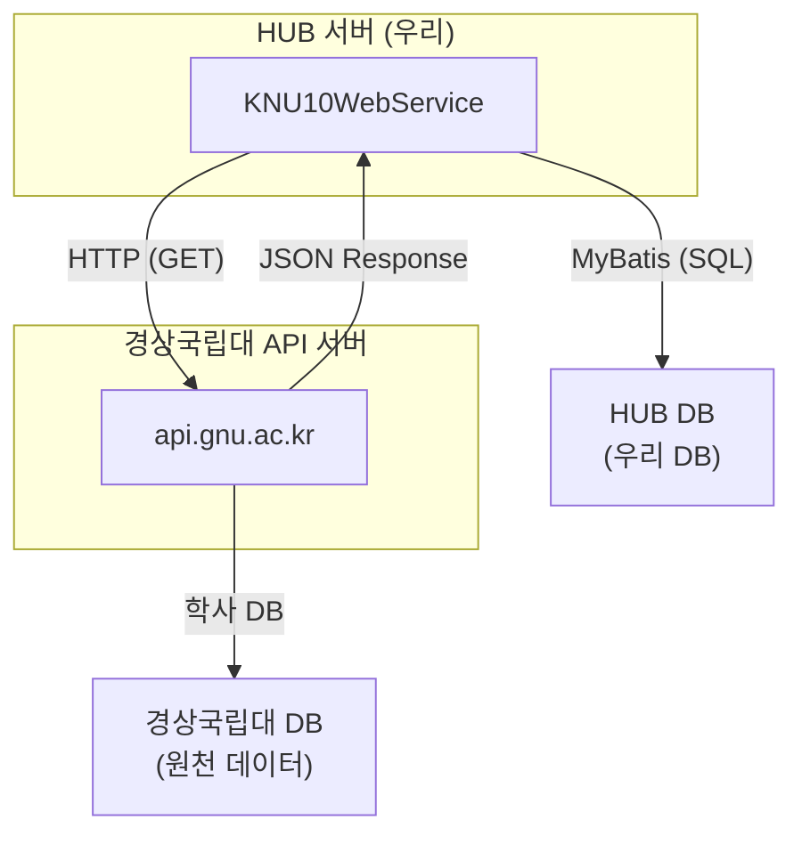
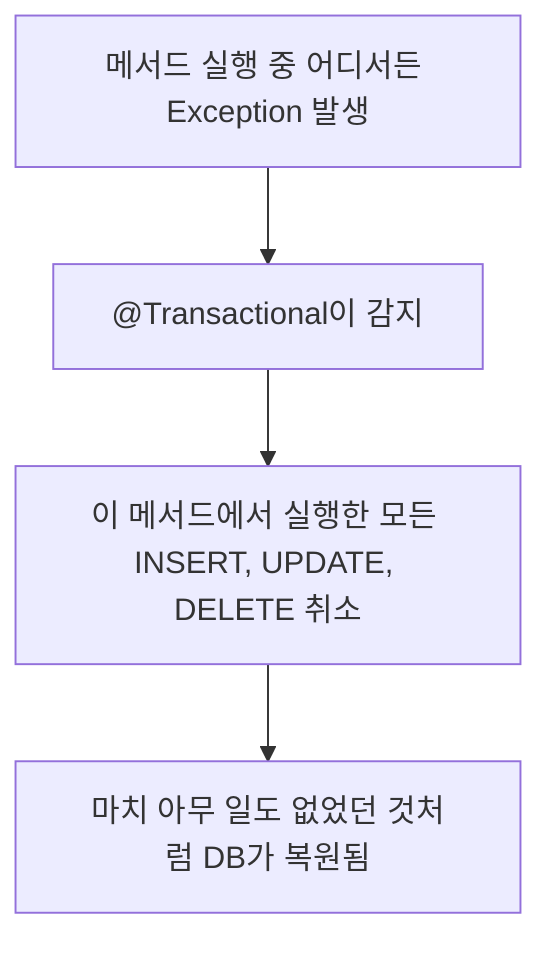
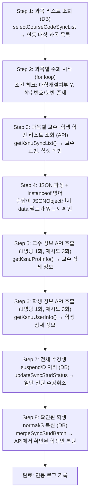
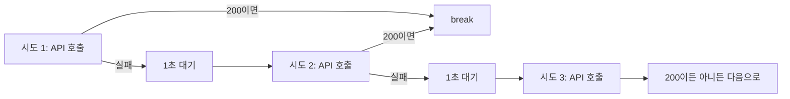
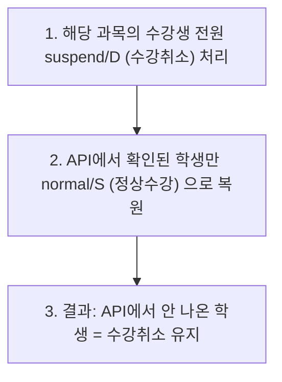

# 08. 실전: 경상국립대 학사연동 전체 분석 - Zeta

---

여기까지 왔으면 HTTP, JSON, REST, 타입캐스팅, @Transactional, MyBatis, 재시도 패턴을 전부 배웠다.

이제 그 전부를 합쳐서 **실제 프로덕션 코드 하나를 완전히 해부**한다.

`syncGsnu()` - 경상국립대 학사연동 메서드. 약 430줄. 이 메서드 하나에 지금까지 배운 모든 게 들어있다.

읽고 나면 "아 그래서 그렇게 된 거구나"가 아니라 **"이건 왜 이렇게밖에 못 했을까"**까지 생각할 수 있어야 한다.

---

## 1. 전체 아키텍처



### 역할 정리

| 구분 | 시스템 | 역할 |
|------|--------|------|
| **HUB** | KNU10WebService | 학습관리시스템의 허브. 각 대학 학사 데이터를 받아서 통합 관리 |
| **경상국립대 API** | api.gnu.ac.kr | 학사 데이터 원천. 과목, 교수, 학생 정보를 API로 제공 |
| **HUB DB** | 우리 데이터베이스 | 연동받은 데이터 저장. 사용자, 과목, 수강 정보 |
| **경상국립대 DB** | 경상국립대 내부 | 실제 학적 데이터. 우리가 직접 접근 불가 |

핵심은 이거다: **경상국립대 DB에 직접 접근할 수 없으니까 API를 통해서 데이터를 가져온다.** 그래서 네트워크 불안정, 서버 에러, 데이터 형식 불일치 같은 문제가 전부 발생할 수 있다.

---

## 2. syncGsnu() 메서드 전체 흐름

### 2.1 메서드 선언부

```java
@Transactional(rollbackFor = Exception.class)
public void syncGsnu(Sync sync) throws Exception {
```

**05장에서 배운 내용 복습:**
- `@Transactional(rollbackFor = Exception.class)` = 이 메서드 안에서 Exception이 터지면 **DB 작업 전부 롤백**
- `throws Exception` = 예외를 호출자에게 던진다

이 두 가지가 합쳐지면 무슨 일이 생기냐면:



왜 이게 중요한지는 4장 "버그 발생 시나리오"에서 뼈저리게 느끼게 된다.

### 2.2 초기 설정

```java
if (haksaSyncYn != null && haksaSyncYn.equals("N")) {
    return;  // 학사연동 비활성화면 즉시 종료
}

List<Sync> syncSubjectList = new ArrayList<Sync>();    // 과목 리스트
List<Sync> syncSubjectProfList = new ArrayList<Sync>(); // 담당교수 리스트
List<Sync> syncOwnerList = new ArrayList<Sync>();       // 공동교수 리스트
List<Sync> syncStudList = new ArrayList<Sync>();        // 수강생 리스트
List<Sync> syncUserList = new ArrayList<Sync>();        // 사용자 리스트
List<Sync> syncUserlogList = new ArrayList<Sync>();     // 연동 로그 리스트
List<Sync> syncDeptList = new ArrayList<Sync>();        // 학과 리스트
Set<String> userLogUserIdSet = new HashSet<>();         // 중복 방지용 Set
```

**왜 이렇게 리스트가 많냐?**

한 번의 연동에서 처리해야 할 데이터가 다양하기 때문이다:
- 과목 정보, 교수 정보, 학생 정보, 수강 정보, 학과 정보 전부 별도로 관리
- 각 리스트에 데이터를 모아두고, 마지막에 **한꺼번에 batch로 DB에 반영**한다

이게 06장에서 배운 MyBatis batch 처리다. 하나씩 INSERT하면 너무 느리니까.

### 2.3 전체 흐름 8단계



### 2.4 Step 1~2: 과목 리스트 순회

```java
List<Sync> subjectList = this.syncMapper.selectCourseCodeSyncList(sync);

for(int i=0; i < subjectList.size(); i++) {
    Sync obj = subjectList.get(i);

    if(obj.getUnivCd() != null &&
        (
            obj.getUnivCd().equals(sync.getUnivCd()) ||
            (
                obj.getUnivOpenYn() != null && obj.getUnivOpenYn().equals("Y") &&
                obj.getUnivHaksuNo() != null && !obj.getUnivHaksuNo().equals("") &&
                obj.getUnivBunban() != null && !obj.getUnivBunban().equals("")
            )
        )
    ) {
```

**조건 분석:**

!!! note "과목 필터링 조건"
    1. `univCd`가 null이 아니어야 함 (대학 코드 존재)
    2. 그리고 둘 중 하나:
        - a. 해당 대학 코드와 일치하거나
        - b. 대학개설여부 = "Y" AND 학수번호 입력됨 AND 분반 입력됨

HUB에는 여러 대학의 과목이 섞여있다. 이 조건으로 **경상국립대 관련 과목만 필터링**하는 거다.

### 2.5 Step 3: 과목별 교수+학생 학번 리스트

```java
obj.setHeaderKey(certificationKey);
String sjbRslt = this.syncRestTemplate.getKsnuSyncList(obj);
```

이 API 호출 하나로 해당 과목의 **교수 교번 목록**과 **학생 학번 목록**을 가져온다.

**API 상세:**

```
GET https://api.gnu.ac.kr/api/hs/openSubjectStudents
    ?year=2026
    &semester=1
    &page=1
    &rowsPerFetch=1000
    &subjectCode=ABC123
    &elearning=3
Header: certification-key: [인증키]
```

**응답 구조:**

```json
{
  "status": "200",
  "data": {
    "subjectList": [
      {
        "repProfessor": "12345",
        "professors": ["12345", "67890"],
        "studentInfo": [
          { "studentNo": "174006", "retakeYn": "N" },
          { "studentNo": "174007", "retakeYn": "N" }
        ]
      }
    ]
  }
}
```

여기서 가져오는 건 **학번/교번 목록뿐**이다. 이름, 학과, 이메일 같은 상세 정보는 없다. 그래서 다음 단계에서 **1명씩 추가 API를 호출**해야 한다.

### 2.6 Step 4: JSON 파싱 + instanceof 방어

```java
JSONParser parser = new JSONParser();
JSONObject jsonObject = (JSONObject) parser.parse(sjbRslt);

if (jsonObject.containsKey("data") && jsonObject.get("data") instanceof JSONObject) {
    JSONObject dataObject = (JSONObject) jsonObject.get("data");

    if(dataObject.get("subjectList") instanceof JSONArray) {
        JSONArray sbjArray = (JSONArray) dataObject.get("subjectList");
```

04장에서 배운 `instanceof` 방어가 여기서 쓰인다.

**왜 방어가 필요한가?**

경상국립대 API가 항상 같은 형식으로 응답하리란 보장이 없다:

| 정상 응답 | `"data": { "subjectList": [...] }` | JSONObject 안에 JSONArray |
|-----------|-------------------------------------|--------------------------|
| 에러 응답 | `"data": "서버 오류입니다"` | String |
| 빈 응답 | `"data": null` | null |
| 예외 응답 | `"data": 500` | Number |

`instanceof` 체크 없이 `(JSONObject) jsonObject.get("data")`를 하면? **ClassCastException**. 그리고 `@Transactional`이 이걸 잡아서 전체 롤백. 이미 처리한 과목 데이터까지 전부 날아간다.

### 2.7 Step 5: 교수 정보 API 호출

```java
for(int j = 0; j < professorArray.size(); j++) {
    String profNo = (String) professorArray.get(j);

    obj.setStudentId(profNo);
    String userInfo = null;
    for(int retry = 0; retry < 3; retry++) {
        userInfo = this.syncRestTemplate.getKsnuProfInfo(obj);
        if(userInfo != null && userInfo.contains("\"status\":\"200\"")) {
            break;
        }
        if(retry < 2) {
            System.out.println("[경상국립대] 교수 API 재시도 (" + (retry+1) + "/3) - 교번: "
                + profNo + ", 응답: " + userInfo);
            Thread.sleep(1000);
        }
    }
```

**API 상세:**

```
GET https://api.gnu.ac.kr/api/hr/employee?employeeNo=12345
Header: certification-key: [인증키]
```

07장에서 배운 재시도 패턴이 여기서 실전 투입된다:



그 뒤에 교수 정보를 파싱해서 사용자 데이터로 매핑한다:

```java
Object parsedObject = parser1.parse(userInfo);  // Object로 먼저 파싱

if (parsedObject instanceof JSONObject) {       // instanceof 방어
    JSONObject jsonObject1 = (JSONObject) parsedObject;

    if (jsonObject1.containsKey("data") && jsonObject1.get("data") instanceof JSONObject) {
        JSONObject userInfoObj = (JSONObject) jsonObject1.get("data");

        // 데이터 매핑
        userObj.setStudentId(String.valueOf(userInfoObj.get("employeeNo")));
        userObj.setUserType("ROLE_PROF");
        userObj.setUserName(String.valueOf(userInfoObj.get("name")));
        // ... 나머지 필드 매핑
    }
}
```

**주목할 점:** `parser1.parse(userInfo)`의 결과를 `JSONObject`로 바로 캐스팅하지 않고 `Object`로 받은 뒤 `instanceof` 체크한다. 이게 수정 후 코드다. 수정 전에는 바로 캐스팅해서 터졌다.

### 2.8 Step 6: 학생 정보 API 호출

```java
for(int j = 0; j < studentInfoArray.size(); j++) {
    JSONObject studInfo = (JSONObject) studentInfoArray.get(j);

    obj.setStudentId(String.valueOf(studInfo.get("studentNo")));
    String userInfo = null;
    for(int retry = 0; retry < 3; retry++) {
        userInfo = this.syncRestTemplate.getKsnuUserInfo(obj);
        if(userInfo != null && userInfo.contains("\"status\":\"200\"")) {
            break;
        }
        if(retry < 2) {
            System.out.println("[경상국립대] 학생 API 재시도 (" + (retry+1) + "/3) - 학번: "
                + studInfo.get("studentNo") + ", 과목번호: " + obj.getSubjectNo()
                + ", 응답: " + userInfo);
            Thread.sleep(1000);
        }
    }
```

**API 상세:**

```
GET https://api.gnu.ac.kr/api/hs/student?studentNo=174006
Header: certification-key: [인증키]
```

교수 API와 구조가 동일하다. 학생 1명당 1회 API 호출, 최대 3회 재시도.

**응답 구조 차이 (교수 vs 학생):**

| 대상 | data 형식 | Java 타입 |
|------|-----------|-----------|
| 교수 응답 | `"data": { ... }` | JSONObject |
| 학생 응답 | `"data": [ { ... } ]` | JSONArray |

교수는 `data`가 JSONObject이고, 학생은 `data`가 JSONArray다. 경상국립대 API가 그렇게 설계되어 있다. 그래서 파싱 코드도 다르다:

```java
// 교수: data가 JSONObject
if (jsonObject1.get("data") instanceof JSONObject) {
    JSONObject userInfoObj = (JSONObject) jsonObject1.get("data");

// 학생: data가 JSONArray
if (jsonObject1.get("data") instanceof JSONArray) {
    JSONArray userArray = (JSONArray) jsonObject1.get("data");
    JSONObject userInfoObj = (JSONObject) userArray.get(0);
```

### 2.9 Step 7~8: suspend/D → normal/S 전략

이 부분이 이 메서드에서 **가장 중요하고 가장 위험한** 로직이다.

```java
// Step 7: 전원 수강취소 처리
sync.setLearnerStatus("suspend");
sync.setEnrlSts("D");
this.syncMapper.updateSyncStudStatus(sync);

// Step 8: API에서 확인된 학생만 복원
sync.setSyncList(syncStudList);
this.syncMapper.mergeSyncStudBatch(sync);
```

**전략:**



**왜 이렇게 하냐?**

경상국립대에서 수강취소한 학생을 별도로 알려주는 API가 없다. 그래서:
- "누가 빠졌는지" 알 방법이 없으니
- "전부 끄고, 있는 사람만 다시 켜는" 방식을 쓴다

이건 **DELETE and Re-INSERT 패턴**의 변형이다. 단순하지만 위험하다.

!!! danger "위험 포인트"
    Step 7 (전원 수강취소)은 실행됐는데 Step 8 (복원)이 실패하면?

    -> 전교생 수강취소 상태로 남는다

    -> 이게 바로 "랜덤 수강취소" 버그의 원인이었다

---

## 3. 경상국립대만의 특수성

### 3.1 다른 대학 vs 경상국립대

!!! example "다른 대학 - 일반적인 패턴"
    API 1회 호출 -> 전체 학생 리스트 응답

    ```
    GET /api/students?subjectCode=ABC123
    응답: [학생1_전체정보, 학생2_전체정보, 학생3_전체정보, ...]
    ```

    API 호출 횟수: 과목 수 (예: 30과목 = 30회)

!!! warning "경상국립대 - 특수 패턴"
    API 1회: 과목별 학번 리스트만 반환 (상세 정보 없음)

    API N회: 학생 1명당 상세 정보 1회씩 추가 호출

    ```
    GET /api/hs/openSubjectStudents → 학번 목록만
    GET /api/hs/student?studentNo=174006 → 학생 1명 상세
    GET /api/hs/student?studentNo=174007 → 학생 1명 상세
    GET /api/hs/student?studentNo=174008 → 학생 1명 상세
    ... (수강생 수만큼 반복)
    ```

    API 호출 횟수: 과목 수 + 교수 수 + 학생 수

    예: 30과목, 교수 30명, 학생 900명 = 약 960회

### 3.2 왜 이런 구조인가

경상국립대 API가 **"학생 개별 조회"용으로만 설계**되어 있기 때문이다. 리스트 조회 API(`openSubjectStudents`)는 학번만 주고, 상세 정보는 개별 API로 따로 가져와야 한다.

이건 우리가 바꿀 수 없다. 경상국립대가 제공하는 API 스펙이 그렇게 되어 있으니까.

### 3.3 이게 왜 문제인가

| 항목 | 다른 대학 (30과목 기준) | 경상국립대 (30과목, 900명 기준) |
|------|------------------------|-------------------------------|
| API 호출 횟수 | 약 30회 | 약 960회 |
| 소요 시간 | 수 초 | 수 분 ~ 수십 분 |
| 에러 발생 확률 | 낮음 | **매우 높음** (960번 중 1번만 실패해도 문제) |
| 네트워크 부하 | 낮음 | 높음 |

**호출 횟수가 많을수록 1번이라도 실패할 확률이 올라간다.** 960번 호출에서 각각 1%의 실패 확률이면, 전체 성공 확률은 `0.99^960 = 약 0.006` = **0.6%**. 거의 매번 실패한다는 뜻이다.

그래서 재시도 패턴이 생존에 필수였다.

---

## 4. 버그 발생 시나리오 재현

수정 전 코드에서 실제로 발생했던 시나리오들이다.

### 시나리오 1: API 500 에러 → 학생 복원 안 됨 → 수강취소

!!! danger "시나리오 1: API 500 에러로 인한 수강취소"
    **상황:** 수강생 30명 중 학생A(학번 174006)의 API만 500 에러

    **1. Step 7 실행:** 30명 전원 suspend/D 처리 -> 학생A, B, C, ... Z 전부 수강취소

    **2. Step 6에서 학생별 API 호출:**

    - 학생B: 200 OK -> syncStudList에 추가 (성공)
    - 학생C: 200 OK -> syncStudList에 추가 (성공)
    - 학생A: 500 Error -> syncStudList에 추가 안 됨 (실패)
    - 학생D: 200 OK -> syncStudList에 추가 (성공)
    - ... (나머지 전부 성공)

    **3. Step 8 실행:** syncStudList에 있는 29명만 normal/S 복원 -> 학생A는 리스트에 없으니까 suspend/D 유지

    **결과:** 학생A만 수강취소 처리됨. 실제로는 수강 중인 학생인데, API 에러 때문에 누락된 것

    **피해:** 학생A는 강의실 접근 불가, 과제 제출 불가, 출석 기록 불가

**수정 전:** 재시도 없이 1회만 호출. 500 나오면 그냥 넘어감. → 매 실행마다 3~6명 랜덤 수강취소.

**수정 후:** 3회 재시도. 대부분의 일시적 500 에러는 재시도로 복구됨. → 수강취소자 0명.

### 시나리오 2: ClassCastException → @Transactional 롤백

!!! danger "시나리오 2: 타입 캐스팅 실패로 인한 전체 롤백"
    **수정 전 코드:** `JSONObject jsonObject1 = (JSONObject) parser1.parse(userInfo);`

    **상황:** 경상국립대 API가 500 에러 시 JSON이 아닌 HTML을 반환

    - `parser1.parse()`가 String을 반환
    - `(JSONObject)`로 캐스팅 시도
    - ClassCastException 발생!

    그런데 이 메서드는 `@Transactional(rollbackFor = Exception.class)`

    - ClassCastException은 RuntimeException의 자식
    - RuntimeException은 Exception의 자식
    - rollbackFor = Exception.class에 해당
    - **전체 롤백!**

    **결과:**

    - 이미 성공적으로 처리한 과목 1~15번 데이터도 전부 롤백
    - 16번 과목의 3번째 학생에서 터졌다고 1~15번까지 다 날아감
    - 연동 로그에는 "실패"만 기록
    - 다음 연동 때 또 처음부터 시작

    **피해:** 전체 학사연동 실패. 모든 과목, 모든 학생 데이터 미반영

이게 04장에서 배운 `instanceof` 방어의 실전 효과다. `instanceof` 체크 하나 안 해서 전교생 데이터가 날아갈 수 있었다.

### 시나리오 3: 교번 99999 → 더미 데이터 → 매번 500 에러

!!! danger "시나리오 3: 더미 교번으로 인한 반복 에러"
    **상황:** 경상국립대에서 교수 교번에 "99999" 같은 더미 값 존재

    - `getKsnuProfInfo(99999)` 호출
    - 경상국립대 DB에 99999 교수 없음
    - API가 500 에러 또는 빈 응답 반환
    - 매 연동마다 이 에러가 반복됨

    **수정 전:** ClassCastException -> 전체 롤백

    **수정 후:** instanceof 방어 + 로그 출력 -> 해당 교수만 건너뛰고 계속

    **로그:**
    ```
    경고: 교수 정보가 JSONObject 형식이 아닙니다.
    교번: 99999, 응답 내용: ...
    ```

---

## 5. 수정 내역 상세

실제 코드에서 수정한 4가지 핵심 포인트를 하나씩 분석한다.

### 5.1 instanceof 방어 (line 477)

**수정 전:**
```java
JSONObject dataObject = (JSONObject) jsonObject.get("data");
```

**수정 후:**
```java
if (jsonObject.containsKey("data") && jsonObject.get("data") instanceof JSONObject) {
    JSONObject dataObject = (JSONObject) jsonObject.get("data");
```

**변경 이유:** `data` 필드가 JSONObject가 아닐 수 있다. `containsKey` + `instanceof` 이중 체크로 ClassCastException 완전 차단.

같은 패턴이 학생 파싱(line 649, 656)에도 적용되어 있다:

```java
Object parsedObject = parser1.parse(userInfo);       // Object로 먼저 받고
if (parsedObject instanceof JSONObject) {             // instanceof 확인 후
    JSONObject jsonObject1 = (JSONObject) parsedObject; // 안전하게 캐스팅
```

### 5.2 교수 API 재시도 (line 496~506)

**수정 전:**
```java
String userInfo = this.syncRestTemplate.getKsnuProfInfo(obj);
```

**수정 후:**
```java
String userInfo = null;
for(int retry = 0; retry < 3; retry++) {
    userInfo = this.syncRestTemplate.getKsnuProfInfo(obj);
    if(userInfo != null && userInfo.contains("\"status\":\"200\"")) {
        break;  // 성공하면 즉시 탈출
    }
    if(retry < 2) {
        System.out.println("[경상국립대] 교수 API 재시도 ...");
        Thread.sleep(1000);  // 1초 대기 후 재시도
    }
}
```

**변경 이유:** 1회 호출 실패 시 바로 포기하면, 일시적 네트워크 문제에도 교수 정보를 못 가져온다. 3회 재시도 + 1초 간격으로 대부분의 일시적 에러를 극복.

### 5.3 학생 API 재시도 (line 632~643)

교수 API 재시도와 동일한 패턴. 학생 API(`getKsnuUserInfo`)에 적용.

```java
String userInfo = null;
for(int retry = 0; retry < 3; retry++) {
    userInfo = this.syncRestTemplate.getKsnuUserInfo(obj);
    if(userInfo != null && userInfo.contains("\"status\":\"200\"")) {
        break;
    }
    if(retry < 2) {
        System.out.println("[경상국립대] 학생 API 재시도 ...");
        Thread.sleep(1000);
    }
}
```

### 5.4 에러 로그 추가 (line 762~772)

**수정 전:** 에러 발생 시 아무 로그도 없음. 뭐가 문제인지 알 수 없었다.

**수정 후:**

```java
} else {
    System.out.println("[경상국립대] 학번: " + studInfo.get("studentNo")
        + " - data 배열이 비어있음 (size=0). 과목번호: " + obj.getSubjectNo());
}
} else {
    System.out.println("[경상국립대] 학번: " + studInfo.get("studentNo")
        + " - data가 JSONArray가 아님 (API 500 오류 가능성). 과목번호: "
        + obj.getSubjectNo() + ", 응답: " + userInfo);
}
} else {
    System.out.println("[경상국립대] 학번: " + studInfo.get("studentNo")
        + " - data 필드 없음 또는 null. 과목번호: "
        + obj.getSubjectNo() + ", 응답: " + userInfo);
}
} else {
    System.out.println("[경상국립대] 학번: " + studInfo.get("studentNo")
        + " - 응답이 JSONObject가 아님. 과목번호: "
        + obj.getSubjectNo() + ", 응답: " + userInfo);
}
```

4가지 에러 케이스를 각각 구분해서 로그를 남긴다:

| 로그 메시지 | 원인 | 심각도 |
|-------------|------|--------|
| data 배열이 비어있음 | 해당 학번의 학생이 경상국립대 DB에 없음 | 낮음 |
| data가 JSONArray가 아님 | API 500 에러 후 재시도도 실패 | 높음 |
| data 필드 없음 또는 null | API 응답 구조 자체가 이상함 | 높음 |
| 응답이 JSONObject가 아님 | HTML 에러 페이지 등 비정상 응답 | 매우 높음 |

---

## 6. 수정 전 vs 수정 후 비교

### 6.1 동작 차이

!!! danger "수정 전 (Before)"
    - API 호출 1회 -> 실패 -> 포기 -> 해당 학생 누락
    - API 응답 이상 -> 바로 캐스팅 -> ClassCastException -> 전체 롤백
    - 에러 발생 -> 로그 없음 -> 원인 파악 불가

    **결과:** 매 실행마다 3~6명 랜덤 수강취소

    **담당자 입장:** "왜 학생이 수강취소됐는지 모르겠음"

!!! success "수정 후 (After)"
    - API 호출 1회 -> 실패 -> 1초 대기 -> 재시도 -> 실패 -> 1초 대기 -> 재시도 -> 성공 -> 학생 정상 처리
    - API 응답 이상 -> instanceof 체크 -> 해당 학생만 건너뜀 -> 다른 학생 처리는 계속 진행
    - 에러 발생 -> 상세 로그 출력 -> 원인 즉시 파악 가능

    **결과:** 수강취소자 0명

    **담당자 입장:** "연동 정상 완료. 로그에 경고 2건 확인, 대응 완료"

### 6.2 수치 비교

| 항목 | 수정 전 | 수정 후 |
|------|---------|---------|
| 랜덤 수강취소 발생 | 매 실행 3~6명 | 0명 |
| ClassCastException | 간헐적 발생 | 발생 불가 |
| 전체 롤백 | 간헐적 발생 | 발생 불가 (instanceof 방어) |
| 에러 원인 파악 시간 | 수 시간 (로그 없어서) | 수 초 (로그 확인) |
| API 실패 복구율 | 0% (재시도 없음) | 약 95% (3회 재시도) |

---

## 7. 이 코드에서 배울 점

### 7.1 외부 API 연동 시 방어 코딩의 중요성

**내 코드는 내가 통제할 수 있다. 남의 API는 통제할 수 없다.**

경상국립대 API가 언제 500을 줄지, 언제 형식이 바뀔지, 언제 다운될지 우리는 모른다. 그래서:

!!! abstract "외부 API 방어 코딩 4원칙"
    1. 외부 API 응답은 절대 신뢰하지 않는다
    2. 모든 파싱에 타입 체크를 넣는다
    3. 실패 시 재시도 로직을 반드시 넣는다
    4. 실패해도 다른 데이터 처리에 영향을 주지 않게 격리한다

### 7.2 instanceof 체크의 필요성

```java
// 이 한 줄이 전교생 데이터를 살렸다
if (parsedObject instanceof JSONObject) {
```

JSON 파싱 결과가 항상 JSONObject라는 보장은 없다. String일 수도, JSONArray일 수도, null일 수도 있다. `instanceof` 하나 안 넣어서 전체 롤백이 날 수 있다.

### 7.3 재시도 패턴의 실전 효과

!!! tip "재시도의 수학적 효과"
    | 조건 | 성공률 |
    |------|--------|
    | API 1회 성공률 | 97% (3% 실패) |
    | API 3회 재시도 후 성공률 | 99.997% (0.003% 실패) |

    **960회 호출 기준:**

    | 전략 | 전체 성공 확률 |
    |------|---------------|
    | 재시도 없음 | 약 0.6% |
    | 3회 재시도 | 약 97.1% |

재시도 패턴 하나로 0.6%짜리 성공률을 97%로 끌어올렸다.

### 7.4 @Transactional 범위 설계의 중요성

이 메서드는 **모든 과목을 하나의 트랜잭션**으로 처리한다. 장점이자 단점이다:

| 장점 | 단점 |
|------|------|
| 데이터 일관성 보장 (전부 성공 or 전부 실패) | 하나라도 터지면 전부 날아감 |
| 부분 반영으로 인한 데이터 꼬임 방지 | 트랜잭션 시간이 길어짐 (수 분) |
| 단순한 로직 | 록(lock) 경합 가능성 |

만약 과목별로 트랜잭션을 분리했다면? 16번 과목에서 터져도 1~15번은 살았을 거다. 하지만 그러면 "15번까지만 반영, 16~30번 미반영"이라는 불완전한 상태가 생긴다.

어느 쪽이 낫냐는 상황에 따라 다르다. **이게 트레이드오프 분석이다.**

---

## 8. 개선 제안

현재 코드는 "돌아간다". 버그도 잡았다. 하지만 **"돌아간다"는 Lv1이다.** 더 나아질 수 있는 부분을 분석한다.

### 8.1 근본적 해결: 리스트 조회 API 신설 요청

!!! note "현재 vs 이상"
    - **현재:** 학생 1명당 1회 API (N+1 문제와 본질적으로 동일)
    - **이상:** 과목별 학생 전체 상세 정보 1회 API

    ```
    요청할 API:
    GET /api/hs/openSubjectStudentsDetail
        ?year=2026&semester=1&subjectCode=ABC123

    응답:
    {
      "data": [
        { "studentNo": "174006", "name": "김철수", "department": "컴퓨터공학과", ... },
        { "studentNo": "174007", "name": "이영희", "department": "전자공학과", ... }
      ]
    }
    ```

이렇게 되면 960회 호출이 30회로 줄어든다. 근본적 해결이다. 하지만 경상국립대 측 개발이 필요하니 우리만으로는 안 된다.

### 8.2 지수 백오프(Exponential Backoff) 적용

현재: 재시도 간격 고정 1초

```java
// 현재
Thread.sleep(1000);  // 항상 1초

// 개선: 지수 백오프
Thread.sleep((long) Math.pow(2, retry) * 1000);
// retry 0: 1초, retry 1: 2초, retry 2: 4초
```

서버가 과부하일 때 동일 간격으로 재시도하면 부하를 가중시킨다. 간격을 점점 늘려서 서버에 회복할 시간을 준다.

### 8.3 로그 레벨 체계화

현재: `System.out.println` 사용

```java
// 현재
System.out.println("[경상국립대] 학생 API 재시도 ...");

// 개선: Logger 사용
private static final Logger log = LoggerFactory.getLogger(SyncService.class);

log.warn("[경상국립대] 학생 API 재시도 ({}/3) - 학번: {}, 과목번호: {}, 응답: {}",
    retry + 1, studInfo.get("studentNo"), obj.getSubjectNo(), userInfo);
```

| System.out.println | Logger |
|--------------------|--------|
| 로그 레벨 없음 | DEBUG, INFO, WARN, ERROR 구분 |
| 파일 출력 설정 복잡 | logback.xml로 간단 설정 |
| 성능 영향 큼 | 비동기 출력 가능 |
| 운영 환경에서 끄기 어려움 | 레벨별 ON/OFF 가능 |

### 8.4 에러 카운트 기록

```java
// 현재: 성공 카운트만 기록
sync.setAddCnt(addCnt);
sync.setModCnt(modCnt);

// 개선: 에러 카운트도 기록
int errCnt = 0;
// ... API 실패 시 errCnt++
sync.setErrCnt(errCnt);  // "960회 중 3회 실패" 같은 정보
```

연동은 성공했지만 "몇 건이 누락됐는지" 정량적으로 파악할 수 있다.

---

## 9. 확인 문제

**Q1.** syncGsnu()에서 Step 7(전원 suspend/D)이 먼저 실행되고 Step 8(normal/S 복원)이 나중에 실행되는 이유는? 순서를 바꾸면 어떤 문제가 생기나?

**Q2.** 경상국립대 API에서 학생 정보 응답의 `data`가 JSONObject가 아니라 JSONArray인데, 교수 정보는 JSONObject다. 코드에서 이 차이를 어떻게 처리하고 있나?

**Q3.** `instanceof` 방어 없이 `(JSONObject) parser1.parse(userInfo)`를 했을 때, API가 HTML 에러 페이지를 반환하면 어떤 일이 순서대로 벌어지나? (파싱 → 캐스팅 → 트랜잭션까지)

**Q4.** 재시도 3회를 하는데, `if(retry < 2)` 조건으로 로그와 Thread.sleep을 감싸고 있다. 왜 `retry < 3`이 아니라 `retry < 2`인가?

**Q5.** 현재 `@Transactional` 범위가 메서드 전체다. 만약 과목별로 트랜잭션을 분리한다면 장점 2가지와 단점 2가지를 말해봐. 그리고 현재 방식이 더 나은 상황은 언제인가?

---

> **"교과서에서 배운 건 이론이야. 프로덕션 코드에서 새벽 3시에 터진 버그를 잡아본 놈이 진짜 개발자야. 이 코드가 왜 이렇게 생겼는지 이해했으면, 이제 네 코드에서 같은 실수하지 마. Not quite my tempo? 다시 읽어."**
