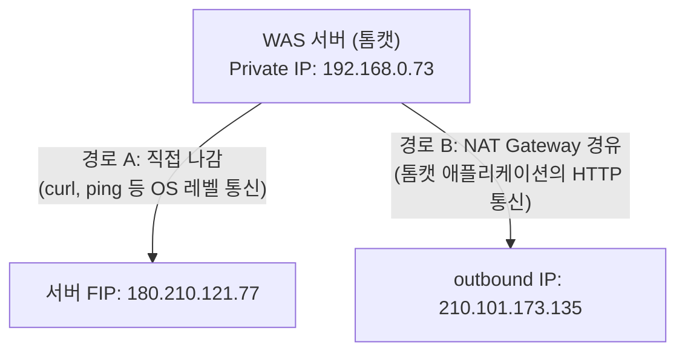
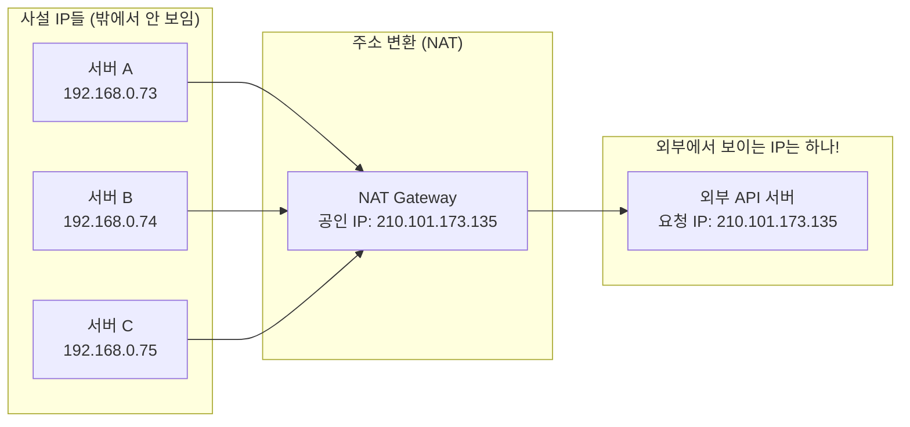
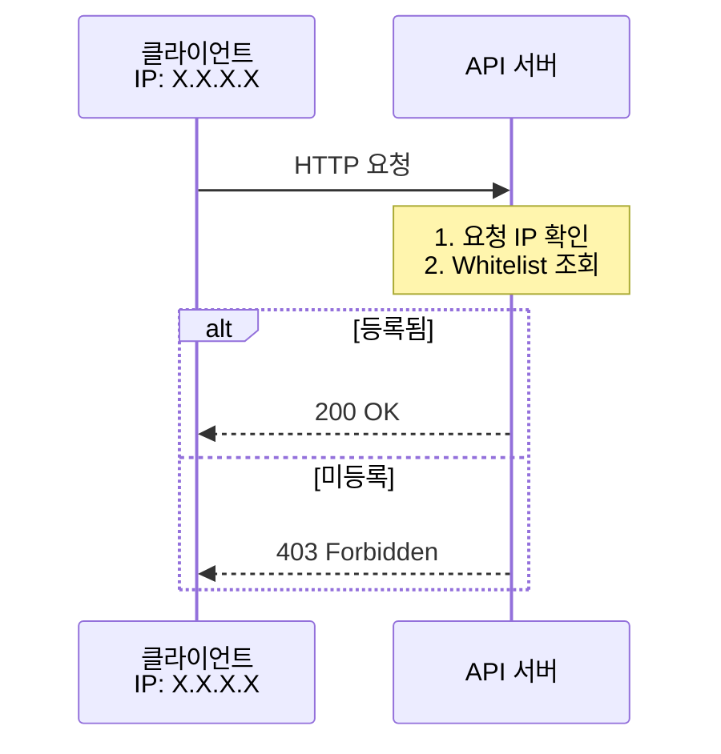
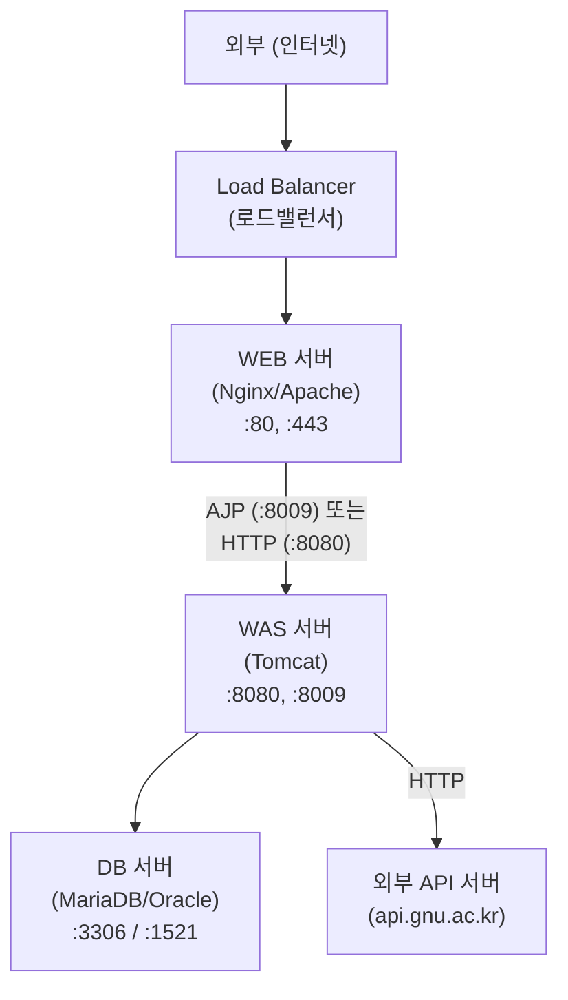
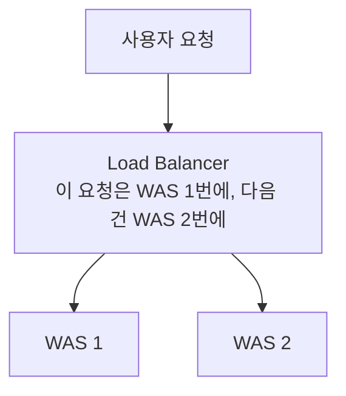
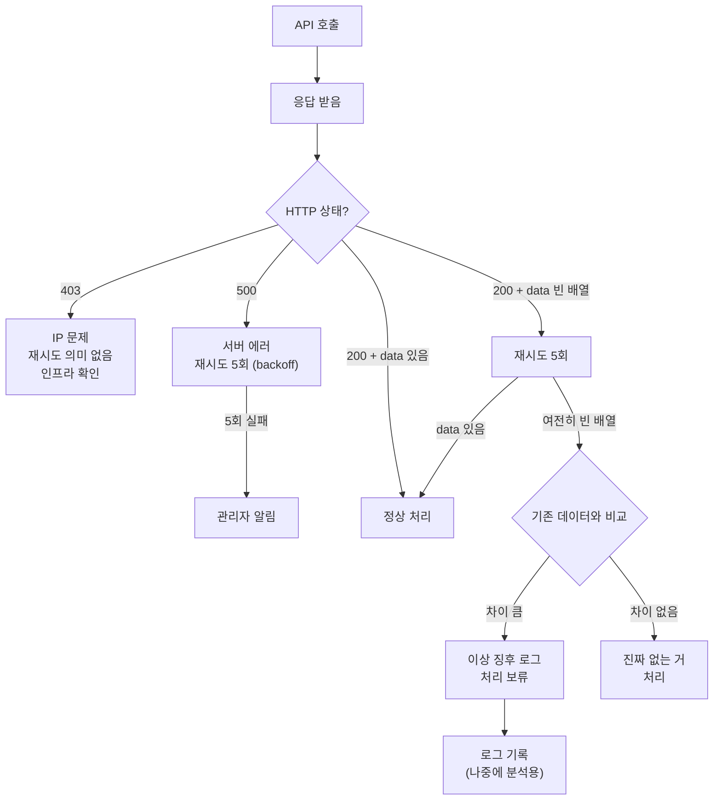

# 11. 서버 인프라와 네트워크 - Omega

---

코드만 잘 짜면 된다고? 서버가 어떻게 돌아가는지 모르면 장애 터졌을 때 넌 그냥 구경꾼이야.

이번 챕터는 경상국립대 학사연동 디버깅하면서 **실제로 겪은 인프라/네트워크 문제**를 정리한 거다. 책에 없는 내용이야. 삽질해야 비로소 보이는 것들.

---

## 1. 서버에서 API 호출할 때 IP가 다르다고?

실화야. 같은 서버에서 같은 API를 호출했는데 결과가 다르다.

```
상황 1: SSH로 서버 접속 → curl로 직접 호출
$ curl -X GET https://api.gnu.ac.kr/api/hs/student?studentNo=174006
→ 403 Forbidden

상황 2: 톰캣 애플리케이션(Java)에서 HttpURLConnection으로 호출
→ 200 OK
```

같은 서버에서 호출했는데 403이랑 200이 갈린다. **왜?**

### 핵심: outbound IP가 다르다



경상국립대 API 서버에 등록된 IP: **210.101.173.135**

- 경로 A(curl)로 가면 → 180.210.121.77로 나감 → **미등록 → 403**
- 경로 B(톰캣)로 가면 → 210.101.173.135로 나감 → **등록됨 → 200**

**FIP(Floating IP)**: 서버에 직접 붙은 공인 IP. SSH 접속할 때 쓰는 그 IP.

**NAT Gateway를 통한 outbound IP**: 네트워크 라우팅 설정에 따라 특정 트래픽이 NAT Gateway를 경유하면, 외부에서 보이는 IP가 달라진다.

이게 왜 중요하냐고? **API 서버가 IP로 인증하니까.** 등록 안 된 IP에서 오면 가차없이 403이야.

---

## 2. NAT Gateway란?

**NAT = Network Address Translation (네트워크 주소 변환)**

한 줄 요약: **내부 IP를 외부 IP로 바꿔주는 놈.**

### NAT가 왜 필요해?

**이유 1: IP 부족**

IPv4 주소는 약 43억 개. 전 세계 기기 수에 비하면 턱없이 부족해. 그래서 내부에서는 사설 IP(192.168.x.x, 10.x.x.x)를 쓰고, 밖에 나갈 때만 공인 IP로 변환한다.



서버가 3대인데 밖에서 보이는 IP는 하나. 이게 NAT야.

**이유 2: 보안**

외부에서 내부 서버의 실제 IP를 알 수 없어. NAT Gateway IP만 보이니까 내부 구조를 숨기는 효과가 있다.

**이유 3: 관리 편의성**

서버가 100대여도 outbound IP는 NAT Gateway IP 하나(혹은 몇 개). 외부 API에 IP 등록할 때 100개 등록할 필요 없이 1개만 등록하면 된다.

### 클라우드 환경에서의 NAT

| 클라우드 | NAT 서비스명 | 설정 위치 |
|----------|-------------|-----------|
| AWS | NAT Gateway | VPC > NAT Gateways |
| NCloud (네이버) | NAT Gateway | VPC > NAT Gateway |
| Azure | NAT Gateway | Virtual Network > NAT gateway |
| GCP | Cloud NAT | VPC network > Cloud NAT |

### 실전 구성: 우리 서버

```
[WAS 서버]
Private IP: 192.168.0.73
Floating IP (FIP): 180.210.121.77  ← SSH 접속용
     │
     ├── curl api.gnu.ac.kr
     │   → FIP(180.210.121.77)로 나감
     │   → 경상국립대: "이 IP 누구야? 등록 안 됨" → 403
     │
     └── 톰캣 애플리케이션 → HttpURLConnection
         → 라우팅 테이블에 의해 NAT Gateway 경유
         → outbound IP: 210.101.173.135
         → 경상국립대: "이 IP 등록됨. 통과" → 200
```

라우팅 설정에 따라 어떤 트래픽이 NAT를 타는지 달라진다. OS 레벨(curl)과 애플리케이션 레벨이 다른 경로를 탈 수 있다는 거야. "같은 서버인데 IP가 다르다"가 이해 안 되면 이 그림 열 번 봐.

---

## 3. VPN과 서버의 차이

"VPN 켜면 되는 거 아닌가요?" - 이 질문 자체가 VPN을 모른다는 증거야.

### VPN이 하는 일

VPN(Virtual Private Network)은 **네 컴퓨터의 네트워크 경로**를 변경하는 거야.

```
VPN 없을 때:
[내 PC] → [인터넷] → [목적지 서버]
          내 IP: 123.456.789.0

VPN 켤 때:
[내 PC] → [VPN 서버] → [인터넷] → [목적지 서버]
                        VPN IP: 210.101.173.xxx
```

### VPN과 서버의 관계

흔한 오해: "내 PC에서 VPN 켜면 서버에서 나가는 IP도 바뀌나요?"

**절대 안 바뀜.**

VPN은 너의 PC에만 적용되는 거야. 서버는 서버 자체의 네트워크 설정(라우팅, NAT)으로 나간다. 네 PC에서 뭘 하든 서버의 outbound IP에는 영향 없음.

| 구분 | 영향 범위 | 역할 |
|------|-----------|------|
| VPN | 내 PC만 | 내 PC의 네트워크 경로 변경 (로컬 영향) |
| NAT Gateway | 서버 인프라 | 서버의 outbound IP 변경 (인프라 영향) |
| 서버 VPN | 서버 자체 | 서버에 별도 VPN 설정 (별도 작업 필요, 잘 안 씀) |

### 실전 시나리오

```
Q: "VPN 켰는데 서버에서 curl 치면 왜 안 돼요?"

A: 너의 VPN은 너의 PC에만 적용됨.
   서버에 SSH로 접속한 뒤 치는 curl은 서버의 네트워크를 탐.
   서버의 outbound IP를 바꾸려면 서버 인프라 설정(NAT, 라우팅)을 바꿔야 해.
```

VPN으로 할 수 있는 것:
- 내 PC에서 직접 API 호출할 때 IP 변경
- 회사 내부망에 접속
- 서버 SSH 접속 (특정 IP에서만 접속 허용인 경우)

VPN으로 못 하는 것:
- 서버의 outbound IP 변경
- 서버의 네트워크 라우팅 변경

VPN과 NAT Gateway의 차이를 못 구분하면 인프라 얘기에 끼지 마.

---

## 4. IP 기반 인증 (IP Whitelisting)

**IP Whitelisting = 화이트리스트에 등록된 IP만 허용**

"너 누구야? IP 확인... 등록 안 됨. 꺼져." → **403 Forbidden**

### 동작 원리



### 경상국립대 사례

경상국립대 학사연동 API는 **이중 인증**을 한다:

| 인증 요소 | 설명 | 없으면? |
|-----------|------|---------|
| certification-key | API 인증키 (헤더에 포함) | 401 Unauthorized |
| IP Whitelist | 등록된 IP에서만 요청 허용 | 403 Forbidden |

둘 다 맞아야 통과:

```
certification-key: "abc123..." + IP: 210.101.173.135 → 200 OK
certification-key: "abc123..." + IP: 180.210.121.77  → 403 Forbidden
certification-key: "잘못된키"   + IP: 210.101.173.135 → 401 Unauthorized
```

인증키가 맞아도 IP가 다르면 403이야. 그래서 curl로 치면 403이었던 거다.

### 개발 환경 vs 운영 환경

```
개발 환경 (dev서버)
outbound IP: 210.101.173.XXX ← 이것도 등록해야 개발 가능

운영 환경 (prod서버)
outbound IP: 210.101.173.135 ← 이미 등록됨

로컬 PC (VPN 없이)
outbound IP: ??? ← 매번 바뀔 수 있음 (유동 IP)
```

외부 API 연동할 때는 **"우리 서버의 outbound IP가 뭔지"** 반드시 확인하고, 상대방에게 등록 요청해야 한다.

확인 방법:
```bash
# 서버에서 직접 실행
$ curl ifconfig.me
$ curl ipinfo.io/ip

# 단, 이것도 라우팅에 따라 다를 수 있으니
# 실제 API 호출 시 사용되는 경로의 IP를 확인해야 함
```

403이 뜨면 제일 먼저 의심할 것: **"내 요청이 어떤 IP로 나가고 있지?"** 코드 문제가 아니라 인프라 문제일 수 있어.

---

## 5. 서버 구성 이해

"서버"라고 다 같은 서버가 아니야. 역할에 따라 나뉘고, 각자 하는 일이 다르다.

이거 모르면 "서버 에러입니다"밖에 못 해. **어떤 서버에서 에러인지** 못 짚으면 디버깅 못 해.

### 실제 운영 환경 구성도



### 각 서버의 역할

**WEB 서버 (Nginx / Apache)**
- 정적 파일 처리 (HTML, CSS, JS, 이미지)
- SSL/TLS 인증서 처리 (HTTPS)
- 리버스 프록시 (WAS로 요청 전달)
- 부하 분산 (여러 WAS에 분배)
- 보안 (DDoS 방어, IP 차단, 접근 제어)

**WAS 서버 (Tomcat)**
- 동적 처리 (Java/JSP 실행)
- 비즈니스 로직 수행
- DB 연동
- 외부 API 호출 ← 오늘 배운 거!
- 세션 관리

**DB 서버 (MariaDB / Oracle)**
- 데이터 저장/조회/수정/삭제
- 트랜잭션 관리
- 인덱싱, 최적화

### 왜 분리하냐고?

| 분리 이유 | 설명 |
|-----------|------|
| **보안** | WEB만 외부에 노출, WAS/DB는 내부망에 숨김 |
| **성능** | 정적 파일은 WEB이 처리, WAS는 로직에만 집중 |
| **확장성** | WAS가 부하 받으면 WAS만 증설 (WEB, DB는 그대로) |
| **장애 격리** | WAS 죽어도 WEB에서 "점검 중" 페이지 띄울 수 있음 |
| **관리 편의** | 역할별 설정, 모니터링, 로그 분리 |

### 로드밸런서 역할



역할:
- 트래픽 분배 (Round Robin, Least Connection 등)
- 헬스 체크 (WAS 죽으면 자동으로 빼기)
- SSL 오프로딩 (HTTPS 처리를 LB가 해서 WAS 부담 줄임)

### Tomcat AJP 커넥터

```
AJP (Apache JServ Protocol) - 포트 8009

WEB(Nginx/Apache) ←── AJP ──→ WAS(Tomcat)
```

HTTP로 전달하는 것보다 빠르다. 왜?
- 바이너리 프로토콜 (HTTP는 텍스트)
- 헤더 압축
- 커넥션 재사용

```xml
<!-- Tomcat server.xml 설정 -->
<Connector port="8009" protocol="AJP/1.3" redirectPort="8443" />
```

최근에는 HTTP/2나 리버스 프록시로 대체하는 추세지만, 레거시 시스템에서는 아직 많이 쓴다.

서버 구성도를 머릿속에 그릴 수 있어야 해. "에러가 어디서 났어?"라고 물었을 때 "서버요"라고 하면 0점이야. **WEB인지 WAS인지 DB인지** 짚을 수 있어야 돼.

---

## 6. 로그 파일 구조

"로그에서 검색했는데 안 나와요" - 어떤 로그 파일을 봤는데? 대답 못 하면 넌 로그 구조를 모르는 거야.

### Tomcat 주요 로그 파일

```
$CATALINA_HOME/logs/
├── catalina.out                         ← stdout/stderr 전부 여기로
├── catalina.2026-03-10.log              ← Tomcat 내부 로그 (SEVERE, WARNING)
├── localhost.2026-03-10.log             ← 웹 애플리케이션 배포/에러 로그
├── localhost_access_log.2026-03-10.txt  ← HTTP 접근 로그
└── host-manager.2026-03-10.log          ← 호스트 매니저 로그
```

### catalina.out vs catalina.YYYY-MM-DD.log

이 차이를 모르면 로그 검색 능력 0점이야.

**catalina.out**
- `System.out.println()` 이 찍히는 곳
- `System.err.println()` 도 여기로
- `e.printStackTrace()` 도 여기로
- 즉, 표준 출력(stdout) + 표준 에러(stderr) = **전부 여기**
- 날짜별로 안 나뉨. 하나의 파일에 계속 쌓임
- **GB 단위로 커질 수 있음** (실제로 그럼)

**catalina.YYYY-MM-DD.log**
- Tomcat 내부 엔진의 로그
- `java.util.logging` 기반
- SEVERE, WARNING 레벨 로그
- 날짜별로 분리됨
- **애플리케이션 코드의 System.out은 여기 안 찍힘!**

핵심 차이: 네가 코드에서 `System.out.println("디버그: " + data)` 찍으면 **catalina.out**에 찍히고, **catalina.2026-03-10.log**에는 안 찍힌다!

### 실전: catalina.out이 GB급일 때

```bash
# 파일 크기 확인
$ ls -lh catalina.out
-rw-r--r-- 1 tomcat tomcat 4.2G Mar 10 14:30 catalina.out

# 전체 열면? → 메모리 터짐. vi로 열지 마.

# 뒤에서부터 보기 (최신 로그)
$ tail -100 catalina.out

# 특정 키워드 검색 (-a 옵션: 바이너리 안전 모드)
$ grep -a "gnu.ac.kr" catalina.out

# 최신 로그부터 역순 검색
$ tac catalina.out | grep -a -m 5 "에러키워드"
#   tac: 파일을 역순으로 출력 (cat의 반대)
#   -m 5: 5개만 찾으면 중단

# 시간 범위로 검색
$ grep -a "2026-03-10 14:" catalina.out

# 실시간 모니터링 (배포 후 로그 확인할 때)
$ tail -f catalina.out
```

### 로그 파일 선택 가이드

| 찾고 싶은 것 | 봐야 할 파일 |
|-------------|-------------|
| 내가 찍은 System.out.println | **catalina.out** |
| e.printStackTrace() | **catalina.out** |
| Tomcat 시작/종료 로그 | catalina.out + catalina.YYYY-MM-DD.log |
| Tomcat 내부 에러 (SEVERE) | catalina.YYYY-MM-DD.log |
| WAR 배포 실패 | localhost.YYYY-MM-DD.log |
| HTTP 요청 기록 (누가 접속했나) | localhost_access_log |
| Spring/Log4j 로그 | 설정에 따라 다름 (별도 로그 파일) |

"catalina.log에서 검색했는데 안 나와요" → **catalina.out을 봐야 해.**

---

## 7. 실전 디버깅: 로그가 안 찍힐 때

경상국립대 학사연동에서 수강취소가 발생했는데 에러 로그가 없다.

"에러 로그 없는데요?" - 그 말은 네가 로그를 못 찾은 거거나, 진짜 에러가 안 난 거거나, 둘 중 하나야. 가설 세워. 추측 말고 **가설**.

### 가설 수립과 검증

**가설 1: 배포가 안 됐다**

검증: 재시도 로그가 있는지 확인
→ catalina.out에서 "재시도" 또는 "retry" 검색
→ 로그 있음 = 배포됨. **가설 기각.**

**가설 2: 다른 로그 파일에 찍혔다**

검증: catalina.out vs catalina.YYYY-MM-DD.log 둘 다 확인
→ 다른 파일에도 없음. **가설 기각.**

**가설 3: 에러가 안 났다 (정상 처리됨)**

검증: API 응답이 200이었고 정상 처리된 건 아닌지 확인
→ 근데 수강취소가 발생했으니 "정상"은 아님. **부분 기각.**

**가설 4: 새로운 유형의 에러**

검증: API가 200을 반환했지만 데이터가 비어있는 경우
→ 200인데 특정 과목의 학생 목록이 누락
→ 우리 시스템은 "학생 없음"으로 처리 → 수강취소 발생
→ **에러가 아니라서 에러 로그가 안 찍힌 거!**

**가설 4 채택.**

### 경상국립대 실전 사례: 과목 레벨 문제

```
[상황]
1. 수강생 목록 동기화 스케줄러 실행
2. 과목별로 API 호출: GET /students?subjectId=XXX
3. 특정 과목에서 200 OK + data: [] (빈 배열) 반환
4. 우리 시스템: "이 과목 수강생 0명" → 기존 수강생 전원 취소 처리
5. 실제로는 수강생이 있지만 경상국립대 API가 빈 배열을 줌

[원인]
경상국립대 API 서버의 일시적 장애 또는 과목 데이터 미갱신
→ API 자체는 200을 반환 (서버 에러가 아님)
→ data가 비어있을 뿐 (에러 응답이 아님)
→ 우리 에러 로그에 안 찍힘 (에러가 아니니까)

[교훈]
200 OK라고 다 믿으면 안 됨.
"정상 응답인데 데이터가 이상한 경우"를 방어해야 함.
```

### 디버깅 체크리스트

로그가 안 보일 때 순서대로 확인:

```
1. 올바른 로그 파일을 보고 있나?
   □ catalina.out (System.out, 스택트레이스)
   □ catalina.YYYY-MM-DD.log (Tomcat 내부)
   □ 애플리케이션 별도 로그 파일 (log4j 설정 확인)

2. 올바른 시간대를 보고 있나?
   □ 서버 시간 확인 (date 명령)
   □ 로그 타임스탬프와 이벤트 발생 시간 대조

3. 올바른 서버를 보고 있나?
   □ WAS가 여러 대면 어느 서버에서 처리됐는지 확인
   □ 로드밸런서가 어디로 보냈는지

4. 진짜 에러인가?
   □ HTTP 200인데 비즈니스 로직 상 문제인 경우
   □ 에러 로그가 안 찍히는 게 정상일 수 있음
```

가설 4개 세우고 하나씩 검증해서 원인 찾아낸 거, **그게 디버깅이야.** "안 돼요"만 반복하는 건 디버깅이 아니라 징징이야.

---

## 8. API 응답 유형별 방어 전략

외부 API는 믿으면 안 돼. 절대. "정상 응답"도 의심해야 하고, "에러 응답"은 대비해야 해.

방어 안 하면? 경상국립대 사례처럼 수강취소 대참사 발생.

### 응답 유형별 분류

| 유형 | 응답 예시 | 우리 방어 전략 |
|------|-----------|---------------|
| 정상 | `{"status":"200", "data":[{...}]}` | 그대로 처리 |
| 서버 에러 | `{"status":"500", "data":""}` | 재시도 5회 |
| 정상인데 빈 배열 | `{"status":"200", "data":[]}` | 재시도 5회 + 로그 기록 |
| IP 미등록 | `{"status":"403", "data":""}` | curl 안 됨, 톰캣에서만 가능 |
| 과목 레벨 누락 | 200이지만 특정 과목 학생 목록 없음 | getKsnuSyncList 재시도 5회 |

### 유형별 상세 방어

**유형 1: 정상 응답**
```json
{"status":"200", "data":[{"name":"홍길동", "id":"2024001"}]}
```
→ 데이터 파싱 후 정상 처리. 그래도 null 체크는 해야 함.

**유형 2: 서버 에러 (500)**
```json
{"status":"500", "data":""}
```
→ 즉시 재시도하지 말고 간격 두고 재시도 (exponential backoff)
→ 1초 → 2초 → 4초 → 8초 → 16초 (최대 5회)
→ 5회 실패 시 관리자 알림 + 로그 기록
→ 절대 "500이니까 스킵"하면 안 됨

**유형 3: 200인데 빈 배열 (가장 위험!)**
```json
{"status":"200", "data":[]}
```
이게 제일 무서워. 에러가 아니니까 에러 로그 안 찍힘.
→ "학생 0명"으로 처리하면 기존 학생 전원 수강취소됨!
→ 방어: 빈 배열이면 바로 처리하지 말고 재시도
→ 재시도 5회 후에도 빈 배열이면 "이상 징후" 로그 기록
→ 기존 데이터와 비교: 어제 30명이었는데 갑자기 0명? → 이상!

**유형 4: IP 미등록 (403)**
```json
{"status":"403", "data":""}
```
→ 재시도 의미 없음 (IP가 바뀌지 않으니까)
→ 인프라 담당자에게 IP 등록 요청
→ 우리 서버 outbound IP 확인: `curl ifconfig.me`

**유형 5: 과목 레벨 누락**

200이지만 특정 과목(subjectId=XXX)의 학생 목록만 빈 배열.
→ 과목 단위로 재시도 (getKsnuSyncList 5회)
→ 전체가 아닌 해당 과목만 재처리
→ 재시도 후에도 빈 배열이면 해당 과목만 스킵 (다른 과목은 정상 처리)

### 방어 전략 의사결정 흐름도



방어 전략 없이 외부 API 연동하는 건 안전벨트 안 매고 고속도로 타는 거야. 터지고 나서 후회하지 말고 미리 대비해.

---

## 9. 확인 문제

여기까지 읽었으면 이 5개는 대답할 수 있어야 해. 못 하면 다시 읽어. 대충 넘기지 마.

### 문제 1

**같은 서버에서 curl과 톰캣 애플리케이션의 외부 IP가 다른 이유를 설명해.**

??? success "정답 보기"
    서버의 네트워크 라우팅 설정에 따라 outbound 경로가 다르기 때문이다.

    - curl(OS 레벨): 서버의 Floating IP(공인 IP)로 직접 나감 -> 예: 180.210.121.77
    - 톰캣 애플리케이션: 라우팅 테이블에 의해 NAT Gateway를 경유해서 나감 -> 예: 210.101.173.135

    같은 서버라도 트래픽이 어떤 경로(라우팅)를 타느냐에 따라 외부에서 보이는 IP가 달라진다. NAT Gateway는 내부 사설 IP를 외부 공인 IP로 변환하는 역할을 하며, 클라우드 환경에서는 이 설정이 인프라 레벨(VPC, 서브넷, 라우팅 테이블)에서 관리된다.

### 문제 2

**NAT Gateway의 역할 3가지를 말해.**

??? success "정답 보기"
    1. **IP 주소 변환**: 내부 사설 IP(192.168.x.x)를 외부 공인 IP로 변환하여 인터넷 통신 가능하게 함
    2. **보안**: 내부 서버의 실제 IP를 외부에 노출하지 않아 내부 네트워크 구조를 숨김
    3. **IP 절약 및 관리**: 여러 서버가 하나의 공인 IP를 공유하여 IP 자원을 절약하고, 외부 API에 IP 등록할 때 하나만 등록하면 됨

### 문제 3

**403 Forbidden 에러가 뜨는 상황 2가지를 실전 사례와 함께 설명해.**

??? success "정답 보기"
    **상황 1: IP Whitelist 미등록**
    경상국립대 API 서버에 우리 서버 IP가 등록되지 않은 경우. 예: curl로 호출 시 서버 FIP(180.210.121.77)로 나가는데, 이 IP가 경상국립대에 미등록이면 403.

    **상황 2: 인프라 변경으로 outbound IP가 바뀐 경우**
    서버 이전, NAT Gateway 변경, 클라우드 설정 변경 등으로 기존에 등록된 IP가 아닌 다른 IP로 요청이 나가는 경우. 또는 개발 환경과 운영 환경의 outbound IP가 다른데 개발 환경 IP를 등록하지 않은 경우.

### 문제 4

**catalina.out과 catalina.2026-03-10.log의 차이를 설명해. 내가 System.out.println()으로 찍은 로그는 어디서 봐야 해?**

??? success "정답 보기"
    **catalina.out**: stdout(표준 출력) + stderr(표준 에러)가 모두 찍히는 파일. System.out.println(), System.err.println(), e.printStackTrace() 전부 여기. 날짜별 분리 안 됨. 하나의 파일에 계속 누적되어 GB급으로 커짐.

    **catalina.YYYY-MM-DD.log**: Tomcat 내부 엔진(java.util.logging)의 SEVERE, WARNING 레벨 로그. 날짜별로 자동 분리됨. 애플리케이션 코드의 System.out.println()은 여기 안 찍힘.

    **System.out.println()으로 찍은 로그는 catalina.out에서 봐야 한다.** catalina.YYYY-MM-DD.log에서 아무리 검색해도 안 나온다.

### 문제 5

**API가 200을 반환했는데 data가 빈 배열일 때, 그대로 처리하면 뭐가 위험하고 어떻게 방어해야 해?**

??? success "정답 보기"
    **위험성:**

    - 200 OK이므로 에러 로그가 안 찍힘 -> 문제 인지가 늦음
    - "데이터 없음"으로 처리되어 기존 데이터가 삭제/초기화될 수 있음
    - 경상국립대 사례: 수강생 목록이 빈 배열로 반환 -> "수강생 0명" 처리 -> 기존 수강생 전원 수강취소

    **방어 전략:**

    1. 빈 배열이면 즉시 처리하지 말고 재시도 (5회, backoff 적용)
    2. 재시도 후에도 빈 배열이면 기존 데이터와 비교 (어제 30명 -> 오늘 0명이면 이상 징후)
    3. 이상 징후 감지 시 처리 보류 + 로그 기록 + 관리자 알림
    4. 과목 단위 실패 시 해당 과목만 스킵하고 나머지는 정상 처리
    5. 절대 200이라고 무조건 신뢰하면 안 됨

---

## 마무리

이번 챕터에서 배운 건 코드가 아니야. **코드 바깥의 세계**야.

NAT Gateway, IP Whitelisting, 서버 구성, 로그 구조... 이런 건 코드만 짜면서는 절대 안 배움. 실제로 장애를 겪고, 서버에 들어가서 삽질하고, "왜 안 되지?"를 파고들어야 비로소 이해되는 것들이야.

오늘 경상국립대 디버깅하면서 이걸 직접 겪은 거잖아. 책으로 100번 읽는 것보다 한 번 삽질한 게 더 강력해. 근데 삽질만 하고 끝내면 그건 그냥 시간 낭비야. 삽질한 걸 정리하고, 원리를 이해하고, 다음에 같은 상황에서 "아, 이거 IP 문제일 수 있겠다"라고 바로 떠올릴 수 있어야 해.

그래서 이 문서를 쓴 거고.

---

> **"인프라를 모르는 개발자는 전쟁터에서 지도 없이 싸우는 거야. 코드만 잘 짠다고? 서버가 어떻게 돌아가는지 모르면 장애 터졌을 때 멍하니 서있을 수밖에 없어."**
