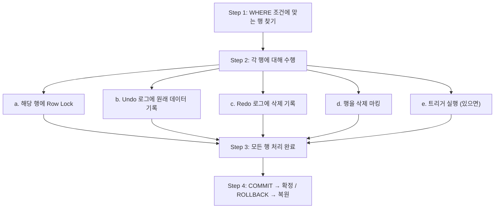
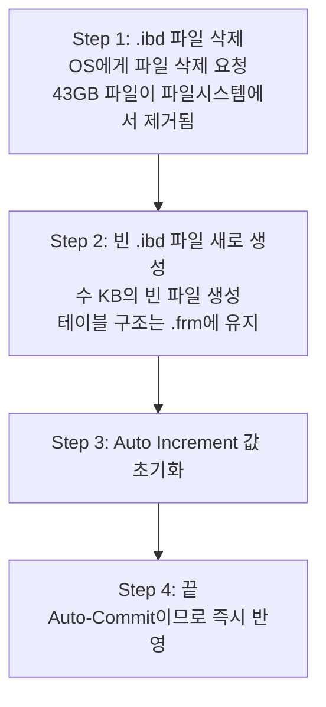
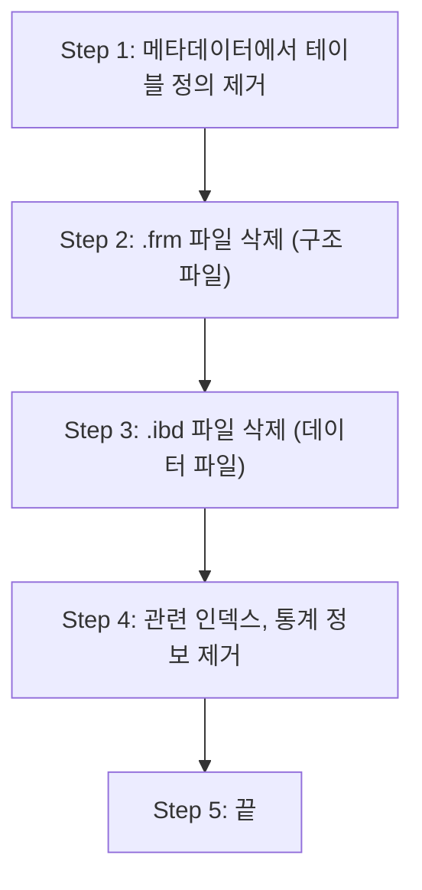
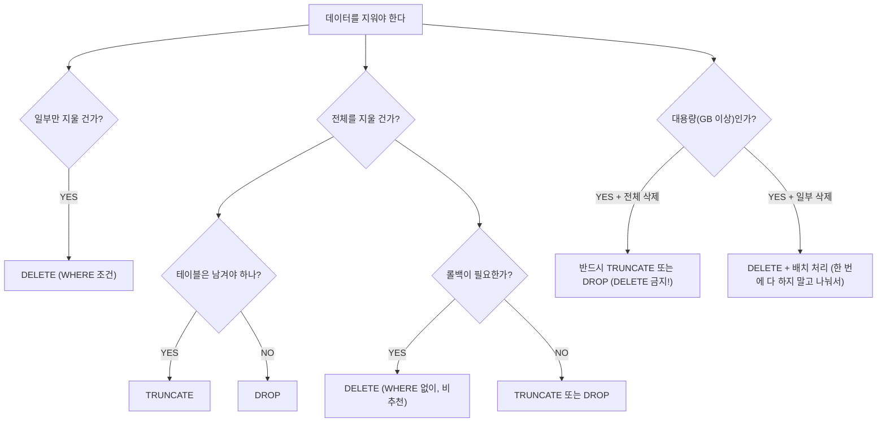
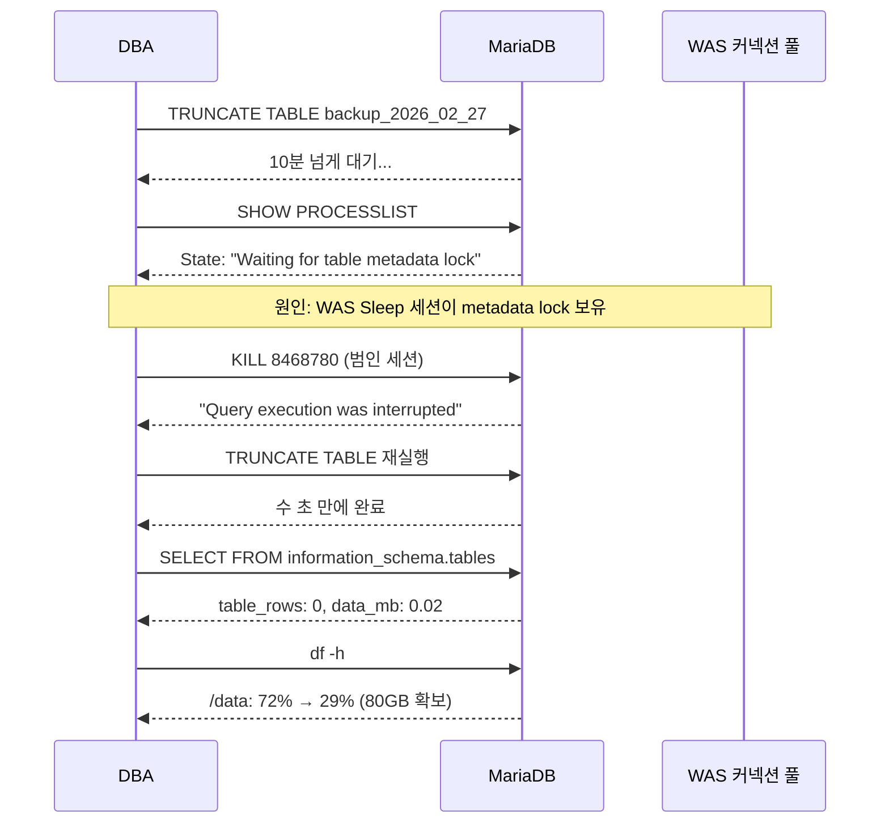

# 03. DELETE vs TRUNCATE vs DROP — 삭제의 세 가지 얼굴

---

## 1. 왜 이 구분이 중요한가

!!! danger "상황: 43GB 테이블을 비워야 한다"
    | 선택 | 명령 | 결과 |
    |------|------|------|
    | A | `DELETE FROM tb_backup;` | 서버 죽는다 |
    | B | `TRUNCATE TABLE tb_backup;` | 수 분이면 끝난다 |
    | C | `DROP TABLE tb_backup;` | 수 초면 끝난다 |

    A를 선택하면 서버가 죽고, B를 선택하면 3분 걸리고, C를 선택하면 끝난다.
    "다 지우는 거 아니야?" 라고 생각하면 프로덕션에서 사고 친다.
    내부 동작이 완전히 다르기 때문이다.

---

## 2. 한눈에 비교

| 항목 | DELETE | TRUNCATE | DROP |
|------|--------|----------|------|
| **분류** | DML | DDL | DDL |
| **삭제 대상** | 행 (조건 가능) | 전체 데이터 | 테이블 자체 |
| **WHERE** | O | X | X |
| **롤백** | O (COMMIT전) | X | X |
| **Auto-Commit** | X | O | O |
| **Undo 로그** | 기록 (느림) | 안 기록 (빠름) | 안 기록 (빠름) |
| **Redo 로그** | 기록 | 최소 | 최소 |
| **트리거** | 발동 | 안 발동 | 안 발동 |
| **Auto Inc.** | 유지 | 초기화 | - |
| **FK 있을때** | 삭제 가능 | 에러 | 에러 (CASCADE 필요) |
| **디스크** | 즉시반환 안됨 | 즉시 반환 | 즉시 반환 |
| **테이블존재** | 유지 | 유지 | 사라짐 |
| **속도** | 매우 느림 | 빠름 | 가장 빠름 |

!!! danger "43GB 기준"
    - **DELETE** → 수 시간, Undo 로그 수십 GB, 서비스 장애
    - **TRUNCATE** → 수 분 (파일 삭제+재생성), 부하 거의 없음
    - **DROP** → 수 초, 테이블 자체 소멸

---

## 3. DELETE 상세 — 행을 하나씩 지운다

### 3.1 내부 동작

```sql
DELETE FROM tb_backup WHERE exam_cd = 'EXAM001';
```



!!! note "핵심"
    - 인덱스 있으면 인덱스로, 없으면 풀스캔
    - 행을 실제로 지우는 게 아니라 "삭제됨" 표시
    - COMMIT 하면 확정, ROLLBACK 하면 Undo 로그로 복원

### 3.2 43GB를 DELETE하면?

!!! danger "43GB를 DELETE하면?"
    **테이블**: 2.7억 건, 43GB, 인덱스 없음

    ```sql
    DELETE FROM tb_lms_exam_stare_paper_backup;
    ```

    **예상 동작:**

    1. 2.7억 행 풀스캔 (인덱스 없으니까)
    2. 각 행마다 Undo 로그 기록 → 약 43GB의 Undo 로그 생성
    3. 각 행마다 Redo 로그 기록 → 수 GB의 Redo 로그
    4. 소요 시간: 수 시간 ~ 수십 시간
    5. 디스크 사용: 43GB(원본) + 43GB(Undo) + Redo = 90GB+ 필요
    6. 53GB 여유 공간으로는 Undo 로그 공간 부족 → Disk Full → 서버 죽음

    **결론: DELETE로 43GB 지우면 서버가 죽는다.**

### 3.3 DELETE 후 디스크 공간

!!! warning "DELETE 후 디스크 공간"
    **DELETE는 디스크 공간을 즉시 반환하지 않는다!**

    | 상태 | tb_backup.ibd |
    |------|---------------|
    | DELETE 전 | 43GB |
    | DELETE 후 | 43GB (여전히!) |

    왜? InnoDB는 DELETE된 행을 "삭제됨" 마킹만 한다.
    실제 파일에서 제거하지 않는다.
    나중에 새 데이터가 INSERT되면 그 공간을 재사용한다.

    **공간을 실제로 줄이려면:**

    ```sql
    OPTIMIZE TABLE tb_backup;  -- 테이블 재구성 (시간 오래 걸림)
    ALTER TABLE tb_backup ENGINE=InnoDB;  -- 동일 효과
    ```

    → 이것도 2.7억 건이면 수 시간 소요
    → 근본적으로 DELETE는 대용량 전체 삭제에 부적합

---

## 4. TRUNCATE 상세 — 파일째 날리고 새로 만든다

### 4.1 내부 동작

```sql
TRUNCATE TABLE tb_backup;
```



### 4.2 43GB를 TRUNCATE하면?

!!! tip "43GB를 TRUNCATE하면?"
    ```sql
    TRUNCATE TABLE tb_lms_exam_stare_paper_backup;
    ```

    **실제 동작:**

    1. 43GB .ibd 파일 삭제 → OS가 파일시스템에서 제거
    2. 빈 .ibd 파일 생성
    3. 소요 시간: 2~3분 (43GB 파일 삭제에 걸리는 시간)
    4. Undo/Redo 로그: 거의 안 씀
    5. 디스크: 43GB 즉시 반환
    6. 서비스 영향: 거의 없음

    **우리 실제 경험:**

    - 4GB 테이블: 1초
    - 43GB 테이블: 약 3분 (metadata lock 제외)

### 4.3 TRUNCATE가 안 되는 경우

!!! warning "TRUNCATE가 안 되는 경우"
    **1. FK 참조가 있을 때**
    → "Cannot truncate a table referenced in a foreign key constraint"
    → 해결: 자식 테이블 먼저 처리, 또는 `SET FOREIGN_KEY_CHECKS = 0;`

    **2. Metadata Lock 대기**
    → 다른 세션이 해당 테이블에 트랜잭션 열어놓으면 대기
    → 우리가 겪은 상황: 10분 넘게 "Waiting for table metadata lock"
    → 해결: `SHOW PROCESSLIST` → `KILL`

    **3. TRUNCATE 후 ROLLBACK?**
    → 안 됨. DDL이니까 Auto-Commit.
    → 날아간 데이터 복구 불가.

### 4.4 TRUNCATE 소요 시간이 파일 크기에 비례하는 이유

!!! note "TRUNCATE 소요 시간이 파일 크기에 비례하는 이유"
    TRUNCATE = OS에게 파일 삭제 요청

    **OS의 파일 삭제 과정:**

    1. 파일 메타데이터(inode) 찾기
    2. 파일이 사용하는 디스크 블록 목록 확인
    3. 각 블록을 "사용 가능" 상태로 변경
    4. 파일시스템 저널 업데이트
    5. inode 해제

    43GB 파일 = 수백만 개의 디스크 블록
    → 각 블록 해제에 시간 소요
    → 4GB: 1초, 43GB: 2~3분 (대략 비례)

    이건 DB가 아니라 OS 레벨의 시간이다.
    DB 자체는 "파일 지워" 명령 내리고 끝.

---

## 5. DROP 상세 — 존재 자체를 없앤다

### 5.1 내부 동작

```sql
DROP TABLE tb_backup;
```



!!! note ""
    → TRUNCATE보다 빠른 이유: 빈 파일 재생성 안 하니까
    → 테이블 자체가 사라짐
    → `SELECT * FROM tb_backup;` → ERROR: Table doesn't exist

### 5.2 DROP의 위험성

!!! danger "DROP의 위험성"
    **DROP은 되돌릴 수 없다.**

    테이블 구조 + 데이터 + 인덱스 + 제약조건 + 트리거 전부 사라진다.

    **복구 방법:**

    1. 백업에서 복원 (백업이 있어야...)
    2. 바이너리 로그에서 CREATE TABLE + INSERT 재생 (까다로움)
    3. 없으면? 없는 거다. 끝.

    **프로덕션에서 DROP 전 체크리스트:**

    - [ ] 이 테이블 진짜 안 쓰는 거 맞아?
    - [ ] 코드에서 참조하는 곳 없어?
    - [ ] 다른 테이블에서 FK로 참조 안 해?
    - [ ] 뷰(VIEW)에서 참조 안 해?
    - [ ] 스토어드 프로시저에서 참조 안 해?
    - [ ] 백업 있어?
    - [ ] 3번 확인했어?

---

## 6. 실전 의사결정 트리



### 6.1 대용량 DELETE 배치 처리

```sql
-- 나쁜 예: 한 번에 전부
DELETE FROM tb_log WHERE reg_dttm < '2024-01-01';
-- 1억 건이면 서버 죽음

-- 좋은 예: 나눠서 (배치)
REPEAT
    DELETE FROM tb_log
    WHERE reg_dttm < '2024-01-01'
    LIMIT 10000;  -- 1만 건씩 삭제

    -- 잠시 쉬기 (서비스 부하 줄이기)
    DO SLEEP(1);
UNTIL ROW_COUNT() = 0
END REPEAT;
```

---

## 7. 우리 사례 상세 복기

### 7.1 상황

| 항목 | 값 |
|------|-----|
| 테이블 | tb_lms_exam_stare_paper_backup_2026_02_27 |
| 용량 | 43GB, 2.7억 건 |
| 목적 | TRUNCATE로 데이터 삭제하여 디스크 확보 |

### 7.2 실제 벌어진 일



### 7.3 교훈

!!! tip "교훈"
    1. TRUNCATE 자체는 부하 없다. 락 문제가 있을 수 있다.
    2. "안 끝나면" 바로 `SHOW PROCESSLIST` 확인.
    3. metadata lock이면 범인 찾아서 `KILL`.
    4. TRUNCATE 전에 열린 트랜잭션 확인하면 더 안전:
       `SELECT * FROM information_schema.INNODB_TRX;`
    5. DDL은 Auto-Commit이므로 결과 확인 외 할 일 없음.

---

## 8. 핵심 정리

!!! abstract "핵심 정리"
    - **DELETE** = 행 하나씩 (느림, 롤백 가능, 로그 폭발)
    - **TRUNCATE** = 파일째 날림 (빠름, 롤백 불가, 로그 없음)
    - **DROP** = 테이블 소멸 (가장 빠름, 구조까지 사라짐)

    **43GB 전체 삭제:**

    - DELETE → 서버 죽음 (수 시간, Undo 폭발)
    - TRUNCATE → 3분 (파일 삭제)
    - DROP → 수 초 (완전 소멸)

    **결정 기준:**

    - 일부만 → DELETE (WHERE)
    - 전체, 재사용 → TRUNCATE
    - 전체, 필요없음 → DROP
    - 대용량 전체 → 절대 DELETE 금지

    **다음 장:** 트랜잭션과 Auto-Commit → "왜 TRUNCATE는 ROLLBACK이 안 되는지" 깊이 파기
