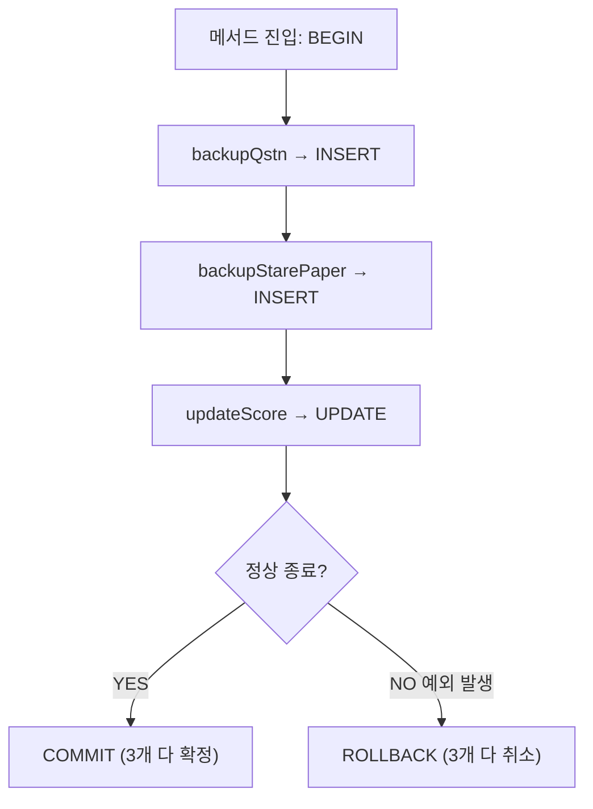
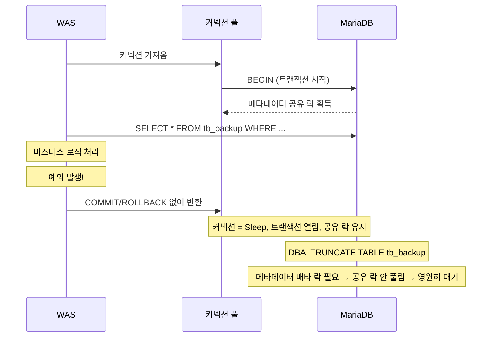

# 04. 트랜잭션과 Auto-Commit

---

## 1. 트랜잭션이란?

### 1.1 한 문장 정의

**"다 되거나, 다 안 되거나."**

이것이 트랜잭션의 본질이다. 중간 상태는 없다.

### 1.2 왜 필요한가

!!! example "계좌 이체 예시"
    A → B에게 100만원 보내기

    - Step 1: A 계좌에서 100만원 차감
    - Step 2: B 계좌에 100만원 입금

    만약 Step 1만 되고 Step 2가 실패하면?
    → A는 100만원 빠졌는데 B는 안 받음
    → 100만원 증발

    이걸 막으려면:
    → Step 1, 2를 하나의 트랜잭션으로 묶는다
    → 둘 다 성공 → COMMIT (확정)
    → 하나라도 실패 → ROLLBACK (전부 취소)

```sql
BEGIN;                                           -- 트랜잭션 시작
UPDATE tb_account SET balance = balance - 1000000 WHERE user = 'A';  -- Step 1
UPDATE tb_account SET balance = balance + 1000000 WHERE user = 'B';  -- Step 2

-- 둘 다 성공했으면
COMMIT;    -- 확정

-- 하나라도 실패했으면
ROLLBACK;  -- Step 1도 취소됨. A 돈 복원.
```

---

## 2. ACID — 트랜잭션의 4가지 보장

### 2.1 Atomicity (원자성)

!!! note "Atomicity (원자성)"
    "전부 성공하거나, 전부 실패하거나. 중간 없음."

    원자(Atom) = 더 이상 쪼갤 수 없는 최소 단위
    트랜잭션도 마찬가지. 쪼갤 수 없다.

    **실현 방법: Undo 로그**

    → 모든 변경 전 원래 값을 Undo 로그에 기록
    → ROLLBACK 시 Undo 로그를 역순으로 적용 → 원래 상태 복원

### 2.2 Consistency (일관성)

!!! note "Consistency (일관성)"
    "트랜잭션 전후로 DB 상태가 일관적이어야 한다."

    **예: 계좌 이체**

    | 상태 | A | B | 합계 |
    |------|---|---|------|
    | 전 | 1000만 | 500만 | 1500만 |
    | 후 | 900만 | 600만 | 1500만 (보존됨 = 일관성 유지) |

    **위반 예:**

    | 상태 | A | B | 합계 |
    |------|---|---|------|
    | 전 | 1000만 | 500만 | 1500만 |
    | 후 | 900만 | 500만 | 1400만 (100만원 증발 = 일관성 깨짐) |

    **실현 방법: 제약조건 + 트랜잭션**
    → PK, FK, CHECK 등 제약조건이 위반되면 트랜잭션 거부

### 2.3 Isolation (격리성)

!!! note "Isolation (격리성)"
    "동시에 실행되는 트랜잭션이 서로 간섭하면 안 된다."

    A가 계좌 이체 중인데 B가 잔액 조회하면?
    → A의 중간 상태(차감만 되고 입금 안 된 상태)를 B가 보면 안 됨
    → 격리 수준(Isolation Level)으로 제어

    **실현 방법: 락 + MVCC**

    - 락: 다른 트랜잭션의 접근을 차단
    - MVCC: 스냅샷으로 이전 버전 읽기

### 2.4 Durability (지속성)

!!! note "Durability (지속성)"
    "COMMIT된 데이터는 영구 저장된다. 서버 꺼져도 유지된다."

    **COMMIT 시점에:**

    → Redo 로그를 디스크에 기록 (fsync)
    → 서버가 갑자기 죽어도 Redo 로그에서 복구 가능
    → 데이터 파일(.ibd)에는 나중에 기록 (lazy write)

    **실현 방법: Redo 로그 + WAL(Write-Ahead Logging)**

    → 데이터보다 로그를 먼저 쓴다
    → 장애 시 로그를 재생하면 복구됨

---

## 3. Auto-Commit

### 3.1 Auto-Commit이란?

| 설정 | 동작 |
|------|------|
| **Auto-Commit ON** (기본값) | 모든 SQL문이 실행 즉시 자동 COMMIT. 각 SQL이 독립 트랜잭션. ROLLBACK 불가. |
| **Auto-Commit OFF** | 명시적으로 COMMIT/ROLLBACK 해야 반영. BEGIN~COMMIT이 하나의 트랜잭션. 실수 시 ROLLBACK 가능. |

### 3.2 확인 및 설정

```sql
-- 현재 상태 확인
SELECT @@autocommit;
-- 1 = ON, 0 = OFF

-- 끄기
SET autocommit = 0;

-- 켜기
SET autocommit = 1;
```

### 3.3 Auto-Commit과 BEGIN의 관계

```sql
-- Auto-Commit ON 상태에서:

INSERT INTO tb_user VALUES ('USR001', '홍길동');
-- 즉시 COMMIT됨. ROLLBACK 불가.

INSERT INTO tb_user VALUES ('USR002', '김철수');
-- 즉시 COMMIT됨. 각각 독립 트랜잭션.

-- BEGIN을 쓰면 Auto-Commit이 일시적으로 꺼짐:

BEGIN;
INSERT INTO tb_user VALUES ('USR003', '이영희');
INSERT INTO tb_user VALUES ('USR004', '박민수');
-- 아직 COMMIT 안 됨. ROLLBACK 가능.

COMMIT;  -- 여기서 확정. 이후 다시 Auto-Commit ON 상태로 복귀.
```

---

## 4. DDL과 Auto-Commit의 관계

### 4.1 DDL은 무조건 Auto-Commit

!!! danger "DDL은 무조건 Auto-Commit"
    DDL (CREATE, ALTER, DROP, TRUNCATE, RENAME)은
    Auto-Commit 설정과 관계없이 항상 즉시 COMMIT된다.

    **이유:**
    DDL은 구조를 변경한다.
    구조 변경은 "반쯤 바뀐 상태"가 존재할 수 없다.
    테이블이 "반쯤 삭제된" 상태란 없다.
    따라서 DDL은 원자적으로 즉시 반영된다.

### 4.2 위험한 시나리오

```sql
-- 시나리오 1: TRUNCATE 후 ROLLBACK 시도
BEGIN;
INSERT INTO tb_user VALUES ('USR001', '홍길동');  -- DML
TRUNCATE TABLE tb_user;                           -- DDL → 즉시 COMMIT!
ROLLBACK;                                         -- 아무 효과 없음

SELECT * FROM tb_user;  -- 결과: 0건 (TRUNCATE 됨)
-- INSERT도 사라짐! TRUNCATE 실행 시 암묵적 COMMIT이 발생하면서
-- 이전 DML도 함께 COMMIT된 후, TRUNCATE가 실행됨.
```

```sql
-- 시나리오 2: DDL의 암묵적 COMMIT
BEGIN;
INSERT INTO tb_user VALUES ('USR001', '홍길동');
INSERT INTO tb_user VALUES ('USR002', '김철수');
-- 여기서 ROLLBACK하면 둘 다 취소될 수 있었는데...

CREATE TABLE tb_temp (id INT);  -- DDL!
-- 이 순간 암묵적 COMMIT 발생!
-- USR001, USR002 INSERT가 이미 COMMIT됨!

ROLLBACK;  -- 아무 효과 없음. 이미 COMMIT됐으니까.
```

### 4.3 암묵적 COMMIT이 발생하는 명령어 전체 목록

!!! warning "암묵적 COMMIT 명령어"
    | 분류 | 명령어 |
    |------|--------|
    | **DDL** | CREATE, ALTER, DROP, TRUNCATE, RENAME |
    | **계정 관리** | CREATE USER, ALTER USER, DROP USER, GRANT, REVOKE |
    | **기타** | LOCK TABLES, UNLOCK TABLES, START TRANSACTION (기존 것 COMMIT), SET autocommit = 1 (OFF→ON 전환 시), LOAD DATA INFILE |

---

## 5. 트랜잭션 실전 패턴

### 5.1 Spring @Transactional

```java
@Service
public class ExamService {

    @Transactional  // 이 메서드 전체가 하나의 트랜잭션
    public void reScore(ExamVO vo) {
        examMapper.backupQstn(vo);         // INSERT
        examMapper.backupStarePaper(vo);   // INSERT
        examMapper.updateScore(vo);        // UPDATE

        // 메서드 정상 종료 → 자동 COMMIT
        // 예외 발생 → 자동 ROLLBACK
    }
}
```



!!! tip "왜 중요하냐"
    → 백업은 됐는데 점수 업데이트가 실패하면?
    → @Transactional이 없으면 백업만 남고 점수는 안 바뀜 (데이터 불일치)
    → @Transactional 있으면 전부 취소 → 일관성 유지

### 5.2 트랜잭션 전파 (Propagation)

```java
@Transactional
public void methodA() {
    // 트랜잭션 A 시작
    methodB();  // B가 @Transactional이면?
}

@Transactional
public void methodB() {
    // 기본(REQUIRED): A의 트랜잭션에 참여 (새로 안 만듦)
    // REQUIRES_NEW: 새 트랜잭션 생성 (A와 독립)
}
```

!!! note "전파 옵션"
    **REQUIRED (기본):**

    → 기존 트랜잭션 있으면 참여, 없으면 새로 생성
    → A 안에서 B 호출 → B도 A의 트랜잭션
    → B에서 예외 → A도 ROLLBACK

    **REQUIRES_NEW:**

    → 항상 새 트랜잭션 생성
    → A 안에서 B 호출 → B는 독립 트랜잭션
    → B COMMIT 후 A에서 예외 → A만 ROLLBACK, B는 유지

### 5.3 트랜잭션과 커넥션 풀 문제 (우리 사례)



!!! danger "교훈"
    - 트랜잭션은 반드시 COMMIT 또는 ROLLBACK으로 끝내라
    - @Transactional 없는 메서드에서 DB 접근 주의
    - 커넥션 풀 설정: 반환 시 자동 ROLLBACK 옵션 확인

---

## 6. Undo 로그와 Redo 로그

### 6.1 Undo 로그 — "이전에 이랬었어" 기록

!!! note "Undo 로그"
    **역할**: ROLLBACK 시 원래 상태로 되돌리기 위한 로그

    | DML | Undo 로그 내용 |
    |-----|----------------|
    | INSERT | "이 행을 DELETE하면 원래 상태" |
    | UPDATE | "이 행의 원래 값은 이거였어" |
    | DELETE | "이 행의 원래 데이터 전부" |

    **크기:**

    - DELETE 1건 → Undo 로그에 해당 행 전체 데이터 기록
    - DELETE 2.7억 건 → Undo 로그에 2.7억 행 전체 기록 ≈ 43GB
    - → 이래서 대용량 DELETE가 위험한 것

    **TRUNCATE는?** → Undo 로그 거의 안 씀 (파일 삭제+재생성이니까 행 단위 기록 필요 없음)

### 6.2 Redo 로그 — "이렇게 바꿨어" 기록

!!! note "Redo 로그"
    **역할**: 장애 복구 시 변경 사항 재실행을 위한 로그

    **모든 데이터 변경을 기록:**

    → COMMIT 시 Redo 로그를 디스크에 강제 기록 (fsync)
    → 데이터 파일(.ibd)에는 나중에 기록 (비동기)
    → 서버 죽어도 Redo 로그에서 복구 가능

    **WAL (Write-Ahead Logging):**

    → "데이터보다 로그를 먼저 쓴다"
    → 로그만 있으면 데이터 복구 가능
    → 데이터 파일 직접 쓰는 것보다 빠름 (순차 쓰기)

### 6.3 바이너리 로그 (binlog) — "뭐가 바뀌었는지" 기록

!!! note "바이너리 로그"
    **역할**: 복제(Replication), Point-in-Time Recovery

    | 항목 | Redo 로그 | Binlog |
    |------|-----------|--------|
    | 레벨 | InnoDB 엔진 레벨 | MySQL/MariaDB 서버 레벨 |
    | 용도 | 장애 복구용 | 복제/복구용 |
    | 파일 | 순환 파일 | 누적 파일 |

    **우리 서버에서 Disk Full 에러 발생한 파일:**
    "Disk is full writing mysql-bin.044449"
    → 바이너리 로그가 디스크를 채운 것

---

## 7. 실전 질문과 답

!!! question "TRUNCATE 했는데 COMMIT 해야 함?"
    아니. DDL이라 Auto-Commit이야. 이미 반영됐어.

!!! question "BEGIN 안에서 TRUNCATE 하면 트랜잭션으로 보호받을 수 있어?"
    안 돼. TRUNCATE 실행 시 암묵적 COMMIT이 발생해서
    이전 DML도 다 COMMIT되고, TRUNCATE도 즉시 반영돼.
    ROLLBACK해도 아무것도 되돌려지지 않아.

!!! question "Auto-Commit ON인데 UPDATE 실수하면?"
    끝이야. 이미 COMMIT됐으니까.
    프로덕션에서 UPDATE/DELETE 전에 반드시:

    1. SELECT로 대상 먼저 확인
    2. `BEGIN;` 으로 트랜잭션 시작
    3. UPDATE/DELETE 실행
    4. SELECT로 결과 확인
    5. 맞으면 COMMIT, 틀리면 ROLLBACK

---

## 8. 핵심 정리

!!! abstract "핵심 정리"
    - **트랜잭션** = "다 되거나, 다 안 되거나"
    - **ACID** = 원자성, 일관성, 격리성, 지속성

    **Auto-Commit ON (기본):**

    - 모든 SQL 즉시 COMMIT, ROLLBACK 불가

    **DDL은 항상 Auto-Commit:**

    - TRUNCATE, DROP 등은 무조건 즉시 반영
    - BEGIN 안에 있어도 암묵적 COMMIT 발생
    - ROLLBACK 불가

    **로그:**

    - Undo 로그: ROLLBACK용 (원래 값 기록)
    - Redo 로그: 장애 복구용 (변경 사항 기록)

    **실수 방지:**

    - UPDATE/DELETE 전에 `BEGIN;` 으로 트랜잭션 시작
    - 결과 확인 후 COMMIT
    - DDL은 되돌릴 수 없으니 3번 확인

    **다음 장:** 격리 수준과 MVCC → "동시에 같은 데이터 건드리면 어떻게 되는지"
