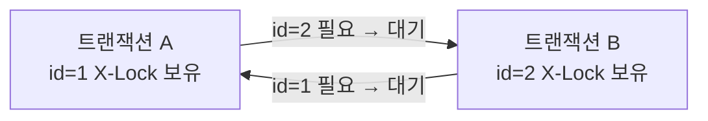

# 06. 락의 세계

---

## 1. 락이란?

### 1.1 한 줄 정의

**"동시 접근을 제어하는 잠금 장치."**

### 1.2 비유: 화장실 문 잠금장치

!!! example "비유: 화장실 문 잠금장치"
    화장실 1칸, 사용자 3명.

    - A가 들어가서 문 잠금 (락 획득)
    - B가 옴: "사용 중" → 대기 (락 대기)
    - C가 옴: "사용 중" → 대기 (락 대기)
    - A가 나오면서 잠금 해제 (락 해제)
    - B가 들어감 (락 획득), C는 계속 대기

    이게 락의 전부다. "한 번에 한 명만" 접근하게 만드는 장치.

### 1.3 왜 필요한가

!!! note "왜 필요한가"
    05장에서 배운 MVCC가 읽기-쓰기 동시성을 해결한다고 했다.
    근데 쓰기-쓰기는?

    트랜잭션 A: `UPDATE score = 95 WHERE id = 1`
    트랜잭션 B: `UPDATE score = 88 WHERE id = 1`

    둘이 동시에 같은 행을 UPDATE하면?
    → 최종 값이 뭐가 돼야 하지? A가 먼저? B가 먼저?
    → MVCC로는 해결 안 됨 → 락이 필요

    | 메커니즘 | 해결하는 문제 |
    |----------|-------------|
    | MVCC | 읽기-쓰기 동시성 |
    | 락 | 쓰기-쓰기 동시성 + 데이터 무결성 |

---

## 2. 락의 종류

### 2.1 공유 락 (Shared Lock, S-Lock)

!!! note "S-Lock: 나 읽고 있으니 수정하지 마. 근데 같이 읽는 건 OK."
    **특징:**

    - 읽기(`SELECT ... LOCK IN SHARE MODE`)에서 사용
    - 여러 트랜잭션이 동시에 S-Lock 획득 가능
    - S-Lock 잡혀있으면 → 쓰기(X-Lock) 대기

    **비유:** 도서관에서 책 읽기 -- 여러 명이 동시에 읽을 수 있지만, 누가 읽고 있으면 낙서(수정)는 못 함

```sql
-- S-Lock 명시적 획득 (일반 SELECT는 MVCC라 락 안 걸림!)
SELECT * FROM tb_student WHERE id = 1 LOCK IN SHARE MODE;

-- 또는 (MariaDB 10.5+)
SELECT * FROM tb_student WHERE id = 1 FOR SHARE;
```

!!! warning "중요한 포인트"
    - 일반 SELECT는 MVCC의 Consistent Read를 사용
    - 락을 걸지 않음! (Non-Locking Read)
    - `LOCK IN SHARE MODE`를 명시해야 S-Lock이 걸림
    - 이 차이를 모르면 안 돼

### 2.2 배타 락 (Exclusive Lock, X-Lock)

!!! note "X-Lock: 나 수정 중이니 읽지도 쓰지도 마. 완전 독점."
    **특징:**

    - 쓰기(INSERT, UPDATE, DELETE)에서 자동 획득
    - 한 트랜잭션만 X-Lock 획득 가능
    - X-Lock 잡혀있으면 → 다른 S-Lock, X-Lock 전부 대기

    **비유:** 화장실 사용 중 -- 1명만 사용 가능, 다른 사람은 대기

```sql
-- X-Lock 자동 획득 (DML)
UPDATE tb_student SET score = 95 WHERE id = 1;  -- 자동 X-Lock
DELETE FROM tb_student WHERE id = 1;             -- 자동 X-Lock

-- X-Lock 명시적 획득
SELECT * FROM tb_student WHERE id = 1 FOR UPDATE;
```

### 2.3 호환성 매트릭스

|  | **S-Lock (읽기)** | **X-Lock (쓰기)** |
|--|-------------------|-------------------|
| **S-Lock (읽기)** | 호환 (O) - 동시 읽기 OK | 비호환 (X) - 읽기 중 쓰기 X |
| **X-Lock (쓰기)** | 비호환 (X) - 쓰기 중 읽기 X | 비호환 (X) - 쓰기 중 쓰기 X |

!!! tip "읽기 방법"
    - S + S = OK (여러 명 동시 읽기 가능)
    - S + X = 대기 (누가 읽고 있으면 수정 못 함)
    - X + S = 대기 (누가 수정 중이면 락 읽기 못 함)
    - X + X = 대기 (누가 수정 중이면 다른 수정도 못 함)

!!! warning "주의"
    일반 SELECT는 MVCC를 써서 락을 안 걸어. 위 매트릭스는 "명시적 락"에 대한 얘기야. 일반 SELECT(Non-Locking Read)는 X-Lock이 있어도 대기 안 함.

---

## 3. 락의 범위

### 3.1 행 레벨 락 (Row Lock)

!!! note "행 레벨 락"
    **범위**: 특정 행 하나 (또는 여러 행) | **엔진**: InnoDB 기본

    **사용**: INSERT, UPDATE, DELETE, SELECT ... FOR UPDATE

    **특징:** 영향 범위 최소, 다른 행은 자유롭게 접근 가능, 동시성 최고

    **예시:**

    - A: `UPDATE SET score = 95 WHERE id = 1;` -- id=1만 락
    - B: `UPDATE SET score = 88 WHERE id = 2;` -- id=2는 자유 → 동시 실행!
    - C: `UPDATE SET score = 77 WHERE id = 1;` -- id=1 → A 대기

!!! example "Row Lock 예시 - tb_student"
    | id | score | 락 상태 | 설명 |
    |----|-------|---------|------|
    | 1 | 95 | X-Lock (A 소유) | C는 여기서 대기 |
    | 2 | 88 | X-Lock (B 소유) | B는 자유롭게 실행 |
    | 3 | 70 | (없음) | 누구나 접근 가능 |

### 3.2 테이블 레벨 락 (Table Lock)

!!! warning "테이블 레벨 락"
    **범위**: 테이블 전체 | **엔진**: MyISAM 기본, InnoDB에서는 LOCK TABLES 명령 시

    **특징:** 영향 범위 큼 (테이블 전체 차단), 동시성 최악, MyISAM은 쓰기 많은 서비스에서 안 씀

    **예시:**

    - A: `LOCK TABLES tb_student WRITE;`
    - → tb_student 전체를 독점
    - → 다른 모든 세션이 tb_student에 접근 불가 (SELECT조차)
    - → A가 `UNLOCK TABLES` 할 때까지

### 3.3 메타데이터 락 (Metadata Lock) -- 핵심!

!!! danger "메타데이터 락 -- 우리가 겪은 문제의 핵심"
    **범위**: 테이블의 구조(메타데이터) 자체

    **대상**: DDL 실행 시 (CREATE, ALTER, DROP, TRUNCATE, RENAME)

    **특징**: 행이나 데이터가 아닌 "테이블 정의"에 대한 락

---

## 4. 메타데이터 락 상세

### 4.1 왜 필요한가

!!! example "왜 필요한가"
    트랜잭션 A: `SELECT * FROM tb_student WHERE score > 80;` (결과를 처리 중...)

    이 사이에 누군가: `ALTER TABLE tb_student DROP COLUMN score;`

    A는 score 컬럼을 읽고 있는데 score가 사라짐.
    → 프로세스 크래시, 데이터 손상, 서버 불안정

    **이걸 막으려면?**

    - A가 테이블을 "사용 중"이라고 표시해야 함
    - 사용 중일 때 구조 변경(DDL)을 차단해야 함
    - 이게 메타데이터 락

### 4.2 공유 vs 배타 메타데이터 락

!!! note "공유 vs 배타 메타데이터 락"
    **공유 메타데이터 락 (MDL Shared):**

    - SELECT, INSERT, UPDATE, DELETE 시 자동 획득
    - "이 테이블 구조 사용 중이야, 바꾸지 마"
    - 여러 세션이 동시에 획득 가능
    - DML끼리는 서로 안 막음

    **배타 메타데이터 락 (MDL Exclusive):**

    - DDL 시 필요 (ALTER, DROP, TRUNCATE, RENAME)
    - "이 테이블 구조 바꿀 거야, 아무도 건드리지 마"
    - 단독으로만 획득 가능
    - 공유 메타데이터 락이 하나라도 있으면 대기

    **호환성:**

    - MDL Shared + MDL Shared = OK (DML 동시 실행)
    - MDL Shared + MDL Exclusive = 대기 (DDL이 DML 기다림)
    - MDL Exclusive + 뭐든 = 대기 (DDL 실행 중이면 전부 대기)

### 4.3 트랜잭션과 메타데이터 락의 관계

이게 제일 중요하다. 집중해.

!!! danger "핵심 규칙"
    **메타데이터 공유 락은 "트랜잭션이 끝날 때까지" 유지된다.**

    SQL 한 건만 실행해도:

    1. 트랜잭션 시작 (BEGIN 또는 Auto-Commit 트랜잭션)
    2. SELECT 실행 → 공유 메타데이터 락 획득
    3. 결과 반환
    4. COMMIT/ROLLBACK → 공유 메타데이터 락 해제

    **Auto-Commit ON이면:** SELECT 하나가 곧 하나의 트랜잭션 → 실행 즉시 COMMIT → 즉시 락 해제 → 문제 없음

    **트랜잭션이 열려있으면:** COMMIT/ROLLBACK 전까지 락 유지. 세션이 Sleep이어도 트랜잭션이 열려있으면 락 유지! **이게 우리 문제의 원인이다.**

타임라인으로 보면:

!!! example "Sleep 세션이 메타데이터 락을 잡는 과정"
    | 시점 | 동작 |
    |------|------|
    | T1 | WAS가 커넥션 풀에서 커넥션 가져옴 |
    | T2 | 트랜잭션 시작 (BEGIN 또는 @Transactional) |
    | T3 | SELECT * FROM tb_backup ... 실행 → **공유 메타데이터 락 획득** |
    | T4 | 비즈니스 로직 처리... |
    | T5 | 로직 완료, but COMMIT/ROLLBACK 없이 커넥션 풀에 반환 → 커넥션은 Sleep 상태, 트랜잭션은 열려있음, **공유 메타데이터 락 유지 중!** |
    | T6 | DBA가 TRUNCATE TABLE tb_backup 실행 → 배타 메타데이터 락 필요 → T5의 공유 락이 안 풀림 → **"Waiting for table metadata lock" 상태로 영원히 대기** |

    **외부에서 보면:** Sleep 세션은 아무것도 안 하는 것 같고(범인이 아닌 것 같고), TRUNCATE는 멈춰있음. 실제 원인은 Sleep 세션의 미완료 트랜잭션.

### 4.4 메타데이터 락의 파급 효과

!!! danger "메타데이터 락의 파급 효과"
    **시간순으로 보면:**

    1. Sleep 세션: 공유 MDL 보유 (안 풀림)
    2. TRUNCATE: 배타 MDL 요청 → 대기 (SHOW PROCESSLIST: "Waiting for table metadata lock")
    3. 새로운 SELECT/INSERT 요청 도착 → 공유 MDL 요청 → 근데 배타 MDL 대기자(TRUNCATE)가 있으므로 → 공유 MDL도 대기!

    **결과:** Sleep 세션 1개가 안 풀림 → TRUNCATE 대기 → 이후 모든 쿼리 대기 → 테이블 접근 완전 차단 → **서비스 장애**

    **1개의 미완료 트랜잭션이 전체 테이블을 마비시킬 수 있다. 이래서 트랜잭션 관리가 중요한 거야.**

---

## 5. 데드락 (Deadlock)

### 5.1 정의

**서로 상대방의 락을 기다리는 교착 상태.**

!!! example "데드락 비유"
    좁은 골목에서 두 차가 마주침

    - 차 A: "네가 비켜줘야 내가 지나가지"
    - 차 B: "네가 비켜줘야 내가 지나가지"
    - → 둘 다 안 비킴 → 영원히 멈춤

    **DB에서:**

    - 트랜잭션 A: id=1에 X-Lock 보유, id=2에 X-Lock 대기
    - 트랜잭션 B: id=2에 X-Lock 보유, id=1에 X-Lock 대기
    - → 서로의 락을 기다림 → 데드락

### 5.2 발생 예시

```sql
-- 트랜잭션 A
BEGIN;
UPDATE tb_student SET score = 95 WHERE id = 1;  -- id=1 X-Lock 획득
-- (잠시 후)
UPDATE tb_student SET score = 88 WHERE id = 2;  -- id=2 X-Lock 대기 (B가 잡고 있음)

-- 트랜잭션 B (동시에)
BEGIN;
UPDATE tb_student SET score = 77 WHERE id = 2;  -- id=2 X-Lock 획득
-- (잠시 후)
UPDATE tb_student SET score = 66 WHERE id = 1;  -- id=1 X-Lock 대기 (A가 잡고 있음)
```



!!! danger "데드락"
    A는 B를 기다리고, B는 A를 기다림 → **데드락**

### 5.3 InnoDB의 데드락 감지

!!! note "InnoDB의 데드락 감지"
    InnoDB는 데드락을 자동 감지한다.

    **동작:**

    1. 데드락 감지 알고리즘이 주기적으로 검사
    2. 순환 대기(Cycle) 발견
    3. 한쪽을 "victim"으로 선택
    4. victim 트랜잭션을 강제 ROLLBACK
    5. 다른 쪽은 계속 진행

    **victim 선택 기준:**
    Undo 로그가 적은 쪽 (ROLLBACK 비용이 적은 쪽), 즉 작업량이 적은 트랜잭션이 죽음

    **에러 메시지:**
    `ERROR 1213 (40001): Deadlock found when trying to get lock; try restarting transaction`

### 5.4 데드락 방지 방법

!!! tip "데드락 방지 방법"
    1. **같은 순서로 락 획득** → A가 id=1 → id=2 순이면, B도 id=1 → id=2 순으로 → 순환 대기 불가능
    2. **트랜잭션 짧게** → 락 보유 시간 최소화 → 충돌 확률 감소
    3. **적절한 인덱스 사용** → 인덱스 없으면 Full Table Scan → 모든 행에 락. 인덱스 있으면 필요한 행만 락 → 충돌 범위 최소화
    4. **락 범위 최소화** → 불필요한 SELECT ... FOR UPDATE 금지 → 꼭 필요한 행만 락
    5. **재시도 로직** → 데드락은 완전히 방지할 수 없음 → 애플리케이션에서 1213 에러 시 재시도

---

## 6. 실전 사례: TRUNCATE metadata lock

우리가 실제로 겪은 사례다. 전체 흐름을 처음부터 끝까지 복기한다.

### 6.1 배경

| 항목 | 값 |
|------|-----|
| 대상 테이블 | tb_lms_exam_stare_paper_backup |
| 크기 | 43GB, 약 2.7억 건 |
| 작업 | TRUNCATE TABLE (테이블 비우기) |
| 목적 | 디스크 공간 확보 |

### 6.2 타임라인

!!! example "타임라인"
    | 시각 | 상황 |
    |------|------|
    | 14:00 | TRUNCATE TABLE tb_lms_exam_stare_paper_backup 실행 → 응답 없음. 멈춤. |
    | 14:05 | "이상하다. TRUNCATE는 빠른 건데." → 느낌이 안 좋음 |
    | 14:10 | SHOW PROCESSLIST 실행 → TRUNCATE 세션 State: "Waiting for table metadata lock" |
    | 14:12 | "metadata lock? 누가 이 테이블 잡고 있는 거야?" → SHOW PROCESSLIST에서 Sleep 세션들 확인 → 192.168.0.16 (WAS)에서 온 Sleep 세션 다수 |
    | 14:15 | information_schema.INNODB_TRX 조회 → 오래된 트랜잭션 발견 (trx_state: RUNNING, trx_started: 2시간 전) |
    | 14:18 | 해당 세션 KILL → 메타데이터 공유 락 해제 → TRUNCATE 즉시 실행됨 → 수 초 만에 완료 |

### 6.3 원인 분석

!!! danger "원인 분석"
    **근본 원인:** WAS 커넥션 풀의 한 커넥션이 tb_lms_exam_stare_paper_backup에 SELECT를 실행한 후 트랜잭션을 닫지 않고 Sleep 상태가 됨. 이 커넥션의 트랜잭션이 공유 메타데이터 락을 유지 → TRUNCATE의 배타 메타데이터 락 획득 불가 → TRUNCATE 무한 대기.

    **연쇄 반응:**

    1. Sleep 세션 (공유 MDL 보유)
    2. TRUNCATE 대기 (배타 MDL 필요)
    3. 이후 새로운 쿼리들도 대기 (배타 MDL 대기자가 있으므로)
    4. 테이블 완전 마비 가능

### 6.4 해결

```sql
-- 1. 범인 찾기
SHOW PROCESSLIST;
-- State가 "Waiting for table metadata lock"인 세션 확인
-- → TRUNCATE 세션 발견

-- 2. 누가 막고 있는지 찾기
SELECT * FROM information_schema.INNODB_TRX;
-- trx_started가 오래된 트랜잭션 확인
-- trx_mysql_thread_id로 PROCESSLIST의 Id와 매칭

-- 3. 범인 세션 KILL
KILL [범인_thread_id];
-- → 트랜잭션 ROLLBACK + 메타데이터 락 해제
-- → TRUNCATE 즉시 진행
```

### 6.5 교훈

!!! warning "교훈"
    1. **TRUNCATE가 느린 게 아니었다** → 락 대기였다. TRUNCATE 자체는 몇 초면 끝남
    2. **Sleep 세션이 범인일 수 있다** → "아무것도 안 하는 것 같은" 세션이 트랜잭션을 열고 메타데이터 락을 잡고 있을 수 있음
    3. **DDL 전에 반드시 SHOW PROCESSLIST + INNODB_TRX 확인** → 대상 테이블을 사용 중인 트랜잭션이 있는지 → 있으면 정리 후 DDL 실행
    4. **커넥션 풀 설정 점검** → 반환 시 자동 ROLLBACK 설정 확인 → idle timeout 적절히 설정
    5. **프로덕션에서 DDL은 점검 시간에** → 서비스 중 DDL = 장애 리스크

---

## 7. 락 관련 진단 명령어

```sql
-- 현재 락 대기 상황 (MariaDB 10.5+)
SELECT * FROM information_schema.INNODB_LOCK_WAITS;

-- 현재 걸려있는 락 목록
SELECT * FROM information_schema.INNODB_LOCKS;

-- 현재 활성 트랜잭션
SELECT * FROM information_schema.INNODB_TRX;

-- 프로세스 목록
SHOW PROCESSLIST;
SHOW FULL PROCESSLIST;  -- 쿼리 전체 보기

-- InnoDB 상태 (데드락 정보 포함)
SHOW ENGINE INNODB STATUS;
```

---

## 8. 핵심 정리

!!! abstract "핵심 정리"
    **락의 종류:** S-Lock (공유) = 읽기 락, 동시 읽기 가능. X-Lock (배타) = 쓰기 락, 완전 독점. S+S=OK, S+X=대기, X+X=대기.

    **락의 범위:** 행 락(InnoDB 기본, 영향 최소), 테이블 락(영향 큼, MyISAM 기본), 메타데이터 락(테이블 구조 보호 -- 우리 문제의 핵심).

    **메타데이터 락 핵심:** DML → 공유 메타데이터 락 (트랜잭션 끝까지 유지). DDL → 배타 메타데이터 락 (공유 락 있으면 대기). Sleep 세션도 트랜잭션 열려있으면 공유 락 유지!

    **데드락:** 서로의 락을 기다리는 교착 상태. InnoDB가 자동 감지 → victim ROLLBACK. 방지: 같은 순서로 락, 트랜잭션 짧게.

    **실전 교훈:** DDL 전에 SHOW PROCESSLIST + INNODB_TRX 확인. Sleep 세션이 범인일 수 있다. 트랜잭션은 반드시 닫아라.

    **다음 장:** SHOW PROCESSLIST 실전 분석 → "프로세스 목록을 보고 문제를 진단하는 실전 기술"
