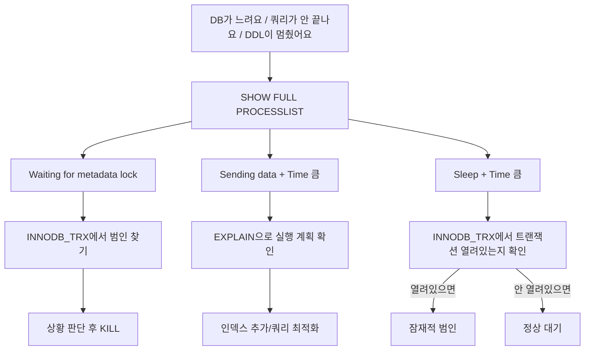

# 07. SHOW PROCESSLIST 실전 분석

---

## 1. SHOW PROCESSLIST란?

### 1.1 한 줄 정의

**"DB에서 지금 무슨 일이 벌어지고 있는지 보는 창."**

!!! example "비유: CCTV 관제실"
    | 건물 CCTV | SHOW PROCESSLIST |
    |-----------|-----------------|
    | 누가 어디에 있는지 | User, Host |
    | 뭘 하고 있는지 | Command, State |
    | 얼마나 오래 있었는지 | Time |
    | 수상한 놈은 누구인지 | 분석 |

### 1.2 기본 사용법

```sql
-- 기본
SHOW PROCESSLIST;

-- 쿼리 전체 보기 (Info가 잘리지 않음)
SHOW FULL PROCESSLIST;

-- information_schema에서 조회 (WHERE 조건 가능)
SELECT * FROM information_schema.PROCESSLIST;

-- 특정 조건으로 필터링
SELECT * FROM information_schema.PROCESSLIST
WHERE COMMAND != 'Sleep'
AND TIME > 10;
```

---

## 2. 출력 컬럼 상세 해석

```sql
SHOW PROCESSLIST;
```

```
+------+------+---------------------+--------+---------+------+---------------------------+------+
| Id   | User | Host                | db     | Command | Time | State                     | Info |
+------+------+---------------------+--------+---------+------+---------------------------+------+
| 1523 | root | 192.168.0.88:54321  | lms_db | Query   |    0 | starting                  | SHOW |
| 2847 | lms  | 192.168.0.16:38291  | lms_db | Sleep   |  847 |                           | NULL |
| 2901 | lms  | 192.168.0.94:42187  | lms_db | Query   |  312 | Waiting for table meta... | TRUN |
| 3102 | root | localhost           | lms_db | Query   | 7200 | Sending data              | SELE |
+------+------+---------------------+--------+---------+------+---------------------------+------+
```

### 각 컬럼 상세

| 컬럼 | 의미 | 분석 포인트 |
|------|------|------------|
| **Id** | 스레드(세션) ID | KILL 명령에 사용. "KILL 2847" 이런 식으로 |
| **User** | 접속 계정 | root? app 계정? root가 많으면 보안 문제 |
| **Host** | 접속 IP:Port | 어디서 온 커넥션인지 파악. WAS? 관리 도구? 로컬? |
| **db** | 사용 중인 DB | 어떤 스키마에 접속했는지. NULL이면 DB 미선택 |
| **Command** | 현재 상태 | Sleep, Query, Connect 등. 아래에서 상세 설명 |
| **Time** | 현재 상태 유지 시간 (초) | 초 단위. 클수록 의심 대상. Sleep + Time 큼 = 좀비 커넥션? Query + Time 큼 = 느린 쿼리? |
| **State** | 상세 상태 | **핵심 분석 대상.** 아래에서 상세 설명 |
| **Info** | 실행 중인 쿼리 | SHOW PROCESSLIST는 앞부분만, SHOW FULL PROCESSLIST로 전체 |

---

## 3. Command 상태별 의미

!!! note "Sleep"
    커넥션은 살아있지만 현재 쿼리 실행 안 함. 주로 커넥션 풀에서 대기 중인 커넥션. WAS가 커넥션을 풀에 반환했지만 TCP 연결은 유지.

    **정상인 경우:** 커넥션 풀 대기 세션 (Time이 짧음), idle timeout 내에서 재사용 대기

    **비정상인 경우:** Time이 매우 큼 (수천 초), 트랜잭션이 열려있는 상태로 Sleep, **메타데이터 락을 잡고 있을 수 있음!**

!!! note "Query"
    현재 쿼리 실행 중.

    **정상인 경우:** Time이 짧음 (수 초 이내), 일반적인 SELECT, INSERT, UPDATE

    **비정상인 경우:** Time이 큼 → 느린 쿼리 (인덱스 확인 필요), State가 "Waiting for..." → 락 대기 중, State가 "Creating tmp table" → 쿼리 최적화 필요

!!! note "Connect"
    연결 수립 중 (매우 짧은 상태, 거의 안 보임). 계속 보이면 인증 문제나 네트워크 지연 의심.

!!! note "Daemon"
    DB 내부 시스템 프로세스 (건드리지 마). InnoDB Purge Thread, 이벤트 스케줄러 등.

---

## 4. State에서 위험 신호 (핵심!)

State 컬럼이 진짜 중요하다. 여기서 문제가 보인다.

### 4.1 락 관련 (긴급도: 높음)

!!! danger "Waiting for table metadata lock"
    **의미:** DDL이 메타데이터 배타 락을 기다리는 중

    **원인:** 다른 세션이 해당 테이블에 트랜잭션을 열고 있음

    **대응:** 1. INNODB_TRX에서 해당 테이블 관련 트랜잭션 찾기 → 2. 해당 트랜잭션의 thread_id로 PROCESSLIST 확인 → 3. 상황 판단 후 KILL

    **우리가 겪은 문제의 정확한 State.**

!!! warning "Waiting for table level lock"
    **의미:** 테이블 락을 기다리는 중

    **원인:** LOCK TABLES 명령 또는 MyISAM 테이블 접근

    **대응:** LOCK TABLES 잡고 있는 세션 찾아서 해제

!!! warning "Locked"
    **의미:** 행 수준 락에 의해 차단됨

    **원인:** 다른 트랜잭션이 같은 행에 X-Lock 보유

    **대응:** 보통 곧 풀림. 오래 지속되면 INNODB_LOCK_WAITS 확인

### 4.2 성능 관련 (긴급도: 중간)

!!! note "Sending data"
    **의미:** 쿼리 결과를 클라이언트로 전송 중. 이름이 헷갈리지만, 실제로는 "데이터를 읽고 처리하는 중"도 포함한다. InnoDB에서 디스크 읽기 + 가공 중일 수 있음.

    **대응 (Time이 길면):** 대량 데이터 조회 (LIMIT 없는 SELECT?), 인덱스 미사용 (Full Table Scan?), EXPLAIN으로 실행 계획 확인

!!! note "Sorting result"
    **의미:** ORDER BY 처리 중

    **대응:** 정렬 대상이 너무 많은지 확인, 인덱스로 정렬을 대체할 수 있는지 확인, sort_buffer_size 조정 검토

!!! warning "Creating tmp table"
    **의미:** 메모리 또는 디스크에 임시 테이블 생성 중

    **원인:** GROUP BY, DISTINCT, UNION, 서브쿼리 등

    **대응:** 디스크 임시 테이블이면 성능 저하 심각. tmp_table_size, max_heap_table_size 확인. 쿼리 구조 개선 검토.

!!! danger "Copying to tmp table on disk"
    **의미:** 메모리 임시 테이블이 너무 커서 디스크로 전환

    **긴급도:** 높음! 디스크 I/O 폭증

    **대응:** 즉시 쿼리 확인 및 최적화

### 4.3 정상 상태 (무시해도 됨)

| State | 의미 | 비고 |
|-------|------|------|
| `starting` | 쿼리 시작 단계 | 순간적 |
| `statistics` | 실행 계획 수립 중 | 순간적 |
| `freeing items` | 쿼리 완료 후 정리 중 | 순간적 |
| `""` (빈 문자열) | Sleep 상태에서 대기 중 | 정상 |
| `cleaning up` | 세션 종료 정리 중 | 정상 |

---

## 5. SHOW PROCESSLIST 실전 읽기 연습

### 5.1 우리 서버 실제 결과 분석

우리 사례에서 실제로 이런 PROCESSLIST가 보였다고 가정해보자.

```
+------+------+---------------------+----------+---------+-------+------------------------------------------+---------------------------------+
| Id   | User | Host                | db       | Command | Time  | State                                    | Info                            |
+------+------+---------------------+----------+---------+-------+------------------------------------------+---------------------------------+
|    1 | sys  | localhost            | NULL     | Daemon  |  NULL | InnoDB purge coordinator                 | NULL                            |
|   23 | root | 192.168.0.88:51234  | lms_db   | Query   |     0 | starting                                 | SHOW PROCESSLIST                |
|  847 | lms  | 192.168.0.16:38291  | lms_db   | Sleep   |  7234 |                                          | NULL                            |
|  851 | lms  | 192.168.0.16:38295  | lms_db   | Sleep   |    12 |                                          | NULL                            |
|  852 | lms  | 192.168.0.16:38301  | lms_db   | Sleep   |     3 |                                          | NULL                            |
|  899 | lms  | 192.168.0.94:42187  | lms_db   | Sleep   |     8 |                                          | NULL                            |
|  901 | lms  | 192.168.0.94:42201  | lms_db   | Query   |     0 | Sending data                             | SELECT * FROM tb_course_user... |
|  950 | root | 192.168.0.88:54567  | lms_db   | Query   |   312 | Waiting for table metadata lock          | TRUNCATE TABLE tb_lms_exam_s... |
| 1001 | root | localhost           | lms_db   | Query   |  7200 | Sending data                             | SELECT /* mysqldump */...       |
| 1050 | lms  | 192.168.0.16:38410  | lms_db   | Query   |    45 | Waiting for table metadata lock          | SELECT * FROM tb_lms_exam_s...  |
+------+------+---------------------+----------+---------+-------+------------------------------------------+---------------------------------+
```

### 5.2 한 줄씩 분석

!!! note "Id=1 | Daemon | InnoDB purge coordinator"
    시스템 프로세스. 무시. 건드리지 마.

!!! note "Id=23 | root | 192.168.0.88 | Query | SHOW PROCESSLIST"
    이건 나다. 내가 SHOW PROCESSLIST를 실행한 거. .88은 DBeaver 등 관리 도구 접속 IP.

!!! danger "Id=847 | lms | 192.168.0.16 | Sleep | Time=7234"
    WAS 서버에서 온 커넥션. Sleep 상태인데 Time이 7234초 = 약 2시간. **이게 범인 후보 1순위.** 2시간 동안 Sleep이면서 트랜잭션이 열려있을 가능성.

!!! note "Id=851, 852 | lms | 192.168.0.16 | Sleep | Time=12, 3"
    WAS 커넥션 풀의 정상적인 대기 커넥션. Time이 짧으니 최근에 사용되고 반환된 것. 정상. 무시.

!!! note "Id=899 | lms | 192.168.0.94 | Sleep | Time=8"
    다른 WAS 서버의 커넥션 풀 대기 세션. 정상. 무시.

!!! note "Id=901 | lms | 192.168.0.94 | Query | Sending data"
    WAS에서 실행 중인 일반 쿼리. Time=0이니 방금 시작한 것. 정상.

!!! warning "Id=950 | root | 192.168.0.88 | Query | Time=312"
    State: "Waiting for table metadata lock". Info: TRUNCATE TABLE tb_lms_exam_s... DBA가 실행한 TRUNCATE가 312초(5분)째 대기 중. **이게 피해자. 누군가의 락 때문에 못 진행하는 것.**

!!! danger "Id=1001 | root | localhost | Query | Time=7200"
    Info: SELECT /\* mysqldump \*/... mysqldump 실행 중! 7200초 = 2시간. --single-transaction이면 트랜잭션 열고 있음. **이것도 범인 후보.** 해당 백업 테이블을 읽었다면 공유 MDL 보유 중.

!!! warning "Id=1050 | lms | 192.168.0.16 | Query | Time=45"
    State: "Waiting for table metadata lock". Info: SELECT * FROM tb_lms_exam_s... **파급 효과!** TRUNCATE(배타 MDL 대기)가 큐에 있어서 이 SELECT의 공유 MDL도 대기하게 된 것. TRUNCATE가 해결되면 이것도 자동 해결됨.

### 5.3 범인 특정 과정

!!! example "범인 특정 과정"
    **Step 1: 피해자 확인** → Id=950: TRUNCATE가 "Waiting for table metadata lock". 누군가 tb_lms_exam_stare_paper_backup 테이블에 공유 메타데이터 락을 잡고 있다.

    **Step 2: 용의자 좁히기** → 해당 테이블 관련 트랜잭션을 열고 있는 세션은? → INNODB_TRX 확인

    **Step 3: INNODB_TRX 조회**

    ```sql
    SELECT trx_id, trx_state, trx_started,
           trx_mysql_thread_id, trx_query
    FROM information_schema.INNODB_TRX;
    ```

    결과: trx_mysql_thread_id = 847 (PROCESSLIST의 Id=847!), trx_started = 2시간 전, trx_state = RUNNING. 또는: trx_mysql_thread_id = 1001 (mysqldump 세션!), trx_started = 2시간 전.

    **Step 4: 판단** → Id=847: Sleep인데 트랜잭션 열림. 미완료 트랜잭션. KILL 대상 (커넥션 풀에서 재생성됨). → Id=1001: mysqldump 진행 중. 덤프 완료까지 기다리거나, 긴급하면 KILL.

    **Step 5: 실행** → `KILL 847;` → 트랜잭션 ROLLBACK, 메타데이터 락 해제 → TRUNCATE 즉시 진행

### 5.4 IP별 의미 (우리 서버 기준)

| IP | 정체 | 특징 |
|----|------|------|
| **192.168.0.16** | WAS 서버 #1 | 커넥션 풀 세션 다수. Sleep이 대부분 정상. Time 큰 Sleep은 의심 |
| **192.168.0.94** | WAS 서버 #2 | 위와 동일 |
| **192.168.0.88** | 관리 도구 (개발자 PC) | DBeaver 등에서 접속. root 계정 사용. DDL/관리 작업 수행 |
| **localhost** | 로컬 접속 | mysqldump, mysql CLI. cron 배치 작업 등. 서버 내부에서 실행 |

!!! tip "IP 추적"
    IP를 알면 "누가 이 세션을 만들었는지" 추적할 수 있다. WAS 세션이면 커넥션 풀 문제, 관리 도구면 DBA가 뭔가 실행 중, localhost면 배치 작업이나 덤프.

---

## 6. KILL 명령

### 6.1 KILL [thread_id] -- 세션 강제 종료

```sql
-- 세션 전체를 종료한다
KILL 847;
```

!!! note "KILL 동작"
    1. 해당 세션의 TCP 커넥션 종료
    2. 실행 중인 쿼리 취소
    3. 열려있는 트랜잭션 ROLLBACK
    4. 보유한 모든 락 해제

    **결과:** 세션 완전 소멸. 커넥션 풀 세션이었다면 풀이 새 커넥션 생성.

### 6.2 KILL QUERY [thread_id] -- 쿼리만 취소

```sql
-- 현재 실행 중인 쿼리만 취소, 세션은 유지
KILL QUERY 1001;
```

!!! warning "KILL QUERY 동작"
    1. 현재 실행 중인 쿼리만 취소
    2. 세션(커넥션)은 유지
    3. 트랜잭션은 열린 상태로 유지 (주의!)

    **언제 쓰냐:**

    - mysqldump가 너무 오래 걸려서 쿼리만 취소하고 싶을 때
    - 커넥션 자체를 끊고 싶지 않을 때

    **주의:** 트랜잭션이 열린 채로 남을 수 있음. 메타데이터 락 문제 해결에는 `KILL` (세션 종료)이 확실함.

### 6.3 KILL의 영향

!!! note "커넥션 풀 세션 KILL"
    풀에서 해당 커넥션 제거 → 풀이 자동으로 새 커넥션 생성 (설정에 따라) → 서비스 영향: 거의 없음 → 순간적으로 커넥션 수 1개 감소 후 복구

!!! warning "트랜잭션 중인 세션 KILL"
    해당 트랜잭션 자동 ROLLBACK → ROLLBACK 완료까지 시간이 걸릴 수 있음 (대량 DML이었다면 Undo 적용에 시간 소요) → ROLLBACK 완료 후 세션 종료

!!! warning "mysqldump 세션 KILL"
    덤프 중단. 불완전한 덤프 파일 생성 → 해당 덤프 파일 삭제 후 재실행 필요 → 트랜잭션 ROLLBACK → 메타데이터 락 해제

!!! tip "실전 판단"
    "이 세션을 죽이면 서비스에 영향이 있나?"

    - Sleep + WAS IP → 풀에서 재생성, 거의 무해
    - Query + WAS IP → 해당 요청 실패, 사용자 재시도 필요
    - mysqldump → 백업 실패, 재실행 필요

    **긴급 상황(서비스 장애)이면:** 뭐든 KILL하고 서비스 복구가 우선. 백업은 나중에 다시 하면 됨.

---

## 7. SHOW FULL PROCESSLIST

### 7.1 왜 필요한가

!!! tip "SHOW FULL PROCESSLIST가 필요한 이유"
    | 명령 | Info 결과 |
    |------|-----------|
    | `SHOW PROCESSLIST` | `SELECT * FROM tb_lms_exam_stare_paper_backup WHERE exa...` (잘림!) |
    | `SHOW FULL PROCESSLIST` | `SELECT * FROM tb_lms_exam_stare_paper_backup WHERE exam_no = '2024-001'` (전체) |

### 7.2 사용법

```sql
-- 전체 쿼리 보기
SHOW FULL PROCESSLIST;

-- information_schema에서 필터링하면서 전체 보기
SELECT ID, USER, HOST, DB, COMMAND, TIME, STATE, INFO
FROM information_schema.PROCESSLIST
WHERE COMMAND != 'Sleep'
ORDER BY TIME DESC;
```

### 7.3 실전 활용 팁

```sql
-- 1. 오래 실행 중인 쿼리만 보기
SELECT ID, USER, HOST, TIME, STATE, LEFT(INFO, 100) as QUERY
FROM information_schema.PROCESSLIST
WHERE COMMAND = 'Query'
AND TIME > 30
ORDER BY TIME DESC;

-- 2. 메타데이터 락 대기 세션만 보기
SELECT ID, USER, HOST, TIME, STATE, INFO
FROM information_schema.PROCESSLIST
WHERE STATE LIKE '%metadata%'
ORDER BY TIME DESC;

-- 3. 특정 테이블 관련 세션 찾기
SELECT ID, USER, HOST, COMMAND, TIME, STATE, INFO
FROM information_schema.PROCESSLIST
WHERE INFO LIKE '%tb_lms_exam_stare_paper%'
ORDER BY TIME DESC;

-- 4. INNODB_TRX와 조합 (범인 찾기 최종 무기)
SELECT p.ID, p.USER, p.HOST, p.COMMAND, p.TIME, p.STATE,
       t.trx_started, t.trx_state, t.trx_isolation_level
FROM information_schema.PROCESSLIST p
JOIN information_schema.INNODB_TRX t
  ON p.ID = t.trx_mysql_thread_id
ORDER BY t.trx_started ASC;
```

---

## 8. 문제 진단 플로우차트



!!! tip "핵심"
    항상 SHOW PROCESSLIST부터 시작한다. State 컬럼이 문제의 방향을 알려준다.

---

## 9. 핵심 정리

!!! abstract "핵심 정리"
    **SHOW PROCESSLIST = DB의 CCTV** → 누가(User), 어디서(Host), 뭘(Info) 하는지 실시간 확인

    **핵심 컬럼:** Id(KILL에 사용), Command(Sleep/Query), Time(오래될수록 의심), State(**문제 진단의 핵심**), Info(실행 중인 쿼리, FULL로 전체 보기)

    **위험 신호:**

    - "Waiting for table metadata lock" → 락 충돌
    - "Sending data" + Time 큼 → 느린 쿼리
    - "Creating tmp table" → 쿼리 최적화 필요
    - Sleep + Time 매우 큼 → 좀비 커넥션, 미완료 트랜잭션

    **KILL:** `KILL [id]` → 세션 종료 + 트랜잭션 ROLLBACK + 락 해제. `KILL QUERY [id]` → 쿼리만 취소, 세션 유지. 커넥션 풀 세션 KILL → 풀이 재생성, 서비스 영향 거의 없음.

    **범인 찾기 순서:** 1. SHOW FULL PROCESSLIST → 전체 현황 파악 → 2. State가 "Waiting..."인 세션 확인 → 피해자 식별 → 3. INNODB_TRX → 열려있는 트랜잭션 확인 → 범인 특정 → 4. 상황 판단 후 KILL → 락 해제 → 문제 해결

    **이 3개 장(05~07)을 합치면:** 격리 수준 → MVCC → 트랜잭션이 스냅샷/락을 유지 → 락 → 메타데이터 락 → DDL 대기 원인 → PROCESSLIST → 범인 찾기 → KILL로 해결. 이게 우리가 겪은 metadata lock 문제의 전체 그림이다.
