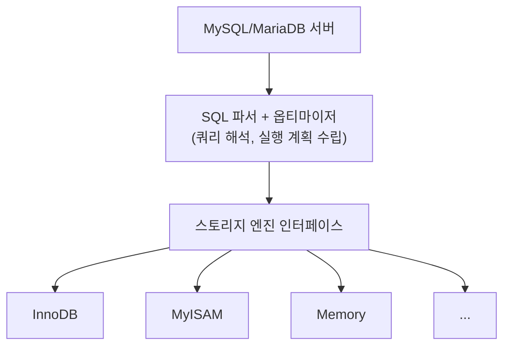
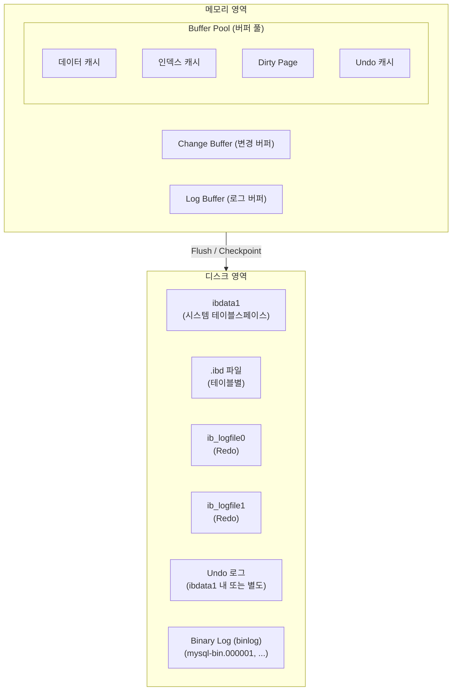
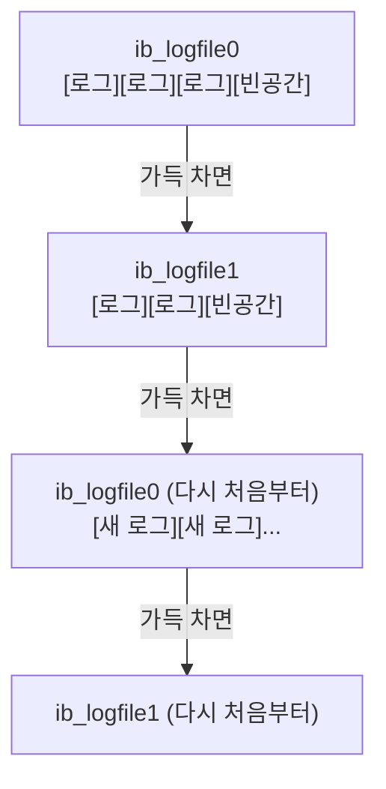

# 10. InnoDB 스토리지 엔진 -- DB의 심장부

---

## 1. InnoDB란?

### 1.1 한 문장 정의

**"MariaDB/MySQL의 기본 스토리지 엔진. 트랜잭션, 행 레벨 락, 장애 복구를 지원한다."**

### 1.2 스토리지 엔진이 뭔가

!!! note "MySQL/MariaDB의 독특한 구조"
    다른 DB (Oracle, PostgreSQL)는 SQL 파서 + 옵티마이저 + 스토리지가 하나로 통합되어 있다. MySQL/MariaDB는 SQL 파서 + 옵티마이저(서버 레이어)와 스토리지 엔진(플러그인 방식으로 교체 가능)이 분리되어 있다.



!!! tip "스토리지 엔진이란?"
    스토리지 엔진 = 데이터를 어떻게 저장하고 읽을지 결정하는 부분. InnoDB = 현재 기본이자 사실상 유일한 선택지.

### 1.3 왜 InnoDB인가

| 기능 | InnoDB | MyISAM |
|------|--------|--------|
| 트랜잭션 | O | X |
| 행 레벨 락 | O | X (테이블 락만) |
| 외래키 | O | X |
| 장애 복구 | O (Redo 로그) | X |
| MVCC | O | X |
| 풀텍스트 인덱스 | O (5.6+) | O |
| COUNT(*) 속도 | 느림 (풀스캔) | 빠름 (저장된 값) |

!!! warning "InnoDB vs MyISAM 핵심"
    MyISAM은 레거시다. 새 프로젝트에서 쓸 이유가 없다.
    InnoDB의 COUNT(*)가 느린 이유는 MVCC 때문이다 (4장 참고).

    우리 사례에서 COUNT(*) 27분:
    InnoDB라서 느린 게 아니라, 2.7억 건에 인덱스가 없어서 느린 것이다.

---

## 2. InnoDB 아키텍처



### 2.1 메모리 영역

**Buffer Pool (버퍼 풀):**

!!! example "Buffer Pool = InnoDB에서 가장 중요한 메모리 영역"
    **역할:** 디스크에 있는 데이터와 인덱스를 메모리에 캐시한다. **이유:** 디스크는 느리고, 메모리는 빠르다.

    | 비유 | 설명 |
    |------|------|
    | 디스크 | 창고 (크지만 멀다) |
    | Buffer Pool | 작업대 (작지만 바로 쓸 수 있다) |

    자주 쓰는 재료(데이터)를 작업대에 올려놓으면 매번 창고까지 갈 필요가 없다.

    Buffer Pool이 클수록 더 많은 데이터를 메모리에 유지하고, 디스크 I/O가 감소하고, 성능이 향상된다. 보통 전체 메모리의 50~80%를 Buffer Pool에 할당한다 (예: 서버 메모리 16GB → Buffer Pool 8~12GB).

**Change Buffer (변경 버퍼):**

!!! note "Change Buffer = 세컨더리 인덱스 변경사항 임시 저장 공간"
    INSERT/UPDATE/DELETE 시:

    - PK(클러스터드 인덱스)는 즉시 업데이트
    - 세컨더리 인덱스는 Change Buffer에 기록
    - 나중에 해당 인덱스 페이지가 Buffer Pool에 올라올 때 적용 (Merge)

    **왜 이렇게 하나?** 세컨더리 인덱스 페이지가 디스크에만 있을 수 있다. 매번 디스크에서 읽어와서 업데이트하면 느리다. "나중에 읽을 때 같이 업데이트하자" 전략이다.

**Log Buffer (로그 버퍼):**

!!! note "Log Buffer = Redo 로그를 디스크에 쓰기 전에 모아두는 메모리 공간"
    매 쿼리마다 디스크에 쓰면 느리다. Log Buffer에 모았다가 한 번에 디스크에 쓴다 (Flush). `innodb_flush_log_at_trx_commit` 설정으로 타이밍을 제어한다.

    | 설정값 | 동작 | 특성 |
    |--------|------|------|
    | 1 | 매 COMMIT마다 디스크에 쓴다 | 안전, 느림 |
    | 2 | 매 COMMIT마다 OS 버퍼에 쓴다 | 타협 |
    | 0 | 1초마다 디스크에 쓴다 | 빠름, 위험 |

### 2.2 디스크 영역

**시스템 테이블스페이스 (ibdata1):**

!!! note "ibdata1 (시스템 테이블스페이스)"
    **경로:** `/var/lib/mysql/ibdata1` (또는 데이터 디렉토리)

    **포함하는 것:** InnoDB 메타데이터 (테이블, 인덱스 정의), Undo 로그 (오래된 버전의 설정에서), Change Buffer, Double Write Buffer

!!! warning "ibdata1 주의사항"
    ibdata1은 커지기만 하고 줄어들지 않는다. DELETE로 데이터를 지워도 ibdata1 크기는 그대로다. OPTIMIZE TABLE을 해도 ibdata1은 줄지 않는다. `innodb_file_per_table=ON`이면 이 문제가 완화된다 (아래 참조).

**개별 테이블스페이스 (.ibd 파일):**

!!! note "개별 테이블스페이스 (.ibd 파일)"
    | 설정 | 동작 |
    |------|------|
    | `innodb_file_per_table=ON` | 각 테이블이 독립적인 .ibd 파일을 가진다 (예: tb_lms_exam_stare_paper_backup.ibd = 43GB) |
    | `innodb_file_per_table=OFF` | 모든 테이블 데이터가 ibdata1에 들어간다. ibdata1이 거대해지고 줄일 수 없다 |

    현재는 ON이 기본값이고 OFF로 쓸 이유가 없다.

**Redo 로그 파일 (ib_logfile0, ib_logfile1):**

!!! note "Redo 로그 파일"
    **경로:** `/var/lib/mysql/ib_logfile0`, `ib_logfile1`

    WAL(Write-Ahead Logging)의 실체. 데이터보다 로그를 먼저 쓴다. 장애 시 로그 재생으로 복구한다. 5절에서 상세히 다룬다.

---

## 3. .ibd 파일 상세

### 3.1 innodb_file_per_table

!!! tip "innodb_file_per_table 설정"
    **ON (기본값, 권장):**

    - 테이블마다 독립 .ibd 파일
    - TRUNCATE 시 파일 삭제 → 즉시 디스크 회수
    - DROP 시 파일 삭제 → 즉시 디스크 회수
    - 테이블별 용량 파악 가능 (`ls -lh *.ibd`)
    - 개별 테이블 백업/복원 가능

    **OFF (비추, 레거시):**

    - 모든 데이터가 ibdata1에 저장
    - TRUNCATE 해도 ibdata1 크기 안 줄어듦
    - DROP 해도 ibdata1 크기 안 줄어듦
    - ibdata1이 계속 커지기만 한다
    - 줄이려면 전체 dump → ibdata1 삭제 → 복원 필요

    **확인 방법:**
    `SHOW VARIABLES LIKE 'innodb_file_per_table';`

### 3.2 .ibd 내부 구조

!!! note ".ibd 파일은 페이지 단위로 구성된다"
    `.ibd 파일 = [Page 0 (16KB)] [Page 1 (16KB)] [Page 2 (16KB)] [Page 3 (16KB)] ...`

    **페이지(Page) = InnoDB의 최소 I/O 단위 = 16KB**

    왜 16KB인가? 디스크에서 1바이트 읽으나 16KB 읽으나 시간이 비슷하다. 그래서 한 번에 16KB를 읽어서 효율을 높인다. 이 16KB 안에 여러 행(Row)이 들어간다.

    | 페이지 종류 | 저장 내용 |
    |------------|----------|
    | 데이터 페이지 | 실제 행 데이터 저장 |
    | 인덱스 페이지 | B-Tree 인덱스 노드 저장 |
    | 파일 헤더 페이지 | 파일 메타데이터 |
    | Undo 로그 페이지 | (ibdata1에 저장되는 경우) |

!!! tip "43GB .ibd 파일이면?"
    43GB / 16KB = 약 280만 개의 페이지. 풀스캔 = 280만 개 페이지를 전부 읽어야 한다. 인덱스 탐색 = 4~5개 페이지만 읽으면 된다. 이것이 09장에서 배운 인덱스의 물리적 실체다.

### 3.3 TRUNCATE의 파일 레벨 동작

!!! example "TRUNCATE의 파일 레벨 동작 (innodb_file_per_table=ON)"
    ```sql
    TRUNCATE TABLE tb_lms_exam_stare_paper_backup;
    ```

    1. 기존 .ibd 파일 삭제 (43GB 파일 삭제)
    2. 빈 .ibd 파일 재생성 (빈 테이블 구조)
    3. 끝

    43GB 파일 삭제 = OS의 파일 삭제 = 파일 시스템에서 해제. 디스크 공간 즉시 회수. 데이터 양과 무관하게 수 분이면 완료.

    | information_schema 확인 | 값 |
    |------------------------|-----|
    | 전 | data_gb = 43.17 |
    | 후 | data_mb = 0.02 (빈 .ibd 파일의 헤더만 남음) |

### 3.4 DELETE의 파일 레벨 동작

!!! danger "DELETE의 파일 레벨 동작"
    ```sql
    DELETE FROM tb_lms_exam_stare_paper_backup;
    ```

    **내부 동작 (2.7억 번 반복):**

    1. 첫 번째 행을 찾는다
    2. Undo 로그에 원래 데이터 기록 (ROLLBACK용)
    3. Redo 로그에 삭제 기록 (장애 복구용)
    4. 해당 행을 "삭제됨"으로 마킹
    5. 다음 행으로...

    **.ibd 파일에서 무슨 일이 일어나는가?**

    | 시점 | 페이지 상태 | 파일 크기 |
    |------|-----------|----------|
    | DELETE 전 | 모든 페이지에 데이터 가득 | **43GB** |
    | DELETE 후 | 모든 페이지에 "삭제 마킹"만 | **43GB (!!!)** |

    파일 크기가 안 줄어든다. 행은 "삭제됨"으로 마킹만 됐을 뿐, 페이지 자체는 그대로 남아 있다.

    디스크 공간을 회수하려면 `OPTIMIZE TABLE`로 테이블을 재구성해야 한다 (새 .ibd 파일 생성 → 살아있는 데이터만 복사 → 교체). 2.7억 건이면 이것도 수 시간. 그래서 03장에서 "TRUNCATE를 써라"고 한 것이다.

---

## 4. Buffer Pool 상세

### 4.1 LRU 알고리즘

!!! note "LRU = Least Recently Used = 가장 오래 전에 사용된 것을 제거"
    Buffer Pool은 메모리이므로 크기가 제한되어 있다. 전체 데이터가 다 올라가지 않는다. 자주 쓰는 데이터는 메모리에 유지하고, 안 쓰는 데이터는 메모리에서 내려보낸다.

    `Hot end (자주 접근) [A] → [B] → [C] → [D] → [E] → [F] → [G] → [H] Cold end (퇴출)`

    - 페이지 A에 접근 → Hot end로 이동
    - 새 페이지 접근 → Buffer Pool이 가득 차면 H 퇴출

!!! warning "Buffer Pool Pollution 방지: Young/Old 영역"
    **문제:** 풀스캔 하면? 2.7억 건 풀스캔 시 모든 페이지가 Buffer Pool에 올라온다. 자주 쓰던 Hot 데이터가 전부 밀려난다. 풀스캔 끝나면 방금 읽은 데이터도 안 쓰는데 Buffer Pool을 차지. 이것을 **Buffer Pool Pollution**이라고 한다.

    **해결:** InnoDB는 LRU를 Young/Old 두 영역으로 나눈다.

    - 새로 읽은 페이지는 Old 영역에 먼저 들어간다
    - Old에서 다시 접근되면 Young으로 승격
    - 풀스캔처럼 한 번만 읽고 버리는 페이지는 Old에서 바로 퇴출
    - Hot 데이터 보호

    `innodb_old_blocks_pct` (기본 37%): Buffer Pool의 37%를 Old 영역으로 설정.

### 4.2 Dirty Page

!!! note "Dirty Page"
    Dirty Page = 메모리에서 수정됐지만 디스크에 아직 안 쓴 페이지

    `UPDATE tb_user SET name = '김철수' WHERE id = 1;`

    - Step 1: Buffer Pool에서 해당 페이지를 찾는다
    - Step 2: 메모리의 페이지를 수정한다
    - Step 3: Redo 로그에 변경 내용을 기록한다
    - Step 4: 디스크의 .ibd 파일은 아직 안 고친다! (Dirty)

    **왜 디스크에 바로 안 쓰나?**

    - 디스크 쓰기는 느리다
    - 매 UPDATE마다 디스크에 쓰면 성능 하락
    - 메모리에 모아뒀다가 나중에 한 번에 쓴다

    **그러면 장애 나면 데이터 날아가지 않나?**

    - Redo 로그가 있다 (Step 3에서 기록함)
    - 장애 복구 시 Redo 로그를 재생하면 된다
    - 이것이 WAL (Write-Ahead Logging)

**Checkpoint:**

!!! note "Checkpoint = Dirty Page를 디스크에 쓰는 시점"
    InnoDB는 주기적으로 Dirty Page를 디스크(.ibd)에 기록한다. 이것을 Checkpoint라고 한다. Checkpoint까지 완료된 데이터는 Redo 로그 없이도 안전하다. Checkpoint 이후의 변경만 Redo 로그 재생이 필요하다.

    **Checkpoint가 중요한 이유:** Redo 로그 파일은 크기가 고정이다 (순환 파일). Checkpoint 이전의 Redo 로그는 덮어쓸 수 있다. Checkpoint가 밀리면 Redo 로그가 가득 차서 쓰기가 멈춘다.

---

## 5. Redo 로그 상세

### 5.1 WAL (Write-Ahead Logging)

!!! note "WAL = Write-Ahead Logging = 데이터보다 로그를 먼저 쓴다"
    이것은 DB의 핵심 원리 중 하나다. 왜 데이터를 바로 디스크에 안 쓰고 로그를 먼저 쓰나?

    | 쓰기 방식 | I/O 패턴 | 속도 |
    |----------|---------|------|
    | 데이터 페이지 쓰기 | .ibd 파일 여기저기에 랜덤 (Random I/O) | 느리다 |
    | Redo 로그 쓰기 | 로그 파일에 순서대로 이어쓰기 (Sequential I/O) | 빠르다 |

    **전략:** 변경 내용을 Redo 로그에 먼저 순차적으로 쓴다 (빠름). 실제 데이터 페이지는 나중에 한 번에 쓴다 (Checkpoint). 장애 나면? Redo 로그 재생으로 복구.

!!! example "WAL 동작 흐름"
    **UPDATE 실행:**

    1. Redo 로그에 기록 (Sequential I/O, 빠름)
    2. Buffer Pool에서 수정 (메모리, 즉시)
    3. .ibd 파일은 나중에 (Checkpoint 때)

    **COMMIT 시점:**

    - Redo 로그가 디스크에 있으므로 COMMIT 안전
    - .ibd에 아직 안 썼어도 Redo 로그로 복구 가능

### 5.2 Redo 로그의 순환 파일 구조

!!! note "Redo 로그의 순환 파일 구조"
    **파일:** ib_logfile0 (예: 48MB), ib_logfile1 (예: 48MB)



!!! warning "순환 파일의 주의사항"
    순환 구조다. 파일이 무한히 커지지 않는다. 하지만 덮어쓰기 전에 반드시 해당 영역의 Dirty Page를 디스크에 기록해야 한다 (Checkpoint). 그래야 Redo 로그가 없어도 데이터가 안전하다. Checkpoint가 밀리면 로그 공간 부족 → 쓰기 대기 발생.

**장애 복구 과정:**

!!! example "장애 복구 과정 (Crash Recovery)"
    **서버가 갑자기 죽었다 (정전, 크래시 등).**

    1. 서버 재시작
    2. InnoDB가 Redo 로그를 읽는다
    3. 마지막 Checkpoint 이후의 로그를 재생한다
    4. Dirty Page였던 변경사항이 .ibd에 반영된다
    5. 복구 완료

    | 트랜잭션 상태 | 복구 처리 |
    |-------------|----------|
    | COMMIT 된 트랜잭션 | Redo 로그에 있으므로 복구됨 |
    | COMMIT 안 된 트랜잭션 | Undo 로그로 ROLLBACK 처리됨 |

    이것이 InnoDB의 장애 복구(Crash Recovery)다. MyISAM에는 이 기능이 없다. 그래서 장애 시 데이터가 깨진다.

---

## 6. Undo 로그 상세

### 6.1 ROLLBACK용

!!! note "Undo 로그 = 변경 전 상태를 기록하는 로그"
    ```sql
    UPDATE tb_user SET name = '김철수' WHERE id = 1;
    -- (원래 name = '박영희')
    ```

    Undo 로그에 기록: "id=1의 name은 원래 '박영희'였다"

    **ROLLBACK 실행 시:** Undo 로그를 읽는다 → name을 '박영희'로 복원한다 → 변경 취소 완료

### 6.2 MVCC용 (다중 버전 동시성 제어)

!!! note "MVCC = Multi-Version Concurrency Control"
    여러 트랜잭션이 동시에 같은 데이터를 읽어도 충돌 안 나게 하는 기술.

    - **트랜잭션 A:** UPDATE name = '김철수' (아직 COMMIT 안 함)
    - **트랜잭션 B:** SELECT name ... (뭐가 보여야 하나?)

    격리 수준에 따라 READ COMMITTED에서는 트랜잭션 A의 COMMIT 전 버전 = '박영희'가 보인다. 어디서? **Undo 로그에서!**

    Undo 로그에 이전 버전이 남아 있으므로 트랜잭션 B는 Undo 로그에서 이전 버전을 읽는다. 트랜잭션 A가 COMMIT 하면 그때 최신 버전이 보인다.

    이것이 "행 레벨 락 없이도 읽기가 가능한" 이유다. 읽기는 Undo에서 이전 버전을 읽으면 되니까 락이 필요 없다. 04장에서 배운 격리 수준의 물리적 구현체가 바로 Undo 로그다.

### 6.3 대용량 DELETE 시 Undo 폭발

!!! danger "대용량 DELETE 시 Undo 폭발"
    ```sql
    DELETE FROM tb_lms_exam_stare_paper_backup;  -- 2.7억 건
    ```

    2.7억 건 × (Undo에 원래 데이터 기록) = Undo 로그에 2.7억 건의 원래 데이터가 전부 기록된다. 43GB 데이터의 원본이 Undo에 들어간다. Undo 로그가 수십 GB까지 폭증. 이 동안 MVCC 때문에 다른 트랜잭션은 Undo에서 이전 버전을 읽어야 함. 시스템 전체가 느려진다.

    그래서 03장에서 "43GB를 DELETE하면 서버가 죽는다"고 한 것이다.

    | 방식 | 비용 |
    |------|------|
    | DELETE | 2.7억 건 x (Undo 기록 + Redo 기록 + 행 마킹) = 서버 사망 |
    | TRUNCATE | .ibd 파일 삭제 + 재생성 = 수 분 |

---

## 7. 바이너리 로그 (binlog)

### 7.1 역할

!!! note "Binary Log (binlog) = DB에서 발생한 모든 변경을 기록하는 로그"
    **용도 1: 복제 (Replication)** -- Master 서버의 binlog를 Slave 서버가 읽어서 같은 변경을 적용. Master-Slave 구조의 핵심.

    **용도 2: Point-in-Time Recovery (PITR)** -- 특정 시점으로 DB를 복구. "어제 백업 + 어제부터 오늘까지의 binlog" = 오늘 특정 시점 복구.

### 7.2 Redo 로그와의 차이

| 구분 | Redo 로그 | Binary 로그 |
|------|-----------|-------------|
| 소속 | InnoDB (엔진 레벨) | MySQL 서버 (서버 레벨) |
| 목적 | 장애 복구 | 복제 + PITR |
| 내용 | 물리적 변경 (어떤 페이지의 어떤 바이트가 어떻게 바뀌었는지) | 논리적 변경 (어떤 SQL을 실행했는지) |
| 파일 크기 | 고정 (순환) | 계속 증가 |
| 파일 수 | 2개 (기본) | 계속 생성 (mysql-bin.000001..) |
| 자동 삭제 | 순환이므로 자동 | 수동 또는 expire_logs_days |

!!! note "핵심 차이"
    - **Redo** = InnoDB 내부의 장애 복구 전용 (순환, 고정 크기)
    - **Binlog** = 서버 전체의 변경 기록 (누적, 크기 증가)

### 7.3 우리 서버 Disk Full 원인

!!! danger "Disk Full 원인 분석"
    **/data 디스크: 196GB / 사용량: 134GB (68%)**

    | 항목 | 용량 |
    |------|------|
    | tb_lms_exam_stare_paper_backup.ibd | 43GB (22%) |
    | 기타 테이블 .ibd 파일들 | ~50GB |
    | Binary 로그 (mysql-bin.*) | ~20GB (추정) |
    | ibdata1 | ~5GB (추정) |
    | 기타 | ~16GB |
    | **합계** | **~134GB** |

    **문제 1: 43GB 테이블이 디스크의 22% 차지**

    - 재채점 코드의 무한 INSERT가 원인
    - 해결: 코드 수정 + TRUNCATE

    **문제 2: Binary 로그가 누적**

    - expire_logs_days 설정이 없거나 너무 큰 경우
    - 14개월간 binlog가 계속 쌓였을 수 있다
    - 해결: expire_logs_days 설정 (예: 7일)
    - `PURGE BINARY LOGS BEFORE '날짜';` 로 수동 정리 가능

    **문제 3: 매일 00:00 백업 14개월 실패 (0바이트)**

    - mysqldump가 43GB 테이블을 덤프하려다 시간 초과
    - 또는 디스크 공간 부족으로 덤프 파일 생성 실패
    - 백업 스크립트에 에러 핸들링이 없어서 실패를 14개월간 모름
    - 이것이 "모니터링 없는 백업은 백업이 아니다"의 실제 사례

```sql
-- binlog 확인 및 관리 쿼리

-- 현재 binlog 파일 목록
SHOW BINARY LOGS;
-- binlog 만료 설정 확인
SHOW VARIABLES LIKE 'expire_logs_days';
-- 7일 이전 binlog 삭제
PURGE BINARY LOGS BEFORE DATE_SUB(NOW(), INTERVAL 7 DAY);
-- 만료 기간 설정 (서버 재시작 시 초기화되므로 my.cnf에도 추가)
SET GLOBAL expire_logs_days = 7;
```

---

## 8. 핵심 정리

!!! abstract "10장 핵심 정리: InnoDB 스토리지 엔진"
    1. **InnoDB** = 트랜잭션 + 행 레벨 락 + 장애 복구
        - MariaDB/MySQL의 기본 엔진, 사실상 유일한 선택지

    2. **Buffer Pool** = DB 성능의 핵심
        - 디스크 데이터를 메모리에 캐시
        - LRU(Young/Old)로 관리, 풀스캔 오염 방지
        - Dirty Page: 메모리에서 수정됨, 디스크에 아직 안 씀
        - Checkpoint에서 Dirty Page를 디스크에 기록

    3. **.ibd 파일** = 테이블 데이터의 물리적 실체
        - innodb_file_per_table=ON이면 테이블당 1개
        - 16KB 페이지 단위로 구성
        - TRUNCATE: 파일 삭제 + 재생성 (43GB → 0.02MB, 수 분)
        - DELETE: 행 마킹만, 파일 크기 안 줄어듦 (43GB → 43GB)

    4. **Redo 로그** = WAL (Write-Ahead Logging)
        - 데이터보다 로그를 먼저 쓴다
        - Sequential I/O라서 빠르다
        - 장애 시 로그 재생으로 복구
        - 순환 파일 구조 (고정 크기)

    5. **Undo 로그** = ROLLBACK + MVCC의 기반
        - 변경 전 데이터를 기록
        - ROLLBACK 시 이전 상태로 복원
        - MVCC: 다른 트랜잭션이 이전 버전을 읽을 수 있게 함
        - 대용량 DELETE 시 Undo가 폭발한다 (서버 사망 원인)

    6. **Binary 로그** = 복제 + PITR
        - Redo 로그와 다르다 (서버 레벨, 누적, 논리적)
        - 관리 안 하면 디스크 가득 찬다
        - expire_logs_days 설정 필수

    7. **우리 사례의 교훈**
        - 43GB .ibd: 코드 결함으로 데이터 폭증
        - 14개월 백업 실패: 모니터링 없는 백업은 백업이 아니다
        - binlog 누적: 관리 설정 없으면 디스크 잡아먹는다
        - 종합: 운영은 만드는 것보다 관리하는 것이 어렵다

    *"InnoDB 내부를 모르면 DB를 운영하는 게 아니라 DB에 운영당하는 거다. 엔진을 알아야 차를 몬다."*

**이전 장 연결:** 08장(information_schema)으로 테이블 상태를 진단하고, 09장(인덱스)으로 조회 성능을 이해했다. 이 장에서 InnoDB의 물리적 동작 원리를 배웠으므로, 이제 "왜 TRUNCATE가 빠르고 DELETE가 느린지", "왜 인덱스가 디스크를 차지하는지", "왜 백업이 실패했는지"를 엔진 레벨에서 설명할 수 있다. 표면이 아니라 근본을 이해하는 것. 이것이 Lv2에서 Lv3으로 가는 길이다.
