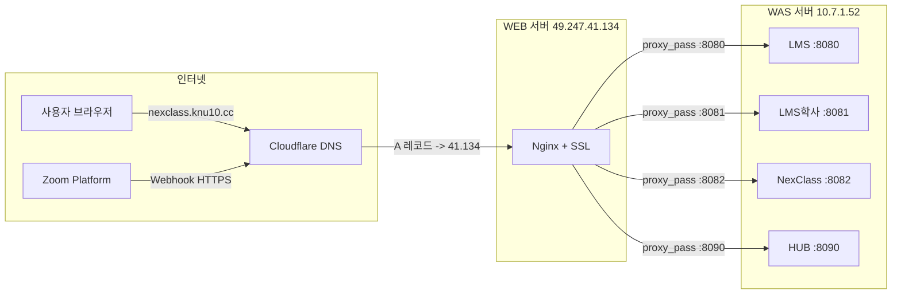

# DNS / Nginx 인프라 완전정복 - 학습 로드맵

!!! abstract "목표"
    "서버에 HTTPS URL 하나 만들어주세요"라고 **남한테 부탁하는 개발자**가 아니라,
    직접 DNS 설정하고 Nginx 리버스 프록시 구성해서 외부 서비스(Zoom Webhook 등)와 연동할 수 있는 수준까지.

!!! danger "왜 이걸 배워야 하냐"
    NexClass 프로젝트에서 Zoom Webhook 연동하려면 **HTTPS URL이 필수**야.
    `https://nexclass.knu10.cc/webhook/zoom` -- 이 URL 하나 만드는 데
    DNS, Nginx, SSL, 리버스 프록시, WEB/WAS 분리 개념이 **전부** 필요해.
    이거 모르면? 인프라 담당자한테 매번 "이거 해주세요" 하는 기생 개발자가 되는 거야.

---

## 학습 단계

| 단계 | 파일 | 주제 | 난이도 |
|:----:|------|------|:------:|
| 01 | `01_IP와_포트.md` | IP 주소, 포트, 왜 필요한지 | Alpha |
| 02 | `02_DNS_도메인의_비밀.md` | DNS, A 레코드, 도메인이 IP가 되는 과정 | Alpha |
| 03 | `03_HTTP와_HTTPS.md` | HTTP vs HTTPS, 왜 HTTPS가 필수인지 | Beta |
| 04 | `04_SSL_인증서.md` | SSL/TLS 인증서, 어떻게 HTTPS가 동작하는지 | Beta |
| 05 | `05_Nginx_리버스프록시.md` | Nginx가 뭔지, 리버스 프록시가 뭔지 | Gamma |
| 06 | `06_Cloudflare.md` | Cloudflare DNS 관리, Proxy 모드, Origin Rules | Gamma |
| 07 | `07_WEB_WAS_아키텍처.md` | WEB/WAS 분리 패턴, 왜 이렇게 하는지 | Delta |
| 08 | `08_NexClass_인프라_실전.md` | 오늘 한 것 전체 복습 - 실전 | Omega |
| 09 | `09_빠싺_최종시험.md` | 전 범위 시험 | Black Hole |
| 10 | `10_빠싺_최종시험_정답.md` | 정답 + 해설 | - |

---

## 우리 프로젝트 인프라 전체 그림

이 로드맵을 다 끝내면 아래 그림이 **완벽하게** 이해돼야 해.

!!! tip "이 그림이 뭔 소린지 모르겠다고?"
    정상이야. 01장부터 차근차근 읽으면 10장 끝날 때 이 그림이 **너무 당연하게** 보일 거야.

---

## 학습 원칙

!!! warning "절대 규칙"
    1. **순서대로** 읽을 것. 뛰어넘지 말 것. 01 모르면 02 이해 못 해.
    2. 각 챕터 끝 **확인 문제** 반드시 풀 것. 틀리면 다시 읽을 것.
    3. 코드 예시는 **직접 타이핑** 할 것. 복붙하면 손에 안 익어.
    4. 최종시험 **80점 이상**이면 합격. 미만이면 처음부터 다시.

---

## 실전 컨텍스트

이 학습 자료는 뜬구름 잡는 이론이 아니야. **오늘 실제로 한 작업**을 기반으로 만들었어.

| 실제 작업 | 관련 챕터 |
|-----------|-----------|
| NexClass가 8082 포트에서 돌아가는 이유 | 01 - IP와 포트 |
| Cloudflare에서 nexclass.knu10.cc A 레코드 추가 | 02 - DNS, 06 - Cloudflare |
| Zoom Webhook이 HTTPS를 요구하는 이유 | 03 - HTTP와 HTTPS |
| Nginx에 SSL 인증서가 걸려있는 이유 | 04 - SSL 인증서 |
| Nginx server block 추가해서 NexClass로 트래픽 전달 | 05 - Nginx 리버스 프록시 |
| WEB 서버와 WAS 서버가 분리된 이유 | 07 - WEB/WAS 아키텍처 |
| `https://nexclass.knu10.cc/webhook/zoom` 완성 | 08 - 실전 종합 |

---

**"Not quite my tempo? 다시."**
