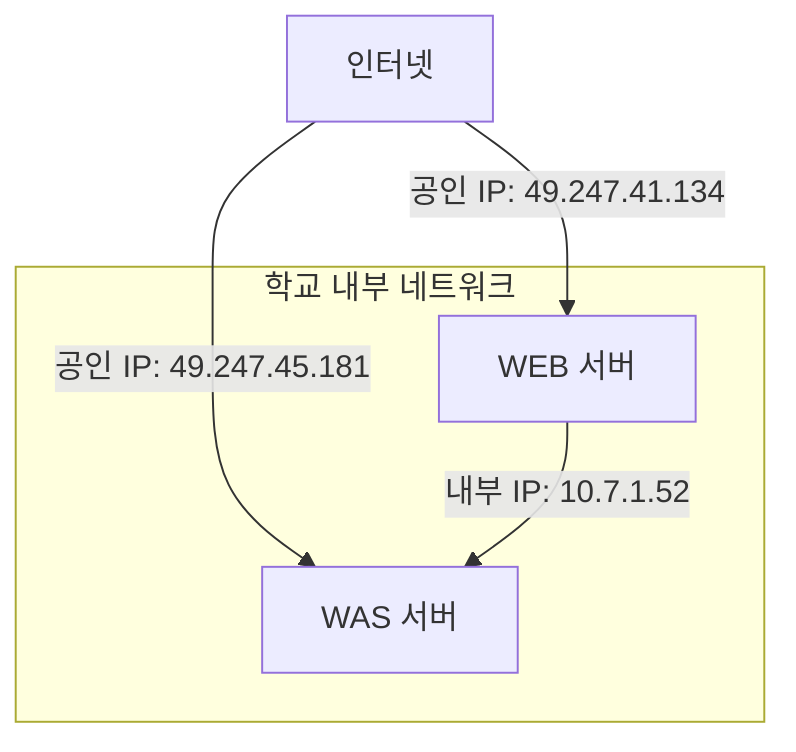
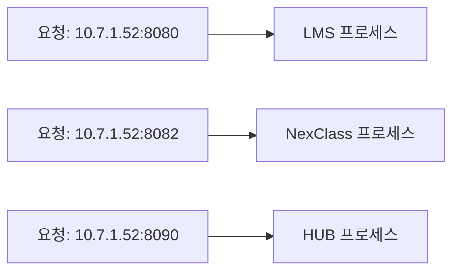
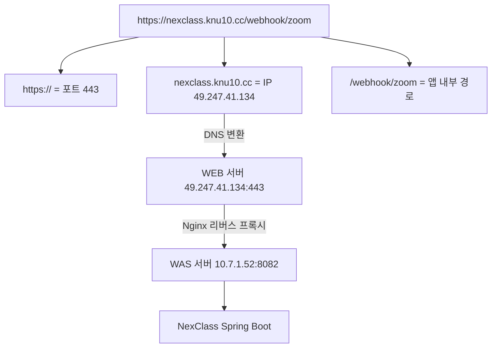

# 01. IP 주소와 포트 - 인터넷의 좌표 시스템

!!! note "난이도: Alpha"
    인프라의 가장 기본. 이거 모르면 뒤에 나오는 거 **하나도** 이해 못 해.

---

## IP 주소가 뭐냐

"집 주소"라고 비유하는 교재가 많은데, 비유는 거기까지만 쓰자. 본질은 이거야.

!!! abstract "IP 주소의 본질"
    **네트워크에 연결된 장치를 식별하는 고유한 숫자 주소.**
    인터넷에서 "너한테 데이터 보낼게" 할 때, **어디로 보낼지** 알아야 하잖아. 그게 IP야.

### IPv4 주소 형식

```
49.247.45.181
```

- 4개의 숫자를 `.`으로 구분
- 각 숫자는 0~255 범위 (8비트 = 1바이트, 총 32비트)
- 전 세계에서 **유일한** 주소 (공인 IP의 경우)

---

## 공인 IP vs 내부(사설) IP

!!! danger "이거 구분 못 하면 삽질의 시작이야"
    "서버 IP가 뭐예요?" 물었을 때 **어떤 IP**를 말하는지 모르면 끝장이야.

| 구분 | 공인 IP (Public) | 내부 IP (Private) |
|------|-------------------|-------------------|
| **누가 쓰냐** | 인터넷에서 접근할 때 | 같은 내부 네트워크에서만 |
| **유일한가** | 전 세계에서 유일 | 같은 내부망에서만 유일 |
| **범위** | 할당받은 주소 | 10.x.x.x, 172.16~31.x.x, 192.168.x.x |
| **예시** | `49.247.45.181` | `10.7.1.52` |

### 우리 프로젝트 실전



!!! example "NexClass WAS 서버의 IP"
    - **공인 IP**: `49.247.45.181` -- 인터넷에서 이 서버를 찾을 때 쓰는 주소
    - **내부 IP**: `10.7.1.52` -- 같은 학교 네트워크 안에서 쓰는 주소
    - 같은 서버인데 주소가 2개야. 밖에서 보는 주소와 안에서 보는 주소가 다른 거지.

### IP 확인 명령어

=== "내부 IP 확인"
    ```bash
    # hostname -I: 이 서버의 내부(사설) IP 주소를 출력하는 명령어
    hostname -I
    # 결과: 10.7.1.52
    ```

=== "공인 IP 확인"
    ```bash
    # curl ifconfig.me: 외부 서비스에 "내 IP가 뭐야?" 물어보는 명령어
    # 인터넷을 통해 나가기 때문에 공인 IP가 반환됨
    curl ifconfig.me
    # 결과: 49.247.45.181
    ```

!!! warning "흔한 실수"
    `hostname -I`로 나온 `10.7.1.52`를 외부 서비스(Zoom Webhook 등)에 넣으면?
    **당연히 안 돼.** 10.x.x.x는 인터넷에서 찾을 수 없는 주소야.

---

## 포트(Port)가 뭐냐

IP 주소가 **건물 주소**라면, 포트는 그 건물 안의 **호수**야. 여기까지가 비유고, 본질은 이거야.

!!! abstract "포트의 본질"
    **하나의 IP 주소(서버)에서 여러 프로그램이 동시에 돌아갈 때, 어떤 프로그램한테 데이터를 전달할지 구분하는 번호.**
    범위: 0 ~ 65535 (16비트)

### 왜 포트가 필요해?

서버 하나에 프로그램이 하나만 돌아가면 포트가 필요 없어. 근데 현실은?

!!! example "우리 WAS 서버 (10.7.1.52) 현황"
    **서버 1대**에 프로그램 **4개**가 동시에 돌아가고 있어:

    | 포트 | 프로그램 | 설명 |
    |:----:|----------|------|
    | `:8080` | LMS (www) | 학습관리시스템 메인 |
    | `:8081` | LMS (학사) | 학사 데이터 API |
    | `:8082` | **NexClass** | 화상강의 자체 솔루션 |
    | `:8090` | HUB | 허브 시스템 |

    같은 IP `10.7.1.52`인데, 포트 번호로 "너한테 보내는 거야"를 구분하는 거지.



### Well-Known 포트 (외워)

!!! tip "이건 걍 외워야 해. 안 외우면 매번 검색해야 돼."

| 포트 | 프로토콜/서비스 | 설명 |
|:----:|----------------|------|
| `80` | HTTP | 웹 기본 포트 (브라우저가 자동으로 붙임) |
| `443` | HTTPS | 암호화된 웹 기본 포트 |
| `22` | SSH | 원격 서버 접속 |
| `3306` | MySQL/MariaDB | 데이터베이스 |
| `5432` | PostgreSQL | 데이터베이스 |
| `8080` | 사용자 정의 | 개발용 웹 서버에서 많이 씀 |
| `8082` | 사용자 정의 | **우리 NexClass가 여기** |

!!! warning "80과 443이 왜 중요하냐"
    브라우저에서 `https://nexclass.knu10.cc`를 치면, 브라우저가 자동으로 **443번 포트**로 연결해.
    `http://nexclass.knu10.cc`를 치면 **80번 포트**로 연결하고.
    즉, 사용자는 포트 번호를 안 쳐도 되는 거야. 브라우저가 알아서 붙여주니까.

### 포트 확인 명령어

```bash
# sudo lsof -i :8082
# - lsof: List Open Files (리눅스에서는 네트워크 소켓도 '파일'이야)
# - -i :8082: 8082번 포트를 사용하는 프로세스를 찾아라
# - sudo: 다른 사용자의 프로세스도 보려면 관리자 권한 필요
sudo lsof -i :8082
```

```
# 결과 예시:
COMMAND   PID   USER   FD   TYPE DEVICE SIZE/OFF NODE NAME
java    12345 ubuntu  100u  IPv6  98765      0t0  TCP *:8082 (LISTEN)
#                                                       ↑
#                                          8082 포트에서 듣고(LISTEN) 있다는 뜻
#                                          = NexClass Spring Boot가 실행 중
```

!!! tip "LISTEN이 뭐냐"
    "이 포트에서 요청을 기다리고 있다"는 뜻이야.
    NexClass.jar가 8082 포트에서 LISTEN 중 = "8082번으로 오는 요청 받을 준비 됐어"

---

## 실전: URL을 분해해보자

`https://nexclass.knu10.cc/webhook/zoom` -- 이 URL에서 IP와 포트가 어디에 숨어있을까?

| URL 부분 | 의미 | 숨겨진 값 |
|----------|------|-----------|
| `https://` | 프로토콜 (HTTPS) | 포트 **443** (생략됨) |
| `nexclass.knu10.cc` | 도메인 | IP **49.247.41.134** (DNS가 변환) |
| `/webhook/zoom` | 경로 | NexClass 앱 내부 라우팅 |

!!! note "잠깐, NexClass는 8082인데 왜 443이야?"
    좋은 질문이야. 이건 02장(DNS)과 05장(Nginx 리버스 프록시)에서 설명해.
    미리 한 줄만 말하면: **Nginx가 443으로 받아서 8082로 전달해주는 거야.**

---

## 정리



| 개념 | 한 줄 정리 |
|------|------------|
| **IP 주소** | 네트워크에서 장치를 찾는 주소 |
| **공인 IP** | 인터넷에서 접근 가능한 유일한 주소 |
| **내부 IP** | 같은 네트워크 안에서만 쓰는 주소 (10.x, 192.168.x 등) |
| **포트** | 같은 서버에서 여러 프로그램을 구분하는 번호 (0~65535) |
| **Well-Known 포트** | 80(HTTP), 443(HTTPS), 22(SSH), 3306(DB) |
| **LISTEN** | 해당 포트에서 요청을 기다리고 있는 상태 |

---

### 확인 문제

!!! question "Q1. 우리 WAS 서버의 공인 IP와 내부 IP를 각각 말해봐. 그리고 Zoom Webhook이 NexClass에 요청을 보내려면 어떤 IP를 써야 해?"

!!! question "Q2. `sudo lsof -i :8082` 명령어를 실행했는데 아무것도 안 나왔어. 이게 무슨 뜻이야?"

!!! question "Q3. 우리 WAS 서버에서 LMS는 8080, NexClass는 8082, HUB는 8090 포트를 쓰고 있어. 만약 포트라는 개념이 없다면 어떤 문제가 생겨?"

!!! question "Q4. 사용자가 브라우저에 `https://nexclass.knu10.cc`를 입력했어. 이때 브라우저가 실제로 연결하는 포트 번호는 뭐야? 그리고 왜 URL에 포트가 안 보여?"

!!! question "Q5. `hostname -I`와 `curl ifconfig.me`의 결과가 다른 이유를 설명해봐."

??? success "정답 보기"
    **A1.** 공인 IP: `49.247.45.181`, 내부 IP: `10.7.1.52`. Zoom Webhook은 **인터넷을 통해** 오니까 공인 IP를 써야 해. 근데 실제로는 공인 IP를 직접 쓰는 게 아니라 도메인(`nexclass.knu10.cc`)을 쓰고, DNS가 WEB 서버 IP(`49.247.41.134`)로 변환해줘. WAS 공인 IP에 직접 접근하는 게 아니라 WEB 서버(Nginx)를 거쳐서 내부망으로 전달되는 구조야.

    **A2.** **8082 포트에서 LISTEN하고 있는 프로세스가 없다**는 뜻이야. 즉, NexClass Spring Boot 애플리케이션이 실행 중이 아닌 거지. `nohup java -jar NexClass.jar &`로 실행해야 해.

    **A3.** 서버 1대에 프로그램 1개만 돌릴 수 있어. LMS, NexClass, HUB를 돌리려면 서버가 3대 필요하게 돼. 포트가 있으니까 **하나의 IP에서 여러 프로그램이 각자 다른 번호로 요청을 받을 수 있는 거야.** 자원 낭비를 막아주는 핵심 개념이지.

    **A4.** **443번 포트**. `https://`는 HTTPS 프로토콜이고, HTTPS의 기본 포트가 443이야. 브라우저가 자동으로 443을 붙여서 연결하기 때문에 URL에 안 보이는 거야. 명시적으로 쓰면 `https://nexclass.knu10.cc:443`인데, 기본 포트는 생략하는 게 관례야.

    **A5.** `hostname -I`는 **서버 자기 자신한테** "니 IP 뭐야?" 물어보는 거라 내부(사설) IP(`10.7.1.52`)가 나와. `curl ifconfig.me`는 **외부 서비스한테** "내가 어디서 접속하는 것처럼 보여?" 물어보는 거라 공인 IP(`49.247.45.181`)가 나와. 내부에서 보는 나 vs 밖에서 보는 나가 다른 거야 -- NAT(Network Address Translation) 때문이야.
