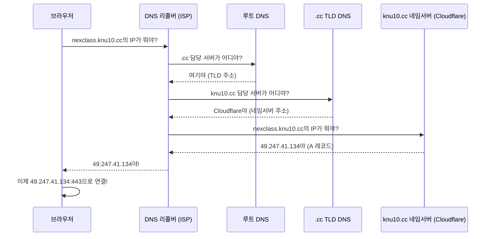
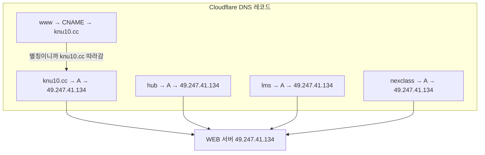
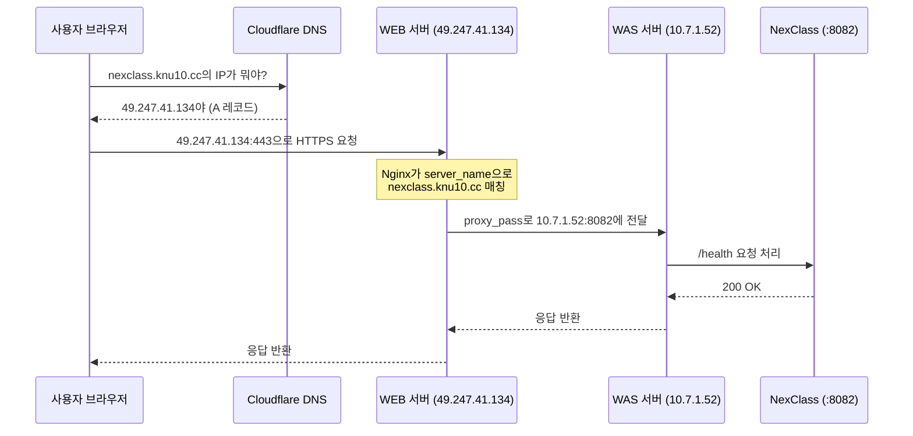

# 02. DNS - 도메인의 비밀

!!! note "난이도: Alpha"
    01장에서 IP와 포트를 배웠어. 근데 사람이 `49.247.41.134` 같은 숫자를 외우고 다녀?
    안 외우지. 그래서 DNS가 있는 거야.

!!! danger "이 장을 끝내면 이 문장을 완벽하게 해석할 수 있어야 해"
    > "nexclass.knu10.cc 서브도메인을 49.247.41.134로 A 레코드 추가"

    이게 무슨 뜻인지 모르면? 이 장을 다시 읽어.

---

## 왜 IP 대신 도메인을 쓰냐

=== "IP로 접속"
    ```
    # 이렇게 접속하면 되긴 돼
    https://49.247.41.134:443/webhook/zoom

    # 근데 문제:
    # 1. 외우기 불가능 (서버 10대면 IP 10개 외울 거야?)
    # 2. 서버 이전하면 IP 바뀜 → 모든 곳 수정해야 함
    # 3. SSL 인증서가 도메인 기반이라 IP로는 HTTPS 제대로 못 씀
    ```

=== "도메인으로 접속"
    ```
    # 이렇게 접속하면
    https://nexclass.knu10.cc/webhook/zoom

    # 장점:
    # 1. 사람이 읽을 수 있음 (nexclass가 뭐하는 서비스인지 바로 앎)
    # 2. 서버 IP 바뀌어도 DNS 레코드만 수정하면 됨
    # 3. SSL 인증서 적용 가능
    ```

!!! tip "핵심"
    도메인은 **사람을 위한 이름**이야. 컴퓨터는 여전히 IP로 통신해.
    도메인을 IP로 바꿔주는 시스템이 필요한데, 그게 **DNS**야.

---

## DNS가 뭐냐

!!! abstract "DNS의 본질"
    **Domain Name System** -- 도메인 이름을 IP 주소로 변환하는 시스템.
    전화번호부라고 비유하는 교재가 많은데, 본질은 이거야:
    **"nexclass.knu10.cc가 뭔데?" → "49.247.41.134야"** 이 변환을 해주는 시스템.

### DNS 조회 과정



!!! warning "이 과정이 매번 일어나냐?"
    아니. **캐싱**이 있어. 한번 조회하면 일정 시간(TTL) 동안 결과를 저장해둬.
    그래서 매번 루트 DNS까지 안 가도 돼. 근데 **처음 조회하거나 캐시 만료되면** 위 과정을 거쳐.

---

## DNS 레코드 - 핵심만

DNS에는 여러 종류의 레코드가 있는데, 지금 당장 알아야 하는 건 **2가지**야.

### A 레코드 (Address Record)

!!! abstract "A 레코드의 본질"
    **도메인 → IP 주소** 직접 매핑. DNS에서 가장 기본이 되는 레코드.

```
# A 레코드 형식
이름(Name)     타입(Type)     값(Value)
nexclass       A              49.247.41.134
```

이게 무슨 뜻이냐:

> **"nexclass.knu10.cc로 오는 요청은 49.247.41.134로 보내라"**

끝이야. 이게 A 레코드야. 별거 없어.

### CNAME 레코드 (Canonical Name)

!!! abstract "CNAME 레코드의 본질"
    **도메인 → 다른 도메인** 별칭(Alias). IP가 아니라 **다른 도메인을 가리킴**.

```
# CNAME 레코드 형식
이름(Name)     타입(Type)     값(Value)
www            CNAME          knu10.cc
```

이게 무슨 뜻이냐:

> **"www.knu10.cc로 오는 요청은 knu10.cc와 같은 곳으로 보내라"**

!!! tip "A 레코드 vs CNAME 차이"
    | | A 레코드 | CNAME 레코드 |
    |---|---------|-------------|
    | **가리키는 것** | IP 주소 (숫자) | 다른 도메인 (이름) |
    | **용도** | "이 도메인은 이 IP야" | "이 도메인은 저 도메인이랑 같아" |
    | **예시** | nexclass → 49.247.41.134 | www → knu10.cc |

---

## 우리 프로젝트: knu10.cc DNS 레코드 전체

!!! example "Cloudflare에 등록된 knu10.cc 도메인의 DNS 레코드"

| 이름 (Name) | 타입 (Type) | 값 (Value) | 설명 |
|:----------:|:-----------:|:----------:|------|
| `knu10.cc` | A | `49.247.41.134` | 루트 도메인 → WEB 서버 |
| `hub` | A | `49.247.41.134` | hub.knu10.cc → WEB 서버 |
| `lms` | A | `49.247.41.134` | lms.knu10.cc → WEB 서버 |
| `nexclass` | A | `49.247.41.134` | nexclass.knu10.cc → WEB 서버 |
| `www` | CNAME | `knu10.cc` | www.knu10.cc → knu10.cc (별칭) |



!!! warning "눈치챘어?"
    **전부 같은 IP(49.247.41.134)를 가리켜.** 서브도메인이 4개나 되는데 전부 WEB 서버 하나로 가.
    "그러면 Nginx가 어떻게 구분해?" -- 좋은 질문이야. 05장(Nginx 리버스 프록시)에서 설명해.
    힌트: **server_name** 디렉티브로 도메인별로 다른 처리를 해.

---

## 서브도메인이 뭐냐

!!! abstract "서브도메인의 본질"
    루트 도메인 앞에 `.`으로 구분해서 붙이는 **하위 도메인**.

```
knu10.cc                  ← 루트 도메인
nexclass.knu10.cc         ← 서브도메인 (nexclass)
lms.knu10.cc              ← 서브도메인 (lms)
hub.knu10.cc              ← 서브도메인 (hub)
www.knu10.cc              ← 서브도메인 (www)
```

서브도메인을 쓰는 이유:

- **서비스 분리**: lms는 LMS, nexclass는 화상강의, hub는 허브
- **같은 서버라도 다른 URL**: Nginx에서 서브도메인별로 다른 포트로 라우팅 가능
- **SSL 인증서**: 와일드카드 인증서(`*.knu10.cc`)면 서브도메인 전부 커버

---

## nslookup - DNS 확인 명령어

DNS 레코드가 제대로 등록됐는지 확인하는 명령어야.

```bash
# nslookup: DNS에 "이 도메인의 IP가 뭐야?" 물어보는 명령어
# nexclass.knu10.cc의 DNS 레코드를 조회
nslookup nexclass.knu10.cc
```

```
# 결과 예시:
Server:    168.126.63.1          # DNS 리졸버 (KT DNS)
Address:   168.126.63.1#53       # DNS 서버 주소 (53번 포트 = DNS 전용)

Non-authoritative answer:        # 캐시된 응답이라는 뜻
Name:   nexclass.knu10.cc       # 조회한 도메인
Address: 49.247.41.134           # 결과 IP ← A 레코드에 설정한 값!
```

!!! tip "Non-authoritative answer가 뭐냐"
    "원본 DNS 서버(Cloudflare)한테 직접 물어본 게 아니라, 캐시된 결과를 알려주는 거야"라는 뜻.
    틀린 건 아니야. 캐시가 만료 안 됐으면 정확한 값이야.

=== "여러 도메인 확인"
    ```bash
    # 우리 서비스 도메인 전부 확인해보기
    nslookup knu10.cc           # 루트 도메인 → 49.247.41.134
    nslookup lms.knu10.cc       # LMS 서브도메인 → 49.247.41.134
    nslookup hub.knu10.cc       # HUB 서브도메인 → 49.247.41.134
    nslookup nexclass.knu10.cc  # NexClass 서브도메인 → 49.247.41.134
    nslookup www.knu10.cc       # www (CNAME) → knu10.cc → 49.247.41.134
    ```

=== "Windows에서 확인"
    ```powershell
    # Windows PowerShell에서도 nslookup 사용 가능
    nslookup nexclass.knu10.cc

    # 또는 Resolve-DnsName cmdlet
    Resolve-DnsName nexclass.knu10.cc
    ```

---

## TTL (Time To Live) - DNS 전파 시간

!!! abstract "TTL의 본질"
    DNS 레코드를 캐시에 **얼마나 오래 저장할지** 정하는 시간 (초 단위).

```
# TTL 예시
nexclass    A    49.247.41.134    TTL=300
#                                      ↑
#                                 300초 = 5분 동안 캐시
```

### TTL이 왜 중요해?

| 상황 | TTL 높으면 (예: 86400 = 24시간) | TTL 낮으면 (예: 300 = 5분) |
|------|-------------------------------|---------------------------|
| DNS 변경 후 반영 | 최대 24시간 걸림 | 최대 5분이면 반영 |
| DNS 조회 속도 | 빠름 (캐시 히트 많음) | 느릴 수 있음 (캐시 미스 많음) |
| DNS 서버 부하 | 적음 | 많음 |

!!! warning "실전 경험"
    Cloudflare에서 nexclass.knu10.cc A 레코드를 추가하고 나서, 바로 `nslookup`으로 확인하면
    안 나올 수 있어. 기존 DNS 캐시가 "그런 도메인 없는데?"라고 기억하고 있으니까.
    **Cloudflare는 TTL Auto(보통 300초)**라서 최대 5분 정도 기다리면 전파돼.

---

## 오늘 한 것 완벽 해석

!!! example "이 문장을 해석해보자"
    > "nexclass.knu10.cc 서브도메인을 49.247.41.134로 A 레코드 추가"

| 단어 | 의미 |
|------|------|
| `nexclass.knu10.cc` | knu10.cc의 **서브도메인** nexclass |
| `49.247.41.134` | WEB 서버의 **공인 IP 주소** |
| `A 레코드` | 도메인을 **IP 주소에 직접 매핑**하는 DNS 레코드 타입 |
| `추가` | Cloudflare DNS 설정에 새 레코드를 **등록** |

**종합 해석**:

> "Cloudflare DNS 설정에서, nexclass라는 서브도메인이 WEB 서버 IP(49.247.41.134)를 가리키도록 A 레코드를 새로 등록했다. 이제 누군가 nexclass.knu10.cc를 브라우저에 치면, DNS가 49.247.41.134로 안내해줄 거다."

!!! danger "여기서 끝이 아니야"
    DNS가 49.247.41.134(WEB 서버)로 안내해줬어. 근데 **WEB 서버가 이 요청을 어떻게 NexClass(8082)로 전달해?**
    그건 **Nginx 리버스 프록시**가 하는 일이야. 05장에서 배워.

---

## 전체 흐름 복습

사용자가 `https://nexclass.knu10.cc/health`를 브라우저에 쳤을 때:



!!! note "01장 + 02장 연결"
    - **01장**: IP(49.247.41.134)와 포트(8082)가 뭔지 배웠어
    - **02장**: 도메인(nexclass.knu10.cc)이 IP(49.247.41.134)로 바뀌는 과정을 배웠어
    - **다음 장**: HTTPS가 뭔지, Nginx가 뭘 하는지 배울 거야

---

## 정리

| 개념 | 한 줄 정리 |
|------|------------|
| **DNS** | 도메인 이름을 IP 주소로 변환하는 시스템 |
| **A 레코드** | 도메인 → IP 직접 매핑 |
| **CNAME 레코드** | 도메인 → 다른 도메인 별칭 |
| **서브도메인** | 루트 도메인(knu10.cc) 앞에 붙이는 하위 도메인 (nexclass, lms, hub) |
| **TTL** | DNS 캐시 유지 시간 (초 단위) |
| **nslookup** | DNS 레코드를 조회하는 명령어 |

---

### 확인 문제

!!! question "Q1. A 레코드와 CNAME 레코드의 차이를 설명해봐. 우리 프로젝트에서 www.knu10.cc는 왜 A 레코드가 아니라 CNAME을 쓸까?"

!!! question "Q2. 우리 프로젝트의 서브도메인(lms, hub, nexclass)이 전부 같은 IP(49.247.41.134)를 가리키고 있어. 그러면 서브도메인을 나누는 의미가 뭐야? 어차피 같은 서버로 가는데?"

!!! question "Q3. Cloudflare에서 nexclass A 레코드를 추가했는데, 바로 nslookup으로 확인하니까 안 나와. 왜 그런 거야? 그리고 어떻게 하면 돼?"

!!! question "Q4. 'nexclass.knu10.cc 서브도메인을 49.247.41.134로 A 레코드 추가' -- 이 작업만으로 https://nexclass.knu10.cc가 NexClass 서비스에 접속되냐? 안 된다면 추가로 뭐가 필요해?"

??? success "정답 보기"
    **A1.** A 레코드는 도메인을 **IP 주소(숫자)**에 직접 매핑하고, CNAME은 도메인을 **다른 도메인(이름)**에 매핑해. www.knu10.cc가 CNAME인 이유: www는 knu10.cc의 "별칭"이야. knu10.cc의 IP가 바뀌면 A 레코드 하나만 수정하면 되고, www는 CNAME으로 knu10.cc를 따라가니까 자동으로 반영돼. 만약 www도 A 레코드였으면? IP 바뀔 때 **두 군데** 다 수정해야 해. DRY 원칙이 DNS에도 적용되는 거야.

    **A2.** **Nginx가 서브도메인(server_name)별로 다른 처리를 하기 때문이야.** 같은 IP로 도착하지만, Nginx가 HTTP 요청의 Host 헤더를 보고 "nexclass.knu10.cc면 8082로, lms.knu10.cc면 8081로, hub.knu10.cc면 8090으로" 라우팅해줘. 즉, DNS는 WEB 서버까지 안내하는 역할이고, 그 다음 분기는 Nginx가 해.

    **A3.** **TTL(캐시 유지 시간) 때문이야.** 이전에 nexclass.knu10.cc를 조회했을 때 "없음"이라는 응답이 캐시됐을 수 있어(네거티브 캐싱). Cloudflare의 기본 TTL(Auto)은 보통 300초(5분)이니까, **최대 5분 정도 기다리면** DNS 캐시가 갱신되면서 새 A 레코드가 반영돼. 급하면 `nslookup nexclass.knu10.cc 1.1.1.1`처럼 Cloudflare DNS 서버에 직접 물어보면 바로 확인 가능해.

    **A4.** **안 돼.** DNS A 레코드 추가는 "nexclass.knu10.cc → 49.247.41.134(WEB 서버)로 안내"까지만 해줘. 추가로 필요한 것: (1) **WEB 서버(Nginx)에 nexclass.knu10.cc용 server block 추가** -- 이 도메인으로 오는 요청을 WAS 서버 10.7.1.52:8082로 proxy_pass 설정, (2) **SSL 인증서** -- HTTPS 접속을 위해 필요, (3) WAS 서버에서 **NexClass가 8082 포트에서 LISTEN** 중이어야 해. DNS는 전체 파이프라인의 첫 번째 단계일 뿐이야.
