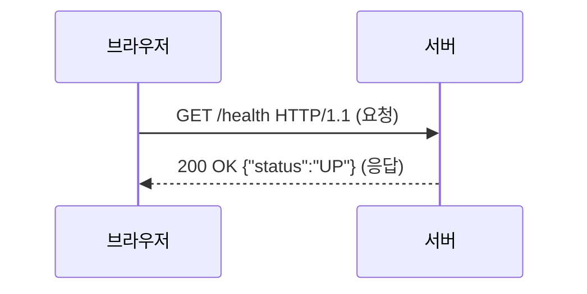
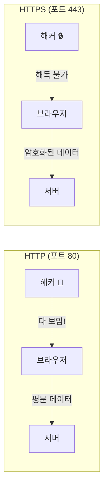
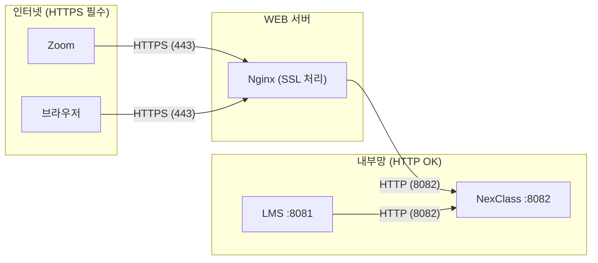

# 03. HTTP와 HTTPS - 왜 S 하나가 중요한가

!!! note "난이도: Beta"
    01장에서 IP/포트, 02장에서 DNS를 배웠어. 이제 **데이터가 어떻게 오가는지** 배울 차례야.
    그리고 왜 Zoom이 **HTTPS만** 허용하는지 이해할 거야.

---

## HTTP가 뭐냐

!!! abstract "HTTP의 본질"
    **HyperText Transfer Protocol** -- 브라우저와 서버가 데이터를 주고받는 **규칙(프로토콜)**.
    "나 이 페이지 줘" → "여기 있어" 이 대화를 어떤 형식으로 할지 정한 거야.

### HTTP 요청-응답 모델



- **요청(Request)**: 브라우저가 서버한테 "이거 줘" 또는 "이거 처리해"
- **응답(Response)**: 서버가 브라우저한테 "여기 있어" 또는 "에러야"
- **포트**: 80번 (기본)

### HTTP의 문제: 평문 전송

!!! danger "HTTP의 치명적 약점"
    HTTP는 데이터를 **암호화 없이 그대로** 보내. 이걸 **평문(plaintext) 전송**이라고 해.

```
# HTTP로 보내는 데이터 (중간에서 누가 보면)
POST /webhook/zoom
Content-Type: application/json

{
  "event": "meeting.ended",
  "payload": {
    "meeting_id": 12345,
    "participants": ["김철수", "이영희", "박민수"]
  }
}
# ↑ 회의 참가자 정보가 그대로 노출됨!
```

중간에 누가 네트워크를 감청하면? **다 보여.** 이름, 학번, 회의 정보, 전부 다.

---

## HTTPS가 뭐냐

!!! abstract "HTTPS의 본질"
    **HTTP + SSL/TLS** = HTTPS. HTTP에 **암호화 계층**을 추가한 거야.
    데이터가 암호화돼서 중간에 누가 봐도 **해독 불가능**.

| 구분 | HTTP | HTTPS |
|------|------|-------|
| **포트** | 80 | 443 |
| **암호화** | 없음 (평문) | SSL/TLS 암호화 |
| **URL** | `http://` | `https://` |
| **자물쇠** | 없음 | 브라우저 주소창에 자물쇠 아이콘 |
| **보안** | 중간자 공격 취약 | 암호화로 보호 |



---

## Zoom이 왜 HTTPS만 허용하나

!!! warning "이게 오늘 우리가 삽질한 근본 원인이야"

Zoom Webhook이 보내는 데이터:
```json
{
  "event": "meeting.ended",
  "payload": {
    "object": {
      "id": 12345678,
      "topic": "2025-1학기 컴퓨터공학개론",
      "start_time": "2026-03-13T09:00:00Z",
      "participants_count": 35
    }
  }
}
```

이 데이터에 **회의 정보, 참가자 수, 강의 주제**가 들어있어. HTTP로 보내면 중간에서 다 볼 수 있어.

!!! danger "그래서 Zoom은"
    - Webhook URL에 **HTTPS만 허용**
    - HTTP URL 등록하면 → **"URL validation failed"** 에러
    - `http://49.247.45.181:8082/webhook/zoom` → 등록 안 됨
    - `https://nexclass.knu10.cc/webhook/zoom` → 등록 됨

---

## HTTP → HTTPS 리다이렉트

실무에서는 HTTP(80)로 들어오면 자동으로 HTTPS(443)로 보내줘.

=== "Nginx 설정 (우리 프로젝트)"
    ```nginx
    # HTTP(80)로 들어오면 HTTPS(443)로 리다이렉트
    server {
        listen 80;                              # 80번 포트로 들어오는 요청
        server_name nexclass.knu10.cc;          # nexclass 도메인일 때
        return 301 https://$host$request_uri;   # HTTPS로 영구 리다이렉트
    }
    # $host = nexclass.knu10.cc (요청한 도메인)
    # $request_uri = /webhook/zoom (요청한 경로)
    # 301 = 영구 이동 (브라우저가 다음부터 바로 HTTPS로 감)
    ```

=== "리다이렉트 흐름"
    ```mermaid
    sequenceDiagram
        participant Browser as 브라우저
        participant Nginx as Nginx (WEB)

        Browser->>Nginx: http://nexclass.knu10.cc/health (포트 80)
        Nginx-->>Browser: 301 Redirect → https://nexclass.knu10.cc/health
        Browser->>Nginx: https://nexclass.knu10.cc/health (포트 443)
        Nginx-->>Browser: 200 OK (정상 응답)
    ```

!!! tip "301 vs 302"
    - **301** (Moved Permanently): "영구적으로 이사했어. 다음부터 HTTPS로 와"
    - **302** (Found): "임시로 이동이야. 다음에 다시 HTTP로 와도 돼"
    - HTTP→HTTPS 리다이렉트는 **301** 쓰는 게 맞아.

---

## 내부 통신 vs 외부 통신

!!! example "핵심 구분"

| 구간 | 프로토콜 | 이유 |
|------|----------|------|
| Zoom → NexClass | **HTTPS** | 인터넷 통과, 보안 필수 |
| 브라우저 → NexClass | **HTTPS** | 인터넷 통과, 보안 필수 |
| LMS 서버 → NexClass | **HTTP** | 같은 내부망, 암호화 불필요 |
| Nginx → NexClass JAR | **HTTP** | 같은 내부망 (10.7.1.x) |



!!! warning "왜 내부는 HTTP가 괜찮냐"
    내부망(10.7.1.x)은 **학교 네트워크 안**이야. 외부에서 접근 불가능해.
    암호화 오버헤드 없이 빠르게 통신하는 게 더 효율적이야.
    Nginx가 HTTPS 받아서 HTTP로 변환해주는 역할을 하는 거지.

---

## 정리

| 개념 | 한 줄 정리 |
|------|------------|
| **HTTP** | 암호화 없이 데이터 주고받는 프로토콜 (포트 80) |
| **HTTPS** | HTTP + SSL/TLS 암호화 (포트 443) |
| **평문 전송** | 데이터가 암호화 없이 그대로 전송 (중간자 공격 취약) |
| **301 리다이렉트** | HTTP → HTTPS 영구 이동 |
| **내부 통신** | 같은 네트워크면 HTTP OK (Nginx ↔ NexClass) |
| **외부 통신** | 인터넷 경유하면 HTTPS 필수 (Zoom → NexClass) |

---

### 확인 문제

!!! question "Q1. Zoom Marketplace에서 webhook URL로 `http://49.247.45.181:8082/webhook/zoom`을 등록하려 했더니 실패했어. 왜?"

!!! question "Q2. 우리 Nginx 설정에서 `return 301 https://$host$request_uri;`가 하는 일을 설명해봐."

!!! question "Q3. Nginx → NexClass JAR 구간은 HTTP(proxy_pass http://10.7.1.52:8082)인데, 이게 보안상 문제 없는 이유는?"

!!! question "Q4. HTTPS의 기본 포트가 443인데, 우리 NexClass는 8082에서 돌아가고 있어. 이 차이를 누가 해결해주고 있어?"

??? success "정답 보기"
    **A1.** 두 가지 이유야. (1) Zoom은 **HTTPS만 허용**해. HTTP URL은 등록 자체가 안 돼. webhook 데이터에 회의 정보, 참가자 정보가 포함되니까 암호화 필수. (2) IP 주소 직접 사용은 SSL 인증서 적용이 어려워. 도메인 기반으로 등록해야 해.

    **A2.** HTTP(80번 포트)로 들어온 요청을 **HTTPS(443)로 영구 리다이렉트**하는 거야. `$host`는 요청한 도메인(nexclass.knu10.cc), `$request_uri`는 경로(/webhook/zoom). 즉 `http://nexclass.knu10.cc/webhook/zoom` → `https://nexclass.knu10.cc/webhook/zoom`으로 보내줘. 301이니까 브라우저가 다음부터는 바로 HTTPS로 접속해.

    **A3.** Nginx와 NexClass JAR은 **같은 내부망(10.7.1.x)**에 있어. 외부에서 이 구간에 접근할 수 없으니까 중간자 공격이 불가능해. HTTPS의 암호화 오버헤드 없이 빠르게 통신하는 게 더 효율적이야. **SSL은 Nginx가 앞단에서 처리**하고, 내부로는 HTTP로 전달하는 패턴을 **SSL 종료(SSL Termination)**라고 해.

    **A4.** **Nginx(리버스 프록시)**가 해결해줘. 외부에서 443으로 들어온 HTTPS 요청을 Nginx가 받아서, SSL 처리 후 내부 8082 포트의 NexClass JAR로 HTTP로 전달해줘. 사용자는 443만 알면 되고, 실제 서비스 포트 8082는 외부에 노출되지 않아.
