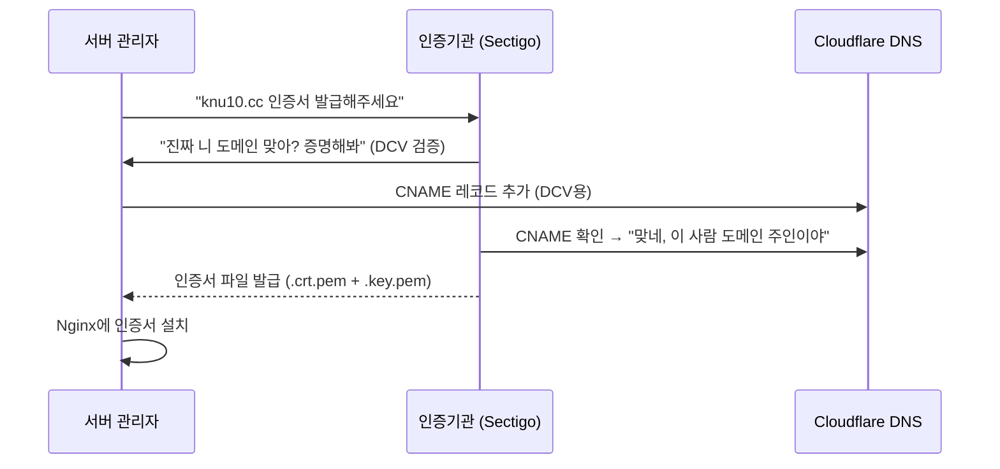
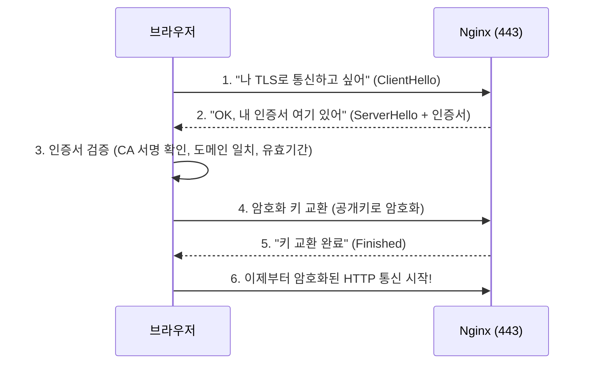

# 04. SSL 인증서 - HTTPS의 심장

!!! note "난이도: Beta"
    03장에서 HTTPS가 암호화된 HTTP라는 걸 배웠어.
    이번 장에서는 **어떻게 암호화하는지**, 그 핵심인 **SSL 인증서**를 파헤쳐.

---

## SSL/TLS가 뭐냐

!!! abstract "본질"
    - **SSL** (Secure Sockets Layer): 원래 이름. 지금은 사실상 안 씀 (보안 취약)
    - **TLS** (Transport Layer Security): SSL의 후속 버전. 실제로 쓰이는 건 이거
    - 근데 관습적으로 다들 "SSL"이라고 불러. "SSL 인증서"도 사실 TLS야.

### SSL/TLS가 하는 일 3가지

| 역할 | 설명 |
|------|------|
| **암호화** | 데이터를 암호화해서 중간에 못 읽게 |
| **인증** | "이 서버가 진짜 nexclass.knu10.cc 맞아" 증명 |
| **무결성** | 데이터가 중간에 변조되지 않았음을 보장 |

---

## SSL 인증서가 뭐냐

!!! abstract "SSL 인증서의 본질"
    **"이 도메인은 진짜야"를 증명하는 디지털 신분증.**
    인증기관(CA)이 발급해주고, 브라우저가 이걸 확인해서 신뢰 여부를 판단해.

### 인증서에 뭐가 들어있냐

| 항목 | 설명 | 우리 프로젝트 |
|------|------|--------------|
| 도메인 | 이 인증서가 커버하는 도메인 | `knu10.cc`, `*.knu10.cc` |
| 발급자 (CA) | 누가 발급했는지 | Sectigo |
| 유효기간 | 언제부터 언제까지 | 보통 1년 |
| 공개키 | 암호화에 쓰는 키 | 인증서에 포함 |

---

## 인증서 발급 과정



!!! tip "DCV가 뭐냐"
    **Domain Control Validation** -- "이 도메인 진짜 니 거 맞아?" 검증 과정.
    CA가 "이 CNAME 레코드 추가해봐" → 추가했으면 "OK 니 도메인 맞네" → 인증서 발급.

### 우리 Cloudflare DNS에 있던 수상한 CNAME들

02장에서 봤던 DNS 레코드 중에 이상한 게 있었어:

```
_2c0cde6a8fb8f5c13ff016852ba9050f  CNAME  94167fa5fbf...sectigo.com
_df291a2f87ce7f8f2b918a9fedb439c3  CNAME  5e4817fb5cc...sectigo.com
```

!!! example "이게 뭐였냐"
    **Sectigo(인증기관)의 DCV 검증용 CNAME 레코드**야.
    "이 CNAME을 DNS에 추가하면 도메인 소유 확인해줄게" → 추가함 → 인증서 발급 완료.
    인증서 발급 끝나도 남겨두는 경우가 많아 (갱신할 때 또 쓰니까).

---

## 인증서 파일 종류

| 파일 | 확장자 | 역할 |
|------|--------|------|
| **인증서** | `.crt.pem`, `.crt` | 공개키 + 도메인 정보 (공개) |
| **개인키** | `.key.pem`, `.key` | 복호화용 비밀키 (**절대 유출 금지**) |
| **체인 인증서** | `.ca-bundle`, `.chain.pem` | 중간 CA 인증서 (신뢰 체인) |

!!! danger "개인키 유출 = 게임 오버"
    `.key.pem` 파일이 유출되면 누구나 너인 척 HTTPS 서버를 만들 수 있어.
    서버에서 **root만 읽을 수 있게** 권한 설정 필수.

### 우리 프로젝트의 인증서 파일

```
/etc/nginx/sslcert/
├── knu10.cc_2025092558193.all.crt.pem   ← 인증서 (공개키 포함)
└── knu10.cc_2025092558193.key.pem       ← 개인키 (비밀!)
```

파일명의 `2025092558193`은 발급 일시/식별자야. `all.crt.pem`은 인증서 + 체인을 합친 파일이야.

---

## Nginx에서 SSL 설정

우리 nginx.conf의 SSL 부분을 한 줄씩 해부하자.

```nginx
server {
    listen 443 ssl;
    # ↑ 443번 포트에서 HTTPS(SSL) 모드로 듣겠다

    server_name nexclass.knu10.cc;
    # ↑ nexclass.knu10.cc 도메인으로 온 요청만 처리

    ssl_certificate /etc/nginx/sslcert/knu10.cc_2025092558193.all.crt.pem;
    # ↑ 인증서 파일 경로 (공개키 + 체인)

    ssl_certificate_key /etc/nginx/sslcert/knu10.cc_2025092558193.key.pem;
    # ↑ 개인키 파일 경로 (비밀!)

    ssl_protocols TLSv1.2 TLSv1.3;
    # ↑ 허용하는 TLS 버전. 1.0/1.1은 보안 취약해서 비활성화

    ssl_prefer_server_ciphers on;
    # ↑ 서버가 선호하는 암호화 방식을 우선 사용

    ssl_ciphers HIGH:!aNULL:!MD5;
    # ↑ 강력한 암호화만 허용, NULL 암호화/MD5 제외
}
```

---

## Let's Encrypt vs 상용 인증서

| 구분 | Let's Encrypt | 상용 (Sectigo 등) |
|------|---------------|-------------------|
| **가격** | 무료 | 유료 (연 수만~수십만원) |
| **유효기간** | 90일 (자동 갱신) | 1~2년 |
| **검증 수준** | DV (도메인만) | DV/OV/EV (조직 검증 가능) |
| **설치** | certbot 자동 | 수동 설치 |
| **우리 프로젝트** | - | Sectigo 사용 중 |

!!! tip "우리는 왜 Sectigo?"
    학교/기관 프로젝트는 보통 상용 인증서를 써. 조직 검증(OV)이 필요하거나,
    기관 정책상 상용 인증서만 허용하는 경우가 많아.
    개인 프로젝트면 Let's Encrypt로 충분해.

---

## TLS 핸드셰이크 (간략)

브라우저가 HTTPS로 연결할 때 일어나는 과정:



!!! note "이 과정이 매번?"
    최초 연결 시에만 전체 핸드셰이크. 이후에는 **세션 재사용**으로 빠르게 연결돼.
    그래서 HTTPS가 HTTP보다 약간 느리긴 하지만, 체감할 정도는 아니야.

---

## 정리

| 개념 | 한 줄 정리 |
|------|------------|
| **SSL/TLS** | 데이터 암호화 + 서버 인증 + 무결성 보장 프로토콜 |
| **SSL 인증서** | "이 도메인은 진짜야"를 증명하는 디지털 신분증 |
| **CA (인증기관)** | 인증서를 발급하는 신뢰할 수 있는 기관 (Sectigo, Let's Encrypt 등) |
| **DCV** | 도메인 소유 검증 (CNAME 추가로 증명) |
| **.crt.pem** | 인증서 파일 (공개) |
| **.key.pem** | 개인키 파일 (절대 유출 금지) |
| **TLS 핸드셰이크** | 브라우저-서버 간 암호화 연결 수립 과정 |

---

### 확인 문제

!!! question "Q1. 우리 Cloudflare DNS에 있던 sectigo.com 관련 CNAME 레코드의 용도가 뭐야?"

!!! question "Q2. ssl_protocols TLSv1.2 TLSv1.3에서 TLSv1.0과 TLSv1.1을 안 쓰는 이유는?"

!!! question "Q3. .key.pem 파일이 유출되면 어떤 일이 벌어져?"

!!! question "Q4. 우리 인증서 파일명이 knu10.cc_xxx.all.crt.pem인데, lms.knu10.cc와 nexclass.knu10.cc 둘 다 이 인증서 하나로 커버가 돼. 어떻게 가능해?"

??? success "정답 보기"
    **A1.** **Sectigo의 DCV(Domain Control Validation) 검증용**이야. SSL 인증서 발급할 때 "이 도메인 진짜 니 거 맞아?" 확인하는 과정에서, Sectigo가 "이 CNAME 추가해봐" → 추가하면 → "OK 도메인 주인 맞네" → 인증서 발급. 인증서 갱신할 때도 쓰일 수 있어서 남겨두는 거야.

    **A2.** **TLSv1.0과 1.1은 보안 취약점이 발견됐기 때문이야.** POODLE, BEAST 같은 공격에 노출돼. 2020년부터 주요 브라우저들이 TLS 1.0/1.1 지원을 중단했어. 1.2가 현재 최소 기준이고, 1.3이 최신이자 가장 안전하고 빨라.

    **A3.** **누구나 nexclass.knu10.cc인 척 HTTPS 서버를 만들 수 있어.** 중간자 공격(MITM)이 가능해져서, 사용자의 데이터를 가로채거나 변조할 수 있어. 인증서 폐기(revoke)하고 새로 발급받아야 해. 그래서 `.key.pem` 파일은 root 권한으로만 읽을 수 있게 설정하는 거야.

    **A4.** **와일드카드 인증서 또는 SAN(Subject Alternative Name) 인증서**이기 때문이야. `*.knu10.cc`로 발급받으면 모든 서브도메인(lms, hub, nexclass 등)을 하나의 인증서로 커버해. 파일명에 `knu10.cc`만 있지 `nexclass.knu10.cc`가 없는 이유가 이거야. 인증서 하나로 여러 서브도메인을 처리하는 거지.
