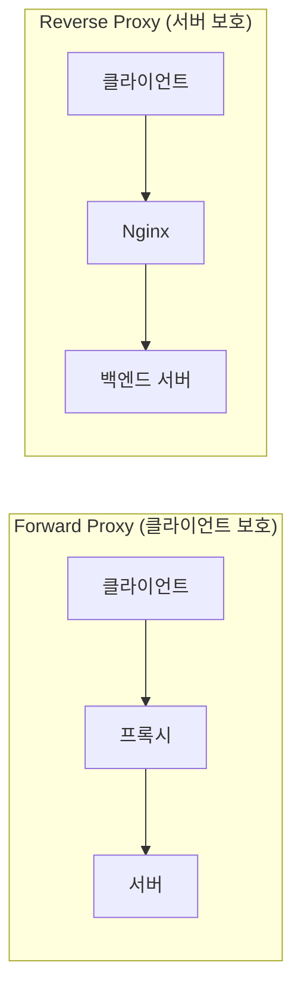
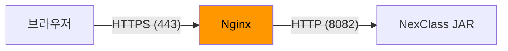
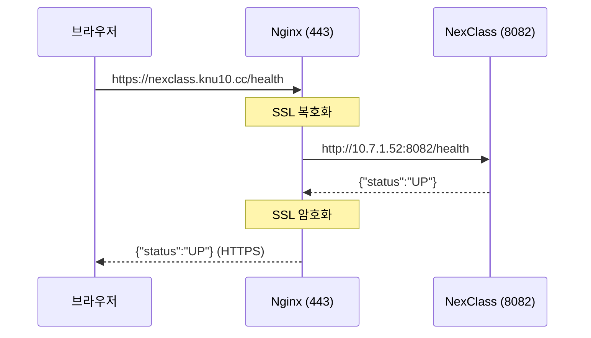
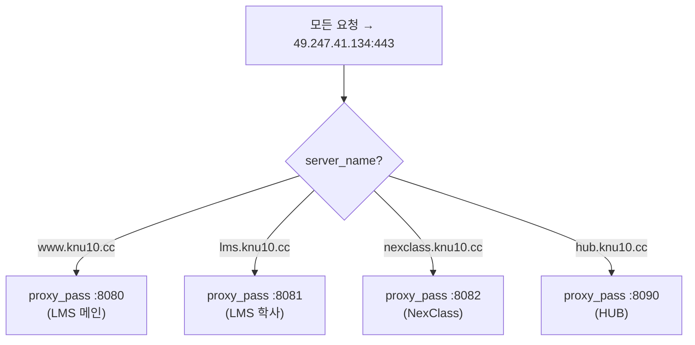
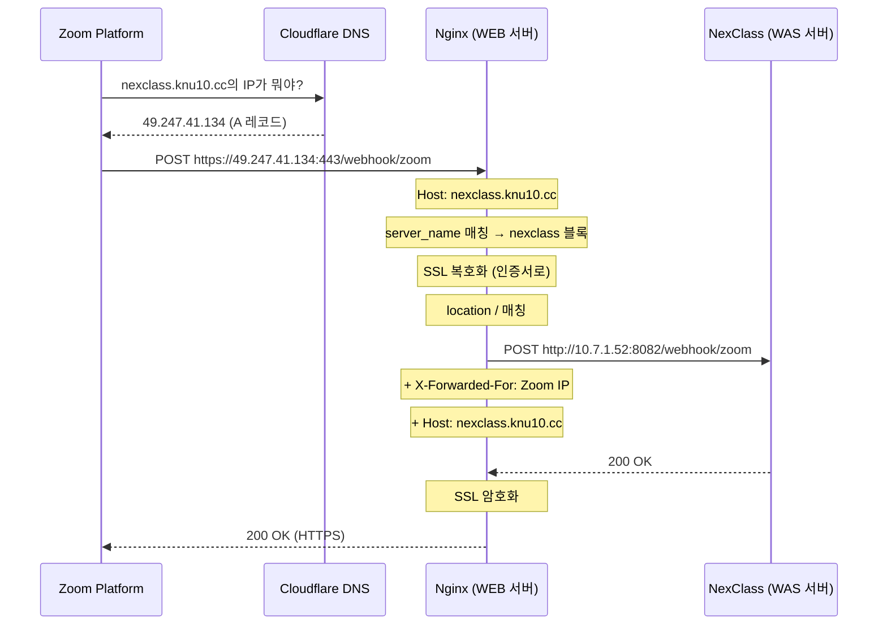

# 05. Nginx 리버스 프록시 - 트래픽의 교통 정리

!!! note "난이도: Gamma"
    01~04에서 IP, DNS, HTTP/HTTPS, SSL을 배웠어.
    이제 이 모든 걸 **실제로 연결해주는 핵심 장치** -- **Nginx**를 파헤칠 거야.

---

## Nginx가 뭐냐

!!! abstract "본질"
    **고성능 웹 서버 + 리버스 프록시 + 로드 밸런서.**
    근데 우리한테 중요한 건 **리버스 프록시** 역할이야.

### 웹 서버로서의 Nginx

| 기능 | 설명 |
|------|------|
| **정적 파일 서빙** | HTML, CSS, JS, 이미지를 직접 제공 |
| **리버스 프록시** | 클라이언트 요청을 백엔드 서버로 전달 |
| **SSL 종료** | HTTPS 암호화/복호화 처리 |
| **로드 밸런싱** | 여러 백엔드 서버에 요청 분배 |

!!! tip "우리 프로젝트에서는"
    Nginx는 **리버스 프록시 + SSL 종료** 역할만 해.
    정적 파일 서빙은 Spring Boot가 알아서 하니까.

---

## 리버스 프록시가 뭐냐

!!! abstract "리버스 프록시의 본질"
    **클라이언트와 백엔드 서버 사이에 서서, 대신 요청을 받아주고 전달해주는 중간자.**
    클라이언트는 Nginx만 보이고, 뒤에 뭐가 있는지 모름.

### 프록시 vs 리버스 프록시

| 구분 | 프록시 (Forward) | 리버스 프록시 (Reverse) |
|------|-------------------|-------------------------|
| **위치** | 클라이언트 쪽 | 서버 쪽 |
| **보호 대상** | 클라이언트를 숨김 | 서버를 숨김 |
| **예시** | 회사 프록시 서버 | Nginx, Apache |
| **용도** | 접근 제어, 캐싱 | 로드 밸런싱, SSL 종료 |



!!! danger "핵심 차이"
    - **프록시**: "내가 누군지 숨겨줘" (클라이언트 → 프록시 → 서버)
    - **리버스 프록시**: "뒤에 뭐가 있는지 숨겨줘" (클라이언트 → Nginx → 백엔드)
    - 우리한테 중요한 건 **리버스 프록시**야.

---

## SSL 종료 (SSL Termination)

!!! abstract "SSL 종료의 본질"
    **Nginx가 HTTPS를 받아서 복호화하고, 백엔드에는 HTTP로 전달하는 패턴.**
    SSL 처리를 Nginx 한 곳에서만 하니까, 백엔드는 SSL 신경 안 써도 됨.



| 구간 | 프로토콜 | 암호화 |
|------|----------|--------|
| 브라우저 → Nginx | HTTPS (443) | 암호화됨 |
| Nginx → NexClass | HTTP (8082) | 평문 (내부망이라 OK) |

!!! tip "왜 이게 좋냐"
    1. **관리 편의**: SSL 인증서를 Nginx 한 곳에서만 관리
    2. **성능**: 백엔드가 암호화/복호화 안 해도 됨
    3. **유연성**: 백엔드 서버 추가/교체 쉬움

---

## 우리 nginx.conf 완전 해부

이게 우리 WEB 서버의 실제 Nginx 설정이야. **한 줄도 빠짐없이** 해부한다.

### 전체 구조

```nginx
# ═══════════════════════════════════════════
# Nginx 설정 파일 전체 구조
# ═══════════════════════════════════════════

events {
    worker_connections 1024;
    # ↑ 동시 접속 수. 1024개의 연결을 동시에 처리 가능
}

http {
    # ── 글로벌 설정 ──
    include mime.types;
    default_type application/octet-stream;
    sendfile on;
    keepalive_timeout 65;

    # ── server 블록 1: lms.knu10.cc (HTTP → HTTPS 리다이렉트) ──
    # ── server 블록 2: lms.knu10.cc (HTTPS → LMS 학사 8081) ──
    # ── server 블록 3: www.knu10.cc (HTTP → HTTPS 리다이렉트) ──
    # ── server 블록 4: www.knu10.cc (HTTPS → LMS 메인 8080) ──
    # ── server 블록 5: hub.knu10.cc (HTTP → HTTPS 리다이렉트) ──
    # ── server 블록 6: hub.knu10.cc (HTTPS → HUB 8090) ──
    # ── server 블록 7: nexclass.knu10.cc (HTTP → HTTPS 리다이렉트) ── ← 오늘 추가!
    # ── server 블록 8: nexclass.knu10.cc (HTTPS → NexClass 8082) ── ← 오늘 추가!
}
```

### server 블록 패턴

모든 도메인이 **같은 패턴** 2개씩 쌍으로 돼있어:

=== "블록 1: HTTP 리다이렉트 (포트 80)"
    ```nginx
    server {
        listen 80;
        # ↑ 80번 포트 (HTTP)로 들어오는 요청을 받겠다

        server_name nexclass.knu10.cc;
        # ↑ nexclass.knu10.cc 도메인으로 온 요청만 처리

        return 301 https://$host$request_uri;
        # ↑ HTTPS로 영구 리다이렉트
        # $host = nexclass.knu10.cc
        # $request_uri = /webhook/zoom (경로 그대로 유지)
    }
    ```

=== "블록 2: HTTPS 처리 (포트 443)"
    ```nginx
    server {
        listen 443 ssl;
        # ↑ 443번 포트에서 SSL(HTTPS) 모드로 듣겠다

        server_name nexclass.knu10.cc;
        # ↑ nexclass.knu10.cc 도메인만 처리

        # ── SSL 인증서 설정 (04장 참고) ──
        ssl_certificate /etc/nginx/sslcert/knu10.cc_2025092558193.all.crt.pem;
        ssl_certificate_key /etc/nginx/sslcert/knu10.cc_2025092558193.key.pem;
        ssl_protocols TLSv1.2 TLSv1.3;
        ssl_prefer_server_ciphers on;
        ssl_ciphers HIGH:!aNULL:!MD5;

        # ── 리버스 프록시 설정 ──
        location / {
            proxy_pass http://10.7.1.52:8082;
            # ↑ 핵심! 이 요청을 WAS 서버의 8082 포트로 전달

            proxy_set_header X-Forwarded-For $proxy_add_x_forwarded_for;
            # ↑ 원래 클라이언트 IP를 백엔드에 전달

            proxy_set_header HOST $http_host;
            # ↑ 원래 요청 도메인을 백엔드에 전달

            proxy_set_header X-NginX-Proxy true;
            # ↑ "이 요청은 Nginx를 거쳐서 온 거야" 표시

            proxy_connect_timeout 1800;
            proxy_read_timeout 1800;
            proxy_send_timeout 1800;
            # ↑ 타임아웃 1800초 (30분). 화상강의처럼 긴 연결 대비
        }
    }
    ```

---

### proxy_pass - 리버스 프록시의 핵심

```nginx
proxy_pass http://10.7.1.52:8082;
```

이 한 줄이 하는 일:



| URL 부분 | 설명 |
|----------|------|
| `http://` | 내부 통신은 HTTP (내부망이니까) |
| `10.7.1.52` | WAS 서버의 **내부 IP** |
| `:8082` | NexClass가 LISTEN하고 있는 포트 |

---

### server_name - 도메인 라우팅

!!! abstract "server_name의 본질"
    **같은 IP로 들어온 요청을, 도메인 이름으로 구분해서 다른 백엔드로 보내는 것.**

우리 WEB 서버 (49.247.41.134)에는 요청이 4가지 도메인으로 들어와:



| 도메인 | server_name | proxy_pass | 백엔드 |
|--------|-------------|------------|--------|
| www.knu10.cc | www.knu10.cc | http://10.7.1.52:8080 | LMS 메인 |
| lms.knu10.cc | lms.knu10.cc | http://10.7.1.52:8081 | LMS 학사 |
| nexclass.knu10.cc | nexclass.knu10.cc | http://10.7.1.52:8082 | NexClass |
| hub.knu10.cc | hub.knu10.cc | http://10.7.1.52:8090 | HUB |

!!! warning "IP는 같은데 어떻게?"
    4개 도메인 전부 DNS에서 `49.247.41.134`로 연결돼.
    **같은 IP인데 도메인이 다르면** Nginx가 `server_name`으로 구분해서 다른 포트로 보내줘.
    이게 **가상 호스팅(Virtual Hosting)**이야.

---

### proxy_set_header - 헤더 전달

```nginx
proxy_set_header X-Forwarded-For $proxy_add_x_forwarded_for;
proxy_set_header HOST $http_host;
proxy_set_header X-NginX-Proxy true;
```

| 헤더 | 값 | 왜 필요해? |
|------|-----|-----------|
| `X-Forwarded-For` | 원래 클라이언트 IP | Nginx 거치면 백엔드는 Nginx IP만 보여. 진짜 클라이언트 IP 알아야 하잖아 |
| `HOST` | nexclass.knu10.cc | 백엔드가 어떤 도메인으로 요청 왔는지 알아야 함 |
| `X-NginX-Proxy` | true | "이 요청은 프록시 거쳐서 온 거야" 표시 |

!!! danger "X-Forwarded-For 없으면?"
    NexClass 로그에 클라이언트 IP가 전부 `10.7.1.139` (Nginx 서버)로 찍혀.
    "누가 접속했지?"를 추적 못 해. 보안 로깅에 치명적이야.

---

### timeout 설정

```nginx
proxy_connect_timeout 1800;
proxy_read_timeout 1800;
proxy_send_timeout 1800;
```

| 설정 | 기본값 | 우리 설정 | 의미 |
|------|--------|-----------|------|
| `proxy_connect_timeout` | 60s | 1800s (30분) | 백엔드 연결 대기 |
| `proxy_read_timeout` | 60s | 1800s (30분) | 백엔드 응답 대기 |
| `proxy_send_timeout` | 60s | 1800s (30분) | 백엔드에 데이터 전송 대기 |

!!! tip "왜 30분이나?"
    화상강의(Zoom) 관련 시스템이라 **긴 연결이 필요할 수 있어**.
    Webhook 응답이 오래 걸리거나, 대용량 데이터 처리 시 타임아웃 방지.

---

## location 블록 심화

### location 매칭 규칙

```nginx
# 정확 매칭 (최우선)
location = /health {
    # /health만 매칭
}

# 접두사 매칭 (우선)
location ^~ /api/ {
    # /api/로 시작하는 모든 경로
}

# 정규식 매칭
location ~ \.php$ {
    # .php로 끝나는 경로
}

# 일반 접두사 매칭
location / {
    # 위에서 안 걸린 나머지 전부 (기본값)
}
```

| 기호 | 의미 | 우선순위 |
|------|------|:--------:|
| `=` | 정확 매칭 | 1 (최고) |
| `^~` | 접두사 매칭 (정규식 안 봄) | 2 |
| `~` | 정규식 매칭 (대소문자 구분) | 3 |
| `~*` | 정규식 매칭 (대소문자 무시) | 4 |
| (없음) | 일반 접두사 매칭 | 5 (최저) |

!!! note "우리 설정은?"
    `location /` -- 가장 단순한 "나머지 전부" 매칭이야.
    NexClass는 API 서버라서 모든 경로를 Spring Boot로 넘기면 돼.

---

## Nginx 핵심 명령어

### 설정 관리

| 명령어 | 설명 |
|--------|------|
| `sudo nginx -t` | 설정 파일 문법 검사 (**수정 후 반드시!**) |
| `sudo nginx -s reload` | 설정 다시 불러오기 (무중단) |
| `sudo nginx -s stop` | Nginx 중지 |
| `sudo systemctl start nginx` | Nginx 시작 |
| `sudo systemctl status nginx` | Nginx 상태 확인 |

!!! danger "nginx -t 안 하고 reload 하면?"
    설정에 오타 있으면 Nginx가 **죽을 수 있어**.
    그러면 LMS, HUB, NexClass **전부** 접속 불가.
    **반드시 -t로 문법 검사 먼저!**

```bash
# 올바른 순서
sudo nginx -t              # 1. 문법 검사
# nginx: configuration file /etc/nginx/nginx.conf test is successful
sudo nginx -s reload       # 2. 검사 통과 후 리로드
```

### 로그 확인

```bash
# 접속 로그 (누가 어디로 요청했는지)
tail -f /var/log/nginx/access.log

# 에러 로그 (뭐가 잘못됐는지)
tail -f /var/log/nginx/error.log
```

---

## 전체 요청 흐름 (처음부터 끝까지)

`https://nexclass.knu10.cc/webhook/zoom`으로 Zoom이 Webhook을 보낼 때:



---

## 정리

| 개념 | 한 줄 정리 |
|------|------------|
| **Nginx** | 고성능 웹 서버 + 리버스 프록시 |
| **리버스 프록시** | 클라이언트 대신 백엔드로 요청 전달 (서버 보호) |
| **SSL 종료** | Nginx가 HTTPS 받아서 HTTP로 변환해 백엔드에 전달 |
| **server_name** | 같은 IP에 여러 도메인을 구분하는 키 |
| **proxy_pass** | 요청을 어디로 전달할지 지정 |
| **location** | URL 경로별 처리 규칙 |
| **nginx -t** | 설정 문법 검사 (reload 전 필수!) |

---

### 확인 문제

!!! question "Q1. 리버스 프록시와 포워드 프록시의 핵심 차이는?"

!!! question "Q2. 우리 WEB 서버에서 nexclass.knu10.cc와 www.knu10.cc가 같은 IP인데 어떻게 다른 백엔드로 보내져?"

!!! question "Q3. proxy_set_header X-Forwarded-For가 없으면 NexClass 로그에 어떤 문제가 생겨?"

!!! question "Q4. nginx -t를 안 하고 nginx -s reload를 했는데 설정에 오타가 있었어. 어떤 일이 벌어져?"

!!! question "Q5. SSL 종료(SSL Termination)가 뭐고, 왜 이렇게 하는 거야?"

??? success "정답 보기"
    **A1.** **포워드 프록시는 클라이언트를 숨기고, 리버스 프록시는 서버를 숨겨.** 포워드 프록시는 클라이언트 앞에서 "내가 누군지 숨겨줘" 역할이고, 리버스 프록시는 서버 앞에서 "뒤에 뭐가 있는지 숨겨줘" 역할이야. 우리 Nginx는 리버스 프록시로, 클라이언트는 NexClass가 8082에서 돌아가는지 모르고 443만 보여.

    **A2.** **Nginx의 server_name 디렉티브로 구분해.** 4개 도메인(www, lms, nexclass, hub)이 전부 같은 IP(49.247.41.134)로 DNS 연결돼 있지만, HTTP 요청에는 `Host` 헤더에 도메인이 들어있어. Nginx가 이 Host 헤더를 보고 server_name이 매칭되는 server 블록으로 보내줘. 이걸 **가상 호스팅(Virtual Hosting)**이라고 해.

    **A3.** **모든 클라이언트 IP가 Nginx 서버 IP(10.7.1.139)로 찍혀.** Nginx가 중간에서 요청을 대신 보내니까, NexClass 입장에서는 "요청을 보낸 놈 = Nginx"로 보여. X-Forwarded-For 헤더가 있어야 진짜 클라이언트 IP를 알 수 있어. 보안 로깅, 접속자 추적에 치명적인 문제야.

    **A4.** **Nginx가 죽을 수 있어.** 설정 파일에 문법 오류가 있으면 reload 시 Nginx 프로세스가 새 설정을 로드 못 해. 최악의 경우 Nginx가 멈추면 **LMS, HUB, NexClass 전부** 외부 접속 불가. 그래서 **반드시 nginx -t로 문법 검사 후 reload** 하는 거야.

    **A5.** **SSL 종료는 Nginx가 HTTPS를 받아서 복호화하고, 백엔드에는 HTTP로 전달하는 패턴**이야. 이렇게 하는 이유: (1) SSL 인증서를 Nginx 한 곳에서만 관리 → 관리 편의, (2) 백엔드가 암호화/복호화 안 해도 됨 → 성능, (3) 백엔드 서버 추가/교체가 쉬움 → 유연성. 내부망(10.7.1.x)은 외부에서 접근 불가하니 HTTP여도 안전해.
