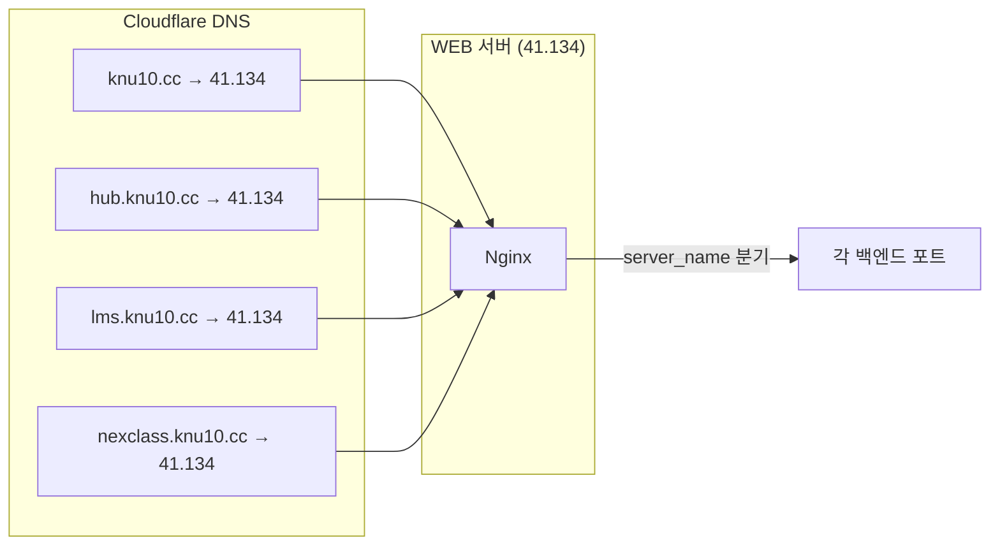
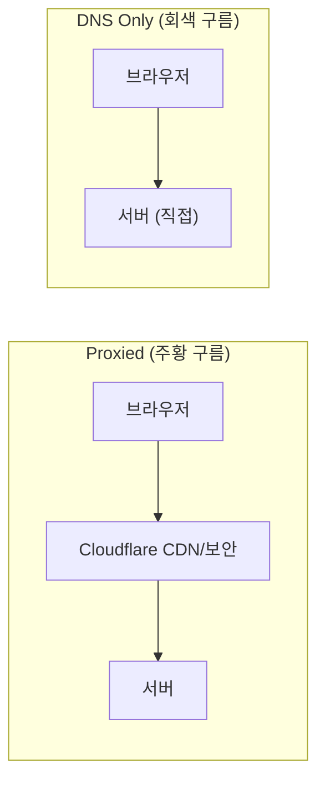
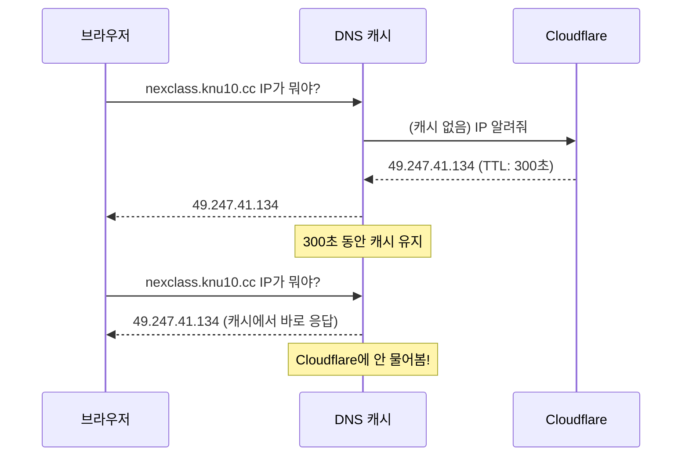

# 06. Cloudflare - DNS 관리의 실전

!!! note "난이도: Gamma"
    02장에서 DNS 이론을 배웠어. 이번에는 **실제로 DNS를 관리하는 곳** -- Cloudflare를 파헤쳐.
    오늘 nexclass.knu10.cc A 레코드를 직접 추가한 그 화면이야.

---

## Cloudflare가 뭐냐

!!! abstract "본질"
    **DNS 관리 + CDN + 보안(DDoS 방어) + SSL을 제공하는 클라우드 서비스.**
    우리는 이 중에서 **DNS 관리** 기능만 쓰고 있어.

### Cloudflare의 역할들

| 기능 | 설명 | 우리가 쓰는지 |
|------|------|:-------------:|
| **DNS 관리** | 도메인의 DNS 레코드 관리 | O (핵심) |
| **CDN** | 전 세계에 콘텐츠 캐싱 | X |
| **DDoS 방어** | 대규모 공격 차단 | X |
| **SSL 관리** | Cloudflare 자체 SSL | X (자체 Sectigo 인증서 사용) |
| **WAF** | 웹 방화벽 | X |

!!! tip "왜 Cloudflare?"
    - **무료 플랜**으로도 DNS 관리 충분
    - 웹 UI로 DNS 레코드 편하게 관리
    - 전 세계 DNS 서버로 빠른 응답
    - 우리 같은 소규모 프로젝트는 무료로 충분해

---

## knu10.cc DNS 레코드 전체 분석

02장에서 살짝 봤는데, 이번에 **전부** 파헤치자.

### A 레코드 (도메인 → IP)

| Name | Type | Content | Proxy | TTL |
|------|------|---------|:-----:|-----|
| `knu10.cc` | A | 49.247.41.134 | DNS only | Auto |
| `hub` | A | 49.247.41.134 | DNS only | Auto |
| `lms` | A | 49.247.41.134 | DNS only | Auto |
| `nexclass` | A | 49.247.41.134 | DNS only | Auto |

!!! warning "전부 같은 IP야!"
    4개 도메인이 전부 `49.247.41.134` (WEB 서버)를 가리켜.
    **같은 IP인데 어떻게 구분?** → 05장에서 배운 Nginx `server_name`!



### CNAME 레코드

| Name | Type | Content | 설명 |
|------|------|---------|------|
| `www` | CNAME | `knu10.cc` | www.knu10.cc → knu10.cc → 49.247.41.134 |
| `_2c0cde6a...` | CNAME | `94167...sectigo.com` | DCV 검증용 (04장) |
| `_df291a2f...` | CNAME | `5e481...sectigo.com` | DCV 검증용 (04장) |

!!! example "www CNAME의 의미"
    `www.knu10.cc` → CNAME → `knu10.cc` → A 레코드 → `49.247.41.134`
    **2단계 변환이야.** CNAME은 "이 도메인을 저 도메인으로 연결해줘"라는 별명이니까.

---

## Proxied vs DNS Only

!!! danger "이거 잘못 설정하면 대참사야"

Cloudflare에서 DNS 레코드 추가할 때, **Proxy status**를 선택해야 해:

| 모드 | 아이콘 | 트래픽 흐름 | SSL |
|------|:------:|-------------|-----|
| **Proxied** (프록시) | 주황색 구름 | 브라우저 → Cloudflare → 서버 | Cloudflare SSL 사용 |
| **DNS Only** | 회색 구름 | 브라우저 → 서버 (직접) | 자체 SSL 사용 |



### 우리는 왜 DNS Only?

!!! warning "핵심"
    우리는 **자체 Sectigo SSL 인증서**를 Nginx에 설치해서 쓰고 있어.
    Proxied 모드로 하면 Cloudflare가 SSL을 처리하려 하니까 **충돌**이 일어날 수 있어.

| 상황 | Proxied | DNS Only |
|------|---------|----------|
| SSL 인증서 | Cloudflare 제공 | **자체 관리 (Sectigo)** |
| 서버 IP 노출 | 숨겨짐 | 노출됨 |
| CDN/캐싱 | 사용 가능 | 사용 불가 |
| DDoS 방어 | 기본 제공 | 직접 해야 함 |

!!! tip "DNS Only의 단점"
    서버 IP(`49.247.41.134`)가 `nslookup`이나 `dig`으로 **그대로 노출**돼.
    근데 우리는 학교 내부 프로젝트라 DDoS 걱정할 수준이 아니니까 괜찮아.

---

## TTL (Time To Live)

### TTL이 뭐냐

!!! abstract "본질"
    **DNS 레코드가 캐시에 얼마나 오래 저장되는지를 정하는 시간(초).**
    TTL이 300이면 "5분 동안은 다시 안 물어봐도 돼"라는 뜻.

### TTL이 왜 중요해?



| TTL | 의미 | 장점 | 단점 |
|-----|------|------|------|
| **짧은 TTL** (60~300초) | 자주 업데이트 | IP 변경 시 빠르게 반영 | DNS 서버 부하 증가 |
| **긴 TTL** (3600초~) | 오래 캐싱 | DNS 응답 빠름 | IP 변경 시 전파 느림 |
| **Auto** | Cloudflare가 자동 결정 | 신경 안 써도 됨 | 정밀 제어 불가 |

!!! danger "실전 삽질 시나리오"
    DNS 레코드를 잘못된 IP로 설정했다가 고쳤어. 근데 TTL이 3600(1시간)이면?
    **최대 1시간 동안** 옛날 IP로 접속돼. 이래서 TTL 이해가 중요해.

---

## 실전: nexclass A 레코드 추가 과정

오늘 실제로 한 작업을 복기하자.

### Step 1: Cloudflare 로그인 → knu10.cc 선택

```
Cloudflare Dashboard → knu10.cc → DNS → Records
```

### Step 2: A 레코드 추가

| 필드 | 입력값 | 설명 |
|------|--------|------|
| Type | A | 도메인 → IP 매핑 |
| Name | nexclass | nexclass.knu10.cc가 됨 |
| IPv4 address | 49.247.41.134 | **WEB 서버** IP (WAS 아님!) |
| Proxy status | DNS only | 자체 SSL 사용하니까 |
| TTL | Auto | 기본값 |

### Step 3: 확인

```bash
nslookup nexclass.knu10.cc
# → 49.247.41.134 나오면 성공
```

!!! danger "오늘의 삽질: 잘못된 IP"
    처음에 **WAS 서버 IP(49.247.45.181)**로 넣을 뻔했어.
    WAS에는 Nginx가 없으니까 HTTPS가 안 돼!
    **WEB 서버 IP(49.247.41.134)**로 넣어야 Nginx가 SSL 처리해줘.

---

## Origin Rules (심화)

!!! note "우리 프로젝트에서는 안 쓰지만 알아두면 좋은 것"

Cloudflare의 Origin Rules는 **Proxied 모드**에서 쓰는 기능이야:

| 기능 | 설명 |
|------|------|
| **Host Header Override** | 오리진 서버로 보내는 Host 헤더 변경 |
| **Destination Port Override** | 오리진 서버의 포트 변경 |
| **DNS Record Override** | 요청을 다른 IP로 보내기 |

!!! tip "언제 쓰냐?"
    Proxied 모드에서 Cloudflare → 서버 사이의 요청을 세밀하게 제어할 때.
    우리는 DNS Only라서 Origin Rules가 의미 없어. Nginx가 다 해주니까.

---

## 정리

| 개념 | 한 줄 정리 |
|------|------------|
| **Cloudflare** | DNS 관리 + CDN + 보안 서비스 (우리는 DNS만 사용) |
| **A 레코드** | 도메인 → IP 직접 매핑 |
| **CNAME** | 도메인 → 도메인 별명 |
| **Proxied** | Cloudflare가 중간에서 처리 (CDN, SSL, DDoS 방어) |
| **DNS Only** | DNS만 제공, 직접 연결 (자체 SSL 사용 시) |
| **TTL** | DNS 캐시 유효 시간 (짧으면 빠른 반영, 길면 부하 감소) |
| **DCV CNAME** | SSL 인증서 발급용 도메인 소유 검증 레코드 |

---

### 확인 문제

!!! question "Q1. 우리 knu10.cc의 4개 A 레코드가 전부 같은 IP(49.247.41.134)를 가리키는데, 이게 가능한 이유는?"

!!! question "Q2. nexclass A 레코드를 추가할 때 Proxied가 아닌 DNS Only로 설정한 이유는?"

!!! question "Q3. TTL이 3600초인 상태에서 A 레코드의 IP를 잘못 입력했다가 바로 고쳤어. 최악의 경우 잘못된 IP로 접속되는 시간은?"

!!! question "Q4. www.knu10.cc가 A 레코드가 아닌 CNAME인 이유와, 접속 시 실제 IP 변환 과정을 설명해봐."

??? success "정답 보기"
    **A1.** **Nginx의 server_name(가상 호스팅) 때문에 가능해.** DNS에서 4개 도메인 전부 같은 WEB 서버 IP로 보내도, HTTP 요청의 `Host` 헤더에 도메인 이름이 들어있어. Nginx가 이 Host 헤더를 보고 server_name이 매칭되는 server 블록으로 분기해서, 각각 다른 백엔드 포트(8080/8081/8082/8090)로 보내줘.

    **A2.** **우리가 자체 Sectigo SSL 인증서를 Nginx에 직접 설치해서 쓰고 있기 때문이야.** Proxied 모드로 하면 Cloudflare가 중간에서 SSL을 처리하려 해서, 우리 자체 인증서와 충돌할 수 있어. DNS Only는 단순히 "이 도메인 = 이 IP" 변환만 해주고, SSL은 우리 Nginx가 직접 처리해.

    **A3.** **최대 1시간(3600초).** TTL 동안 전 세계 DNS 서버들이 잘못된 IP를 캐시에 보관해. TTL이 만료되기 전까지는 새 IP를 확인하러 Cloudflare에 다시 물어보지 않아. 그래서 긴급 변경이 필요한 환경에서는 TTL을 짧게 설정하는 거야.

    **A4.** `www.knu10.cc`는 CNAME으로 `knu10.cc`를 가리켜. 변환 과정: (1) `www.knu10.cc` → CNAME → `knu10.cc`, (2) `knu10.cc` → A 레코드 → `49.247.41.134`. 2단계 변환이야. CNAME을 쓰는 이유는 **관리 편의성** -- `knu10.cc`의 IP가 바뀌면 A 레코드 하나만 수정하면 www도 자동으로 따라가. A 레코드로 직접 연결하면 IP 바꿀 때 둘 다 수정해야 해.
