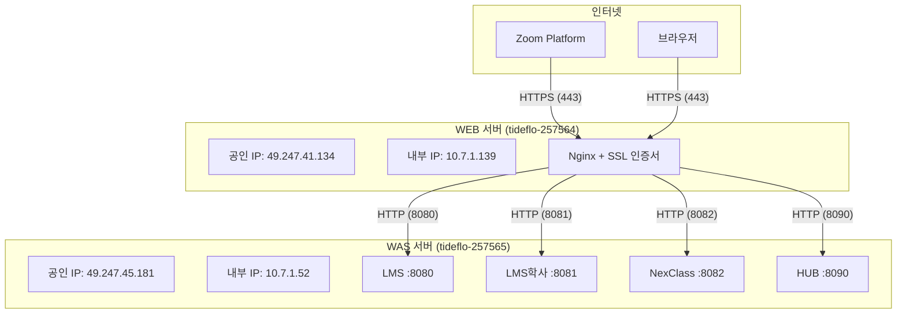
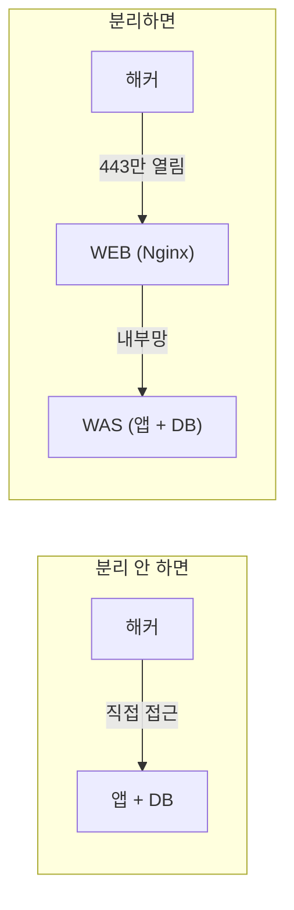
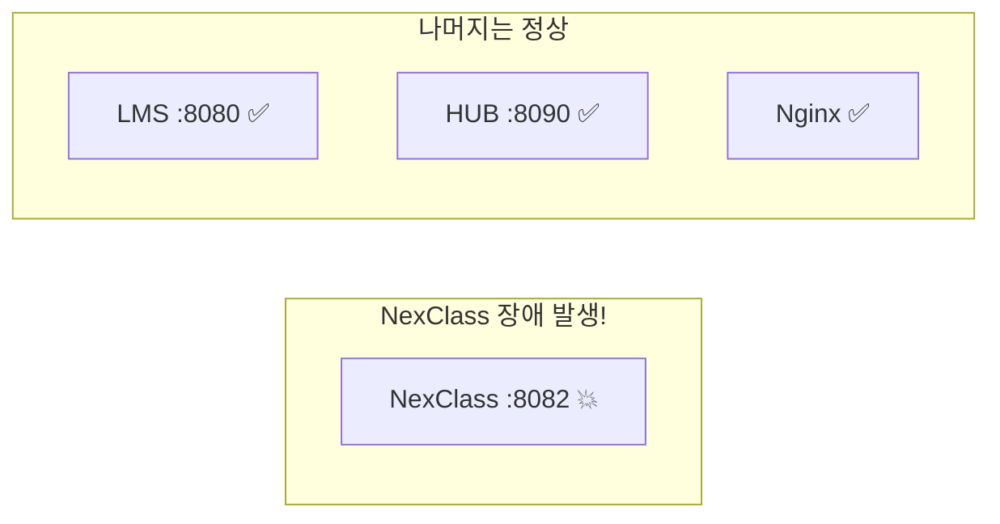
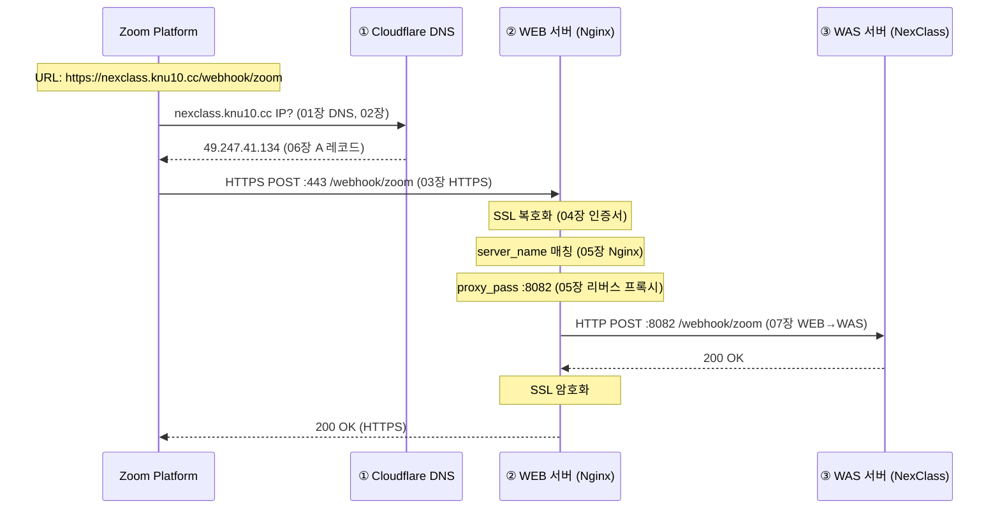

# 07. WEB/WAS 아키텍처 - 왜 서버가 2대야?

!!! note "난이도: Delta"
    지금까지 배운 게 전부 합쳐지는 장이야.
    "왜 WEB 서버와 WAS 서버를 분리하는지" -- 이 질문에 완벽하게 대답할 수 있어야 해.

---

## WEB 서버 vs WAS 서버

!!! abstract "본질"
    - **WEB 서버**: 클라이언트의 요청을 받아서 **정적 콘텐츠를 제공하거나, 요청을 뒤로 전달**하는 서버
    - **WAS 서버**: 실제 **비즈니스 로직을 실행**하는 서버 (애플리케이션 서버)

### 역할 비교

| 구분 | WEB 서버 | WAS 서버 |
|------|----------|----------|
| **하는 일** | SSL 처리, 리버스 프록시, 정적 파일 | 비즈니스 로직, DB 연동 |
| **소프트웨어** | Nginx, Apache | Tomcat, Spring Boot, Node.js |
| **처리하는 것** | HTTP 요청 라우팅 | API 처리, 데이터 연산 |
| **CPU 사용** | 낮음 (전달만) | 높음 (연산 수행) |
| **메모리 사용** | 낮음 | 높음 (JVM, DB 커넥션) |

---

## 우리 프로젝트 아키텍처

### 서버 구성



### 서버별 스펙

| 항목 | WEB 서버 | WAS 서버 |
|------|----------|----------|
| **호스트명** | tideflo-257564 | tideflo-257565 |
| **공인 IP** | 49.247.41.134 | 49.247.45.181 |
| **내부 IP** | 10.7.1.139 | 10.7.1.52 |
| **역할** | Nginx (리버스 프록시 + SSL) | Java 앱 4개 실행 |
| **소프트웨어** | Nginx | Java (LMS, NexClass, HUB) |
| **SSL 인증서** | /etc/nginx/sslcert/*.pem | 없음 |
| **외부 접근** | O (443) | X (방화벽 차단) |

---

## 왜 분리하냐 (핵심)

!!! danger "이 질문에 대답 못 하면 빠싺 불합격"

### 이유 1: 보안



| 분리 안 하면 | 분리하면 |
|-------------|---------|
| WAS가 인터넷에 직접 노출 | WEB만 인터넷에 노출 |
| 8082 포트가 외부에서 접근 가능 | 8082는 내부망에서만 접근 가능 |
| DB 포트(3306)도 위험 | DB는 내부망에서만 접근 |

!!! warning "실전 예시"
    WAS의 8082 포트가 외부에 열려있으면?
    `http://49.247.45.181:8082/` → 직접 접속 가능.
    Nginx를 거치지 않으니 **SSL도 없고, 접근 제어도 없어.**

### 이유 2: SSL 관리 일원화

```
분리 안 하면: LMS, NexClass, HUB 각각에 SSL 설정 필요 (3번)
분리하면:     Nginx에만 SSL 설정 (1번)
```

인증서 갱신할 때도 **Nginx 한 곳만** 업데이트하면 됨.

### 이유 3: 독립적 스케일링/관리

| 상황 | 대응 |
|------|------|
| 트래픽 급증 | WEB 서버만 추가 (로드 밸런싱) |
| NexClass 버그 | WAS에서 NexClass만 재시작. LMS/HUB 영향 없음 |
| Nginx 설정 변경 | WEB만 reload. WAS 무관 |
| Java 업데이트 | WAS만. WEB 무관 |

### 이유 4: 장애 격리



NexClass가 죽어도 LMS와 HUB는 **정상 동작**. WEB 서버(Nginx)도 정상.

---

## 개발 서버 vs 운영 서버 비교

!!! warning "아키텍처가 다를 수 있다는 걸 인지해야 해"

### 개발 서버 (우리가 지금 쓰는 것)

| 항목 | 값 |
|------|-----|
| WEB 서버 | tideflo-257564 (49.247.41.134) |
| WAS 서버 | tideflo-257565 (49.247.45.181 / 10.7.1.52) |
| WEB 서비스 | Nginx |
| WAS 서비스 | LMS 8080, LMS학사 8081, NexClass 8082, HUB 8090 |
| DNS | Cloudflare (knu10.cc) |
| SSL | Sectigo 와일드카드 (*.knu10.cc) |
| Nginx 설정 | 4개 도메인 → 4개 포트 |

### 운영 서버 (본서버)

!!! note "운영 서버는 구조가 다를 수 있어"
    운영 서버는 Apache httpd를 쓰거나, WEB/WAS가 같은 서버일 수도 있어.
    하지만 **분리 원칙은 동일**해. WEB → WAS 흐름은 같아.

| 구분 | 개발 서버 | 운영 서버 |
|------|-----------|-----------|
| WEB 서버 | Nginx | Apache httpd 또는 Nginx |
| SSL 관리 | Nginx에서 직접 | 별도 SSL 오프로딩 가능 |
| 도메인 | knu10.cc | 실제 학교 도메인 |
| 접근 제어 | 기본 수준 | 방화벽 + ACL 강화 |

---

## 요청 흐름 총정리

`https://nexclass.knu10.cc/webhook/zoom` -- 이 URL 하나에 01~07장 내용이 **전부** 들어있어.



| 단계 | 관련 장 | 핵심 |
|:----:|---------|------|
| ① DNS 조회 | 01 IP, 02 DNS, 06 Cloudflare | 도메인 → IP 변환 |
| ② WEB 서버 | 03 HTTPS, 04 SSL, 05 Nginx | SSL + 리버스 프록시 |
| ③ WAS 서버 | 01 포트, 07 WEB/WAS | 비즈니스 로직 실행 |

---

## 정리

| 개념 | 한 줄 정리 |
|------|------------|
| **WEB 서버** | 요청 수신, SSL 처리, 리버스 프록시 (Nginx) |
| **WAS 서버** | 비즈니스 로직 실행 (Spring Boot, Tomcat) |
| **WEB/WAS 분리 이유** | 보안, SSL 일원화, 독립 관리, 장애 격리 |
| **SSL 종료** | WEB에서 HTTPS → HTTP 변환, WAS는 HTTP만 처리 |
| **장애 격리** | NexClass 죽어도 LMS/HUB 정상 |
| **내부 통신** | WEB → WAS는 내부망 HTTP (10.7.1.x) |

---

### 확인 문제

!!! question "Q1. WEB/WAS를 분리하는 이유 4가지를 말해봐."

!!! question "Q2. WAS 서버(49.247.45.181)의 8082 포트가 외부에 직접 열려있으면 어떤 보안 문제가 생겨?"

!!! question "Q3. NexClass가 장애로 죽었어. LMS와 HUB는 영향 받아?"

!!! question "Q4. SSL 인증서를 갱신해야 해. WEB/WAS 분리 구조에서 어디만 업데이트하면 돼?"

!!! question "Q5. 이 URL의 요청 흐름을 01~07장 개념으로 설명해봐: https://nexclass.knu10.cc/health"

??? success "정답 보기"
    **A1.** (1) **보안**: WAS가 인터넷에 직접 노출되지 않아. WEB만 외부에 열림. (2) **SSL 관리 일원화**: Nginx 한 곳에서만 SSL 관리. 백엔드마다 SSL 설정 안 해도 됨. (3) **독립적 관리**: WEB/WAS를 독립적으로 스케일링, 업데이트, 재시작 가능. (4) **장애 격리**: 하나의 앱이 죽어도 다른 앱에 영향 없음.

    **A2.** (1) SSL 없이 평문 HTTP로 접속 가능 → 데이터 도청 위험. (2) Nginx의 접근 제어를 우회해서 직접 접근 가능. (3) DB 포트(3306)도 같은 서버에 있을 수 있어 → 2차 공격 가능. (4) Zoom은 HTTPS만 허용하는데, 8082는 HTTP라 Webhook URL로 사용 불가. **WEB 서버를 통해서만 접근하게 해야 안전해.**

    **A3.** **영향 안 받아.** NexClass(:8082), LMS(:8080/:8081), HUB(:8090)는 각각 독립 프로세스야. NexClass가 죽어도 다른 포트의 프로세스는 정상 동작. Nginx도 정상이라 LMS, HUB로의 요청은 문제없이 처리돼. 이게 **장애 격리**의 핵심이야.

    **A4.** **WEB 서버(Nginx)만 업데이트하면 돼.** SSL 인증서 파일(.crt.pem, .key.pem)을 WEB 서버의 `/etc/nginx/sslcert/`에 교체하고, `sudo nginx -t && sudo nginx -s reload`하면 끝. WAS 서버는 SSL을 전혀 신경 안 써. 이게 **SSL 관리 일원화**의 장점이야.

    **A5.** (1) 브라우저가 `nexclass.knu10.cc`의 IP를 DNS에 질의 (**01장 IP, 02장 DNS**) → Cloudflare가 `49.247.41.134` 응답 (**06장 Cloudflare**). (2) 브라우저가 `49.247.41.134:443`에 HTTPS 연결 (**03장 HTTPS**) → TLS 핸드셰이크, 인증서 검증 (**04장 SSL**). (3) Nginx가 `server_name nexclass.knu10.cc` 매칭 → `proxy_pass http://10.7.1.52:8082` (**05장 Nginx**). (4) WAS 서버의 NexClass가 `/health` 요청 처리 → `{"status":"UP"}` 응답 (**07장 WEB/WAS**). (5) Nginx가 응답을 SSL 암호화해서 브라우저에 전달.
