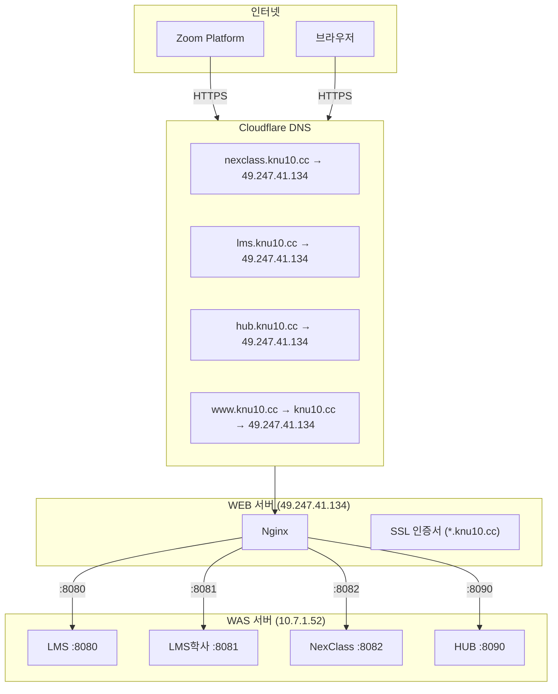

# 08. NexClass 인프라 실전 - 오늘 한 것 전체 복습

!!! note "난이도: Omega"
    01~07장에서 배운 모든 개념이 **합체**하는 최종장이야.
    오늘 `https://nexclass.knu10.cc/webhook/zoom`을 만들기까지의 **전체 과정**을 복습해.
    삽질도 포함이야. 삽질에서 배우는 게 제일 많으니까.

---

## 미션

!!! danger "오늘의 목표"
    **Zoom Webhook URL `https://nexclass.knu10.cc/webhook/zoom`을 만들어라.**

    Zoom이 요구하는 조건:

    - HTTPS 필수 (HTTP 안 됨)
    - 도메인 필수 (IP 안 됨)
    - URL 유효성 검사 통과 (CRC 응답 필요)

이 URL 하나 만드는 데 필요한 것들:

| 필요한 것 | 관련 장 | 현재 상태 |
|-----------|---------|:---------:|
| 도메인 (nexclass.knu10.cc) | 02, 06 | 오늘 추가 |
| DNS A 레코드 | 02, 06 | 오늘 추가 |
| SSL 인증서 | 04 | 기존 와일드카드 활용 |
| Nginx server 블록 | 05 | 오늘 추가 |
| WEB → WAS 연결 | 07 | 오늘 확인 |
| Webhook 코드 | - | 미구현 (Phase 4-B) |

---

## 작업 순서 복기

### Step 1: DNS 설정 (Cloudflare)

**목표**: `nexclass.knu10.cc`가 WEB 서버를 가리키게 하기

```
Cloudflare → knu10.cc → DNS Records → Add record

Type: A
Name: nexclass
Content: 49.247.41.134
Proxy status: DNS only
TTL: Auto
```

**확인**:
```bash
nslookup nexclass.knu10.cc
# → 49.247.41.134 ✅
```

!!! danger "삽질 1: 잘못된 IP"
    처음에 WAS 서버 IP(`49.247.45.181`)를 넣을 뻔했어.
    WAS에는 Nginx가 없으니까 HTTPS 처리가 안 됨!
    **핵심: DNS는 WEB 서버(Nginx가 있는 곳)를 가리켜야 해.**

!!! danger "삽질 2: Proxied 모드"
    처음에 Proxied(주황 구름)로 설정했어.
    우리는 자체 Sectigo SSL을 쓰니까 DNS Only(회색 구름)가 맞아.
    **핵심: 자체 SSL 쓰면 DNS Only.**

---

### Step 2: WEB 서버 확인

**목표**: Nginx가 어디에 있는지 찾기

```bash
# WAS 서버 (49.247.45.181)에서
sudo nginx -t
# → command not found ← Nginx가 없다!

# WEB 서버 (49.247.41.134)에서
sudo nginx -t
# → nginx: configuration file /etc/nginx/nginx.conf test is successful ✅
```

!!! danger "삽질 3: 서버 혼동"
    WAS 서버에서 Nginx 찾다가 "없는데?" 당황.
    **핵심: Nginx는 WEB 서버에 있다. WAS 서버가 아니라.**

---

### Step 3: Nginx 설정 추가

**목표**: nexclass.knu10.cc → NexClass(:8082) 연결

WEB 서버에서 `/etc/nginx/nginx.conf`에 server 블록 추가:

```nginx
# ── 블록 1: HTTP → HTTPS 리다이렉트 ──
server {
    listen 80;
    server_name nexclass.knu10.cc;
    return 301 https://$host$request_uri;
}

# ── 블록 2: HTTPS 처리 + 리버스 프록시 ──
server {
    listen 443 ssl;
    server_name nexclass.knu10.cc;

    ssl_certificate /etc/nginx/sslcert/knu10.cc_2025092558193.all.crt.pem;
    ssl_certificate_key /etc/nginx/sslcert/knu10.cc_2025092558193.key.pem;
    ssl_protocols TLSv1.2 TLSv1.3;
    ssl_prefer_server_ciphers on;
    ssl_ciphers HIGH:!aNULL:!MD5;

    location / {
        proxy_pass http://10.7.1.52:8082;
        proxy_set_header X-Forwarded-For $proxy_add_x_forwarded_for;
        proxy_set_header HOST $http_host;
        proxy_set_header X-NginX-Proxy true;

        proxy_connect_timeout 1800;
        proxy_read_timeout 1800;
        proxy_send_timeout 1800;
    }
}
```

**설정 적용**:
```bash
sudo nginx -t                # 문법 검사 ← 필수!
sudo nginx -s reload          # 설정 리로드
```

---

### Step 4: 검증

```bash
curl https://nexclass.knu10.cc/health
# → {"message":"NexClass is healthy!","status":"UP"} ✅
```

!!! tip "이 한 줄 응답이 오기까지"
    1. DNS 조회: nexclass.knu10.cc → 49.247.41.134
    2. HTTPS 연결: 443 포트, SSL 핸드셰이크
    3. Nginx: server_name 매칭 → proxy_pass :8082
    4. NexClass: /health API 응답
    5. 역방향으로 돌아옴

---

## 전체 아키텍처 완성도



---

## 삽질 요약 & 교훈

| # | 삽질 | 원인 | 교훈 |
|:-:|------|------|------|
| 1 | DNS에 WAS IP 넣으려 함 | WEB/WAS 구조 이해 부족 | **DNS → WEB 서버 (Nginx 있는 곳)** |
| 2 | Proxied 모드 선택 | Cloudflare 프록시 이해 부족 | **자체 SSL = DNS Only** |
| 3 | WAS에서 Nginx 찾음 | 서버 역할 혼동 | **Nginx = WEB 서버** |
| 4 | ngrok 고려 | 기존 인프라 파악 안 함 | **먼저 현재 인프라 파악** |
| 5 | IP로 Webhook URL | Zoom HTTPS 요구사항 모름 | **Zoom = HTTPS + 도메인 필수** |

!!! tip "가장 큰 교훈"
    **삽질의 90%는 "현재 인프라를 모르기 때문"에 발생해.**
    ngrok을 찾고, 별도 설정을 고민하기 전에 **지금 뭐가 있는지부터 파악**해야 해.
    WEB 서버에 Nginx가 이미 있고, SSL도 이미 있었어. server 블록 하나만 추가하면 끝이었던 거야.

---

## 남은 작업: Zoom Webhook

인프라는 완성! 남은 건 **코드**야:

| 작업 | 상태 | 설명 |
|------|:----:|------|
| DNS 설정 | ✅ | nexclass.knu10.cc A 레코드 |
| Nginx 설정 | ✅ | server 블록 + proxy_pass |
| SSL 인증서 | ✅ | 기존 와일드카드 활용 |
| HTTPS URL 동작 | ✅ | /health 정상 응답 |
| Zoom App 설정 | ✅ | KNU10-NexClass, Secret Token 발급 |
| **WebhookController 코드** | ❌ | CRC 응답 + 이벤트 처리 |
| **Zoom URL 검증** | ❌ | 코드 배포 후 URL Validation |

!!! note "다음 단계 (Phase 4-B)"
    1. WebhookController 구현 (CRC 응답 + HMAC-SHA256 서명 검증)
    2. 개발서버 배포 (`NexClass.jar`)
    3. Zoom Marketplace에서 URL 검증
    4. Webhook 이벤트 수신 테스트
    5. 출결 데이터 처리

---

## 정리

| 단계 | 작업 | 핵심 개념 |
|:----:|------|-----------|
| 1 | Cloudflare A 레코드 추가 | DNS, 도메인 → IP 매핑 |
| 2 | WEB 서버 확인 | WEB/WAS 분리, Nginx 위치 |
| 3 | Nginx server 블록 추가 | 리버스 프록시, SSL 종료 |
| 4 | 검증 (curl /health) | 전체 흐름 확인 |

**01~07장의 모든 개념이 합쳐져서 URL 하나가 만들어진 거야.**

---

### 확인 문제

!!! question "Q1. nexclass.knu10.cc HTTPS URL을 만들기 위해 필요한 3가지 인프라 구성 요소를 말해봐."

!!! question "Q2. 오늘 삽질 중 'WAS 서버에서 Nginx를 찾으려 한 것'은 어떤 개념을 이해 못 해서야?"

!!! question "Q3. 기존 인프라(WEB 서버 Nginx + SSL 인증서)가 이미 있었으니까 실제로 한 작업은 딱 2가지야. 뭐랑 뭐야?"

!!! question "Q4. Zoom Webhook URL은 인프라만으로 완성이 안 돼. 왜?"

??? success "정답 보기"
    **A1.** (1) **DNS**: Cloudflare에서 nexclass.knu10.cc A 레코드 → WEB 서버 IP. (2) **SSL 인증서**: Nginx에 설치된 Sectigo 와일드카드 인증서 (*.knu10.cc). (3) **Nginx 리버스 프록시**: server 블록에서 nexclass.knu10.cc → proxy_pass :8082로 연결.

    **A2.** **WEB/WAS 분리 아키텍처**를 이해 못 해서야. Nginx는 **WEB 서버**에 있어. WAS 서버에는 Java 앱만 돌아가고 Nginx가 없어. 서버 2대의 역할이 다르다는 걸 모르면 이런 삽질이 생겨.

    **A3.** (1) **Cloudflare에 A 레코드 추가** (nexclass → 49.247.41.134). (2) **Nginx에 server 블록 추가** (nexclass.knu10.cc → proxy_pass :8082). SSL 인증서는 기존 와일드카드(*.knu10.cc)가 nexclass 서브도메인도 커버하니까 별도 작업 불필요.

    **A4.** Zoom은 URL 등록 시 **URL 유효성 검사(CRC)**를 해. Zoom이 challenge 파라미터를 보내면, 서버가 Secret Token으로 HMAC-SHA256 해싱해서 응답해야 해. 이 **WebhookController 코드가 없으면** URL 검증에 실패해. 인프라(DNS + Nginx + SSL)는 "URL에 접근 가능하게 해주는 것"이고, **실제 Zoom과의 핸드셰이크는 코드가 해야 해.** 이게 Phase 4-B에서 할 일이야.
