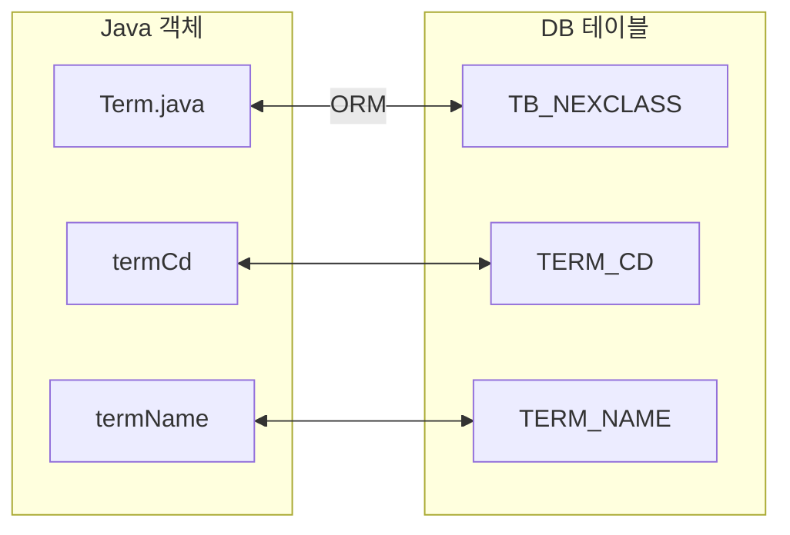
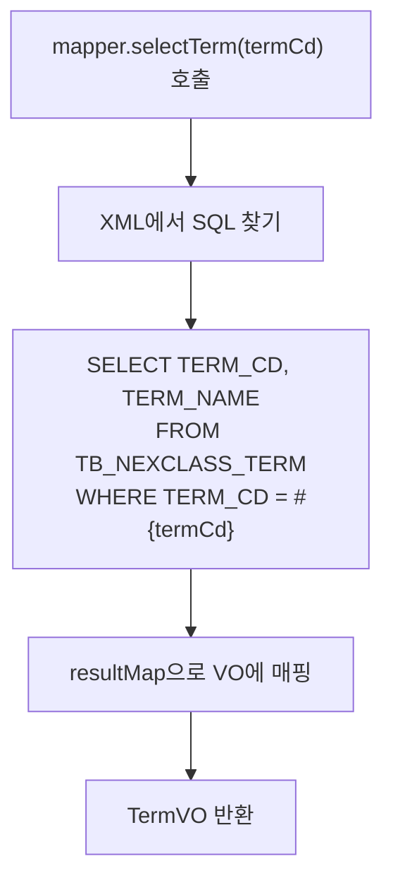
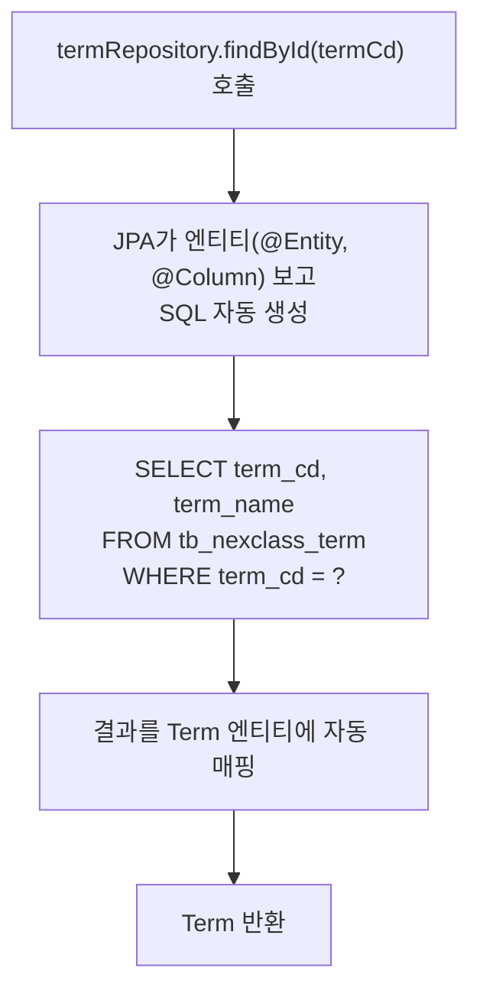

# 01. JPA가 뭐야? - Alpha

---

## 1. 이게 뭐야? — "자동변속기"

### 비유부터

- **수동변속기(MyBatis)**: 기어를 네가 직접 조작. SQL을 네가 직접 다 짜야 해.
- **자동변속기(JPA)**: 엑셀만 밟으면 알아서 기어 바꿔줘. 엔티티만 만들면 SQL을 JPA가 만들어줘.

비유는 입구야. 진짜를 보자.

### 본질

**ORM (Object-Relational Mapping)** — 자바 객체(Object)와 DB 테이블(Relational)을 자동으로 연결(Mapping)해주는 기술.



**JPA** — ORM을 자바에서 쓰기 위한 표준 스펙(인터페이스). JPA 자체는 코드가 아니라 "규칙".
**Hibernate** — JPA 스펙을 실제로 구현한 라이브러리. 실제로 SQL 만들어주는 놈.
**Spring Data JPA** — JPA를 스프링에서 더 편하게 쓰게 해주는 모듈.

```
Spring Data JPA (편의 기능)
 └── JPA (표준 스펙)
      └── Hibernate (구현체)
           └── JDBC (DB 연결)
```

---

## 2. 어떻게 돌아가?

### MyBatis 흐름 (네가 익숙한 거)



네가 해야 하는 것: **SQL 작성 + resultMap + Mapper 인터페이스 + XML 파일**

### JPA 흐름



네가 해야 하는 것: **엔티티 클래스 만들기. 끝.**

---

## 3. 코드로 보자

### MyBatis 방식 — 3개 파일

```java
// 파일 1: TermMapper.java
public interface TermMapper {
    TermVO selectTerm(String termCd);
    int insertTerm(TermVO vo);
    int updateTerm(TermVO vo);
}
```

```xml
<!-- 파일 2: TermMapper_SQL.xml -->
<select id="selectTerm" resultType="TermVO">
    SELECT TERM_CD, TERM_NAME FROM TB_NEXCLASS_TERM WHERE TERM_CD = #{termCd}
</select>
<insert id="insertTerm">
    INSERT INTO TB_NEXCLASS_TERM (TERM_CD, TERM_NAME) VALUES (#{termCd}, #{termName})
</insert>
```

```java
// 파일 3: TermVO.java
public class TermVO {
    private String termCd;
    private String termName;
    // getter, setter...
}
```

### JPA 방식 — 2개 파일

```java
// 파일 1: Term.java (엔티티)
@Entity
@Table(name = "TB_NEXCLASS_TERM")
public class Term {
    @Id
    @Column(name = "TERM_CD", length = 40)
    private String termCd;

    @Column(name = "TERM_NAME", length = 100)
    private String termName;
}
```

```java
// 파일 2: TermRepository.java
@Repository
public interface TermRepository extends JpaRepository<Term, String> {
    // 끝. CRUD 자동 제공.
}
```

### 사용 비교

```java
// MyBatis — INSERT와 UPDATE 따로
termMapper.insertTerm(newTerm);
termMapper.updateTerm(existingTerm);

// JPA — 같은 메서드 하나로
termRepository.save(newTerm);       // INSERT
termRepository.save(existingTerm);  // UPDATE (PK 있으면 자동)
```

### 핵심 차이 표

| 항목 | MyBatis | JPA |
|------|---------|-----|
| SQL | 네가 직접 작성 | JPA가 자동 생성 |
| 매핑 | XML resultMap | @Entity, @Column |
| 파일 수 | Mapper + XML + VO = 3개 | Entity + Repository = 2개 |
| INSERT | mapper.insert() | repository.save() |
| UPDATE | mapper.update() (별도) | repository.save() (같은 메서드) |
| SELECT | mapper.select() + SQL | repository.findById() |
| 조건 검색 | XML에 WHERE 직접 작성 | findBy필드명() 메서드명으로 자동 |

---

## 4. 주의사항 / 함정

**함정 1: "JPA 쓰면 SQL 몰라도 돼"**
틀렸어. JPA가 만드는 SQL을 이해해야 성능 문제를 잡아. SQL 모르면 100배 삽질.

**함정 2: "JPA가 무조건 좋아"**
틀렸어. 복잡한 통계 쿼리, 다중 JOIN, 서브쿼리 — 이런 건 MyBatis가 낫다.

**함정 3: "MyBatis 습관 그대로"**
위험해. JPA는 영속성 컨텍스트가 있어서 MyBatis처럼 매번 update 메서드 안 불러도 돼. 이거 모르면 불필요한 코드 양산.

**함정 4: "기본 생성자 까먹음"**
JPA 엔티티는 반드시 기본 생성자 필요. Lombok @NoArgsConstructor가 해줌. 없으면 에러.

---

## 5. 정리

| 장점 | 단점 |
|------|------|
| SQL 안 짜도 됨 (단순 CRUD) | 학습 곡선 높음 |
| 코드량 적음 (파일 수 절반) | 복잡한 쿼리에 약함 |
| save() 하나로 INSERT/UPDATE | 성능 최적화 어려움 (N+1) |
| DB 바꿔도 코드 안 바꿈 | 디버깅 어려움 (SQL 안 보임) |

> **JPA는 자바 객체와 DB 테이블을 자동으로 연결해주는 ORM이다. SQL을 직접 안 짜도 되지만, SQL을 모르면 쓸 자격이 없다.**

---

### 확인 문제

**Q1.** JPA와 Hibernate의 관계를 한 문장으로.

**Q2.** MyBatis에서 INSERT/UPDATE 각각 따로 만드는데, JPA에서는?

**Q3.** JPA가 MyBatis보다 못하는 상황 2가지.

**Q4.** JPA 엔티티에 @NoArgsConstructor가 필요한 이유?

??? success "정답 보기"

    **A1.** JPA는 표준 스펙(인터페이스), Hibernate는 그 스펙의 구현체.

    **A2.** save() 하나로 PK 유무 기준 INSERT/UPDATE 자동 판단.

    **A3.** (1) 복잡한 통계/JOIN 쿼리 (2) 대량 데이터 성능 최적화

    **A4.** JPA가 DB 데이터로 객체 만들 때 빈 객체를 먼저 생성하고 필드를 채우는 방식이라 기본 생성자 필수.
