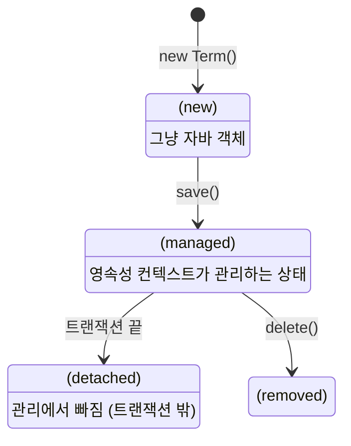

# 05. 영속성 컨텍스트 - Gamma

---

## 1. 이게 뭐야? — "장바구니"

온라인 쇼핑할 때 물건을 바로 결제 안 하잖아. 장바구니에 담아뒀다가 한 번에 결제하지.

JPA도 마찬가지. 엔티티를 DB에 바로 안 넣어. **영속성 컨텍스트라는 장바구니**에 담아뒀다가, 트랜잭션 끝날 때 한 번에 DB에 반영해.

이게 JPA의 핵심 개념이야. 이거 모르면 JPA를 쓰는 게 아니라 JPA한테 끌려다니는 거야.

---

## 2. 어떻게 돌아가?

### 엔티티 생명주기 4단계



| 상태 | 설명 | 예시 |
|------|------|------|
| **비영속** | new로 만든 상태. JPA가 모름 | `Term term = new Term()` |
| **영속** | save() 후. JPA가 관리 | `termRepository.save(term)` |
| **준영속** | 트랜잭션 끝남. JPA가 더 이상 안 봄 | 메서드 리턴 후 |
| **삭제** | delete() 호출. DB에서 지울 예정 | `termRepository.delete(term)` |

### 1차 캐시

같은 트랜잭션 안에서 같은 PK로 2번 조회하면?

```java
@Transactional
public void example() {
    Term term1 = termRepository.findById("2026-1").orElseThrow();  // SQL 실행 O
    Term term2 = termRepository.findById("2026-1").orElseThrow();  // SQL 실행 X (캐시!)

    System.out.println(term1 == term2);  // true — 같은 객체!
}
```

JPA: SQL 1번만 실행. 두 번째는 1차 캐시에서 가져옴.
MyBatis: SQL 2번 실행. 캐시 없음 (2차 캐시 설정 안 했으면).

### 변경 감지 (Dirty Checking) — 이게 핵심

```java
@Transactional
public void updateTermName(String termCd, String newName) {
    Term term = termRepository.findById(termCd).orElseThrow();  // 영속 상태
    term.setTermName(newName);  // 필드 값만 바꿈
    // save() 안 불러도 됨! 트랜잭션 끝날 때 JPA가 알아서 UPDATE
}
```

JPA가 트랜잭션 끝날 때 "아까 조회한 거랑 지금 값이 다르네?" → 자동 UPDATE SQL 생성.

**MyBatis였으면:**
```java
public void updateTermName(String termCd, String newName) {
    TermVO vo = termMapper.selectTerm(termCd);
    vo.setTermName(newName);
    termMapper.updateTerm(vo);  // 반드시 호출해야 DB 반영!
}
```

JPA: set만 하면 끝.
MyBatis: set 한 뒤 반드시 update 메서드 호출.

### NexClass 실전 — LessonService.updateLesson()

```java
@Transactional
public Lesson updateLesson(String lessonCd, Lesson updateData) {
    Lesson lesson = getLesson(lessonCd);                    // 영속 상태
    if (updateData.getLessonName() != null) {
        lesson.setLessonName(updateData.getLessonName());   // 값만 바꿈
    }
    // ...
    return lessonRepository.save(lesson);  // 사실 이 save() 없어도 됨
}
```

`@Transactional` 안이라 `save()` 없어도 변경 감지로 UPDATE 됨. 하지만 NexClass에서는 명시적으로 `save()` 호출해서 가독성을 높인 거야.

---

## 3. flush — "장바구니 결제"

영속성 컨텍스트의 변경 내용을 DB에 밀어내는 것.

```
평소: 영속성 컨텍스트에 쌓아둠
flush 시점: DB에 SQL 날림
  → 트랜잭션 커밋 직전 (자동)
  → JPQL 쿼리 실행 직전 (자동)
  → entityManager.flush() 직접 호출 (수동)
```

보통 신경 안 써도 돼. 트랜잭션 끝나면 자동 flush.

---

## 4. 주의사항 / 함정

**함정 1: @Transactional 없이 변경 감지 기대**
@Transactional 없으면 영속성 컨텍스트 안 만들어져. set만 하고 save() 안 부르면 DB 반영 안 됨.

**함정 2: 트랜잭션 밖에서 지연 로딩**
연관관계 설정한 엔티티를 트랜잭션 밖에서 접근하면 LazyInitializationException 터져.

**함정 3: MyBatis 습관으로 매번 save()**
변경 감지가 되는 @Transactional 안에서 매번 save() 부르는 건 불필요한 코드. 틀린 건 아닌데 JPA답지 않아.

---

## 5. 정리

| 개념 | MyBatis | JPA |
|------|---------|-----|
| 같은 PK 2번 조회 | SQL 2번 | SQL 1번 (1차 캐시) |
| 값 변경 후 DB 반영 | mapper.update() 필수 | set만 하면 자동 (변경 감지) |
| 트랜잭션 | SqlSession 수동 관리 | @Transactional 어노테이션 |
| 장바구니 개념 | 없음 | 영속성 컨텍스트 |

> **영속성 컨텍스트는 JPA의 장바구니. 엔티티를 관리하다가 트랜잭션 끝날 때 DB에 반영한다. 변경 감지 덕분에 set만 해도 UPDATE가 자동으로 나간다.**

---

### 확인 문제

**Q1.** 영속성 컨텍스트의 1차 캐시가 하는 일은?

**Q2.** 변경 감지(Dirty Checking)가 뭐야? MyBatis와 비교해서.

**Q3.** @Transactional 없이 entity.setName("새이름") 하면 DB에 반영돼?

**Q4.** NexClass LessonService.updateLesson()에서 save()를 빼도 되는 이유는?

??? success "정답 보기"

    **A1.** 같은 트랜잭션 안에서 같은 PK로 조회하면 DB 대신 캐시에서 반환. SQL 실행 횟수를 줄여줌.

    **A2.** @Transactional 안에서 영속 엔티티의 필드를 바꾸면, 트랜잭션 끝날 때 JPA가 원본과 비교해서 자동 UPDATE. MyBatis는 반드시 mapper.update()를 직접 호출해야 함.

    **A3.** 안 됨. @Transactional 없으면 영속성 컨텍스트가 관리 안 해서 변경 감지가 작동 안 함. save()를 명시적으로 호출해야 함.

    **A4.** @Transactional 안이라 변경 감지가 작동. 트랜잭션 끝날 때 JPA가 변경된 필드를 감지해서 자동 UPDATE. save()는 가독성을 위해 명시적으로 쓴 것.
