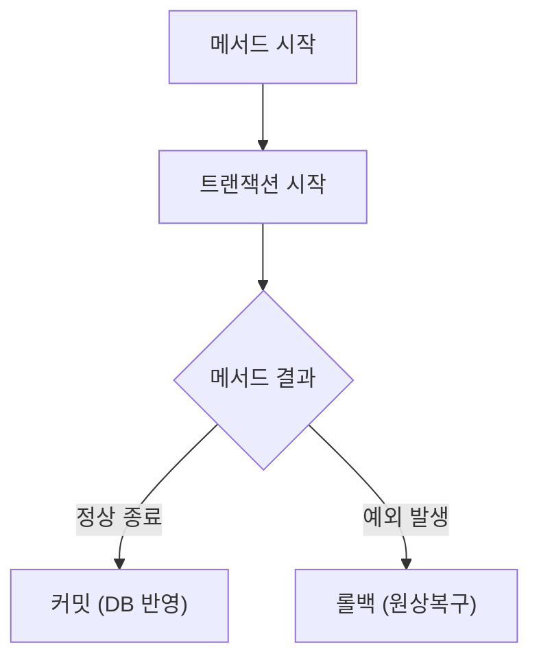

# 07. 트랜잭션과 동시성 - Delta

---

## 1. 이게 뭐야? — "은행 ATM"

ATM에서 돈 뽑을 때 중간에 에러나면? 뽑기 전 상태로 돌아가야지, 반만 빠지면 안 돼. 이게 트랜잭션이야. **전부 성공하거나, 전부 실패하거나.**

JPA에서는 `@Transactional` 하나면 됨.

---

## 2. 어떻게 돌아가?

### @Transactional 기본 동작

```java
@Transactional
public Lesson createLesson(Lesson lesson) {
    String hostEmail = hostPoolService.assignHost(...);  // 1. 호스트 배정
    Map<String, Object> zoom = zoomService.createMeeting(...);  // 2. Zoom 생성
    lesson.setZoomMeetingId(...);
    return lessonRepository.save(lesson);  // 3. DB 저장
}
// → 3개 다 성공하면 커밋
// → 하나라도 실패하면 전부 롤백
```



### 주요 옵션

```java
@Transactional                              // 기본 — 읽기+쓰기
@Transactional(readOnly = true)             // 읽기 전용 (성능 최적화)
@Transactional(rollbackFor = Exception.class)  // Checked 예외도 롤백
```

| 옵션 | 의미 |
|------|------|
| 기본 | RuntimeException 시 롤백 |
| readOnly = true | 읽기 전용, 변경 감지 비활성화 (성능 up) |
| rollbackFor | 지정한 예외에서도 롤백 |

### 전파 (Propagation)

트랜잭션 안에서 또 @Transactional 메서드를 호출하면?

```java
@Transactional  // 트랜잭션 A
public void createLesson() {
    hostPoolService.assignHost();  // @Transactional — 트랜잭션 B?
}
```

| 전파 | 동작 |
|------|------|
| **REQUIRED** (기본) | A 있으면 A에 합류, 없으면 새로 만듦 |
| REQUIRES_NEW | 무조건 새 트랜잭션 생성. A 일시 중단 |

기본(REQUIRED)이면 하나의 트랜잭션으로 묶여. 둘 중 하나 실패하면 전부 롤백.

---

## 3. 코드로 보자 — 동시성 문제

### 문제: 호스트 동시 배정

19개 호스트 중 1개 남았는데 동시에 2건 요청이 오면?

```
요청 A: 가용 호스트 조회 → kren19 발견 → 배정!
요청 B: 가용 호스트 조회 → kren19 발견 → 배정!  ← 충돌!
```

### 해결: 비관적 락

```java
@Query("SELECT h FROM HostPool h WHERE h.hostStatus = 'ACTIVE'")
@Lock(LockModeType.PESSIMISTIC_WRITE)  // 다른 트랜잭션이 못 건드리게 잠금
List<HostPool> findActiveHostsForUpdate();
```

비관적 락 = "내가 쓰는 동안 다른 놈 건드리지 마"
→ DB에 `SELECT ... FOR UPDATE` 실행

### 낙관적 락 vs 비관적 락

| 방식 | 동작 | 장점 | 단점 | 사용 시점 |
|------|------|------|------|----------|
| **낙관적** (@Version) | 수정 시 버전 비교, 충돌하면 예외 | 성능 좋음 (잠금 X) | 충돌 시 재시도 필요 | 충돌 드문 경우 |
| **비관적** (@Lock) | 조회 시 행 잠금 | 충돌 불가능 | 성능 저하 (대기) | 충돌 잦은 경우 |

```java
// 낙관적 락 — @Version 필드 추가
@Version
private Long version;
// 수정 시: UPDATE ... SET version = version + 1 WHERE version = ?
// 버전 안 맞으면 OptimisticLockException
```

---

## 4. 주의사항 / 함정

**함정 1: 같은 클래스 내부 호출**
```java
public void methodA() {
    this.methodB();  // ❌ @Transactional 안 먹힘!
}

@Transactional
public void methodB() { ... }
```
스프링 @Transactional은 프록시 기반. 같은 클래스 안에서 내부 호출하면 프록시를 안 거쳐서 트랜잭션 안 걸려.

**함정 2: Checked Exception**
```java
@Transactional
public void method() throws IOException {  // Checked Exception
    throw new IOException("실패");
    // ❌ 롤백 안 됨! RuntimeException만 기본 롤백
}

@Transactional(rollbackFor = Exception.class)  // ✅ 모든 예외에서 롤백
```

**함정 3: @Transactional 안에서 외부 API 호출**
NexClass createLesson()처럼 Zoom API 호출이 @Transactional 안에 있으면, API가 느릴 때 DB 커넥션을 오래 점유. 주의.

**함정 4: readOnly인데 수정**
readOnly = true인 메서드에서 entity.setName() 해도 변경 감지 안 돼서 DB 반영 안 됨. 에러는 안 나는데 수정도 안 돼.

---

## 5. 정리

| MyBatis | JPA |
|---------|-----|
| SqlSession.commit() / rollback() | @Transactional 자동 |
| 트랜잭션 수동 관리 | 어노테이션 하나 |
| 동시성? SQL LOCK 직접 | @Lock, @Version |

> **@Transactional = "이 메서드는 하나의 작업 단위야. 전부 성공하거나 전부 실패해." 동시성은 낙관적/비관적 락으로.**

---

### 확인 문제

**Q1.** @Transactional 메서드에서 예외 발생하면?

**Q2.** 같은 클래스 내부에서 @Transactional 메서드를 호출하면 왜 안 먹혀?

**Q3.** 낙관적 락과 비관적 락의 차이?

**Q4.** readOnly = true의 효과?

??? success "정답 보기"

    **A1.** RuntimeException이면 자동 롤백. Checked Exception이면 롤백 안 됨 (rollbackFor로 설정 필요).

    **A2.** 스프링 @Transactional은 프록시 기반. 내부 호출(this.method())은 프록시를 안 거쳐서 트랜잭션 적용 안 됨.

    **A3.** 낙관적: 잠금 없이 수정 시 버전 비교, 충돌하면 예외. 비관적: 조회 시 행 잠금, 다른 트랜잭션 대기. 충돌 빈도에 따라 선택.

    **A4.** 변경 감지 비활성화 → 영속성 컨텍스트가 스냅샷 안 뜸 → 메모리/성능 절약. 읽기만 하는 메서드에 붙임.
