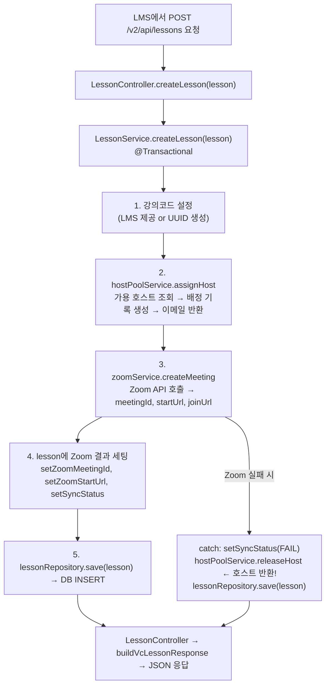
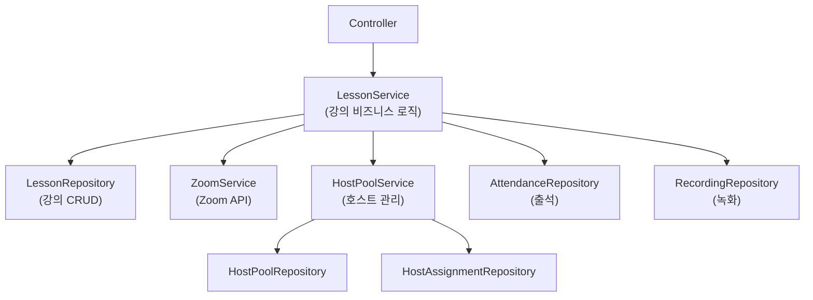

# 09. NexClass 실전 - Omega

---

## 1. 프로젝트 구조

```
src/main/java/kr/ac/knu/nexclass/
├── entity/              ← JPA 엔티티 (DB 테이블 매핑)
│   ├── Lesson.java          강의
│   ├── Attendance.java      출석
│   ├── Recording.java       녹화
│   ├── HostPool.java        호스트 풀
│   ├── HostAssignment.java  호스트 배정
│   ├── Term.java            학기 (Phase 3)
│   ├── Course.java          과목 (Phase 3)
│   ├── User.java            사용자 (Phase 3)
│   ├── CourseUser.java      과목-학생 (Phase 3)
│   └── SyncLog.java         동기화 이력 (Phase 3)
├── repository/          ← JPA Repository (CRUD 자동)
├── service/             ← 비즈니스 로직
│   ├── LessonService.java
│   ├── ZoomService.java
│   └── HostPoolService.java
└── controller/          ← API 엔드포인트
    └── LessonController.java
```

---

## 2. 엔티티 전체 분석

### PK 전략 — 왜 어떤 건 String이고 어떤 건 Long?

| 엔티티 | PK | 타입 | 전략 | 이유 |
|--------|-----|------|------|------|
| Lesson | lessonCd | String | @Id만 | LMS가 강의코드 결정 |
| HostPool | hostEmail | String | @Id만 | 이메일이 고유 식별자 |
| Term | termCd | String | @Id만 | LMS에서 학기코드 넘어옴 |
| Course | courseCd | String | @Id만 | LMS에서 과목코드 넘어옴 |
| User | userCd | String | @Id만 | LMS에서 사용자코드 넘어옴 |
| HostAssignment | id | Long | @GeneratedValue | NexClass 내부 관리용 |
| CourseUser | id | Long | @GeneratedValue | 복합키 대신 대리키 사용 |
| SyncLog | syncId | Long | @GeneratedValue | 이력 로그, 순차 번호 |

**패턴**: 외부 시스템(LMS)이 PK를 결정 → String. 내부 관리용 → Long + AUTO_INCREMENT.

### @PrePersist 패턴

모든 엔티티에서 동일한 패턴:

```java
@PrePersist
protected void onCreate() {
    createdAt = LocalDateTime.now();     // 생성 시간
    updatedAt = LocalDateTime.now();     // 수정 시간 (첫 값)
    if (기본값필드 == null) {
        기본값필드 = "기본값";            // 기본값 자동 세팅
    }
}
```

| 엔티티 | 기본값 필드 | 기본값 |
|--------|-----------|--------|
| Term | useYn | "Y" |
| Course | useYn | "Y" |
| User | enrolledYn | "Y" |
| HostPool | hostStatus | "ACTIVE" |
| SyncLog | syncStatus | "PROCESSING" |

---

## 3. Repository → Service → Controller 흐름

### 강의 생성 전체 과정



### 의존성 구조



**원칙**:
- Controller → Service만 접근 (Repository 직접 접근 X)
- LessonService → HostPoolService만 접근 (HostPoolRepository 직접 접근 X)
- 각 계층은 자기 아래만 알아. 이게 SRP.

---

## 4. @Transactional 적용 위치

```java
// LessonService
@Transactional  createLesson()     // 호스트배정 + Zoom + DB저장 한 묶음
@Transactional  updateLesson()     // 조회 + 수정 + Zoom수정 한 묶음
@Transactional  deleteLesson()     // Zoom삭제 + 호스트반환 + DB삭제 한 묶음
(없음)          getLesson()        // 조회만 — 트랜잭션 불필요
(없음)          getHostUrl()       // 조회만
```

**규칙**: 데이터를 변경하는 메서드에만 @Transactional. 조회만 하는 건 안 붙여도 됨 (붙이려면 readOnly = true).

---

## 5. 연관관계를 안 쓴 이유

NexClass 엔티티들은 FK를 String으로만 저장:

```java
// Course.java — String FK
@Column(name = "TERM_CD", length = 40)
private String termCd;    // Term 객체가 아니라 String
```

**이유:**
1. **동기화 데이터** — LMS에서 가져와서 저장만. 복잡한 JOIN 불필요
2. **독립적 조회** — 과목 조회할 때 학기 정보 같이 필요한 경우 거의 없음
3. **YAGNI** — 연관관계 쓰면 N+1, 지연 로딩 관리 포인트만 늘어남
4. **UPSERT 단순화** — save()만 하면 끝. 연관 객체 먼저 조회할 필요 없음

이게 트레이드오프야. 연관관계 쓰면 course.getTerm().getTermName() 한 줄로 되는 편리함이 있지만, 지금 NexClass에는 그런 요구사항이 없어.

---

## 6. 정리

| 설계 결정 | 선택 | 이유 |
|----------|------|------|
| PK 전략 | String(외부) / Long(내부) | 외부 시스템 vs 내부 관리 |
| 연관관계 | 안 씀 (String FK) | YAGNI, 동기화 데이터 |
| @PrePersist | 모든 엔티티 | 시간/기본값 자동화 |
| @Transactional | 변경 메서드만 | 불필요한 트랜잭션 방지 |
| 계층 구조 | Controller→Service→Repository | SRP, 책임 분리 |

> **NexClass는 "필요한 만큼만" JPA를 쓴다. 연관관계, 상속 매핑 같은 고급 기능은 요구사항이 생길 때 도입. 이게 YAGNI.**

---

### 확인 문제

**Q1.** NexClass에서 Term은 String PK, SyncLog는 Long PK. 각각의 이유?

**Q2.** createLesson()에서 Zoom 실패 시 호스트 반환하는 이유?

**Q3.** Controller가 Repository를 직접 접근하면 안 되는 이유?

**Q4.** 연관관계를 안 쓰면 불편한 점은? 그래도 안 쓴 이유?

??? success "정답 보기"

    **A1.** Term: LMS에서 TERM_CD 코드값이 넘어와서 외부가 PK 결정. SyncLog: NexClass 내부 이력 로그라 DB AUTO_INCREMENT.

    **A2.** Zoom 실패했는데 호스트가 배정된 상태로 남으면 그 호스트는 다른 강의에 사용 불가. 자원 점유 방지.

    **A3.** SRP(단일 책임 원칙). Controller는 HTTP 요청/응답만, 비즈니스 로직은 Service가, DB 접근은 Repository가. 계층 뛰어넘으면 책임이 섞여.

    **A4.** 불편한 점: 학기 정보 필요하면 별도 조회 필요 (course.getTermCd()로 termRepository.findById() 따로). 안 쓴 이유: 그런 요구사항이 지금 없고, 연관관계 쓰면 N+1 등 관리 복잡도만 증가 (YAGNI).
