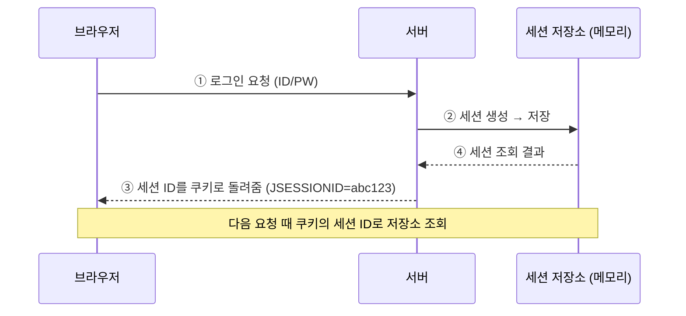
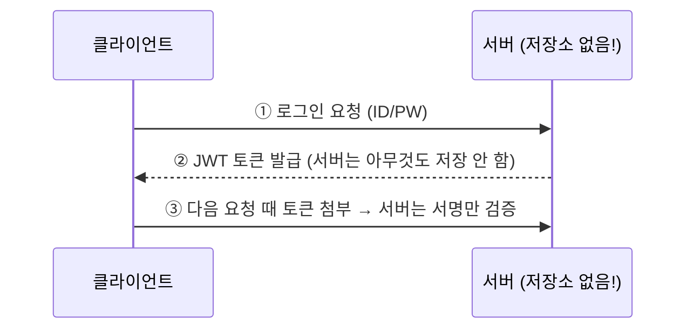
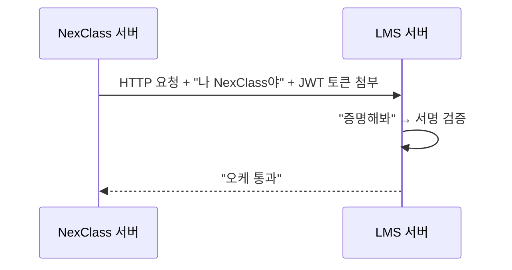

# 01. JWT가 뭐야 - Alpha

---

## 1. 핵심 개념 - "이게 뭐야?"

### 비유로 문 열기

놀이공원 가면 팔찌 채워주잖아.

!!! example "놀이공원 팔찌 비유"
    너: "안녕하세요, 입장권 샀어요"
    직원: (확인) "여기 팔찌요"

    팔찌에 뭐가 적혀있어?
    → 이름, 입장 시간, 만료 시간, 등급(자유이용권)

    놀이기구 탈 때마다:
    직원: "팔찌 보여주세요" → (확인) → "타세요"

    매번 매표소 안 가도 돼. 팔찌가 증명하니까.

**JWT가 이 팔찌야.**

### 비유는 입구고, 진짜는 이거야

**JWT (JSON Web Token)**: 서버가 발급한 **서명된 JSON 데이터 문자열**. 클라이언트가 들고 다니면서 "나 인증된 놈이야"를 증명하는 토큰.

핵심 키워드 3개:
- **JSON**: 데이터 형식이 JSON이야
- **Web**: 웹 환경(HTTP)에서 쓰려고 만든 거야
- **Token**: 토큰 = 증표 = "이거 보여주면 통과"

---

## 2. 왜 필요해? - "없으면 어떻게 되는데?"

### 인증 없는 세상

```
클라이언트: "내 정보 줘"
서버: "너 누군데?"
클라이언트: "나 김철수인데"
서버: "증거는?"
클라이언트: "...없는데?"
서버: "꺼져" (401 Unauthorized)
```

### 매번 로그인하는 세상 (JWT 이전)

```
클라이언트: "내 정보 줘. ID: kim, PW: 1234"
서버: (DB 조회, 비번 확인) "오케, 여기"

클라이언트: "내 게시글도 줘. ID: kim, PW: 1234"
서버: (또 DB 조회, 또 비번 확인) "오케, 여기"

클라이언트: "내 알림도 줘. ID: kim, PW: 1234"
서버: (또또 DB 조회...) "이거 비효율적인데..."
```

**매 요청마다 ID/PW를 보내고, 서버는 매번 DB를 뒤져야 해.** 비밀번호가 네트워크를 계속 타고 다녀. 보안 구멍 덩어리야.

### JWT가 있는 세상

```
[1회만] 로그인
클라이언트: "ID: kim, PW: 1234"
서버: (DB 조회, 확인) "오케. 이 토큰 가져가" → JWT 발급

[이후 모든 요청]
클라이언트: "내 정보 줘" + JWT 토큰 첨부
서버: (토큰 서명만 확인, DB 안 뒤짐) "오케, 여기"

클라이언트: "내 게시글도 줘" + JWT 토큰 첨부
서버: (토큰 서명만 확인) "오케, 여기"
```

**로그인은 1번. 이후엔 토큰만 보여주면 끝.**

---

## 3. JWT vs 세션 - "뭐가 다른데?"

너 MyBatis 할 때 세션(HttpSession) 썼잖아. 그거랑 비교해보자.

### 세션 방식 (니가 해본 것)



**서버가 "너 누구야" 정보를 자기 메모리에 들고 있어.**

### JWT 방식



**서버가 아무것도 저장 안 해. 토큰 자체에 정보가 다 들어있어.**

### 비교 표

| 구분 | 세션 (Session) | JWT |
|------|---------------|-----|
| 정보 저장 위치 | **서버** 메모리 | **토큰** 자체 (클라이언트가 보관) |
| 서버 부담 | 사용자 많으면 메모리 뻥 | 서명 검증만 하면 끝 |
| 서버 여러 대일 때 | 세션 공유 문제 (sticky session 등) | 아무 서버나 검증 가능 |
| 탈취 당하면 | 서버에서 세션 삭제 가능 | 만료될 때까지 막기 어려움 |
| 사용 환경 | 브라우저 (쿠키 기반) | 브라우저, 앱, 서버 간 통신 전부 |

### 핵심 차이

```
세션: 서버가 기억한다   → "이 세션 ID 가진 놈 = 김철수"
JWT:  토큰이 증명한다   → "이 토큰 안에 김철수라고 적혀있고, 서명도 유효하네"
```

---

## 4. 그래서 언제 JWT를 써? - "세션 쓰면 안 돼?"

세션 써도 돼. 상황에 따라 다른 거야.

| 상황 | 세션이 나은 경우 | JWT가 나은 경우 |
|------|-----------------|----------------|
| 웹 브라우저만 | ✅ 쿠키로 편하게 | 가능하지만 굳이 |
| 앱 + 웹 동시 | 세션 공유 복잡 | ✅ 토큰 하나로 통일 |
| 서버 1대 | ✅ 간단 | 가능하지만 굳이 |
| 서버 여러 대 | 세션 동기화 귀찮 | ✅ 서버 무관 검증 |
| **서버 → 서버 (API)** | 세션 개념 자체가 안 맞음 | ✅ **이게 핵심** |

**NexClass → LMS 호출은 "서버 → 서버" 통신이야.** 브라우저가 없어. 쿠키가 없어. 세션을 쓸 수가 없어.

그래서 JWT밖에 답이 없는 거야.



---

## 5. 정리

| 질문 | 답 |
|------|-----|
| JWT가 뭐야? | 서명된 JSON 데이터 문자열. 디지털 신분증. |
| 왜 필요해? | 매번 로그인 안 하려고. 토큰 하나로 신원 증명. |
| 세션이랑 뭐가 달라? | 세션은 서버가 기억, JWT는 토큰이 증명. |
| 언제 써? | 서버↔서버 통신, 다중 서버, 앱+웹 동시 지원할 때. |
| 우리 프로젝트에선? | NexClass→LMS API 호출할 때 신원 증명용. |

**이 챕터에서 반드시 기억할 것**: JWT는 **"서버가 아무것도 저장 안 하고, 토큰 자체가 신원을 증명"**하는 구조다.

---

### 확인 문제 (5문제)

> 다음 문제를 풀어봐. 답 못 하면 위에서 다시 읽어.

**Q1.** JWT를 한 문장으로 정의해봐.

**Q2.** 세션 방식에서 서버가 3대로 늘어나면 뭐가 문제야?

**Q3.** NexClass → LMS API 호출에서 세션 대신 JWT를 쓰는 이유가 뭐야?

**Q4.** JWT 방식에서 서버는 로그인 이후 요청에서 DB를 조회해야 해? 안 해도 돼?

**Q5.** "JWT는 서버가 아무것도 저장 안 한다"는 말이 무슨 뜻이야? 세션과 비교해서 설명해봐.

??? success "정답 보기"
    **A1.** JWT는 서버가 발급한 서명된 JSON 데이터 문자열로, 클라이언트가 들고 다니면서 신원을 증명하는 토큰이다.

    **A2.** 세션은 서버 메모리에 저장되니까, 사용자가 서버1에서 로그인했는데 다음 요청이 서버2로 가면 세션이 없어서 "로그인 안 됨" 처리됨. 세션 공유/동기화가 필요해져서 복잡해진다.

    **A3.** 서버 → 서버 통신이라 브라우저/쿠키가 없어. 세션 개념 자체가 안 맞아. JWT 토큰을 HTTP 헤더에 넣어서 보내는 게 유일한 방법이야.

    **A4.** 안 해도 돼. JWT 안에 사용자 정보가 들어있고, 서명만 검증하면 되니까 DB 조회 없이 인증 가능.

    **A5.** 세션은 서버가 메모리(또는 Redis 등)에 "이 세션 ID = 이 사용자" 매핑을 저장해둬야 해. JWT는 그런 저장소가 필요 없어. 토큰 자체에 사용자 정보 + 서명이 다 들어있으니까, 서버는 서명만 확인하면 끝.
