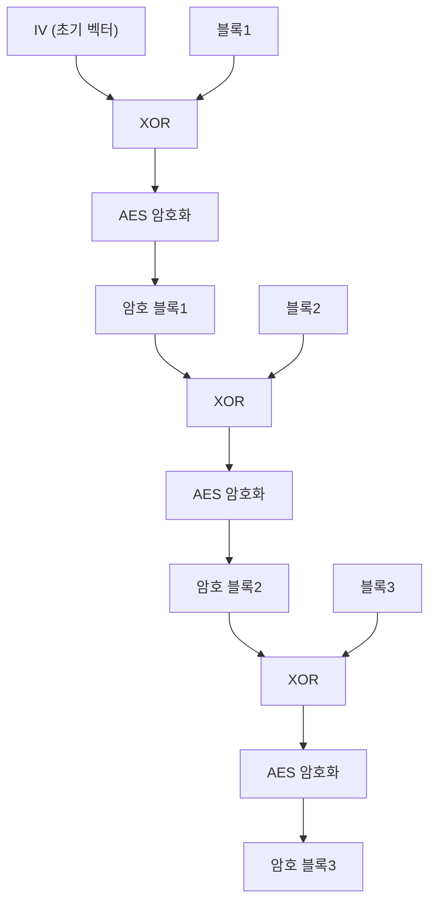
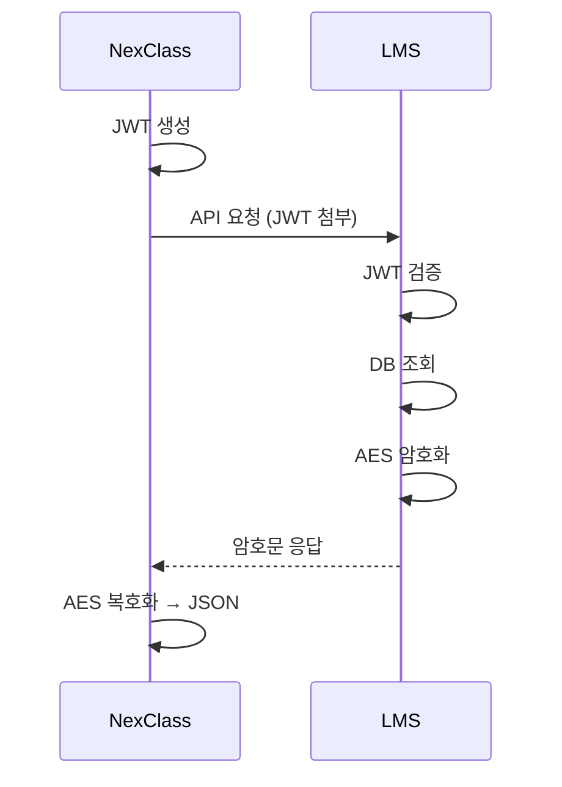

# 06. AES-256 암호화 - Gamma

---

> 👹 "JWT는 '누구야?' 확인하는 거고, AES는 '데이터 보호'하는 거야.
> 이 둘이 왜 같이 쓰이는지 모르면 전체 흐름을 이해 못 한 거야."

---

## 1. AES-256이 뭐야?

### 비유

!!! example "택배 비유"
    택배를 보내는데...

    **일반 택배:**
    → 상자에 물건 넣고 보냄. 택배 기사가 열어볼 수 있음.

    **AES-256 택배:**
    → 상자에 자물쇠 채워서 보냄.
    → 보내는 사람과 받는 사람만 같은 열쇠를 가지고 있음.
    → 택배 기사가 열어볼 수 없음.

    자물쇠 = AES-256 알고리즘
    열쇠 = 암호화 키 ("MediOpi@85oO!!!!")

### 진짜 정의

**AES (Advanced Encryption Standard)**: 미국 정부 표준 대칭키 암호화 알고리즘.

- **AES**: 알고리즘 이름
- **256**: 키 길이 (256비트 = 32바이트)
- **대칭키**: 암호화 키 = 복호화 키 (같은 키 1개)

```
AES-256의 위치:

  AES-128: 키 16바이트. 빠름. 보통 보안.
  AES-192: 키 24바이트. 중간.
  AES-256: 키 32바이트. 느림. 최고 보안. ← 우리가 쓰는 것.

  256이 제일 안전. 미국 기밀문서 암호화에도 쓰임.
```

---

## 2. CBC 모드 - "블록 단위로 암호화"

### AES는 블록 암호화야

```
AES는 16바이트(128비트) 블록 단위로 암호화해.

데이터가 길면?
→ 16바이트씩 잘라서 각각 암호화.

근데 같은 블록이 같은 암호문이 되면?
→ 패턴이 보여. 보안 약해짐.

그래서 "모드"가 필요해.
```

### CBC (Cipher Block Chaining) 모드



!!! tip "CBC 핵심"
    이전 암호 블록이 다음 블록 암호화에 영향을 줌
    → 같은 평문 블록이라도 다른 암호문이 나옴
    → 패턴이 안 보여!

### IV (Initialization Vector) 가 뭐야?

```
첫 번째 블록은 "이전 암호 블록"이 없잖아.
그래서 첫 번째 블록에 XOR할 초기값이 필요해.
그게 IV야.

우리 프로젝트:
  키 = "MediOpi@85oO!!!!"  (16자)
  IV = "MediOpi@85oO!!!!"  (키와 동일)

  ⚠️ 실무에서 키와 IV를 같게 쓰는 건 좋은 습관은 아니야.
     원래는 랜덤 IV를 써야 보안이 좋아.
     근데 LMS가 이렇게 정했으니까 따라야 해.
```

### PKCS5Padding은?

```
데이터가 딱 16바이트 배수가 아니면?

예: 데이터가 25바이트
  → 블록1: 16바이트 (꽉 참)
  → 블록2: 9바이트 (7바이트 부족!)

PKCS5Padding: 부족한 만큼 패딩(채움) 값을 넣어.
  → 블록2: 9바이트 + 0x07 0x07 0x07 0x07 0x07 0x07 0x07
  → 7바이트가 부족하니 7(0x07)로 7개 채움

복호화할 때는 패딩을 자동으로 제거해.
```

---

## 3. 우리 프로젝트 AES 설정

```
알고리즘:  AES/CBC/PKCS5Padding
키:       "MediOpi@85oO!!!!" (16바이트 = AES-128 실질)
IV:       키와 동일 ("MediOpi@85oO!!!!")

⚠️ 잠깐! AES-256이라며? 키가 16바이트면 AES-128 아냐?

맞아. 엄밀히 말하면 이건 AES-128이야.
AES-256이려면 키가 32바이트여야 해.
근데 LMS 쪽에서 "AES256"이라고 부르고 있어.
이런 경우 실무에서 종종 있어. 이름과 실제가 다른 경우.
우리는 LMS 규격에 맞추면 돼.
```

### 코드로 보자

```java
// AES256Util.java (우리가 만든 것)

public class AES256Util {
    private final String iv;              // 초기 벡터
    private final SecretKeySpec keySpec;  // 암호화 키

    // 생성자: 키를 받아서 IV와 KeySpec 준비
    public AES256Util(String key) {
        this.iv = key.substring(0, 16);   // IV = 키의 앞 16자

        byte[] keyBytes = new byte[16];   // 16바이트 배열 준비
        byte[] b = key.getBytes(StandardCharsets.UTF_8);  // 키를 바이트로
        int len = Math.min(b.length, keyBytes.length);    // 길이 맞추기
        System.arraycopy(b, 0, keyBytes, 0, len);         // 복사

        this.keySpec = new SecretKeySpec(keyBytes, "AES"); // AES 키 객체 생성
    }

    // 복호화: 암호문 → 원본 JSON
    public String decrypt(String encrypted) throws GeneralSecurityException {
        // ① AES/CBC/PKCS5Padding 방식의 Cipher(암호기) 준비
        Cipher cipher = Cipher.getInstance("AES/CBC/PKCS5Padding");

        // ② 복호화 모드로 초기화 (키 + IV)
        cipher.init(
            Cipher.DECRYPT_MODE,           // 복호화!
            keySpec,                        // 키
            new IvParameterSpec(iv.getBytes(StandardCharsets.UTF_8))  // IV
        );

        // ③ Base64 디코딩 (암호문은 Base64로 인코딩되어 전송됨)
        byte[] decoded = Base64.getDecoder().decode(encrypted);

        // ④ 실제 복호화 수행
        return new String(cipher.doFinal(decoded), StandardCharsets.UTF_8);
    }
}
```

**한 줄씩 뭐 하는 거야?**

```
① Cipher.getInstance("AES/CBC/PKCS5Padding")
   → "AES 알고리즘, CBC 모드, PKCS5 패딩" 쓸 거야

② cipher.init(DECRYPT_MODE, keySpec, ivSpec)
   → 복호화 모드로 준비해. 키랑 IV 여기 있어.

③ Base64.getDecoder().decode(encrypted)
   → 암호문이 Base64 문자열로 왔으니까 먼저 바이트로 변환

④ cipher.doFinal(decoded)
   → 진짜 복호화! 바이트 → 원본 바이트 → String
```

---

## 4. JWT와 AES의 역할 분담

### 완전히 다른 목적이야

!!! note "JWT vs AES 역할 분담"
    **JWT (인증):**
    "너 누구야? 진짜 NexClass 맞아?"
    → 요청할 때 보내는 것
    → NexClass → LMS 방향

    **AES (암호화):**
    "데이터 보내줄게, 근데 암호화해서 보낼 거야"
    → 응답을 보호하는 것
    → LMS → NexClass 방향

### 타임라인으로 보면



| 단계 | 기술 | 방향 | 목적 |
|------|------|------|------|
| 요청 | JWT | NexClass → LMS | 인증 (너 누구야?) |
| 응답 | AES | LMS → NexClass | 데이터 보호 (개인정보 암호화) |

### 둘 다 없으면?

```
JWT 없이:
  아무나 LMS API 호출 가능 → 5만 명 개인정보 유출

AES 없이:
  인증은 하지만 응답이 평문 JSON → 네트워크 도청 시 개인정보 노출

둘 다 없으면:
  아무나 호출 + 데이터 평문 전송 = 재앙
```

---

## 5. 대칭키 vs 비대칭키 (더 깊이)

### 대칭키 (AES) - 우리가 쓰는 것

```
같은 키 1개:

  LMS:       키 A로 잠금   ──전송──→   NexClass: 키 A로 열기

  장점: 빠름. 대용량 데이터에 적합.
  단점: 키를 어떻게 안전하게 전달하냐? (키 교환 문제)

  우리 경우: 키를 설정 파일에 미리 약속해놨음.
  → 키 교환 문제 없음. 이미 양쪽이 알고 있으니까.
```

### 비대칭키 (RSA) - 참고용

```
키 2개 (공개키, 비밀키):

  보내는 쪽: 상대방의 공개키로 잠금 → 전송
  받는 쪽: 자기의 비밀키로 열기

  장점: 키 교환 문제 없음. 공개키는 공개해도 됨.
  단점: 느림. 대용량 데이터에 부적합.

  실전에서는?
  → HTTPS(TLS)가 비대칭키로 "세션 키"를 교환한 뒤,
    그 세션 키(대칭키)로 실제 데이터를 암호화.
  → 두 방식의 장점을 조합!
```

---

## 6. 주의사항 / 함정

### 함정 1: "AES가 있으니까 JWT는 필요 없지 않아?"

```
❌ AES는 데이터를 보호하는 거야. "누가 요청했는지"는 모르잖아.
   AES만 있으면 → 아무나 키만 알면 데이터 가져갈 수 있어.
   JWT가 있어야 → "등록된 앱만" 데이터를 요청할 수 있어.
```

### 함정 2: "JWT가 있으니까 AES는 필요 없지 않아?"

```
❌ JWT는 인증만 하는 거야. 데이터 자체를 보호 안 해.
   JWT만 있으면 → 인증은 되지만, 응답 데이터가 평문으로 전송.
   네트워크 중간에서 도청하면 개인정보 다 보여.
```

### 함정 3: "키가 16자니까 AES-128이잖아. AES-256이라고 하면 거짓말 아냐?"

```
△ 엄밀히 맞아. 16바이트 키 = AES-128이야.
   근데 LMS 코드에서 클래스 이름이 AES256Util이야.
   이런 경우 실무에서 종종 있어. "이름 ≠ 실제" 케이스.
   중요한 건 LMS와 같은 방식으로 복호화하는 거야.
   이름에 집착하지 말고 실제 동작에 집중해.
```

### 함정 4: "복호화 실패하면 뭐가 문제야?"

```
복호화 실패 원인:
  1. 키가 다름 → LMS와 NexClass의 키가 불일치
  2. IV가 다름 → IV 설정이 다름
  3. 패딩 방식 다름 → PKCS5 vs PKCS7 vs NoPadding
  4. 인코딩 다름 → UTF-8 vs EUC-KR

  → 에러 메시지: javax.crypto.BadPaddingException
  → "패딩이 잘못됐다" = 대부분 키/IV/모드가 안 맞는 거야.
```

---

## 7. 정리

| 질문 | 답 |
|------|-----|
| AES-256이 뭐야? | 대칭키 블록 암호화 알고리즘. 같은 키로 잠그고 풂. |
| CBC가 뭐야? | 이전 블록 암호문을 다음 블록에 연쇄시키는 모드. 패턴 방지. |
| IV가 뭐야? | 첫 블록에 쓰는 초기값. 같은 평문도 다른 암호문으로 만듦. |
| JWT랑 뭐가 달라? | JWT=인증(누구야?), AES=암호화(데이터 보호). 목적이 완전 다름. |
| 우리 프로젝트에서? | LMS가 AES로 암호화한 응답을 NexClass가 복호화. |

**이 챕터에서 반드시 기억할 것**:
- JWT는 **인증**, AES는 **데이터 보호**. 둘 다 필요해.
- AES/CBC/PKCS5Padding = 알고리즘/모드/패딩
- 키와 IV가 양쪽에서 같아야 복호화 성공

---

### 확인 문제 (4문제)

> 다음 문제를 풀어봐. 답 못 하면 위에서 다시 읽어.

**Q1.** JWT와 AES의 역할을 각각 한 줄로 말해봐. 요청/응답 어느 방향에서 쓰여?

**Q2.** AES에서 CBC 모드를 쓰는 이유가 뭐야? 안 쓰면 뭐가 문제야?

**Q3.** 복호화할 때 `BadPaddingException`이 나왔어. 원인 3가지를 말해봐.

**Q4.** 대칭키 암호화의 "키 교환 문제"가 뭐야? 우리 프로젝트에서는 이 문제가 있어 없어?

??? success "정답 보기"
    **A1.** JWT: "너 누구야?" 인증. 요청 방향(NexClass→LMS). AES: 데이터 보호. 응답 방향(LMS→NexClass).

    **A2.** CBC를 안 쓰면(ECB 모드) 같은 평문 블록이 항상 같은 암호문이 돼서 패턴이 보여. CBC는 이전 암호 블록을 다음 블록에 연쇄시켜서 같은 평문이라도 다른 암호문을 만들어. 패턴이 안 보여.

    **A3.**

    1. 키가 LMS와 NexClass에서 다름.
    2. IV가 다름.
    3. 패딩 방식이 다름 (PKCS5/PKCS7/NoPadding 불일치).

    **A4.** 대칭키는 같은 키를 양쪽이 가져야 하는데, 이 키를 어떻게 안전하게 전달하느냐가 문제야 (네트워크로 보내면 도청 가능). 우리 프로젝트에서는 키를 설정 파일에 미리 약속해놨으니까 키 교환 문제가 없어.
