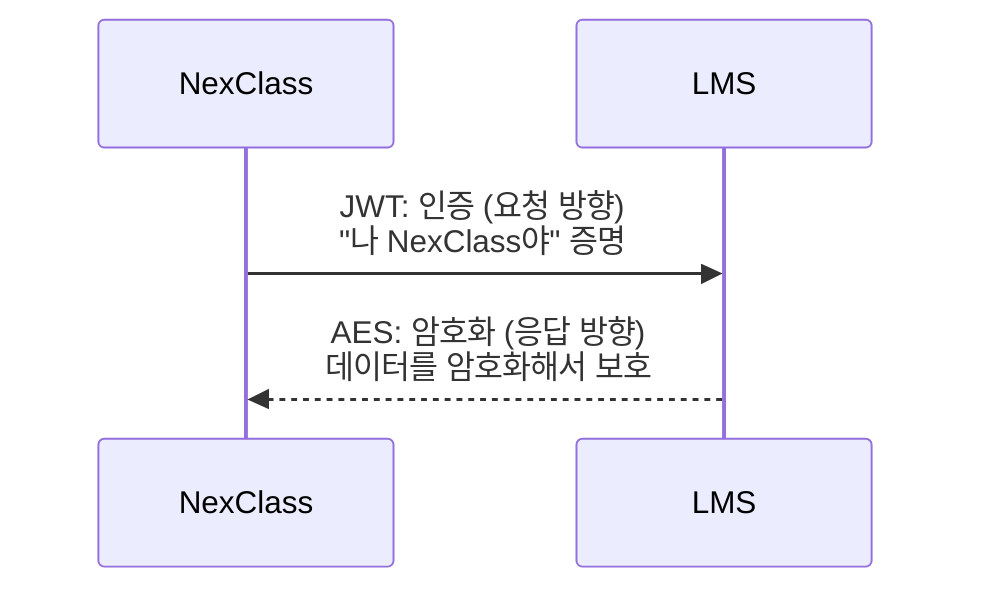

# 10. 빠싺 최종시험 - 정답 및 해설

---

> **"정답 맞히는 건 시작이야. 왜 그게 정답인지 설명 못 하면 불합격."**
>
> 이건 정답지가 아니야. **해설지**야.
> 정답만 보고 넘어가면 Lv1에서 영원히 못 벗어나.
> 틀린 문제는 해당 챕터 다시 읽고 와.

---

## Part 1: 객관식 (각 2점)

### Q1. JWT 인증 정보 관리 방식 (객관식, 2점)

**정답**: **(B) 토큰 자체에 정보를 담아서 클라이언트가 보관**

**해설**:

| 보기 | 왜 틀렸는가 (또는 왜 맞는가) |
|------|-------------------------------|
| (A) | 이건 세션 방식. JWT는 서버에 아무것도 저장 안 해. |
| (B) | ✅ JWT의 핵심. Payload에 정보가 들어있고 클라이언트가 보관. |
| (C) | JWT는 DB 저장 불필요. 토큰 자체가 증명. |
| (D) | 쿠키에 ID/PW 저장은 Basic Auth도 아니고 그냥 위험한 짓. |

→ 01_Alpha_JWT가_뭐야.md 2절 참조

---

### Q2. Base64의 정체 (객관식, 2점)

**정답**: **(C) 인코딩 방식**

**해설**:

| 보기 | 왜 틀렸는가 (또는 왜 맞는가) |
|------|-------------------------------|
| (A) | 암호화는 키가 필요해. Base64는 키 없이 누구나 되돌림. |
| (B) | 해싱은 단방향. Base64는 양방향(인코딩↔디코딩). |
| (C) | ✅ 형식 변환. 비밀 아님. 누구나 디코딩 가능. |
| (D) | 서명은 HMAC-SHA256 같은 거. Base64는 서명 아님. |

→ 02_Alpha_암호화_인코딩_해싱.md 2절 참조

---

### Q3. 단방향인 것 (객관식, 2점)

**정답**: **(C) HMAC-SHA256 해싱**

**해설**:

| 보기 | 왜 틀렸는가 (또는 왜 맞는가) |
|------|-------------------------------|
| (A) | AES는 키로 복호화 가능. 양방향. |
| (B) | Base64는 디코딩 가능. 양방향. |
| (C) | ✅ 해싱은 원본 복원 불가. 감자→감자칩, 감자칩→감자 안 됨. |
| (D) | RSA도 비밀키로 복호화 가능. 양방향. |

→ 02_Alpha_암호화_인코딩_해싱.md 4절 참조

---

### Q4. Payload 변조 감지 방법 (객관식, 2점)

**정답**: **(C) SECRET_KEY로 서명을 다시 만들어서 비교**

**해설**:

| 보기 | 왜 틀렸는가 (또는 왜 맞는가) |
|------|-------------------------------|
| (A) | Payload는 암호화가 아니라 인코딩. "복호화"라는 개념이 없어. |
| (B) | Header 확인만으로는 Payload 변조를 감지 못 해. |
| (C) | ✅ Header+변조된Payload+SECRET_KEY로 서명 재생성 → 원래 서명과 비교 → 불일치 → 위조 감지 |
| (D) | Base64 디코딩은 누구나 하는 거고 변조 감지와 무관. |

→ 03_Beta_JWT_3조각_해부.md 4절 참조

---

### Q5. Payload에 넣으면 안 되는 것 (객관식, 2점)

**정답**: **(C) 사용자 비밀번호**

**해설**:

| 보기 | 왜 틀렸는가 (또는 왜 맞는가) |
|------|-------------------------------|
| (A) | APP_KEY는 공개 정보. 넣어도 됨. |
| (B) | exp는 표준 클레임. 당연히 넣어야 함. |
| (C) | ✅ Payload는 Base64 인코딩일 뿐. 누구나 디코딩해서 읽을 수 있어. 비밀번호 넣으면 유출. |
| (D) | iat도 표준 클레임. 넣어도 됨. |

→ 03_Beta_JWT_3조각_해부.md 3절 참조

---

### Q6. JWT 전달 형식 (객관식, 2점)

**정답**: **(C) Authorization: Bearer eyJhbGci...**

**해설**:

| 보기 | 왜 틀렸는가 (또는 왜 맞는가) |
|------|-------------------------------|
| (A) | 쿠키는 세션 방식. JWT는 보통 헤더로 전달. |
| (B) | "Bearer" 접두어가 빠져있어. 서버가 인증 방식을 식별 못 함. |
| (C) | ✅ Bearer는 "이건 JWT 인증이야"라는 표준 접두어. |
| (D) | X-Token은 비표준 헤더. 쓸 수는 있지만 표준은 Authorization. |

→ 04_Beta_JWT_생성과_검증.md 3절 참조

---

### Q7. JWT를 쓰는 가장 큰 이유 (객관식, 2점)

**정답**: **(B) 서버↔서버 통신이라 브라우저/쿠키가 없으니까**

**해설**:

| 보기 | 왜 틀렸는가 (또는 왜 맞는가) |
|------|-------------------------------|
| (A) | 속도 차이는 핵심 이유가 아님. |
| (B) | ✅ NexClass→LMS는 서버↔서버. 브라우저 없으니 세션/쿠키 불가. JWT가 유일한 선택지. |
| (C) | 일반적으로 JWT가 세션보다 보안이 좋다고 단정할 수 없어. 각각 장단점이 있음. |
| (D) | Java 17에서 세션 지원 안 한다는 건 거짓. |

→ 05_Gamma_API_인증과_JWT.md 3절 참조

---

### Q8. 대칭키의 의미 (객관식, 2점)

**정답**: **(B) 암호화 키와 복호화 키가 같다**

**해설**:

| 보기 | 왜 틀렸는가 (또는 왜 맞는가) |
|------|-------------------------------|
| (A) | 알고리즘이 같다는 건 당연하고 "대칭"의 의미가 아님. |
| (B) | ✅ 대칭 = 같은 키 1개로 잠그고 풀기. LMS와 NexClass가 같은 키 공유. |
| (C) | 블록 크기(128bit)와 키 크기(128/192/256bit)는 다를 수 있어. |
| (D) | AES는 패딩 때문에 출력이 입력보다 커질 수 있어. |

→ 06_Gamma_AES256_암호화.md 1절 참조

---

### Q9. JWT의 가장 큰 보안 약점 (객관식, 2점)

**정답**: **(C) 탈취된 토큰을 서버에서 즉시 무효화하기 어렵다**

**해설**:

| 보기 | 왜 틀렸는가 (또는 왜 맞는가) |
|------|-------------------------------|
| (A) | 토큰 크기는 불편하지만 "가장 큰 약점"은 아님. |
| (B) | HS256 서명은 충분히 강함. 위조는 현실적으로 불가능. |
| (C) | ✅ 서버가 토큰을 저장 안 하니까 개별 무효화 불가. 만료까지 기다려야 함. 세션은 서버에서 삭제하면 끝. |
| (D) | Payload 미암호화는 약점이지만, 비밀 데이터 안 넣으면 됨. "가장 큰" 약점은 아님. |

→ 07_Delta_JWT_보안_설계.md 1절 참조

---

### Q10. 동기화 순서 이유 (객관식, 2점)

**정답**: **(C) 의존성 순서 (참조하는 데이터가 먼저 있어야 함)**

**해설**:

| 보기 | 왜 틀렸는가 (또는 왜 맞는가) |
|------|-------------------------------|
| (A) | 알파벳은 관계없어. |
| (B) | 크기 순서가 아니라 의존성 순서. |
| (C) | ✅ crsUsers는 crs+users 참조, crs는 term 참조. 참조 대상이 먼저 있어야 저장 가능. |
| (D) | LMS API는 순서 제약 없이 개별 호출 가능. NexClass가 순서를 지켜야 하는 거. |

→ 08_Omega_NexClass_LMS_실전.md 7절 참조

---

## Part 2: 단답형 (각 3점)

### Q11. 세션 + 서버 3대 문제 (단답형, 3점)

**정답**: 사용자가 서버1에서 로그인했는데 다음 요청이 서버2로 가면 세션이 없어서 인증 실패함 (세션 동기화/공유 문제).

**채점 기준**: "세션이 특정 서버에만 있어서 다른 서버에서 인증 못 함" 취지 포함 시 만점. 단순히 "세션 문제"만 쓰면 1점.

→ 01_Alpha_JWT가_뭐야.md 3절 참조

---

### Q12. 인코딩/해싱/암호화 사용처 (단답형, 3점)

**정답**:
- 인코딩: JWT Header/Payload를 Base64로 인코딩 (형식 변환)
- 해싱: JWT Signature를 HMAC-SHA256으로 생성 (위조 방지)
- 암호화: LMS 응답 데이터를 AES-256으로 암호화 (데이터 보호)

**채점 기준**: 3개 모두 정확 = 3점, 2개 = 2점, 1개 = 1점.

→ 02_Alpha_암호화_인코딩_해싱.md 5절 참조

---

### Q13. APP_KEY vs SECRET_KEY (단답형, 3점)

**정답**:
- APP_KEY: "나 누구야" 식별용 공개 정보. Payload에 넣어서 보냄.
- SECRET_KEY: 서명 생성/검증용 비밀 정보. 노출되면 유효한 JWT를 아무나 만들 수 있어서 인증 시스템 뚫림.

**채점 기준**: "공개 vs 비밀" + "역할 차이" 포함 시 만점. 한쪽만 = 1.5점.

→ 03_Beta_JWT_3조각_해부.md 6절 참조

---

### Q14. Unix 타임스탬프 (단답형, 3점)

**정답**: 1970년 1월 1일 00:00:00 UTC부터 경과한 초(seconds) 수. JWT에서 쓰는 이유: 시간대(timezone) 상관없이 전 세계가 같은 숫자를 사용할 수 있고, 컴퓨터가 비교하기 쉬우니까(큰 숫자 = 미래).

**채점 기준**: "1970년부터 초 단위" + "시간대 무관/비교 용이" 포함 시 만점. 정의만 = 2점.

→ 03_Beta_JWT_3조각_해부.md 3절 참조

---

### Q15. signWith의 역할 (단답형, 3점)

**정답**: Signature (서명). SECRET_KEY와 HS256 알고리즘으로 Header+Payload에 대한 HMAC-SHA256 해시값을 생성한다.

**채점 기준**: "Signature" 명시 시 2점. + 동작 설명 포함 시 3점.

→ 04_Beta_JWT_생성과_검증.md 2절 참조

---

### Q16. LMS 401 원인 3가지 (단답형, 3점)

**정답**:
1. 서명 불일치 (SECRET_KEY가 다르거나 토큰 위조)
2. 토큰 만료 (exp 시각 지남)
3. APP_KEY 미등록 (LMS에 등록되지 않은 앱)

**채점 기준**: 3가지 모두 = 3점, 2가지 = 2점, 1가지 = 1점.

→ 05_Gamma_API_인증과_JWT.md 5절 참조

---

### Q17. IV와 CBC (단답형, 3점)

**정답**: IV(Initialization Vector)는 CBC 모드에서 첫 번째 블록을 암호화할 때 XOR할 초기값. CBC는 이전 암호 블록을 다음 블록에 연쇄시키는데, 첫 블록은 "이전 블록"이 없으니까 IV가 대신 역할을 해.

**채점 기준**: "첫 블록용 초기값" + "이전 블록이 없어서 필요" 취지 포함 시 만점.

→ 06_Gamma_AES256_암호화.md 2절 참조

---

### Q18. Refresh Token 불필요 이유 (단답형, 3점)

**정답**: 서버↔서버 통신이라 사람이 없음. 코드가 APP_KEY + SECRET_KEY를 가지고 있으니까 토큰이 만료되면 바로 새로 만들면 됨. "다시 로그인" 개념이 없어서 Refresh Token이 필요 없음.

**채점 기준**: "코드가 키를 알고 있어서 바로 재발급 가능" 취지 포함 시 만점.

→ 07_Delta_JWT_보안_설계.md 5절 참조

---

## Part 3: 코드 작성/분석 (각 5점)

### Q19. JWT 생성 코드 분석 (코드 분석, 5점)

**정답**:
```java
Jwts.builder()
    .claim("appKey", "knu-lms-2026")   // Payload (비공개 클레임)
    .issuedAt(new Date())               // Payload (iat 등록 클레임)
    .signWith(key, Jwts.SIG.HS256)      // Signature (서명 생성)
    .compact();                          // 3조각 합치기 (Header.Payload.Signature)
```

**채점 기준**: 4개 모두 정확 = 5점, 3개 = 4점, 2개 = 3점, 1개 = 1점. Header는 Jwts.builder()가 자동 생성하므로 compact()의 답으로 "Header+Payload+Signature 합치기"도 정답.

→ 04_Beta_JWT_생성과_검증.md 2절 참조

---

### Q20. AES 복호화 코드 분석 (코드 분석, 5점)

**정답**:
```
① AES/CBC/PKCS5Padding 방식의 Cipher(암호기) 객체를 생성
② 복호화 모드로 초기화 (키와 IV 설정)
③ 암호문이 Base64 인코딩되어 왔으니까 먼저 바이트 배열로 디코딩
④ 실제 AES 복호화 수행 → 바이트 배열 → String으로 변환 (원본 JSON)
```

**채점 기준**: 4단계 모두 설명 = 5점, 3단계 = 4점, 2단계 = 3점. ③에서 "Base64 디코딩" 빠지면 -1점 (암호문이 Base64로 전송됐다는 것을 아는 게 중요).

→ 06_Gamma_AES256_암호화.md 3절 참조

---

### Q21. HTTP 요청 분석 (코드 분석, 5점)

**정답**:
```
POST /vc/api/sync/term?orgCd=ORG0000001 HTTP/1.1
→ POST 메서드로 학기(term) 동기화 API 호출. 기관코드 ORG0000001.

Authorization: Bearer eyJhbGci...
→ JWT 토큰을 Bearer 방식으로 첨부. LMS가 이걸로 인증.

Content-Type: application/json
→ Body가 JSON 형식이라는 것을 알려줌.

{"pageNumber": 0, "pageSize": 1000}
→ 0번째 페이지(첫 페이지), 1000개씩 요청하는 페이징 정보.
```

**채점 기준**: 4줄 모두 설명 = 5점, 3줄 = 4점. pageNumber가 0부터 시작한다는 것 명시하면 보너스.

→ 05_Gamma_API_인증과_JWT.md 4절 참조

---

### Q22. 페이징 + 토큰 만료 문제 (코드 분석, 5점)

**정답**:

문제점: 토큰을 1번만 생성해서 52페이지 동안 재사용하는데, 52페이지를 도는 데 30분이 넘으면 토큰이 만료되어 401 에러 발생.

수정 방법 (둘 중 하나):

```java
// 방법 1: 매 페이지마다 새 토큰 생성
for (int page = 0; page < 52; page++) {
    String token = generateToken();  // 루프 안에서 매번 생성
    String response = callLmsApi("users", page, token);
}

// 방법 2: 만료 체크 후 필요시 재발급
String token = generateToken();
for (int page = 0; page < 52; page++) {
    if (isTokenExpired(token)) {
        token = generateToken();  // 만료됐으면 재발급
    }
    String response = callLmsApi("users", page, token);
}
```

**채점 기준**: 문제점 식별 = 2점. 수정 코드 = 3점. 문제점 없이 코드만 쓰면 3점.

→ 07_Delta_JWT_보안_설계.md 6절 참조

---

### Q23. 맞는 것 / 틀린 것 (코드 분석, 5점)

**정답**:

| 보기 | O/X | 이유 |
|------|-----|------|
| (A) | ❌ | Payload는 Base64 인코딩일 뿐 암호화가 아님. 누구나 디코딩해서 읽을 수 있어. |
| (B) | ✅ | 해싱은 단방향. 해시값에서 원본 복원 불가능. |
| (C) | ❌ | AES-256은 대칭키 암호화. 같은 키로 암호화/복호화. 비대칭은 RSA. |
| (D) | ❌ | Base64는 인코딩. 키 없이 누구나 디코딩 가능. |

**채점 기준**: 4개 모두 O/X + 이유 = 5점, O/X만 맞으면 3점, 3개 = 4점, 2개 = 3점.

→ 02_Alpha_암호화_인코딩_해싱.md 전체 참조

---

### Q24. JWT + AES 역할 다이어그램 (코드 분석, 5점)

**정답**:



정리: JWT = 요청 방향(NexClass→LMS), 인증 목적. AES = 응답 방향(LMS→NexClass), 데이터 보호 목적.

**채점 기준**: 방향 정확 = 2점, 역할(인증/암호화) 정확 = 2점, 다이어그램 표현 = 1점.

→ 06_Gamma_AES256_암호화.md 4절, 08_Omega_NexClass_LMS_실전.md 참조

---

### Q25. BadPaddingException 원인과 확인 방법 (코드 분석, 5점)

**정답**:

| 원인 | 확인 방법 |
|------|-----------|
| 키 불일치 | application.properties의 aes-key와 LMS의 키가 같은지 확인 |
| IV 불일치 | IV 설정이 양쪽에서 동일한지 확인 (우리는 키=IV) |
| 패딩 방식 불일치 | PKCS5Padding인지 양쪽 확인 (PKCS7, NoPadding과 혼동) |

**채점 기준**: 원인 3개 = 3점 + 확인 방법 = 2점.

→ 06_Gamma_AES256_암호화.md 6절 참조

---

## Part 4: 서술형 (배점 다름)

### Q26. API 인증과 JWT (서술형, 4점)

**정답**:

API 인증은 API를 호출하는 쪽이 "나 누구야"를 증명하는 과정이다. 비공개 API는 인가된 시스템만 호출할 수 있어야 하기 때문에 인증이 필수다. JWT는 서명된 토큰으로 신원을 증명하며, 서버가 아무것도 저장하지 않고도 검증할 수 있다. 특히 서버↔서버 통신에서는 브라우저/쿠키가 없어서 세션을 쓸 수 없기 때문에 JWT가 적합하다. NexClass→LMS 호출 시 JWT를 Authorization 헤더에 첨부하면, LMS는 서명을 검증해서 인가된 시스템인지 확인한다.

**채점 기준**: API 인증 정의(1점) + 왜 필요한지(1점) + JWT 작동 방식(1점) + 서버↔서버 특수성(1점). "이거 불합격" 기준: "JWT는 보안이 좋아서 쓴다" 같은 추상적 답변.

→ 01_Alpha_JWT가_뭐야.md, 05_Gamma_API_인증과_JWT.md 참조

---

### Q27. SECRET_KEY 노출 위험과 관리 (서술형, 4점)

**정답**:

SECRET_KEY가 노출되면 공격자가 유효한 JWT를 직접 만들 수 있다. 만료 시간도 마음대로 설정 가능하고, 인증 시스템이 완전히 뚫려서 5만 명 개인정보에 접근할 수 있다. 따라서 코드에 하드코딩하면 안 되고, 설정 파일(application.properties)로 분리해야 한다. 더 안전하게는 환경변수나 비밀 관리 서비스(AWS Secrets Manager 등)를 사용한다. 우리 프로젝트는 설정 파일 분리 + @Value 주입 방식을 사용한다.

**채점 기준**: 노출 시 위험(1.5점) + 관리 방법 2가지 이상(1.5점) + 우리 프로젝트 방식(1점). "이거 불합격" 기준: "코드에 넣으면 안 된다"만 쓰고 왜인지 설명 없는 경우.

→ 07_Delta_JWT_보안_설계.md 3절 참조

---

### Q28. 무결성 vs 기밀성 (서술형, 5점)

**정답**:

무결성(Integrity)은 "데이터가 변조되지 않았음"을 보장하는 것이고, 기밀성(Confidentiality)은 "데이터를 허가되지 않은 자가 읽을 수 없음"을 보장하는 것이다.

JWT에서:
- 무결성: Signature(HMAC-SHA256)가 담당. Payload가 변조되면 서명이 불일치해서 감지 가능. 하지만 Payload 자체는 누구나 읽을 수 있으므로 기밀성은 없다.
- 기밀성: JWT 자체에는 없다. Payload는 Base64 인코딩일 뿐. LMS 응답의 기밀성은 AES-256이 담당한다.

정리하면 JWT의 서명은 "못 바꾸게" 하는 것이지 "못 읽게" 하는 게 아니다.

**채점 기준**: 무결성 정의(1점) + 기밀성 정의(1점) + JWT에서 무결성 담당(1점) + JWT에 기밀성 없음(1점) + AES가 기밀성 담당(1점). "이거 불합격" 기준: "JWT는 암호화되어 있어서 기밀성이 있다."

→ 02_Alpha_암호화_인코딩_해싱.md, 06_Gamma_AES256_암호화.md 참조

---

### Q29. 만료 시간 트레이드오프 (서술형, 4점)

**정답**:

5분: 탈취돼도 5분만 유효해서 보안이 강하지만, 자주 재발급해야 해서 효율이 떨어진다. 긴 작업 중에 만료되면 재발급 로직이 필수다.

24시간: 한 번 발급으로 오래 사용 가능해서 편하지만, 탈취되면 24시간 동안 무방비 상태다.

우리 프로젝트는 30분으로 설정했다. 이유: 동기화 작업 1회가 보통 5~15분이라 30분이면 충분하고, 탈취돼도 30분 후 자동 무효화되어 적절한 균형점이다. 서버↔서버 통신이라 토큰 재생성 비용이 거의 없어서 짧게 유지해도 부담이 없다.

**채점 기준**: 5분 장단점(1점) + 24시간 장단점(1점) + 우리 프로젝트 설정과 이유(2점). "이거 불합격" 기준: 트레이드오프 없이 "짧을수록 좋다"만 쓴 경우.

→ 07_Delta_JWT_보안_설계.md 2절, 6절 참조

---

### Q30. 페이징과 JWT 만료 해결 (서술형, 4점)

**정답**:

5만 명 이상의 사용자 데이터를 한 번에 가져오면 메모리 부족, 네트워크 타임아웃, LMS 서버 부하 문제가 발생한다. 그래서 1000명씩 나눠서 52페이지로 요청하는 페이징이 필요하다.

JWT 만료 해결 방법:
1. 매 페이지 요청마다 토큰을 새로 생성: 만료 걱정 없음. 토큰 생성 비용은 미미해서 부담 없음.
2. 요청 전 만료 여부 체크 후 필요시 재발급: 토큰 생성 횟수를 줄이면서도 만료 문제를 해결. 약간 복잡하지만 효율적.

**채점 기준**: 페이징 필요 이유(1점) + 해결 방법 2가지(각 1.5점). "이거 불합격" 기준: "토큰 만료시간을 늘리면 된다"만 쓴 경우 (근본 해결이 아님).

→ 08_Omega_NexClass_LMS_실전.md 7절, 07_Delta_JWT_보안_설계.md 참조

---

## 배점 총정리

| Part | 문항 | 만점 |
|------|------|------|
| Part 1: 객관식 | Q1~Q10 (각 2점) | 20점 |
| Part 2: 단답형 | Q11~Q18 (각 3점) | 24점 |
| Part 3: 코드 분석 | Q19~Q25 (각 5점) | 35점 |
| Part 4: 서술형 | Q26~Q30 (다양) | 21점 |
| **합계** | **30문제** | **100점** |

---

!!! quote "마무리"
    80점 넘겼어? 그럼 다음 단계로.
    못 넘겼어? 틀린 문제의 참조 챕터 다시 읽고 와.

    "Were you rushing or were you dragging?"
