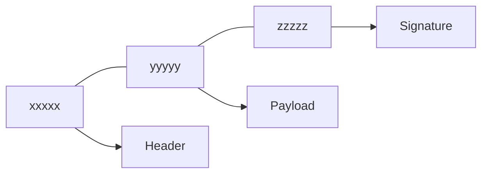
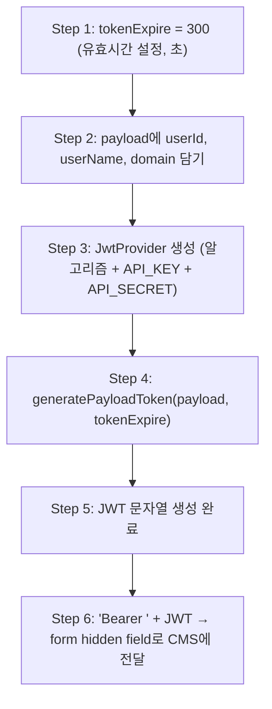
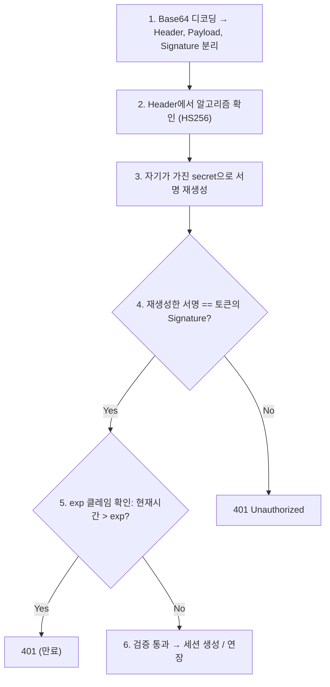

# 01. JWT (JSON Web Token) 기본 구조

> 👹 "토큰 유효시간이 300초인데 뭐가 문제인지 모르겠다고?
> 그건 JWT가 뭔지 모르니까 그래. 처음부터 간다."

---

## JWT가 뭐야

**한 줄 정의**: 서버가 클라이언트한테 "너 누구야"를 증명하는 **서명된 JSON 데이터**

기존 세션 방식과 비교하면:

| 구분 | 세션 (Session) | JWT |
|------|---------------|-----|
| 상태 저장 | 서버 메모리에 저장 | 클라이언트가 들고 다님 |
| 확인 방법 | 서버가 세션 ID로 조회 | 서버가 서명 검증 |
| 서버 부담 | 사용자 많으면 메모리 증가 | 서명 검증만 하면 됨 |
| 만료 관리 | 서버가 세션 삭제 | 토큰 안에 만료시간 내장 |

핵심: **JWT는 서버가 아니라 토큰 자체에 정보가 들어있다.**

---

## JWT 구조: 세 조각

JWT는 `.`으로 구분된 세 덩어리다:



### 1. Header (헤더)

"이 토큰을 어떻게 암호화했는지" 알려주는 메타 정보

```json
{
  "alg": "HS256",
  "typ": "JWT"
}
```

- `alg`: 서명 알고리즘 (HS256 = HMAC + SHA-256)
- `typ`: 토큰 타입

### 2. Payload (페이로드)

**실제 데이터**가 들어가는 곳. 이걸 **Claims(클레임)**이라 부른다.

```json
{
  "userId": "20231234",
  "userName": "이준성",
  "domain": "localhost",
  "iat": 1709020800,
  "exp": 1709021100
}
```

| 클레임 | 의미 | 비고 |
|--------|------|------|
| `iat` | Issued At (발급 시간) | Unix timestamp |
| `exp` | Expiration (만료 시간) | Unix timestamp |
| `userId` | 사용자 ID | 커스텀 클레임 |
| `domain` | 도메인 | 커스텀 클레임 |

**여기서 핵심:**
- `exp` = `iat` + `tokenExpire`
- `tokenExpire = 300`이면 → 발급 후 300초(5분) 뒤에 만료
- `tokenExpire = 3600`이면 → 발급 후 3600초(1시간) 뒤에 만료

### 3. Signature (서명)

"이 토큰이 위조되지 않았음"을 증명하는 서명

```
HMACSHA256(
  base64UrlEncode(header) + "." + base64UrlEncode(payload),
  secret
)
```

서명 검증 원리:
1. 서버가 `header + payload`를 같은 secret으로 다시 서명
2. 결과가 토큰의 signature와 일치하면 → 유효
3. 불일치하면 → **위조됨 (401 Unauthorized)**

---

## 우리 프로젝트에서 JWT가 만들어지는 과정

`mediopia_cms_pop.jsp`의 코드를 해부하자:



여기서 `Constants.CMS_JWT_API_KEY`와 `Constants.CMS_JWT_API_SECRET`은:
- `framework.properties`에서 읽어오는 값
- CMS 서버도 같은 key/secret을 갖고 있어야 서명 검증 가능
- **이게 틀리면 CMS에서 토큰 자체를 거부한다**

---

## Base64 인코딩 ≠ 암호화

> 👹 "JWT는 암호화된 거 아니야?"

**아니다.** Header와 Payload는 Base64Url **인코딩**일 뿐이다.

!!! warning "인코딩 vs 암호화"
    - **인코딩**: 형태 변환 (누구나 되돌릴 수 있음)
    - **암호화**: 키 없으면 못 읽음

즉, JWT 토큰을 가로채면 **페이로드 내용을 누구나 읽을 수 있다.**
그래서 JWT에 비밀번호 같은 민감 정보를 넣으면 안 된다.

Signature가 보장하는 건 **위변조 방지**이지, **기밀성**이 아니다.

---

## JWT 검증 순서 (서버 측)

CMS 서버가 JWT를 받으면 이 순서로 검증한다:



**5번이 오늘 문제의 핵심이다.**
`exp`가 5분 후로 설정되어 있으니, 5분 뒤에 healthCheck가 토큰을 들고 와도 이미 만료 → 세션 연장 불가.

---

## jwt.io로 직접 확인하는 방법

실무에서 "이 토큰 유효시간이 뭐지?" 확인하는 가장 빠른 방법:

1. 브라우저 개발자 도구(F12) → Network 탭
2. CMS 호출 요청 찾기
3. Form Data에서 `jwtToken` 값 복사 ("Bearer " 뒤의 문자열)
4. https://jwt.io 에 붙여넣기
5. Payload 섹션에서 `iat`와 `exp` 확인
6. `exp - iat` = 토큰 유효시간 (초)

```
예시:
iat = 1709020800  (2024-02-27 12:00:00)
exp = 1709021100  (2024-02-27 12:05:00)
차이 = 300초 = 5분
```

> 👹 "업체가 '토큰 유효시간 확인해달라'고 했을 때,
> jwt.io에 붙여넣기만 했으면 5분 만에 끝났어.
> 코드를 안 봐도 되는 방법이 있다는 거야."

---

## 핵심 요약

| 개념 | 한 줄 |
|------|-------|
| JWT | 서명된 JSON. 서버 대신 토큰이 인증 정보를 들고 다님 |
| Header | 알고리즘 정보 |
| Payload | 실제 데이터 + iat/exp |
| Signature | 위변조 방지용 서명 |
| exp | 만료 시간. 이거 지나면 서버가 거부 |
| Base64 | 인코딩이지 암호화가 아님. 누구나 읽을 수 있음 |
| jwt.io | 토큰 디코딩해서 확인하는 도구 |

> 👹 "JWT가 뭔지도 모르면서 토큰 유효시간 문제를 어떻게 찾아.
> 다음 장에서 세션이랑 엮이면 뭐가 터지는지 본다."
