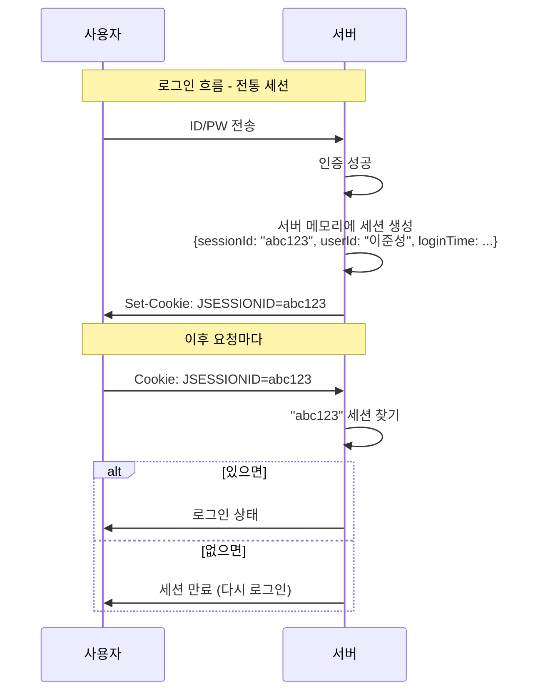
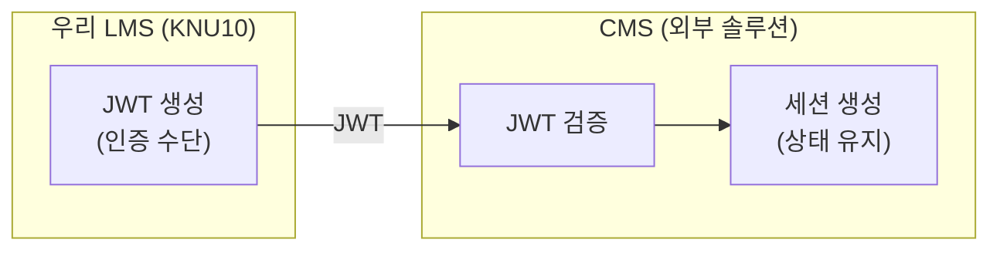

# 02. 세션(Session)과 토큰(Token)의 관계

> 👹 "세션이 뭔지 대충 안다고? 그러면 왜 세션이 풀리는지 설명해봐.
> 못 하잖아. 그러니까 처음부터 제대로 간다."

---

## 세션이란

**한 줄 정의**: 서버가 "이 사용자 로그인 상태"를 기억하는 저장소

---

## CMS는 왜 JWT + 세션 둘 다 쓰는가

여기서 헷갈리기 쉬운 부분:

- **JWT**: LMS → CMS로 "이 사람 맞아"를 증명하는 **일회성 입장권**
- **세션**: CMS 내부에서 "이 사람 로그인 중"을 유지하는 **상태 저장**

**JWT는 문을 열어주는 열쇠고, 세션은 문 안에서의 체류 허가다.**

---

## healthCheck란

CMS가 세션을 유지하는 메커니즘:

!!! abstract "healthCheck 흐름"
    **시간 0초**: 사용자 CMS 접속 (JWT로 인증 → 세션 생성)
    세션 상태: 활성

    **시간 300초**: CMS가 healthCheck 실행
    → "이 세션 아직 유효한가?" 확인
    → JWT 토큰 재검증
    → 유효하면 → 세션 연장
    → 만료면 → 세션 종료

    **시간 600초**: 또 healthCheck
    → 반복...

---

## 오늘 문제가 터진 정확한 타이밍

!!! danger "tokenExpire = 300초일 때 (문제 발생)"
    **시간 0초**: JWT 발급 (exp = 현재 + 300초), CMS 접속 성공, 세션 생성
    세션: OK / 토큰: OK

    **시간 100초**: 사용자 CMS 사용 중
    세션: OK / 토큰: OK (아직 200초 남음)

    **시간 250초**: 사용자 CMS 사용 중
    세션: OK / 토큰: OK (아직 50초 남음)

    **시간 300초**: healthCheck 발동!
    CMS: "세션 연장할까? 토큰 확인해보자"
    토큰: exp = 300초... 현재 = 300초...
    → 만료됨 (또는 만료 직전)
    → 세션 연장 거부
    → **세션 종료!**

    **사용자**: "??? 갑자기 세션 풀렸는데???"

**만약 tokenExpire = 3600이었다면:**

!!! success "tokenExpire = 3600초일 때 (정상 동작)"
    **시간 0초**: JWT 발급 (exp = 현재 + 3600초)

    **시간 300초**: healthCheck 발동
    토큰: 아직 3300초 남음 → 세션 연장!

    **시간 600초**: healthCheck 발동
    토큰: 아직 3000초 남음 → 세션 연장!

    ...

    **시간 3600초**: healthCheck 발동
    토큰: 만료됨 → 세션 종료 (하지만 이미 1시간 사용함)

---

## 다른 학교는 왜 문제가 없나

업체가 "다른 학교는 문제 없다"고 했다. 왜?

| 구분 | tokenExpire | healthCheck 주기 | 결과 |
|------|------------|-----------------|------|
| **다른 학교** | 3600초 (1시간) | 300초 (5분) | healthCheck 때마다 토큰 유효 → 세션 계속 연장 |
| **KNU10** | 300초 (5분) | 300초 (5분) | healthCheck 시점에 토큰 만료 → 세션 연장 불가 |

결론: **토큰 유효시간이 healthCheck 주기보다 충분히 길어야 한다.**

---

## 토큰 유효시간 설계 원칙

> 👹 "그러면 토큰 유효시간은 길면 길수록 좋은 거야?"

**아니다.** 트레이드오프가 있다:

| 유효시간 | 장점 | 단점 |
|----------|------|------|
| **짧게 (300초)** | 토큰 탈취 시 피해 기간 짧음 | healthCheck 주기보다 짧으면 세션 유지 불가 |
| **적당히 (3600초)** | healthCheck 여유, 합리적 보안 | 1시간 동안 탈취된 토큰 사용 가능 |
| **길게 (86400초)** | 거의 안 끊김 | 24시간 동안 보안 위험 노출 |

일반적인 가이드라인:
- **healthCheck 주기의 2~12배** 정도가 적절
- CMS처럼 내부 시스템 연동이면 **3600초 (1시간)** 이 업계 관행
- 외부 공개 API면 더 짧게 (15~30분) + Refresh Token 조합

---

## JWT vs 세션 비교 정리

| 구분 | 세션 | JWT |
|------|------|-----|
| 저장 위치 | 서버 메모리 | 클라이언트 (쿠키/헤더) |
| 상태 | Stateful (서버가 기억) | Stateless (토큰에 다 있음) |
| 만료 | 서버가 삭제하면 끝 | exp 클레임으로 자동 만료 |
| 확장성 | 서버 여러 대면 세션 공유 필요 | 서버 상관없이 검증 가능 |
| 보안 위험 | 세션 하이재킹 | 토큰 탈취 |
| 무효화 | 서버에서 삭제하면 즉시 무효 | 만료 전까지 무효화 어려움 |

---

## 핵심 요약

| 개념 | 한 줄 |
|------|-------|
| 세션 | 서버가 로그인 상태를 기억하는 저장소 |
| JWT + 세션 조합 | JWT로 문 열고, 세션으로 체류 |
| healthCheck | CMS가 주기적으로 세션 유효성 확인 |
| 오늘 문제 | tokenExpire(300초) = healthCheck 주기(300초) → 타이밍 충돌 |
| 설계 원칙 | 토큰 유효시간 > healthCheck 주기 (최소 2배 이상) |

> 👹 "세션이 왜 풀리는지 이제 설명할 수 있어?
> 못 하면 처음부터 다시 읽어.
> 다음 장에서 '어떻게 찾았어야 하는지' 간다."
