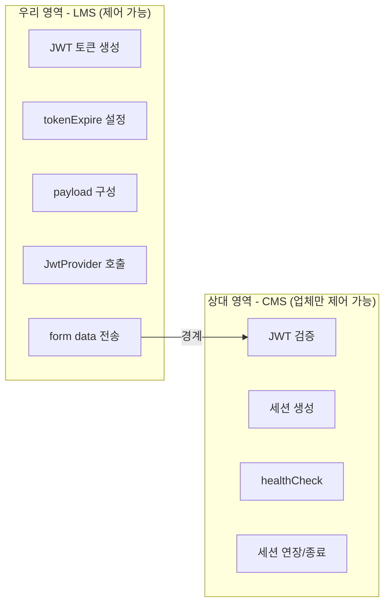
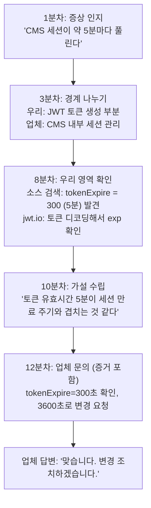

# 04. 외부 연동 시스템 디버깅 방법론

> 👹 "외부 솔루션이니까 난 모르겠어요? 그건 포기지 방법론이 아니야.
> 외부 시스템이어도 네가 할 수 있는 영역이 있어. 그걸 구분하는 게 실력이야."

---

## 외부 연동 문제의 특징

내부 코드 버그와 다른 점:

| 구분 | 내부 버그 | 외부 연동 문제 |
|------|-----------|----------------|
| 코드 접근 | 전부 볼 수 있음 | 우리 쪽만 볼 수 있음 |
| 디버깅 | 브레이크포인트 가능 | 네트워크 레벨에서 관찰 |
| 수정 | 직접 고침 | 우리 쪽 or 업체에 요청 |
| 원인 범위 | 좁음 | 넓음 (우리? 업체? 네트워크?) |

---

## 디버깅 3단계 프레임워크

!!! note "디버깅 3단계 프레임워크"
    **Step 1: 경계를 나눠라**
    → 우리 영역 vs 상대 영역 구분

    **Step 2: 우리 영역부터 확인해라**
    → 우리가 보내는 것이 올바른지 검증

    **Step 3: 증거를 들고 업체에 가라**
    → "확인해주세요"가 아니라 "이게 원인 같은데 맞는지 확인해주세요"

---

## Step 1: 경계를 나눠라

오늘 CMS 문제를 예시로:

**경계를 나누면 뭘 해야 하는지 보인다:**
- 우리 영역: 코드 검색으로 확인 가능
- 상대 영역: 업체에 문의해야 함
- 경계(네트워크): 브라우저 개발자 도구로 관찰 가능

---

## Step 2: 우리 영역부터 확인해라

### 확인 도구 1: 브라우저 개발자 도구 (F12)

!!! tip "Network 탭에서 확인 가능한 것들"
    | 항목 | 확인 내용 |
    |------|-----------|
    | Request URL | 어디로 보내는지 |
    | Request Method | POST/GET |
    | Form Data | 뭘 보내는지 (jwtToken 값) |
    | Response Status | 200? 401? 403? |
    | Response Body | 에러 메시지 |
    | Timing | 얼마나 걸렸는지 |

!!! example "오늘 케이스에서 이걸 했으면"
    1. CMS 접속 → Network 탭 열기
    2. authForm submit 요청 찾기
    3. Form Data에서 jwtToken 값 복사
    4. jwt.io에서 디코딩
    5. exp 클레임 확인 → "5분이네?"
    6. 5분 뒤에 세션 풀리는 것과 연결 → "이거 때문인가?"

### 확인 도구 2: 소스 코드 검색

!!! example "우리가 CMS에 뭘 보내는지 코드에서 확인"
    1. `mediopia_cms_pop.jsp` → tokenExpire = 300 확인
    2. `Constants.java` → CMS_JWT_EXPIRE = 300 확인
    3. `framework.properties` → jwt.expire=300 확인
    4. `JwtProvider.java` → generatePayloadToken이 exp를 어떻게 설정하는지 확인

### 확인 도구 3: 서버 로그

!!! tip "서버 로그 확인 (가능하다면)"
    - CMS 호출 시점의 요청/응답 로그
    - 세션 생성/만료 시점 로그
    - JWT 검증 실패 로그

---

## Step 3: 증거를 들고 업체에 가라

> 👹 **"'안 돼요 고쳐주세요'는 질문이 아니야. 그건 민원이야."**

!!! danger "나쁜 문의 (증거 없음)"
    "CMS 세션이 자꾸 풀려요. 확인 부탁드립니다."

    → 업체 반응: "어디서요? 언제요? 뭘 하다가요? 재현 되나요?"
    → 핑퐁 시작 (시간 낭비)

!!! success "좋은 문의 (증거 있음)"
    "CMS 로그인 후 약 5분 경과 시 세션이 만료됩니다.
    확인 결과:

    1. mediopia_cms_pop.jsp에서 tokenExpire = 300 (5분)
    2. healthCheck 주기도 300초로 알고 있음
    3. 토큰 만료와 healthCheck 타이밍 충돌로 추정
    4. 다른 학교는 3600초라면, 저희도 동일하게 변경 요청드립니다.

    [첨부: jwt.io 디코딩 스크린샷, 네트워크 탭 캡처]"

    → 업체 반응: "맞습니다. 3600으로 변경하겠습니다." (1회 왕복)

**차이가 보이나? 증거가 있으면 핑퐁이 없다.**

---

## 실전 체크리스트: 외부 연동 문제 발생 시

!!! abstract "실전 체크리스트"
    - [ ] **1. 증상 정확히 기록**
        - 뭐가 안 되는지 (세션 풀림)
        - 언제 발생하는지 (5분 후)
        - 재현 가능한지 (매번)
    - [ ] **2. 경계 나누기**
        - 우리 코드에서 확인 가능한 부분은?
        - 업체에 물어봐야 하는 부분은?
    - [ ] **3. 우리 영역 확인**
        - 브라우저 네트워크 탭 확인
        - 관련 소스 코드 검색
        - 서버 로그 확인
    - [ ] **4. 가설 수립**
        - "이것 때문인 것 같다"를 근거와 함께
    - [ ] **5. 업체 문의 (증거 포함)**
        - 증상 + 확인 내용 + 추정 원인 + 요청사항

---

## 외부 연동별 디버깅 포인트

| 연동 대상 | 우리가 확인 | 업체에 문의 |
|-----------|-------------|-------------|
| **CMS** | JWT 토큰값, 유효시간, form data | healthCheck 주기, 세션 정책 |
| **CDN** | 요청 URL, 인증 헤더 | 파일 존재 여부, 캐시 정책 |
| **결제** | 요청 파라미터, 콜백 URL | 결제 상태, 승인 번호 |
| **메일** | SMTP 설정, 발신 주소 | 수신 차단, 스팸 필터 |
| **SSO** | 인증 토큰, 리다이렉트 URL | 계정 상태, 권한 설정 |

---

## 오늘 케이스 복기: 이상적인 흐름

**총 소요: 15분 + 업체 답변 대기**

---

## 핵심 요약

| 원칙 | 내용 |
|------|------|
| 경계 나눠라 | 우리 영역 vs 상대 영역 구분이 첫 번째 |
| 우리부터 확인 | 브라우저 F12, 소스 검색, 로그 확인 |
| 증거 들고 가라 | "안 돼요"가 아니라 "이거 때문인 것 같은데 맞나요?" |
| 핑퐁 최소화 | 증거 있으면 1~2회 왕복으로 해결 |

> 👹 "외부 시스템이라서 못 찾겠다는 건 핑계야.
> 우리 영역은 우리가 확인하고, 증거 들고 가면 된다.
> 다음 장에서 최종 시험 본다. 각오해."
