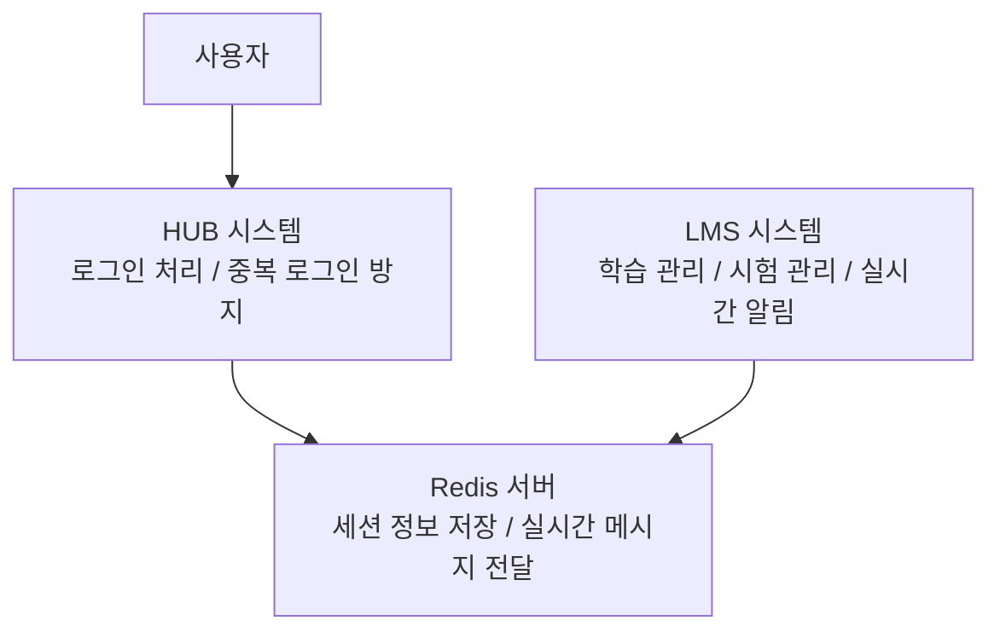

# Redis 쉬운 요약 (비전공자/제안서용)

**작성일**: 2025-12-17
**대상**: 개발 비전문가, 제안서 참고용

---

## 1. Redis가 뭔가요? (한 줄 정의)

> **"초고속 임시 저장소"** - 자주 쓰는 정보를 빠르게 저장하고 꺼내는 기술

---

## 2. 쉬운 비유로 이해하기

### 도서관 vs 책상 메모장

| 구분 | 일반 데이터베이스 | Redis |
|------|------------------|-------|
| **비유** | 도서관 창고 | 책상 위 메모장 |
| **특징** | 많이 저장, 찾는데 오래 걸림 | 적게 저장, 바로 찾음 |
| **속도** | 느림 (10ms) | 매우 빠름 (0.1ms) |
| **용도** | 영구 보관 데이터 | 자주 쓰는 임시 데이터 |

**일상 예시:**
- 📚 **도서관(일반 DB)**: 책을 찾으려면 창고까지 가야 함
- 📝 **메모장(Redis)**: 자주 쓰는 전화번호는 책상 위 메모에 적어둠

---

## 3. 우리 시스템에서 Redis를 왜 쓰나요?

### 3.1 중복 로그인 방지

**상황**: 한 사람이 PC와 모바일에서 동시 로그인하면?

```
[기존 방식 - Redis 없이]
PC로 로그인 → 모바일로 또 로그인 → 둘 다 접속 가능 (보안 문제!)

[현재 방식 - Redis 사용]
PC로 로그인 → 모바일로 또 로그인 → PC 자동 로그아웃 (보안 강화!)
```

**어떻게 가능한가요?**
1. 로그인하면 Redis에 "누가 어디서 로그인했다" 기록
2. 다른 곳에서 로그인하면 기록이 덮어씌워짐
3. 이전 기기에서 접속하면 "기록이 다르네?" → 강제 로그아웃

### 3.2 실시간 알림 (LMS에서 사용)

**상황**: 교수가 시험을 강제 종료하면?

```
[기존 방식 - Redis 없이]
교수가 종료 버튼 클릭 → 학생들은 모름 → 계속 시험 봄 (문제!)

[현재 방식 - Redis 사용]
교수가 종료 버튼 클릭 → Redis가 모든 서버에 전파 → 학생 화면에 즉시 알림!
```

---

## 4. 비즈니스 관점에서 Redis의 가치

### 4.1 보안 강화
| 기능 | 효과 |
|------|------|
| 중복 로그인 차단 | 계정 도용 방지, 무단 접근 차단 |
| 세션 관리 | 자동 로그아웃으로 보안 사고 예방 |

### 4.2 사용자 경험 개선
| 기능 | 효과 |
|------|------|
| 빠른 응답 속도 | 페이지 로딩 100배 빠름 |
| 실시간 알림 | 즉각적인 정보 전달 |

### 4.3 시스템 안정성
| 기능 | 효과 |
|------|------|
| 서버 부하 분산 | DB 부하 감소, 안정적 운영 |
| 장애 대응 | 여러 서버 간 정보 공유 |

---

## 5. 우리 프로젝트 적용 현황

### 5.1 현재 구성



### 5.2 프로젝트별 사용 목적

| 시스템 | Redis 사용 여부 | 주요 용도 |
|--------|----------------|----------|
| **HUB (포털)** | O | 중복 로그인 방지 |
| **LMS (학습)** | O | 학습 중복 방지 + 실시간 알림 |
| **SYNC (연동)** | X | 데이터 동기화 전용 (Redis 불필요) |

---

## 6. 자주 묻는 질문 (FAQ)

### Q1. Redis 없으면 안 되나요?
> **A**: 가능하지만, 로그인 처리가 느려지고 중복 로그인 방지가 어렵습니다.

### Q2. Redis 서버가 죽으면 어떻게 되나요?
> **A**: 로그인은 가능하지만, 중복 로그인 방지 기능이 일시적으로 작동하지 않습니다.
> 실제 데이터는 일반 DB에 저장되어 있어 업무 연속성은 유지됩니다.

### Q3. 추가 비용이 드나요?
> **A**: Redis는 오픈소스(무료)입니다. 서버 운영 비용만 발생합니다.

### Q4. 다른 시스템에서도 많이 쓰나요?
> **A**: 네. 네이버, 카카오, 쿠팡, 배달의민족 등 대부분의 대형 서비스에서 사용합니다.

---

## 7. 제안서용 핵심 문구

### 기술 도입 효과 (복사해서 사용 가능)

> **Redis 도입을 통한 시스템 고도화**
>
> - **보안 강화**: 중복 로그인 차단으로 계정 보안 강화
> - **성능 개선**: 데이터 조회 속도 최대 100배 향상 (10ms → 0.1ms)
> - **실시간 처리**: 분산 환경에서 즉각적인 이벤트 전파 가능
> - **비용 효율**: 오픈소스 기반 무료 라이선스

### 기대 효과 (복사해서 사용 가능)

> **사용자 경험 향상**
> - 빠른 로그인 처리 및 페이지 응답
> - 실시간 알림을 통한 즉각적인 정보 전달
>
> **운영 안정성 확보**
> - 서버 간 세션 정보 동기화
> - 데이터베이스 부하 분산
> - 장애 발생 시 빠른 복구 가능

---

## 8. 한 줄 요약

| 관점 | 요약 |
|------|------|
| **기술적** | 메모리 기반 초고속 저장소 |
| **비즈니스** | 보안 강화 + 성능 향상 + 실시간 처리 |
| **사용자** | 빠르고 안전한 서비스 이용 |

---

**참고 문서**: 기술 상세 내용은 같은 폴더의 01~05번 문서를 참조하세요.
