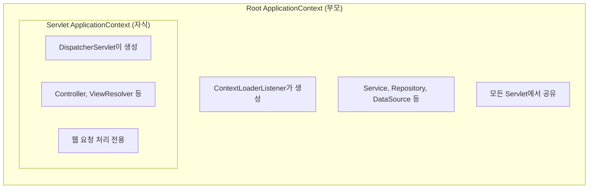

# 08. Spring Context

**이 장의 목표**: ApplicationContext가 뭔지, Root Context와 Servlet Context의 차이를 설명할 수 있다

---

## 1. Context란

```
Context = Bean들이 살고 있는 세상
        = Spring 컨테이너의 실제 구현체
        = ApplicationContext

비유:
  Bean = 주민
  Context = 마을

  마을(Context) 안에 주민(Bean)들이 산다.
  마을 관리소(ApplicationContext)가 주민을 관리한다.
```

---

## 2. ApplicationContext

### 2.1 정의

```
ApplicationContext = Spring 컨테이너의 핵심 인터페이스
                   = Bean의 생성, 관리, 조회를 담당
                   = 모든 Spring 애플리케이션의 중심

하는 일:
  1. XML/어노테이션을 읽어서 Bean을 생성한다
  2. Bean 간의 의존성을 주입한다
  3. Bean을 저장하고 관리한다
  4. Bean을 조회해서 돌려준다
```

### 2.2 생성 과정

```
서버 시작:

1. Tomcat이 web.xml을 읽는다
2. web.xml에 정의된 Spring 설정 파일을 찾는다
3. Spring이 설정 파일(XML)을 읽는다
4. XML에 정의된 Bean들을 생성한다
5. Bean 간 의존성을 주입한다
6. 초기화 콜백을 호출한다
7. ApplicationContext 준비 완료
8. → 이제 요청을 받을 수 있다
```

---

## 3. 웹 애플리케이션의 Context 구조

### 3.1 2개의 Context

Spring 웹 애플리케이션에는 Context가 2개다.



자식은 부모의 Bean을 볼 수 있다.
부모는 자식의 Bean을 볼 수 없다.

### 3.2 왜 2개로 나누나

```
이유: 관심사의 분리

Root Context:
  → 비즈니스 로직 (Service, Repository)
  → 데이터 접근 (DataSource, SqlSession)
  → 웹과 무관한 것들
  → 여러 Servlet이 공유 가능

Servlet Context:
  → 웹 요청 처리 (Controller)
  → 뷰 처리 (ViewResolver)
  → 웹 전용 것들
  → DispatcherServlet마다 1개

비유:
  Root Context = 회사 본사 (공유 부서: 인사, 재무)
  Servlet Context = 지점 (각 지점의 영업팀)
  → 지점은 본사 부서를 이용할 수 있다
  → 본사는 지점 영업팀을 모른다
```

---

## 4. web.xml에서 보는 Context 설정

### 4.1 Root Context 설정

```xml
<!-- web.xml -->

<!-- Root ApplicationContext 생성 -->
<listener>
    <listener-class>
        org.springframework.web.context.ContextLoaderListener
    </listener-class>
</listener>

<!-- Root Context가 읽을 설정 파일 -->
<context-param>
    <param-name>contextConfigLocation</param-name>
    <param-value>
        classpath*:/egovframework/spring/context-*.xml
    </param-value>
</context-param>
```

```
해석:
  ContextLoaderListener:
    → 서버 시작 시 Root ApplicationContext를 만드는 놈
    → Listener = 서버 이벤트를 감시하는 놈

  contextConfigLocation:
    → Root Context가 읽을 XML 파일 경로
    → context-*.xml = context-로 시작하는 모든 XML
    → context-common.xml, context-datasource.xml,
      context-sqlMap.xml, context-transaction.xml 등
```

### 4.2 Servlet Context 설정

```xml
<!-- web.xml -->

<!-- Servlet Context 생성 -->
<servlet>
    <servlet-name>action</servlet-name>
    <servlet-class>
        org.springframework.web.servlet.DispatcherServlet
    </servlet-class>
    <init-param>
        <param-name>contextConfigLocation</param-name>
        <param-value>
            classpath*:/egovframework/spring/dispatcher-servlet.xml
        </param-value>
    </init-param>
</servlet>
```

```
해석:
  DispatcherServlet:
    → Spring MVC의 핵심. 모든 HTTP 요청을 받는 놈.
    → 자기만의 Servlet Context를 만든다.

  contextConfigLocation (servlet용):
    → Servlet Context가 읽을 XML 파일
    → dispatcher-servlet.xml
    → Controller, ViewResolver 등 웹 전용 Bean 정의
```

---

## 5. Context 간 Bean 접근

!!! note "Bean 접근 규칙"

    **Root Context의 Bean:**
    dataSource, sqlSession, userService, examService ...
    → Servlet Context에서 접근 가능 (O)

    **Servlet Context의 Bean:**
    userController, examController, viewResolver ...
    → Root Context에서 접근 불가 (X)

    **규칙:**
    자식 → 부모 Bean 사용 가능
    부모 → 자식 Bean 사용 불가

    **그래서:**
    Controller에서 @Resource로 Service를 주입받을 수 있다
    (Controller = Servlet Context, Service = Root Context)

    Service에서 Controller를 주입받을 수 없다
    (Service = Root Context, Controller = Servlet Context)

---

## 6. Context 중복 로드 문제

### 6.1 우리 서버에서 발견된 문제

```
MAT 분석에서 발견:
  RefreshableSqlSessionFactoryBean이 2개였다.
  → 인스턴스 #1: DataSource = BasicDataSource (18.5 MB)
  → 인스턴스 #2: DataSource = Log4jdbcProxyDataSource (16.7 MB)

왜 2개?
  → Root Context에서 1번 생성
  → Servlet Context에서 또 1번 생성
  → component-scan 범위가 겹쳐서 같은 Bean이 2번 만들어진 것
```

### 6.2 왜 이런 일이 생기나

```
Root Context XML:
  <context:component-scan base-package="egovframework.mediopia.lxp" />

Servlet Context XML:
  <context:component-scan base-package="egovframework.mediopia.lxp" />

둘 다 같은 패키지를 스캔!
→ 같은 Bean이 양쪽 Context에서 각각 생성
→ 메모리 낭비, 예상치 못한 동작

해결:
  Root: Service, Repository만 스캔
  Servlet: Controller만 스캔
  → 범위를 분리해야 한다
```

### 6.3 올바른 분리

```xml
<!-- Root Context: Service, Repository -->
<context:component-scan base-package="egovframework.mediopia.lxp">
    <context:exclude-filter type="annotation"
        expression="org.springframework.stereotype.Controller" />
</context:component-scan>

<!-- Servlet Context: Controller만 -->
<context:component-scan base-package="egovframework.mediopia.lxp"
    use-default-filters="false">
    <context:include-filter type="annotation"
        expression="org.springframework.stereotype.Controller" />
</context:component-scan>
```

```
exclude-filter: "Controller는 빼고 스캔"
include-filter: "Controller만 스캔"
→ 역할별로 깔끔하게 분리
```

---

## 7. Context 생성 순서

```
서버 시작 시:

1. Tomcat 시작
2. web.xml 읽기
3. ContextLoaderListener 실행
   → Root ApplicationContext 생성
   → context-*.xml 읽기
   → Service, Repository, DataSource Bean 생성
   → 의존성 주입
   → 초기화 (afterPropertiesSet 등)

4. DispatcherServlet 초기화
   → Servlet ApplicationContext 생성
   → dispatcher-servlet.xml 읽기
   → Controller, ViewResolver Bean 생성
   → Root Context를 부모로 설정

5. 준비 완료 → 요청 처리 가능

순서가 중요한 이유:
  Root Context가 먼저 만들어져야
  Servlet Context가 Root의 Bean을 참조할 수 있다
```

---

## 8. 핵심 정리

!!! abstract "핵심 정리"

    **Context** = Bean들이 사는 세상 = Spring 컨테이너

    **2개의 Context:**

    - Root Context: Service, Repository, DataSource
        - ContextLoaderListener가 생성
        - context-*.xml
    - Servlet Context: Controller, ViewResolver
        - DispatcherServlet이 생성
        - dispatcher-servlet.xml

    **접근 규칙:**
    자식(Servlet) → 부모(Root) Bean 사용 가능
    부모(Root) → 자식(Servlet) Bean 사용 불가

    **주의:** component-scan 범위 겹치면 Bean 중복 생성
    → Root와 Servlet의 스캔 범위를 분리해야 한다

    **다음 장:**
    우리 프로젝트로 보는 Spring
    → 이론을 우리 코드에서 확인한다
