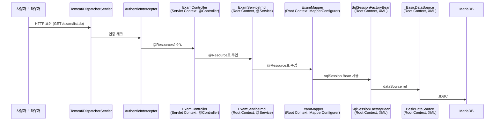

# 09. 우리 프로젝트로 보는 Spring

**이 장의 목표**: 지금까지 배운 개념을 우리 프로젝트 코드에서 전부 찾아낼 수 있다

---

## 1. 전체 구조

### 1.1 우리 프로젝트의 Spring 설정 파일들

```
src/main/resources/egovframework/spring/
  ├── context-common.xml         → 공통 설정, component-scan
  ├── context-datasource.xml     → DataSource (DB 연결)
  ├── context-sqlMap.xml         → MyBatis SqlSession
  ├── context-transaction.xml    → 트랜잭션
  ├── context-aspect.xml         → AOP
  ├── context-idgen.xml          → ID 생성기
  ├── context-properties.xml     → 프로퍼티 설정
  └── dispatcher-servlet.xml     → Spring MVC (Controller)
```

```
역할:
  context-*.xml → Root ApplicationContext가 읽는다
  dispatcher-servlet.xml → Servlet ApplicationContext가 읽는다
```

---

## 2. Bean 흐름 추적

### 2.1 요청 1개가 처리되는 전체 흐름



### 2.2 각 Bean이 어디서 등록되는지

| Bean | 등록 방법 |
|------|-----------|
| ExamController | @Controller (어노테이션) |
| ExamServiceImpl | @Service (어노테이션) |
| ExamMapper | MapperConfigurer 자동 스캔 |
| sqlSession | XML (context-sqlMap.xml) |
| dataSource | XML (context-datasource.xml) |
| txManager | XML (context-transaction.xml) |
| lobHandler | XML (context-sqlMap.xml) |

패턴:
  내 코드 (Controller, Service) → 어노테이션
  라이브러리 (SqlSession, DataSource) → XML
```

---

## 3. context-sqlMap.xml 완전 분석

### 3.1 수정 전 (문제 코드)

```xml
<bean id="sqlSession"
      class="egovframework.mediopia.lxp.common.comm.config.RefreshableSqlSessionFactoryBean">
    <property name="dataSource" ref="dataSource" />
    <property name="configLocation"
              value="classpath:/egovframework/sqlmap/sql-mapper-config.xml" />
    <property name="mapperLocations"
              value="classpath*:/egovframework/sqlmap/${framework.database.db_type}/*/*.xml" />
    <property name="interval" value="1000" />
</bean>
```

```
Spring 관점에서 일어나는 일:

1. Bean 생성 (1단계)
   new RefreshableSqlSessionFactoryBean()

2. DI - 의존성 주입 (2단계)
   bean.setDataSource(dataSource);        // ref → 다른 Bean
   bean.setConfigLocation(resource);       // value → 문자열→Resource 변환
   bean.setMapperLocations(resources);     // value → 문자열→Resource[] 변환
   bean.setInterval(1000);                 // value → 문자열→int 변환

3. 초기화 (3단계)
   bean.afterPropertiesSet()
     → super.afterPropertiesSet()   // SqlSessionFactory 빌드
     → setRefreshable()             // Timer-0 시작! ← 여기서 메모리 누수 시작

4. 사용 (4단계)
   → Mapper가 SQL 실행할 때 sqlSession 사용
   → Timer-0이 1초마다 126개 XML 체크 (문제!)
   → DelegatingClassLoader 무한 누적 (문제!)

5. 소멸 (5단계 - 서버 종료 시)
   bean.destroy()
     → timer.cancel()   // Timer 종료
```

### 3.2 수정 후 (현재)

```xml
<bean id="sqlSession" class="org.mybatis.spring.SqlSessionFactoryBean">
    <property name="dataSource" ref="dataSource" />
    <property name="configLocation"
              value="classpath:/egovframework/sqlmap/sql-mapper-config.xml" />
    <property name="mapperLocations"
              value="classpath*:/egovframework/sqlmap/${framework.database.db_type}/*/*.xml" />
</bean>
```

```
수정 후 일어나는 일:

1. Bean 생성
   new SqlSessionFactoryBean()    // 공식 클래스

2. DI
   bean.setDataSource(dataSource);
   bean.setConfigLocation(resource);
   bean.setMapperLocations(resources);
   // interval 없음!

3. 초기화
   bean.afterPropertiesSet()
     → SqlSessionFactory 빌드
     → Timer 없음! 감시 없음! 깔끔!

4. 사용
   → SQL 실행만 한다. 파일 감시 안 한다.

5. 소멸
   → 특별한 정리 불필요

→ Timer 스레드 없음
→ DelegatingClassLoader 누적 없음
→ 메모리 누수 없음
```

---

## 4. 상속과 Bean의 관계

### 4.1 RefreshableSqlSessionFactoryBean의 상속 구조

```
SqlSessionFactoryBean (MyBatis 공식)
  ↑ extends
RefreshableSqlSessionFactoryBean (메디오피아 커스텀)

부모(SqlSessionFactoryBean):
  - dataSource, configLocation, mapperLocations
  - afterPropertiesSet() → SqlSessionFactory 빌드
  - 이것만으로 충분하다

자식(RefreshableSqlSessionFactoryBean):
  - interval, Timer, TimerTask 추가
  - afterPropertiesSet() 오버라이드
    → 부모 호출 + Timer 시작
  - 파일 감시 기능 추가

XML에서 class를 바꾸면:
  class="RefreshableSqlSessionFactoryBean"  → 자식 사용 (문제)
  class="SqlSessionFactoryBean"             → 부모 사용 (정상)

Bean의 class가 곧 "어떤 객체를 만들 것인가"를 결정한다.
```

---

## 5. DI 체인 추적

### 5.1 dataSource는 어디서 오는가

```
context-sqlMap.xml:
  <property name="dataSource" ref="dataSource" />
  → "dataSource"라는 Bean을 찾아라

context-datasource.xml:
  <bean id="dataSource" class="org.apache.commons.dbcp2.BasicDataSource">
      <property name="driverClassName" value="${db.driver}" />
      <property name="url" value="${db.url}" />
      <property name="username" value="${db.username}" />
      <property name="password" value="${db.password}" />
  </bean>

${db.driver}, ${db.url} 등은:
  globals.properties에서 치환됨

결과:
  globals.properties → ${} 치환 → dataSource Bean 생성
  → sqlSession Bean에 ref로 주입
  → Service에서 사용
```

### 5.2 의존성 주입 체인 전체

```mermaid
graph TD
    A["globals.properties"] -->|값 치환| B["context-datasource.xml → dataSource Bean"]
    B -->|ref| C["context-sqlMap.xml → sqlSession Bean"]
    C -->|MapperConfigurer| D["Mapper Bean들 (자동 생성)"]
    D -->|@Resource| E["ServiceImpl Bean들 (@Service)"]
    E -->|@Resource| F["Controller Bean들 (@Controller)"]
    F -->|HTTP 응답| G["사용자 브라우저"]
```

모든 연결을 Spring이 관리한다.
설정 파일(XML, properties)만 바꾸면 전체가 바뀐다.
이게 IoC + DI의 힘이다.

---

## 6. 메모리 누수와 Spring의 관계

### 6.1 Bean 생명주기에서 본 메모리 누수

```
RefreshableSqlSessionFactoryBean의 생명주기:

  1단계 (생성): new → 정상
  2단계 (DI): setter 호출 → 정상
  3단계 (초기화): afterPropertiesSet()
    → super.afterPropertiesSet()  → 정상
    → setRefreshable()            → Timer 시작!
      → timer.schedule(task, 0, 1000)
      → 1초마다 isModified() 실행
      → Resource.lastModified() 호출
      → 리플렉션 → DelegatingClassLoader 생성
      → GC 안 됨 → 누적!

  4단계 (사용): 매 1초마다 문제 반복
    → 5일간 4,574개 ClassLoader 누적

  5단계 (소멸): timer.cancel()
    → 서버 종료할 때만 실행
    → 종료 전까지는 계속 누적

문제의 근본:
  3단계(초기화)에서 Timer가 시작되는 것 자체가 문제.
  운영 서버에서는 필요 없는 기능이니까.
```

### 6.2 Spring 관점에서의 교훈

!!! warning "Spring 설정의 교훈"

    **1. XML의 class 하나가 서버 전체를 좌우한다**
    → SqlSessionFactoryBean vs Refreshable... 한 줄 차이
    → 메모리 누수 vs 정상

    **2. property 하나가 동작을 완전히 바꾼다**
    → interval=1000 → 1초마다 감시 + 메모리 누수
    → interval=0 → 감시 안 함
    → interval 없음 → 기능 자체 없음 (가장 안전)

    **3. 개발 편의 설정이 운영에서 독이 된다**
    → 개발: 파일 감시 유용 (코드 수정 즉시 반영)
    → 운영: 파일 감시 불필요 (배포 후 고정)
    → 환경별 설정 분리가 중요

    **4. Bean 등록은 "주문서"다**
    → 잘못된 주문 = 잘못된 객체 = 잘못된 동작
    → XML 한 줄의 무게를 알아야 한다

---

## 7. 핵심 정리

!!! abstract "핵심 정리"

    **우리 프로젝트 Spring 구조:**
    설정: context-*.xml (Root) + dispatcher-servlet.xml
    등록: XML (라이브러리) + 어노테이션 (내 코드)
    주입: ref (XML) + @Resource (어노테이션)

    **요청 흐름:**
    Browser → Tomcat → DispatcherServlet
    → Controller → Service → Mapper → SqlSession → DB

    **메모리 누수 원인 (Spring 관점):**

    1. XML에서 class를 커스텀 클래스로 지정
    2. interval=1000 property로 Timer 활성화
    3. 초기화(afterPropertiesSet)에서 Timer 시작
    4. Timer가 리플렉션으로 ClassLoader 무한 생성

    **해결 (Spring 관점):**
    class를 공식 클래스로 변경 → 커스텀 기능 제거
    = XML 한 줄 수정으로 해결

    **다음 장:** 빠싺 최종시험
