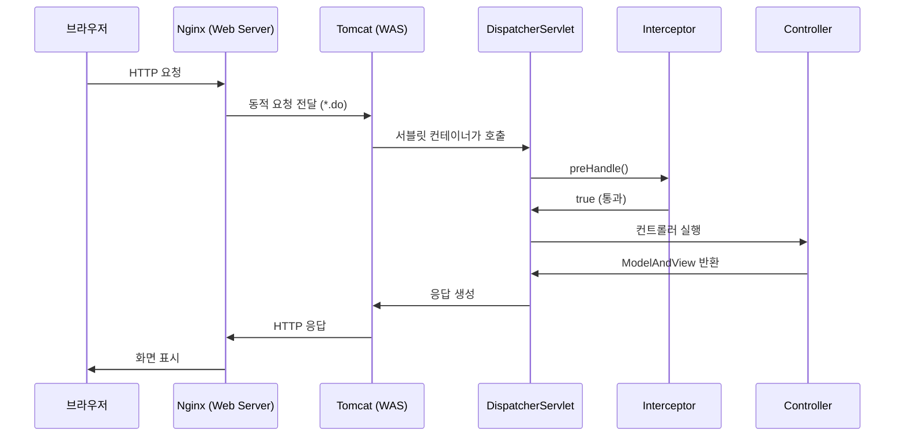
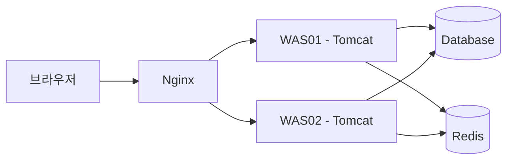

# 01. HTTP 요청이 서버에 도착하면

**난이도**: Alpha | **예상 시간**: 20분

---

## 브라우저에서 서버까지

너가 LMS 주소를 브라우저에 입력하고 엔터를 치는 순간, 뒤에서 벌어지는 일을 하나씩 뜯어보자.

### 1단계: DNS 해석

브라우저가 제일 먼저 하는 일은 **도메인을 IP 주소로 바꾸는 것**이다.

`lms.example.ac.kr` → `210.101.173.xxx`

!!! note "DNS (Domain Name System)"
    사람이 읽을 수 있는 도메인 이름을 컴퓨터가 이해하는 IP 주소로 변환하는 시스템이다.
    전화번호부라고 생각하면 된다. "홍길동" → "010-1234-5678" 이런 식.

### 2단계: TCP 연결

IP 주소를 알았으니 이제 그 서버에 연결한다. **TCP 3-way handshake**로 연결을 수립한다.

| 단계 | 방향 | 내용 |
|------|------|------|
| SYN | 브라우저 → 서버 | "연결하고 싶어" |
| SYN-ACK | 서버 → 브라우저 | "알겠어, 나도 준비됐어" |
| ACK | 브라우저 → 서버 | "좋아, 시작하자" |

### 3단계: HTTP 요청 전송

연결이 됐으니 브라우저가 HTTP 요청을 보낸다.

```http
GET /lms/lesson/lessonHome/Form/lessonList HTTP/1.1
Host: lms.example.ac.kr
Cookie: JSESSIONID=abc123def456
User-Agent: Mozilla/5.0 ...
```

여기서 중요한 건 **Cookie 헤더**다. `JSESSIONID`가 들어있다. 이게 뭔지는 04장에서 자세히 배운다.

---

## 서버 내부의 여정

HTTP 요청이 서버에 도착하면, 여러 계층을 거쳐서 네 코드까지 도달한다.



### Web Server (Nginx/Apache)

!!! abstract "Web Server의 역할"
    - **정적 파일 직접 처리**: CSS, JS, 이미지 파일은 Tomcat까지 안 보내고 여기서 바로 응답
    - **동적 요청 전달**: `.do`, `.jsp` 같은 요청은 Tomcat으로 넘김
    - **리버스 프록시**: 클라이언트는 Nginx만 보이고, 뒤에 Tomcat이 있는지 모름
    - **로드 밸런싱**: 우리 프로젝트처럼 WAS01, WAS02가 있으면 요청을 분배

정적 파일(CSS, JS, 이미지)은 Tomcat까지 갈 필요가 없다. Nginx가 직접 처리하는 게 훨씬 빠르다. 동적 처리가 필요한 요청만 Tomcat으로 보낸다.

### WAS (Tomcat)

!!! abstract "WAS의 역할"
    - **서블릿 컨테이너**: Java 서블릿을 실행하는 환경
    - **JSP 컴파일**: JSP 파일을 서블릿으로 변환해서 실행
    - **쓰레드 풀 관리**: 요청마다 쓰레드를 할당해서 동시 처리
    - **세션 관리**: JSESSIONID 기반 세션 생성/관리

Tomcat은 요청을 받으면 **web.xml** 설정에 따라 적절한 서블릿을 찾아서 실행한다. Spring MVC에서는 모든 요청이 **DispatcherServlet**으로 간다.

### DispatcherServlet

Tomcat이 요청을 받으면, Spring이 등록해놓은 **DispatcherServlet**을 호출한다.

!!! tip "핵심 포인트"
    DispatcherServlet은 Spring MVC의 **입구**다. 모든 요청이 여기를 거친다.
    다음 장에서 이놈이 뭘 하는지 자세히 파볼 거다.

---

## Web Server vs WAS 비교

| 구분 | Web Server (Nginx) | WAS (Tomcat) |
|------|-------------------|--------------|
| **처리 대상** | 정적 파일 (CSS, JS, 이미지) | 동적 요청 (Java, JSP) |
| **언어** | C 기반 | Java 기반 |
| **성능** | 빠름 (단순 파일 전달) | 상대적으로 느림 (로직 실행) |
| **역할** | 프록시, 로드밸런싱, SSL | 비즈니스 로직, DB 연동 |

!!! warning "흔한 오해"
    "Tomcat도 정적 파일 줄 수 있잖아?" → 맞다. 근데 그러면 Tomcat의 쓰레드를 낭비하는 거다.
    정적 파일은 Nginx가 처리하고, Tomcat은 비즈니스 로직에만 집중시키는 게 맞다.

---

## 우리 프로젝트 구조

우리 LMS(LXP-KNU10) 프로젝트의 실제 구조를 보면:



- **WAS01, WAS02**: 두 대의 Tomcat이 돌고 있다
- **Nginx**: 요청을 두 WAS에 분배한다 (로드 밸런싱)
- **Redis**: 세션 공유를 위한 외부 저장소 (05장에서 배움)

!!! danger "09장 미리보기"
    WAS02의 catalina.out이 468일 동안 쌓여서 서버가 죽었다.
    이게 왜 일어났는지는 09장에서 상세하게 분석한다.

---

## 핵심 정리

1. 브라우저 → DNS → IP → TCP 연결 → HTTP 요청 전송
2. Nginx(Web Server)가 정적 파일은 직접 처리, 동적 요청은 Tomcat으로 전달
3. Tomcat(WAS)이 요청을 받아서 DispatcherServlet을 호출
4. DispatcherServlet부터가 Spring의 영역

---

## 확인문제

### Q1. Web Server와 WAS를 분리하는 이유

!!! question "문제"
    Nginx(Web Server)와 Tomcat(WAS)를 분리해서 운영하는 이유를 2가지 말해봐.

??? success "정답 보기"
    1. **역할 분리**: 정적 파일은 Nginx가 빠르게 처리하고, Tomcat은 동적 로직에만 집중하게 해서 자원을 효율적으로 쓴다.
    2. **로드 밸런싱**: Nginx가 여러 대의 Tomcat(WAS01, WAS02)에 요청을 분배할 수 있다. Tomcat 하나가 죽어도 다른 쪽으로 보내면 된다.

### Q2. HTTP 요청의 여정

!!! question "문제"
    브라우저에서 Spring Controller까지 요청이 도달하는 순서를 올바르게 나열해봐.

    A. Controller → Tomcat → Nginx → DispatcherServlet
    B. Nginx → Tomcat → DispatcherServlet → Controller
    C. Tomcat → Nginx → Controller → DispatcherServlet
    D. DispatcherServlet → Nginx → Tomcat → Controller

??? success "정답 보기"
    **B. Nginx → Tomcat → DispatcherServlet → Controller**

    요청은 항상 외부(Web Server)에서 내부(WAS)로, 그리고 Spring 내부에서는 DispatcherServlet을 거쳐 Controller로 간다. 반대로 가는 건 응답이다.

### Q3. DNS의 역할

!!! question "문제"
    DNS가 없으면 어떻게 되는지 설명해봐. 웹사이트 접속이 완전히 불가능한가?

??? success "정답 보기"
    DNS가 없어도 **IP 주소를 직접 입력하면** 접속 가능하다. DNS는 도메인 → IP 변환을 해주는 것일 뿐이다. `210.101.173.xxx`를 직접 치면 된다.

    다만 현실적으로 IP 주소를 외우고 다니는 사람은 없으니까, DNS 없이는 사실상 인터넷을 쓸 수 없다.

### Q4. 정적 파일 처리

!!! question "문제"
    CSS 파일 요청이 Tomcat까지 도달하면 왜 문제인가?

??? success "정답 보기"
    Tomcat은 요청 하나당 **쓰레드 하나**를 할당한다. CSS 파일 같은 단순 전달 작업에 쓰레드를 쓰면, 정작 비즈니스 로직을 처리할 쓰레드가 부족해진다.

    Nginx는 **이벤트 기반**으로 동작해서 적은 자원으로 많은 정적 파일을 처리할 수 있다. 역할에 맞는 놈이 맡는 게 맞다.

### Q5. TCP 3-way Handshake

!!! question "문제"
    TCP 3-way handshake를 하는 이유가 뭐야? 바로 데이터를 보내면 안 되나?

??? success "정답 보기"
    **양쪽 다 데이터를 주고받을 준비가 됐는지 확인**하기 위해서다.

    - 서버가 꺼져있는데 데이터를 보내면 유실된다
    - 네트워크가 끊겨있는데 보내면 유실된다
    - 3-way handshake로 "나 보낼 준비 됨" → "나 받을 준비 됨" → "확인, 시작" 을 거쳐야 안전하게 통신할 수 있다

    TCP가 **신뢰성 있는 프로토콜**이라고 불리는 이유가 이거다.
