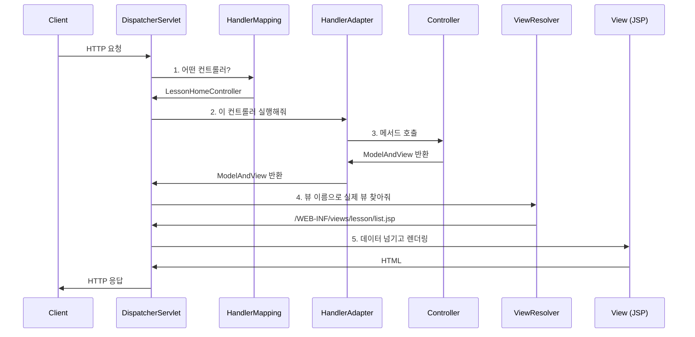
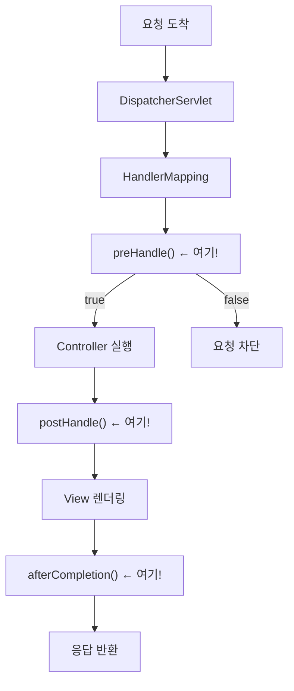
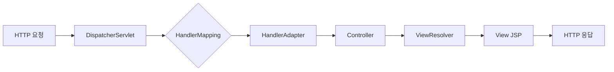

# 02. DispatcherServlet - 교통정리

**난이도**: Alpha | **예상 시간**: 25분

---

## Front Controller 패턴

01장에서 모든 요청이 DispatcherServlet으로 간다고 했다. 이게 바로 **Front Controller 패턴**이다.

!!! abstract "Front Controller 패턴"
    **모든 요청을 하나의 진입점에서 받아서 적절한 곳으로 분배하는 패턴.**

    교차로의 교통경찰이라고 생각해. 차(요청)가 어디로 가든 일단 교통경찰(DispatcherServlet)을 거친다. 경찰이 "너는 직진", "너는 우회전" 이렇게 정리해준다.

Front Controller가 없으면 어떻게 될까?

| 구분 | Front Controller 없음 | Front Controller 있음 |
|------|----------------------|----------------------|
| 진입점 | 각 서블릿이 직접 처리 | DispatcherServlet 하나 |
| 공통 로직 | 각 서블릿마다 중복 | 한 곳에서 처리 |
| 인터셉터 | 적용 어려움 | 일괄 적용 가능 |
| 유지보수 | 서블릿마다 수정 | 한 곳만 수정 |

---

## DispatcherServlet이 하는 일

요청이 들어오면 DispatcherServlet이 순서대로 처리한다. 하나씩 뜯어보자.



### 1. HandlerMapping - "누가 처리해?"

요청 URL을 보고 어떤 컨트롤러의 어떤 메서드가 처리할지 찾는다.

```java
// 이 URL이 들어오면
// GET /lms/lesson/lessonHome/Form/lessonList

// HandlerMapping이 이 메서드를 찾아준다
@RequestMapping("/lms/lesson/lessonHome/Form/lessonList")
public String lessonList(Model model) {
    // ...
}
```

!!! tip "매핑 방식"
    `@RequestMapping`, `@GetMapping`, `@PostMapping` 어노테이션에 적힌 URL 패턴을 보고 매칭한다. Spring이 애플리케이션 시작할 때 이 어노테이션들을 전부 스캔해서 맵을 만들어 놓는다.

### 2. HandlerAdapter - "실행 방법이 뭐야?"

컨트롤러를 찾았으면 실행해야 한다. 근데 컨트롤러가 다양한 형태일 수 있다.

| 컨트롤러 타입 | HandlerAdapter |
|--------------|----------------|
| `@Controller` 메서드 | RequestMappingHandlerAdapter |
| `Controller` 인터페이스 구현 | SimpleControllerHandlerAdapter |
| `HttpRequestHandler` 구현 | HttpRequestHandlerAdapter |

!!! note "우리 프로젝트"
    우리 LXP-KNU10은 `@Controller` + `@RequestMapping` 조합을 쓴다. 그래서 `RequestMappingHandlerAdapter`가 실행을 담당한다.

### 3. Controller - "비즈니스 로직 실행"

컨트롤러가 실행되면 Service → DAO → DB 순서로 비즈니스 로직을 처리하고, 결과를 담아서 돌려보낸다.

```java
@RequestMapping("/lms/lesson/lessonHome/Form/lessonList")
public String lessonList(Model model) {
    List<LessonVO> list = lessonService.getList();
    model.addAttribute("lessonList", list);
    return "lms/lesson/lessonList";  // 뷰 이름
}
```

여기서 반환하는 `"lms/lesson/lessonList"`는 **뷰 이름**이다. 실제 파일 경로가 아니다.

### 4. ViewResolver - "뷰 이름 → 실제 파일"

뷰 이름을 실제 JSP 파일 경로로 변환한다.

```
뷰 이름: "lms/lesson/lessonList"
    ↓ ViewResolver (prefix + viewName + suffix)
실제 경로: "/WEB-INF/views/lms/lesson/lessonList.jsp"
```

!!! example "ViewResolver 설정"
    ```xml
    <bean class="org.springframework.web.servlet.view.InternalResourceViewResolver">
        <property name="prefix" value="/WEB-INF/views/" />
        <property name="suffix" value=".jsp" />
    </bean>
    ```
    prefix(`/WEB-INF/views/`) + 뷰 이름 + suffix(`.jsp`) = 실제 경로

### 5. View 렌더링 - "HTML 만들기"

JSP가 Model에 담긴 데이터를 꺼내서 HTML을 만든다. 이 HTML이 최종적으로 브라우저에 전달된다.

---

## 인터셉터는 어디에 끼어드나?

DispatcherServlet 흐름에서 인터셉터가 실행되는 타이밍이 있다. 03장 미리보기.



!!! warning "핵심"
    `preHandle()`이 `false`를 반환하면 **Controller까지 가지도 못한다**.
    우리 프로젝트의 `AuthenticInterceptor`가 바로 이 preHandle()에서 인증을 체크한다. 03장에서 자세히.

---

## dispatcher-servlet.xml 설정

우리 프로젝트의 실제 설정을 보자.

```xml
<mvc:interceptors>
    <mvc:interceptor>
        <mvc:mapping path="/*/*Home/**" />
        <mvc:mapping path="/*/*Lect/**" />
        <mvc:mapping path="/*/*Pop/**" />
        <!-- ... 생략 ... -->
        <bean class="egovframework.mediopia.lxp.common.comm
                     .interceptor.AuthenticInterceptor" />
    </mvc:interceptor>
</mvc:interceptors>
```

`/*/*Home/**`, `/*/*Lect/**` 등의 패턴에 매칭되는 URL에만 `AuthenticInterceptor`가 동작한다. 특정 URL에만 인터셉터를 적용할 수 있다는 거다.

---

## 전체 흐름 요약



1. **DispatcherServlet**: 모든 요청의 진입점 (Front Controller)
2. **HandlerMapping**: URL → 컨트롤러 매칭
3. **HandlerAdapter**: 컨트롤러 실행
4. **Controller**: 비즈니스 로직 처리
5. **ViewResolver**: 뷰 이름 → 실제 파일 경로
6. **View**: HTML 렌더링

---

## 확인문제

### Q1. Front Controller 패턴의 장점

!!! question "문제"
    DispatcherServlet이 Front Controller 역할을 한다. 만약 Front Controller 없이 각 URL마다 별도 서블릿을 만들면 어떤 문제가 생기나? 2가지.

??? success "정답 보기"
    1. **공통 로직 중복**: 인증 체크, 로깅, 인코딩 같은 공통 처리를 모든 서블릿마다 넣어야 한다. 하나 빼먹으면 보안 구멍이 생긴다.
    2. **유지보수 어려움**: 공통 로직을 변경하려면 모든 서블릿을 하나하나 수정해야 한다. 서블릿이 100개면 100개 다 수정.

### Q2. HandlerMapping의 역할

!!! question "문제"
    다음 중 HandlerMapping이 하는 일은?

    A. 컨트롤러의 메서드를 실행한다
    B. 요청 URL에 맞는 컨트롤러를 찾아준다
    C. JSP 파일을 찾아서 렌더링한다
    D. 세션을 체크한다

??? success "정답 보기"
    **B. 요청 URL에 맞는 컨트롤러를 찾아준다**

    - A는 HandlerAdapter의 역할
    - C는 ViewResolver + View의 역할
    - D는 Interceptor의 역할

### Q3. ViewResolver 동작

!!! question "문제"
    컨트롤러가 `return "lms/lesson/lessonList"`를 반환했다. ViewResolver의 prefix가 `/WEB-INF/views/`이고 suffix가 `.jsp`일 때, 최종 JSP 파일 경로는?

??? success "정답 보기"
    `/WEB-INF/views/lms/lesson/lessonList.jsp`

    prefix + 뷰 이름 + suffix = 실제 경로.
    이게 ViewResolver가 하는 일의 전부다. 단순하지만 이걸 통해 컨트롤러가 실제 파일 경로를 몰라도 되게 만든다.

### Q4. preHandle()이 false를 반환하면

!!! question "문제"
    인터셉터의 `preHandle()`이 `false`를 반환하면 어떻게 되나?

??? success "정답 보기"
    **Controller가 실행되지 않는다.** 요청이 거기서 멈춘다.

    preHandle()은 Controller 실행 **전에** 호출된다. false가 반환되면 DispatcherServlet이 더 이상 진행하지 않는다. 우리 프로젝트에서 인증 실패 시 이렇게 요청을 차단한다.

### Q5. DispatcherServlet 처리 순서

!!! question "문제"
    DispatcherServlet의 처리 순서를 올바르게 나열해봐.

    A. HandlerMapping → Controller → HandlerAdapter → ViewResolver → View
    B. HandlerMapping → HandlerAdapter → Controller → ViewResolver → View
    C. Controller → HandlerMapping → ViewResolver → HandlerAdapter → View
    D. ViewResolver → HandlerMapping → Controller → HandlerAdapter → View

??? success "정답 보기"
    **B. HandlerMapping → HandlerAdapter → Controller → ViewResolver → View**

    1. HandlerMapping으로 어떤 컨트롤러인지 찾고
    2. HandlerAdapter로 그 컨트롤러를 실행하고
    3. Controller가 비즈니스 로직 처리 후 뷰 이름 반환하고
    4. ViewResolver가 뷰 이름을 실제 경로로 바꾸고
    5. View가 HTML을 만든다
