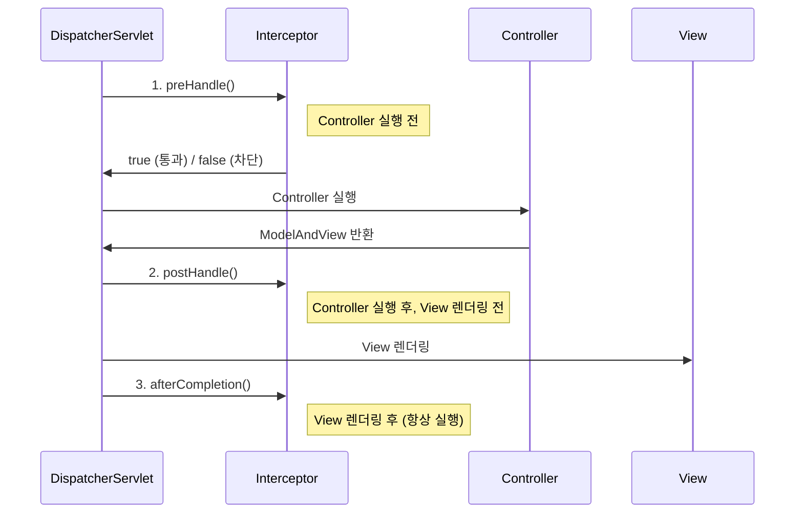
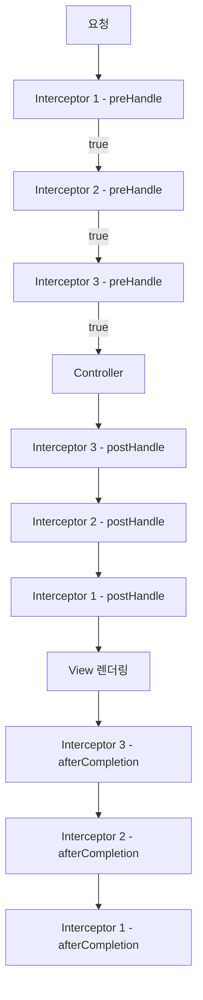
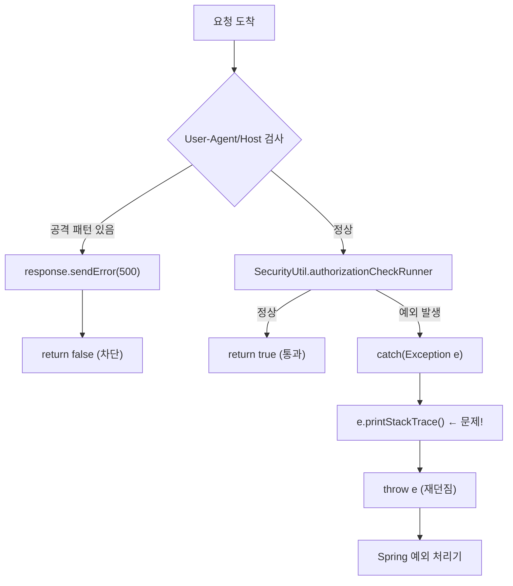

# 03. 인터셉터 - 경비원

**난이도**: Beta | **예상 시간**: 25분

---

## 인터셉터란?

건물 출입구의 **경비원**이라고 생각해. 건물(Controller)에 들어가기 전에 출입증(세션)을 확인한다.

!!! abstract "HandlerInterceptor"
    Spring MVC에서 **Controller 실행 전/후에 공통 로직을 실행**하는 컴포넌트.
    인증 체크, 로깅, 권한 확인 같은 걸 여기서 처리한다.

---

## 3가지 타이밍 포인트

인터셉터에는 3개의 메서드가 있고, 각각 다른 시점에 실행된다.



| 메서드 | 실행 시점 | 용도 | 반환값 |
|--------|-----------|------|--------|
| `preHandle()` | Controller **전** | 인증, 권한, 로깅 | boolean (true=통과, false=차단) |
| `postHandle()` | Controller **후**, View **전** | 모델 데이터 가공 | void |
| `afterCompletion()` | View **후** (항상 실행) | 리소스 정리, 로깅 | void |

!!! warning "preHandle()의 반환값"
    - `true` 반환: **통과**. Controller로 넘어간다.
    - `false` 반환: **차단**. Controller까지 가지도 못한다.
    - 예외 throw: 예외 처리기(ExceptionResolver)가 받는다.

---

## 인터셉터 체인

인터셉터는 여러 개를 등록할 수 있다. 순서대로 실행된다.



!!! tip "실행 순서 핵심"
    - **preHandle**: 등록 순서대로 (1 → 2 → 3)
    - **postHandle**: 역순으로 (3 → 2 → 1)
    - **afterCompletion**: 역순으로 (3 → 2 → 1)

    스택(LIFO)과 같다. 먼저 들어간 놈이 마지막에 나온다.

---

## 우리 프로젝트의 AuthenticInterceptor

자, 이제 우리 프로젝트의 실제 코드를 보자. `AuthenticInterceptor.java` 전체 구조다.

```java
public class AuthenticInterceptor extends HandlerInterceptorAdapter {

    @Override
    public boolean preHandle(HttpServletRequest request,
                             HttpServletResponse response,
                             Object handler) throws Exception {

        // 1. SQL Injection 방지 (User-Agent, Host 헤더 검사)
        boolean chkUserAgentHack = false;
        if(request.getHeader("User-Agent").indexOf("--") != -1)
            chkUserAgentHack = true;
        if(request.getHeader("User-Agent").indexOf("' AND ") != -1)
            chkUserAgentHack = true;
        // ... 더 많은 체크 ...

        if (chkUserAgentHack) {
            response.sendError(500, "Invalid access.");
            return false;  // ← 차단! Controller까지 안 감
        }

        // 2. 권한 검사 ← 여기가 핵심
        try {
            SecurityUtil.authorizationCheckRunner(request, response);
        } catch(Exception e) {
            e.printStackTrace();  // ← line 71. 이게 문제야
            throw e;
        }

        return true;  // ← 통과! Controller로 넘어감
    }
}
```

### 코드 분석

이 코드가 하는 일은 딱 2가지다.

**첫 번째**: SQL Injection 방지

User-Agent나 Host 헤더에 `--`, `' AND `, `' OR ` 같은 SQL 공격 패턴이 있으면 요청을 차단한다. `return false`로 Controller까지 아예 안 보낸다.

**두 번째**: 인증/권한 체크

`SecurityUtil.authorizationCheckRunner()`를 호출해서 인증과 권한을 체크한다. 여기서 예외가 터지면 `catch`에서 잡는다.

!!! danger "문제의 코드: line 71"
    ```java
    } catch(Exception e) {
        e.printStackTrace();  // ← 이 한 줄이 서버를 죽였다
        throw e;
    }
    ```
    `e.printStackTrace()`가 왜 문제인지는 08장에서 상세하게 분석한다. 지금은 **"여기서 모든 예외의 스택 트레이스가 찍힌다"** 정도만 기억해.

---

## preHandle()의 흐름 정리



!!! note "정리"
    - 정상 요청: preHandle → SecurityUtil 체크 통과 → `return true` → Controller 실행
    - 세션 만료: preHandle → SecurityUtil → SessionBrokenException 발생 → catch → **e.printStackTrace()** → throw → 로그인 리다이렉트
    - 헤더 공격: preHandle → 헤더 검사 실패 → `return false` → 요청 차단

---

## postHandle()과 afterCompletion()

우리 프로젝트의 `AuthenticInterceptor`에서 이 두 메서드는 뭘 하고 있나?

```java
@Override
public void postHandle(HttpServletRequest request,
                       HttpServletResponse response,
                       Object handler,
                       ModelAndView model) throws Exception {
    // 전부 주석 처리됨. 아무것도 안 함.
}

// afterCompletion()은 아예 주석 처리됨
```

!!! tip "현실"
    postHandle()과 afterCompletion()이 **비어있다**. 실질적으로 preHandle()만 쓰고 있다.
    원래는 Model에 공통 데이터를 넣거나 리소스를 정리하는 용도인데, 우리 프로젝트에서는 사용하지 않는다.

---

## Interceptor vs Filter

!!! question "그거 Filter랑 뭐가 다른데?"

| 구분 | Filter | Interceptor |
|------|--------|-------------|
| **소속** | 서블릿 스펙 (Java EE) | Spring MVC |
| **실행 위치** | DispatcherServlet **전** | DispatcherServlet **후** |
| **접근 가능** | request, response | request, response + handler + ModelAndView |
| **설정 파일** | web.xml | dispatcher-servlet.xml |
| **Spring Bean 사용** | 불가 (직접 주입 안 됨) | 가능 |

핵심은 **Interceptor는 Spring 영역 안**에 있다는 거다. 그래서 Spring Bean을 쓸 수 있고, Controller 정보(handler)에도 접근할 수 있다. Filter는 Spring 바깥이라 이게 안 된다.

---

## 핵심 정리

1. 인터셉터는 Controller 전/후에 공통 로직을 실행하는 경비원
2. `preHandle()` → `Controller` → `postHandle()` → `View` → `afterCompletion()` 순서
3. `preHandle()`이 `false` 반환하면 Controller까지 가지도 못함
4. 우리 프로젝트: `AuthenticInterceptor.preHandle()`에서 인증 체크
5. 문제: catch 블록의 `e.printStackTrace()`가 모든 예외 스택 트레이스를 찍음

---

## 확인문제

### Q1. 인터셉터 메서드 실행 순서

!!! question "문제"
    인터셉터 A, B가 순서대로 등록되어 있다. Controller가 정상 실행됐을 때 메서드 실행 순서를 적어봐.

??? success "정답 보기"
    1. A.preHandle()
    2. B.preHandle()
    3. Controller 실행
    4. B.postHandle()
    5. A.postHandle()
    6. View 렌더링
    7. B.afterCompletion()
    8. A.afterCompletion()

    preHandle은 순서대로, postHandle과 afterCompletion은 역순으로 실행된다.

### Q2. AuthenticInterceptor의 catch 블록

!!! question "문제"
    다음 코드에서 `e.printStackTrace()`와 `throw e`를 각각 왜 실행하는지 설명해봐.
    ```java
    try {
        SecurityUtil.authorizationCheckRunner(request, response);
    } catch(Exception e) {
        e.printStackTrace();  // (1)
        throw e;              // (2)
    }
    ```

??? success "정답 보기"
    - **(1) e.printStackTrace()**: 예외의 전체 스택 트레이스를 System.err(catalina.out)에 출력한다. **원래 의도는 디버깅용 로그**였겠지만, 프로덕션에서는 하면 안 되는 짓이다.
    - **(2) throw e**: 잡은 예외를 **다시 던진다**. DispatcherServlet이 이 예외를 받아서 적절한 예외 처리(로그인 리다이렉트 등)를 한다.

    결과적으로 이 catch 블록은 "스택 트레이스 찍고 다시 던지기"만 한다. 예외를 처리하는 게 아니라 **구경만 하고 넘기는** 것이다.

### Q3. preHandle이 false를 반환하는 경우

!!! question "문제"
    우리 프로젝트의 AuthenticInterceptor에서 `return false`가 실행되는 상황은 어떤 경우인가?

??? success "정답 보기"
    **User-Agent나 Host 헤더에 SQL Injection 공격 패턴이 감지됐을 때.**

    `--`, `' AND `, `' OR `, `" AND `, `" OR ` 같은 문자열이 헤더에 포함되면 `chkUserAgentHack = true`가 되고, `response.sendError(500)`을 보낸 후 `return false`로 요청을 차단한다.

    세션 만료의 경우는 `return false`가 아니라 **예외를 throw**한다. 이 차이를 구분해야 한다.

### Q4. Filter vs Interceptor

!!! question "문제"
    인증 체크 로직을 Filter가 아닌 Interceptor에 넣은 이유가 뭘까? (힌트: SecurityUtil 코드를 생각해봐)

??? success "정답 보기"
    `SecurityUtil.authorizationCheck()`에서 **Spring Bean을 사용**한다.

    ```java
    OrgMenuService orgMenuService = WebApplicationContextUtils
        .getWebApplicationContext(request.getSession().getServletContext())
        .getBean(OrgMenuService.class);
    ```

    Service, DAO 같은 Spring Bean에 접근해야 하기 때문에 Spring 영역 안에 있는 Interceptor를 쓰는 게 맞다. Filter는 Spring 영역 바깥이라 Bean을 직접 주입받을 수 없다 (WebApplicationContextUtils로 우회는 가능하지만 깔끔하지 않다).

### Q5. 인터셉터 적용 범위

!!! question "문제"
    dispatcher-servlet.xml에 다음과 같이 설정되어 있다.
    ```xml
    <mvc:mapping path="/*/*Home/**" />
    <mvc:mapping path="/*/*Lect/**" />
    ```
    이때 `/lms/api/getData` 요청은 AuthenticInterceptor를 거치나?

??? success "정답 보기"
    **거치지 않는다.** `/lms/api/getData`는 `/*/*Home/**`도 `/*/*Lect/**`도 아니다.

    `mvc:mapping`에 정의된 패턴에 매칭되는 URL만 인터셉터가 동작한다. 이렇게 URL 패턴으로 인터셉터 적용 범위를 제어할 수 있다.
