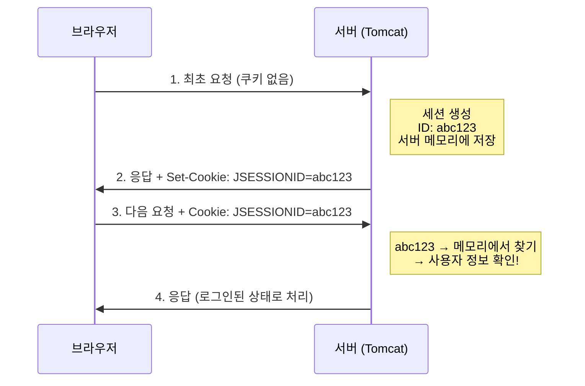
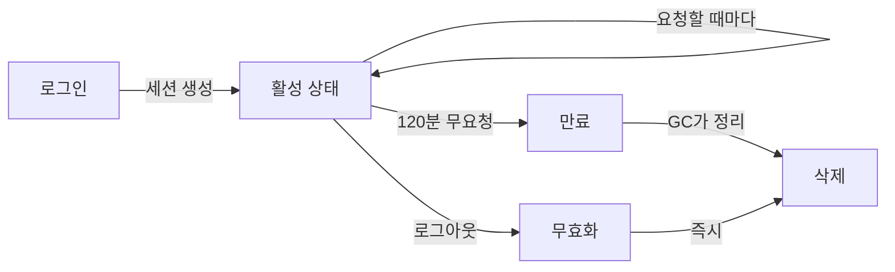

# 04. 세션이란 무엇인가

**난이도**: Beta | **예상 시간**: 25분

---

## HTTP는 무상태(Stateless)다

!!! abstract "핵심 개념"
    HTTP는 **무상태 프로토콜**이다. 서버는 이전 요청을 기억하지 않는다.
    매 요청이 완전히 독립적이다. "너 아까 로그인한 사람이지?"를 기본적으로 모른다.

편의점에 비유하면:

| 상태유지 (Stateful) | 무상태 (Stateless) |
|---------------------|-------------------|
| 단골 가게 사장님: "아, 지난번에 라면 사간 분!" | 무인 편의점: "누구세요? 처음 뵙겠습니다" |
| 이전 방문을 기억함 | 매번 새 고객 취급 |

HTTP가 왜 무상태로 설계됐냐면, **확장성** 때문이다. 서버가 클라이언트 상태를 기억해야 하면, 서버를 여러 대로 늘리기 어렵다. 요청이 항상 같은 서버로 가야 하니까. 무상태면 아무 서버나 처리할 수 있다.

---

## 그런데 로그인은 어떻게?

문제가 있다. HTTP가 무상태인데, 어떻게 "이 사용자는 로그인한 사람"이라는 걸 알 수 있을까?

!!! question "생각해봐"
    만약 세션이 없다면, 매 페이지 이동할 때마다 아이디/비밀번호를 입력해야 한다.
    강의 목록 보기 → 로그인 / 과제 제출 → 다시 로그인 / 성적 조회 → 또 로그인

    이건 말이 안 되잖아. 그래서 **세션**이 필요하다.

---

## 세션의 동작 원리

### JSESSIONID 쿠키

세션의 핵심은 **JSESSIONID**라는 쿠키다.



**동작 순서:**

1. 브라우저가 처음 서버에 접속한다 (쿠키 없음)
2. 서버가 **세션을 생성**하고, 고유한 ID(`abc123`)를 만든다
3. 이 ID를 **Set-Cookie 헤더**로 브라우저에 보낸다
4. 브라우저는 다음 요청부터 이 쿠키를 **자동으로** 같이 보낸다
5. 서버는 쿠키의 ID로 세션을 찾아서 "아, 이 사람이구나" 판단한다

!!! tip "핵심 포인트"
    - **JSESSIONID는 그냥 ID**다. 사용자 정보 자체가 아니다.
    - 실제 사용자 데이터(이름, 학번, 권한)는 **서버 메모리**에 있다.
    - JSESSIONID는 서버 메모리의 데이터를 **찾는 열쇠**다.
    - 은행 대기표라고 생각해. 대기표(JSESSIONID)에는 번호만 있고, 실제 업무 내용은 은행 시스템에 있다.

---

## 세션에 뭐가 저장되나?

우리 프로젝트에서 세션에 저장하는 대표적인 데이터들:

| 세션 키 | 값 예시 | 용도 |
|---------|---------|------|
| `LOGIN_USERNO` | "20210001" | 사용자 번호 (핵심!) |
| `LOGIN_USERNAME` | "홍길동" | 사용자 이름 |
| `USER_ORG_CD` | "KNU" | 기관 코드 |
| `USER_TYPE` | "STUDENT" | 사용자 유형 |
| `MNG_TYPE` | "MANAGE" | 관리자 유형 |

`UserBroker.getUserNo(request)`가 하는 일이 바로 이거다:

```java
public static final String getUserNo(HttpServletRequest request) {
    return getSessionValue(request, Constants.LOGIN_USERNO);
}
```

세션에서 `LOGIN_USERNO` 값을 꺼내는 것. 이 값이 비어있으면 → 세션이 만료됐거나 로그인을 안 한 것이다.

---

## session-timeout 설정

세션은 영원히 살아있지 않는다. **일정 시간 동안 요청이 없으면 만료**된다.

!!! example "web.xml 설정"
    ```xml
    <session-config>
        <session-timeout>120</session-timeout>
    </session-config>
    ```
    단위: **분**. 우리 프로젝트는 **120분 (2시간)**.

!!! warning "주의: '마지막 요청'으로부터 120분"
    세션 타임아웃은 **로그인 시점**이 아니라 **마지막 요청 시점**으로부터 계산한다.

    - 10:00 로그인
    - 10:30 강의 목록 조회 ← 타이머 리셋
    - 11:00 과제 제출 ← 타이머 리셋
    - 11:30 이후 아무 요청 없음
    - 13:30 (120분 경과) → **세션 만료!**

---

## 세션 생명주기



| 단계 | 설명 | 트리거 |
|------|------|--------|
| **생성** | 로그인 성공 시 세션 생성, 데이터 저장 | 로그인 요청 |
| **사용** | 매 요청마다 세션 데이터 조회/갱신 | 모든 요청 |
| **갱신** | 요청이 오면 만료 타이머 리셋 | 모든 요청 |
| **만료** | timeout 시간 동안 요청 없으면 만료 | 120분 무요청 |
| **무효화** | 로그아웃 시 즉시 세션 삭제 | `session.invalidate()` |
| **GC 정리** | JVM의 Garbage Collector가 메모리에서 제거 | JVM이 알아서 |

!!! note "만료 ≠ 즉시 삭제"
    세션이 만료됐다고 메모리에서 즉시 사라지는 건 아니다. 만료된 세션은 **다음 접근 시 무효 처리**되고, 이후 GC가 정리한다. Tomcat은 기본적으로 1분마다 만료된 세션을 체크한다.

---

## 쿠키 vs 세션

!!! question "쿠키에 바로 사용자 정보 넣으면 안 돼?"

| 구분 | 쿠키 | 세션 |
|------|------|------|
| **저장 위치** | 브라우저 (클라이언트) | 서버 메모리 |
| **보안** | 취약 (사용자가 볼 수 있음) | 안전 (서버에만 있음) |
| **크기 제한** | 약 4KB | 서버 메모리 한도까지 |
| **변조 가능성** | 있음 (개발자 도구로 수정 가능) | 없음 (서버만 접근) |

쿠키에 `UserNo=20210001`을 직접 넣으면? 사용자가 개발자 도구 열어서 `UserNo=ADMIN001`로 바꿔버릴 수 있다. 그래서 **세션 ID만 쿠키에 넣고, 실제 데이터는 서버에 보관**하는 거다.

---

## 핵심 정리

1. HTTP는 무상태 → 세션으로 사용자 식별
2. JSESSIONID 쿠키 = 서버 메모리의 열쇠
3. 실제 데이터는 서버 메모리에 있음
4. session-timeout=120분 (마지막 요청으로부터)
5. 세션 만료 시 UserBroker.getUserNo()가 빈 값 → SessionBrokenException

---

## 확인문제

### Q1. 무상태 프로토콜

!!! question "문제"
    HTTP가 무상태(Stateless)로 설계된 이유를 설명해봐. Stateful이면 뭐가 불편한데?

??? success "정답 보기"
    **확장성(Scalability)** 때문이다.

    Stateful이면 서버가 클라이언트의 상태를 기억해야 한다. 서버가 1대일 때는 괜찮지만, 서버를 여러 대로 늘리면 문제가 생긴다. 사용자 A의 상태가 서버1에만 있으면, A의 다음 요청도 반드시 서버1로 가야 한다 (sticky session). 서버1이 죽으면 A의 상태가 날아간다.

    Stateless면 아무 서버나 처리할 수 있다. 서버 추가/제거가 자유롭다.

### Q2. JSESSIONID의 역할

!!! question "문제"
    JSESSIONID 쿠키에 사용자 이름, 학번, 권한 정보가 직접 들어있나?

??? success "정답 보기"
    **아니다.** JSESSIONID에는 **세션 ID만** 들어있다. (예: `JSESSIONID=abc123def456`)

    실제 사용자 데이터(이름, 학번, 권한)는 **서버 메모리**에 저장되어 있고, JSESSIONID는 그 데이터를 **찾기 위한 키(열쇠)**다.

    이렇게 하는 이유는 **보안**. 쿠키에 실제 데이터를 넣으면 사용자가 변조할 수 있다.

### Q3. 세션 타임아웃 계산

!!! question "문제"
    session-timeout이 120분이다. 사용자가 다음과 같이 행동했을 때 세션이 만료되는 시각은?

    - 09:00 로그인
    - 09:30 강의 목록 조회
    - 10:00 과제 제출
    - 이후 아무 행동 없음

??? success "정답 보기"
    **12:00에 만료된다.**

    마지막 요청(10:00 과제 제출)으로부터 120분 후 = 12:00.

    09:00(로그인)으로부터 120분 = 11:00이 아니다! 타임아웃은 **마지막 요청 시점**으로부터 카운트된다. 요청이 올 때마다 타이머가 리셋된다.

### Q4. 세션 저장 위치

!!! question "문제"
    기본 설정에서 세션 데이터는 어디에 저장되나? 서버가 2대(WAS01, WAS02)일 때 어떤 문제가 생기나?

??? success "정답 보기"
    기본 설정에서 세션은 **각 서버(Tomcat)의 메모리**에 저장된다.

    서버가 2대일 때 문제: 사용자가 WAS01에서 로그인하면 세션이 WAS01 메모리에만 있다. 다음 요청이 WAS02로 가면 세션이 없어서 **로그인 안 한 사람 취급**당한다.

    이 문제의 해결책이 05장의 **Redis**다.

### Q5. 쿠키에 직접 데이터를 넣으면?

!!! question "문제"
    JSESSIONID 방식 대신, 쿠키에 직접 `UserNo=20210001&UserType=STUDENT`를 넣으면 어떤 보안 문제가 생기나?

??? success "정답 보기"
    **사용자가 쿠키 값을 변조할 수 있다.**

    브라우저 개발자 도구(F12)로 쿠키를 열어서 `UserNo=ADMIN001&UserType=MANAGE`로 바꿔버리면, 서버는 이 사람이 관리자인 줄 알고 관리자 페이지를 보여준다.

    JSESSIONID 방식에서는 ID만 쿠키에 있고 실제 데이터는 서버에 있으므로, 사용자가 JSESSIONID를 바꿔봤자 존재하지 않는 세션 ID가 되어 효과가 없다.
