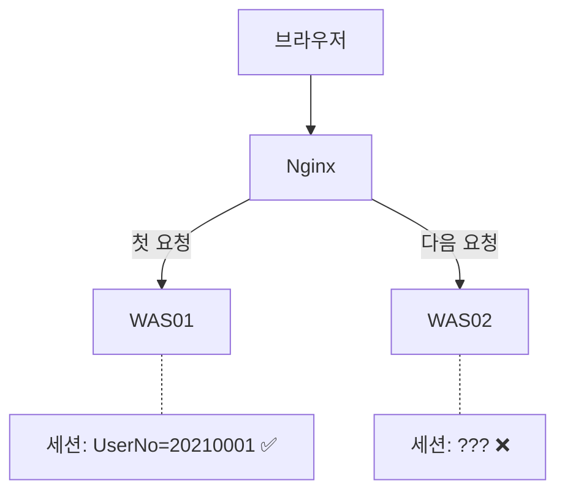
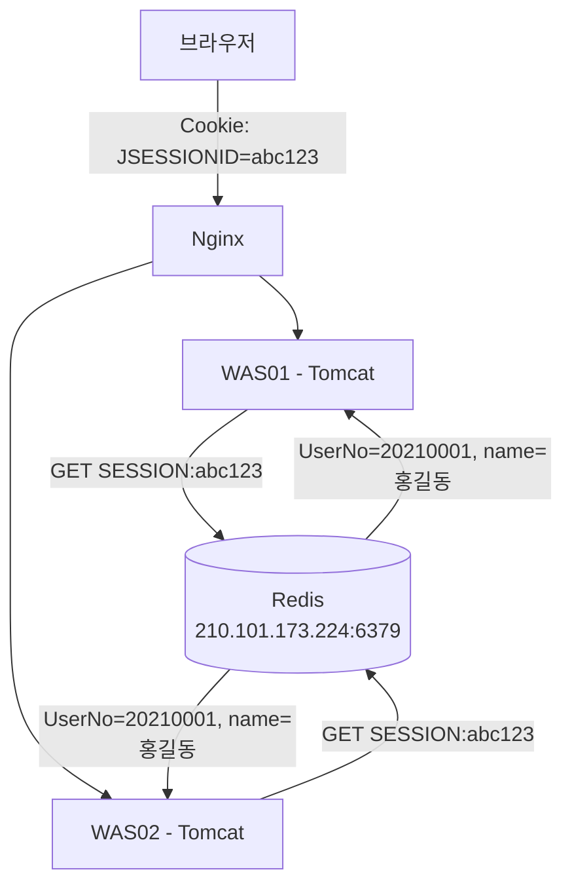
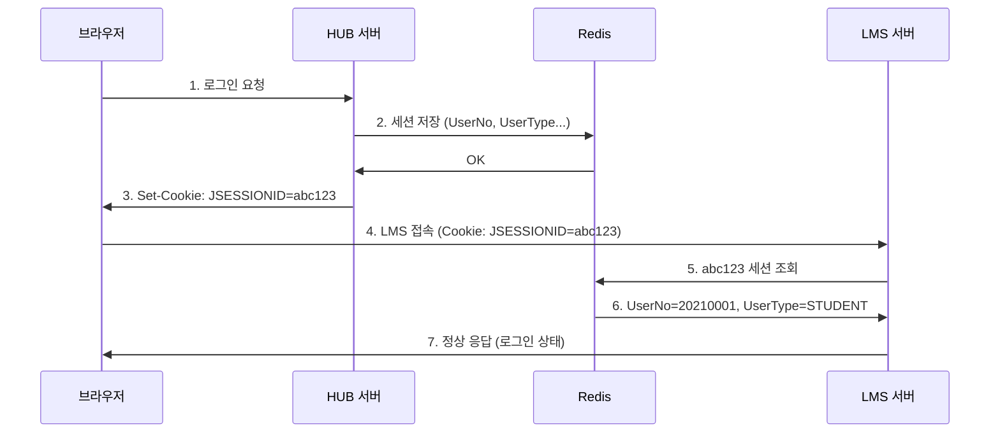
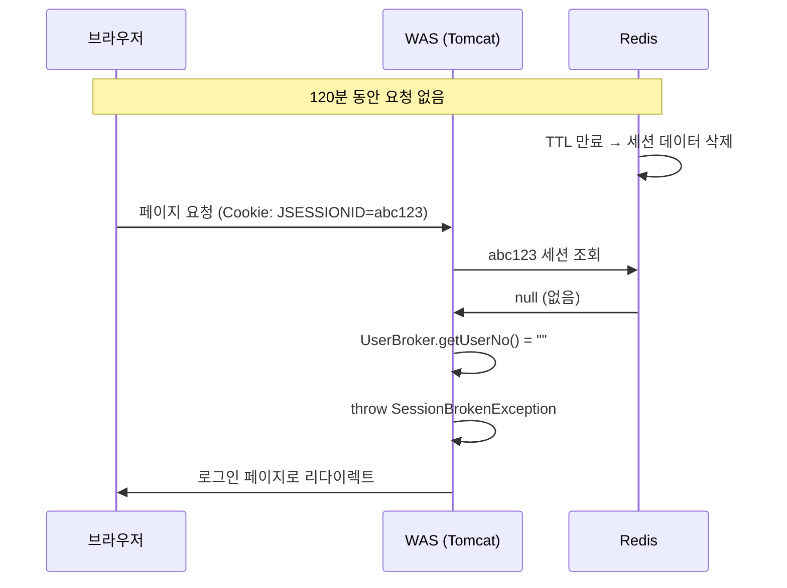

# 05. Redis와 세션 공유

**난이도**: Gamma | **예상 시간**: 30분

---

## 문제 상황

04장에서 세션은 서버 메모리에 저장된다고 했다. 근데 우리 프로젝트는 서버가 여러 대다.



1. 사용자가 WAS01에서 로그인했다 → WAS01 메모리에 세션 생성
2. 다음 요청이 Nginx 로드밸런싱에 의해 WAS02로 갔다
3. WAS02 메모리에는 이 세션이 없다 → **"로그인 안 한 사람" 취급**

!!! danger "이거 실제로 발생하는 문제다"
    Nginx가 요청을 어떤 WAS로 보낼지는 그때그때 다르다 (라운드로빈, 최소연결 등). 한 번은 WAS01, 다음에는 WAS02로 갈 수 있다. 매번 같은 서버로 가는 보장이 없다.

---

## 해결 방법들

| 방법 | 설명 | 단점 |
|------|------|------|
| **Sticky Session** | 같은 사용자는 항상 같은 서버로 보냄 | 서버 하나 죽으면 세션 날아감 |
| **Session Replication** | 서버 간 세션 복제 | 서버 늘수록 복제 부하 증가 |
| **외부 세션 저장소 (Redis)** | 세션을 별도 서버에 저장 | Redis 서버 관리 필요 |

!!! tip "우리 프로젝트의 선택: Redis"
    Redis를 **외부 세션 저장소**로 사용한다. 모든 WAS가 같은 Redis를 바라보니까, 어떤 WAS로 요청이 가든 같은 세션을 쓸 수 있다.

---

## Redis란?

!!! abstract "Redis (Remote Dictionary Server)"
    - **인메모리 Key-Value 저장소**: 데이터를 메모리에 저장해서 엄청 빠르다
    - **별도의 서버**: Tomcat 안에 있는 게 아니다. 완전히 독립된 서버 프로세스
    - **Key-Value 구조**: 키로 값을 찾는 딕셔너리(Map) 구조

Redis는 **데이터베이스(MySQL 등)와 다르다**:

| 구분 | MySQL | Redis |
|------|-------|-------|
| **저장 위치** | 디스크 (HDD/SSD) | 메모리 (RAM) |
| **속도** | 상대적으로 느림 | 매우 빠름 (ms 이하) |
| **데이터 구조** | 테이블, 행, 열 | Key-Value |
| **용도** | 영구 데이터 저장 | 캐시, 세션, 임시 데이터 |
| **데이터 소멸** | 직접 삭제하기 전까지 유지 | expire 시간 후 자동 삭제 |

---

## 아키텍처

우리 프로젝트의 실제 구조를 보자.



**핵심**: WAS01이든 WAS02든 **같은 Redis**에서 세션을 가져온다.

### 실제 저장 구조

Redis에 세션이 이렇게 저장된다:

```
Key:   "SESSION:abc123def456"
Value: {
    "UserNo": "20210001",
    "UserName": "홍길동",
    "UserOrgCd": "KNU",
    "UserType": "STUDENT",
    "MngType": "",
    "lastAccessTime": 1710500000000
}
TTL:   7200 (초) = 120분
```

!!! note "TTL (Time To Live)"
    Redis의 expire 설정. 이 시간이 지나면 Redis가 자동으로 키를 삭제한다. 우리 프로젝트에서는 **120분(7200초)**으로 설정되어 있다. web.xml의 session-timeout과 맞춘 거다.

---

## HUB와 LMS의 세션 공유

여기서 중요한 게 하나 더 있다. 우리 시스템은 **HUB(KNU10WebService)**와 **LMS(LXP-KNU10)**가 별도 서버다.



1. 사용자가 **HUB에서 로그인**한다
2. HUB가 Redis에 세션 데이터를 저장한다
3. 브라우저가 JSESSIONID 쿠키를 받는다
4. 사용자가 **LMS에 접속**한다 (같은 쿠키를 보냄)
5. LMS가 Redis에서 세션을 조회한다
6. Redis가 HUB에서 저장한 세션 데이터를 돌려준다
7. LMS도 이 사용자를 로그인된 사용자로 인식한다

!!! warning "Redis가 없으면?"
    HUB와 LMS는 서로 다른 서버다. HUB 메모리의 세션을 LMS가 볼 수 없다. HUB에서 로그인했는데 LMS에서 "로그인하세요"가 뜬다. Redis가 **두 시스템을 연결하는 다리** 역할을 한다.

---

## 우리 프로젝트 설정

```properties
# Redis 설정
redis.host=210.101.173.224
redis.port=6379
redis.expire=120
```

| 설정 | 값 | 의미 |
|------|-----|------|
| `redis.host` | 210.101.173.224 | Redis 서버 IP |
| `redis.port` | 6379 | Redis 기본 포트 |
| `redis.expire` | 120 | 세션 만료 시간 (분) |

!!! note "Redis는 별도 서버"
    `210.101.173.224`는 **WAS와 다른 서버**다. Redis는 Tomcat 안에 내장된 게 아니라, 별도로 설치된 독립 프로세스다. WAS가 네트워크를 통해 Redis에 접속한다.

---

## 세션 만료 시 일어나는 일



1. 120분 동안 요청이 없으면 Redis가 TTL 만료로 세션을 삭제한다
2. 사용자가 다시 접속하면 WAS가 Redis에서 세션을 찾으려 한다
3. Redis에 없다 → `UserBroker.getUserNo()`가 빈 문자열 반환
4. `SecurityUtil.authorizationCheck()`에서 빈 문자열 감지 → `SessionBrokenException` throw
5. 로그인 페이지로 리다이렉트

!!! tip "이게 정상 흐름이다"
    세션 만료 → 로그인 리다이렉트는 **정상적인 동작**이다. 에러가 아니다. 근데 우리 코드는 이걸 `e.printStackTrace()`로 찍고 있다. 이게 왜 문제인지는 08장에서.

---

## 핵심 정리

1. 서버가 여러 대면 메모리 세션이 공유 안 됨 → Redis로 해결
2. Redis = 별도 서버에서 돌아가는 인메모리 Key-Value 저장소
3. HUB에서 로그인 → Redis에 세션 저장 → LMS에서 Redis 조회 → 로그인 유지
4. expire=120분, TTL 만료 시 Redis가 자동 삭제
5. 세션 만료 후 접속 → UserBroker 빈 값 → SessionBrokenException → 로그인 리다이렉트

---

## 확인문제

### Q1. Redis를 사용하는 이유

!!! question "문제"
    세션 공유 문제를 해결하는 방법으로 Sticky Session도 있는데, 왜 Redis를 선택했을까? Sticky Session의 단점을 2가지 말해봐.

??? success "정답 보기"
    1. **서버 장애 시 세션 유실**: WAS01에 붙어있던 사용자의 세션이 WAS01 메모리에만 있으므로, WAS01이 죽으면 세션이 전부 날아간다. 다시 로그인해야 한다.
    2. **부하 분산 불균형**: 특정 서버에 세션이 많이 몰리면 그 서버만 과부하가 걸린다. 다른 서버가 여유 있어도 이동시킬 수 없다.

    Redis는 별도 서버이므로 WAS가 죽어도 세션은 살아있고, 어떤 WAS든 Redis에서 같은 세션을 가져올 수 있다.

### Q2. Redis 데이터 소멸

!!! question "문제"
    Redis에 저장된 세션이 삭제되는 경우 2가지를 말해봐.

??? success "정답 보기"
    1. **TTL(expire) 만료**: 설정된 시간(120분) 동안 갱신이 없으면 Redis가 자동으로 삭제한다.
    2. **로그아웃**: `session.invalidate()`가 호출되면 Redis에서도 해당 세션 키가 삭제된다.

    추가로 Redis 서버 자체가 재시작되면 메모리의 데이터가 날아갈 수 있다 (persistence 설정에 따라 다름).

### Q3. HUB와 LMS 세션 공유

!!! question "문제"
    사용자가 HUB에서 로그인한 후 LMS에 접속했는데 "로그인하세요"가 떴다. 원인으로 가능한 것 3가지를 추론해봐.

??? success "정답 보기"
    1. **Redis 서버 장애**: Redis가 다운되면 LMS가 세션을 조회할 수 없다.
    2. **세션 만료**: HUB 로그인 후 120분이 지나서 Redis에서 세션이 삭제됐다.
    3. **쿠키 문제**: HUB와 LMS의 도메인이 달라서 브라우저가 쿠키를 안 보냈다. 쿠키의 domain 설정이 두 서버를 포함하지 않으면 이런 일이 생긴다.

### Q4. Redis vs 데이터베이스

!!! question "문제"
    세션을 Redis가 아니라 MySQL(데이터베이스)에 저장하면 안 되나? 되긴 된다면, Redis를 쓰는 이유는?

??? success "정답 보기"
    MySQL에 저장해도 **동작은 한다**. 하지만 Redis를 쓰는 이유는 **속도** 때문이다.

    세션 조회는 **매 요청마다** 발생한다. 인터셉터가 매번 세션을 확인하니까. MySQL은 디스크 I/O가 필요해서 1-10ms 정도 걸리지만, Redis는 메모리에서 바로 읽으므로 0.1ms 이하다.

    요청이 초당 1000개면: MySQL = 초당 1000번 디스크 접근 vs Redis = 초당 1000번 메모리 접근. 차이가 엄청나다.

### Q5. expire 설정

!!! question "문제"
    `redis.expire=120`과 `web.xml`의 `session-timeout=120`이 같은 값(120분)인 이유가 뭐야? 다른 값이면 어떻게 되나?

??? success "정답 보기"
    **두 값이 같아야 세션 만료 동작이 일관적**이기 때문이다.

    만약 Redis expire=60분, web.xml timeout=120분이면:
    - 60분 후 Redis에서 세션 삭제됨
    - Tomcat은 아직 120분 안 지났다고 생각함
    - 결과: Tomcat의 세션은 살아있는데 Redis 데이터는 없음 → 혼란

    반대로 Redis expire=120분, web.xml timeout=60분이면:
    - 60분 후 Tomcat 세션 만료
    - Redis에는 아직 데이터가 남아있음 → 메모리 낭비

    두 값을 동일하게 맞춰야 깔끔하다.
