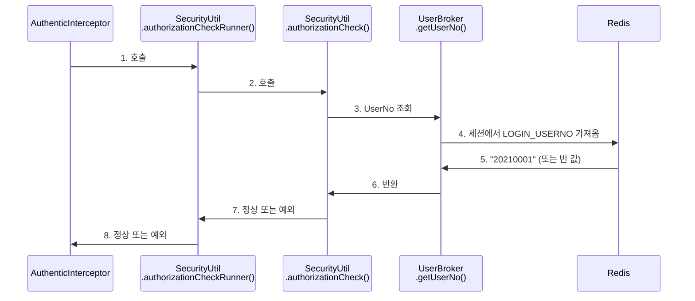
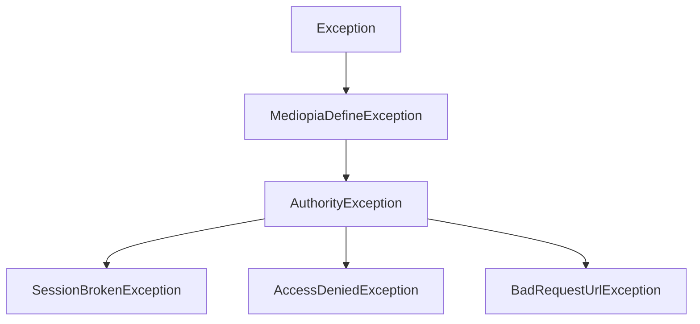
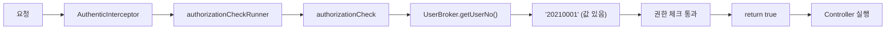
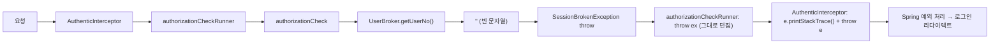

# 06. 인증 체크 흐름

**난이도**: Gamma | **예상 시간**: 30분

---

## 인증 체크 체인 전체 그림

03장에서 `AuthenticInterceptor.preHandle()`이 인증을 체크한다고 했다. 이번 장에서는 그 안에서 벌어지는 일을 **코드 레벨**로 뜯어본다.



체인이 4단계다. 하나씩 보자.

---

## 1단계: AuthenticInterceptor.preHandle()

**진입점**이다. 모든 요청이 여기를 거친다.

```java
// AuthenticInterceptor.java (line 68-73)
try {
    SecurityUtil.authorizationCheckRunner(request, response);
} catch(Exception e) {
    e.printStackTrace();  // line 71 - 문제의 코드
    throw e;
}
return true;
```

하는 일: `SecurityUtil.authorizationCheckRunner()`를 호출하고, 예외가 나오면 **스택 트레이스를 찍고 다시 던진다**.

!!! warning "이 catch 블록의 문제"
    - `e.printStackTrace()`: 모든 예외의 스택 트레이스를 System.err에 출력
    - `throw e`: 잡은 예외를 그대로 다시 던짐
    - 결과: **구경만 하고 넘기는** 코드. 예외를 처리하는 게 아님.

---

## 2단계: SecurityUtil.authorizationCheckRunner()

```java
// SecurityUtil.java (line 76-82)
public static void authorizationCheckRunner(
        HttpServletRequest request,
        HttpServletResponse response) throws Exception {
    try {
        SecurityUtil.authorizationCheck(request, response);
    } catch (Exception ex) {
        throw ex;
    }
}
```

!!! danger "이 메서드는 무의미하다"
    잘 봐. `try`에서 `authorizationCheck()`를 호출하고, `catch`에서 그냥 `throw ex`로 다시 던진다. **아무것도 안 하는** 래퍼 메서드다.

    ```
    try {
        실제_로직();
    } catch (Exception ex) {
        throw ex;  // ← 잡아서 다시 던지기? 이거 없어도 똑같다.
    }
    ```

    이런 코드는 제거하고 `authorizationCheck()`를 직접 호출하는 게 맞다. 근데 레거시 코드라 건드리기 어려운 거다.

---

## 3단계: SecurityUtil.authorizationCheck()

여기가 **실제 인증/권한 로직**이다. 코드가 길지만, 핵심만 추리면:

### 강의실 페이지 접근 시 (line 148-150)

```java
if(Action.matches(".*Lect/.*") || Action.matches(".*Open/.*")) {
    if(ValidationUtils.isEmpty(UserBroker.getUserNo(request))) {
        throw new SessionBrokenException("system.fail.session.expire");
    }
    // ... 강의실 권한 체크 로직 ...
}
```

강의 페이지(`*Lect/*`, `*Open/*`)에 접근할 때, **UserNo가 비어있으면 바로 SessionBrokenException**을 던진다. 세션이 만료됐다는 뜻이니까.

### 조회/생성 권한 체크 시 (line 477-488)

```java
if("".equals(UserBroker.getUserNo(request))) {
    // 로그인 안 된 상태
    if(isViewAuthorize(Action) && !"Y".equals(viewAuth)) {
        throw new SessionBrokenException("system.fail.session.expire");  // line 480
    } else if(isCreateAuthorize(Action) && !"Y".equals(creAuth)) {
        throw new SessionBrokenException("system.fail.session.expire");  // line 482
    } else {
        if(!isAnonmousAuthorize(Action)) {
            throw new SessionBrokenException("system.fail.session.expire");  // line 487
        }
    }
}
```

UserNo가 비어있고, 익명 접근이 허용되지 않는 페이지면 **SessionBrokenException**을 던진다.

!!! note "SessionBrokenException이 던져지는 3곳"
    1. **line 150**: 강의실 페이지인데 UserNo가 없을 때
    2. **line 480**: 조회 권한이 필요한데 로그인 안 됐을 때
    3. **line 482, 487**: 생성 권한이 필요하거나 익명이 안 되는 페이지인데 로그인 안 됐을 때

---

## 4단계: UserBroker.getUserNo()

```java
// UserBroker.java (line 116-118)
public static final String getUserNo(HttpServletRequest request) {
    return getSessionValue(request, Constants.LOGIN_USERNO);
}
```

세션에서 `LOGIN_USERNO` 값을 가져오는 것. 이 값은:

- **세션 정상**: "20210001" 같은 사용자 번호 반환
- **세션 만료**: `""` (빈 문자열) 반환

이 빈 문자열이 `authorizationCheck()`에서 감지되면 `SessionBrokenException`이 터지는 거다.

---

## SessionBrokenException 계층 구조



```java
// SessionBrokenException.java
public class SessionBrokenException extends AuthorityException {
    private static final String DEFAULT_MESSAGE = "system.fail.session.expire";
    // ...
}
```

!!! abstract "예외 계층 정리"
    - **SessionBrokenException**: 세션 만료 (로그인 안 됨 or 세션 타임아웃)
    - **AccessDeniedException**: 권한 없음 (로그인은 됐는데 접근 권한이 없음)
    - **BadRequestUrlException**: 잘못된 URL (기관 정보 없음)

    **SessionBrokenException은 세션 만료를 의미하는 정상적인 흐름**이다. 에러가 아니다.

---

## 전체 흐름: 정상 vs 만료

### 정상 흐름



### 세션 만료 흐름



!!! danger "문제 지점"
    세션 만료 흐름에서 **I 단계**가 문제다.

    `e.printStackTrace()`가 SessionBrokenException의 스택 트레이스를 catalina.out에 찍는다. 하루 1,471회. 매번 약 35줄. 하루에 **51,485줄**의 불필요한 로그가 쌓인다.

    이게 "정상 흐름"이라면서 왜 스택 트레이스를 찍어? 이건 08장에서 해결한다.

---

## 핵심 정리

1. 인증 체크 체인: AuthenticInterceptor → authorizationCheckRunner → authorizationCheck → UserBroker
2. `authorizationCheckRunner()`는 무의미한 래퍼 (catch → throw, 아무것도 안 함)
3. `authorizationCheck()`에서 `UserBroker.getUserNo()`가 빈 값이면 SessionBrokenException
4. SessionBrokenException은 세션 만료를 의미하는 **정상 흐름**
5. 문제: AuthenticInterceptor가 이 정상 흐름을 `e.printStackTrace()`로 찍고 있음

---

## 확인문제

### Q1. authorizationCheckRunner()의 역할

!!! question "문제"
    `SecurityUtil.authorizationCheckRunner()`의 코드를 보면:
    ```java
    try {
        SecurityUtil.authorizationCheck(request, response);
    } catch (Exception ex) {
        throw ex;
    }
    ```
    이 메서드가 존재하는 의미가 있나? 없다면 왜?

??? success "정답 보기"
    **의미가 없다.** try에서 호출하고 catch에서 그대로 throw하는 건, 이 try-catch가 없는 것과 완전히 동일하다.

    `SecurityUtil.authorizationCheck(request, response);`를 직접 호출하는 것과 결과가 같다. 예외를 잡아서 뭔가 처리(로깅, 변환, 복구)하는 게 아니라 그냥 다시 던지기만 한다.

    아마 과거에 여기에 로깅이나 다른 처리를 넣으려다가 결국 안 넣은 것으로 보인다. 레거시 코드에서 흔한 패턴.

### Q2. SessionBrokenException이 발생하는 조건

!!! question "문제"
    `authorizationCheck()`에서 SessionBrokenException이 던져지는 조건을 3가지 말해봐.

??? success "정답 보기"
    1. **강의실 페이지 접근 시 UserNo가 빈 값** (line 148-150): `*Lect/*` 또는 `*Open/*` URL인데 `UserBroker.getUserNo(request)`가 빈 문자열
    2. **조회/생성 권한 필요 페이지인데 로그인 안 됨** (line 480, 482): UserNo가 빈 문자열이고, 해당 메뉴의 viewAuth나 creAuth가 "Y"가 아닐 때
    3. **익명 접근 불가 페이지인데 로그인 안 됨** (line 487): UserNo가 빈 문자열이고, `isAnonmousAuthorize(Action)`이 false일 때

### Q3. 예외 계층 이해

!!! question "문제"
    SessionBrokenException과 AccessDeniedException의 차이를 설명해봐. 각각 어떤 상황에서 발생하나?

??? success "정답 보기"
    - **SessionBrokenException**: 로그인이 **안 된 상태**에서 보호된 페이지에 접근. 세션이 만료됐거나 애초에 로그인을 안 한 것. → 로그인 페이지로 리다이렉트
    - **AccessDeniedException**: 로그인은 **됐지만 권한이 없는** 페이지에 접근. 학생이 관리자 페이지에 접근하는 것. → "권한이 없습니다" 에러 페이지

    핵심 차이: **인증(Authentication)** vs **인가(Authorization)**.
    SessionBroken = 인증 실패 (누군지 모름)
    AccessDenied = 인가 실패 (누군지는 알지만 권한 없음)

### Q4. UserBroker.getUserNo()가 빈 값인 이유

!!! question "문제"
    `UserBroker.getUserNo(request)`가 빈 문자열을 반환하는 이유를 2가지 말해봐.

??? success "정답 보기"
    1. **세션 만료**: 120분 동안 요청이 없어서 Redis에서 세션이 삭제됨. JSESSIONID 쿠키는 브라우저에 남아있지만, 서버에서 해당 세션을 찾을 수 없음.
    2. **로그인하지 않음**: 애초에 로그인을 안 한 상태. 세션 자체가 없거나, 세션에 `LOGIN_USERNO`가 저장된 적 없음.

### Q5. 인증 체크 흐름 순서

!!! question "문제"
    세션이 만료된 사용자가 강의 목록 페이지를 요청했을 때, 코드 실행 순서를 적어봐.

    A. `e.printStackTrace()` 실행
    B. `UserBroker.getUserNo()` → "" 반환
    C. `authorizationCheckRunner()` 호출
    D. `SessionBrokenException` throw
    E. Spring이 로그인 페이지로 리다이렉트
    F. `authorizationCheck()` 호출

??? success "정답 보기"
    **C → F → B → D → A → E**

    1. C: `AuthenticInterceptor`가 `authorizationCheckRunner()` 호출
    2. F: `authorizationCheckRunner()`가 `authorizationCheck()` 호출
    3. B: `authorizationCheck()` 내부에서 `UserBroker.getUserNo()` → 빈 문자열
    4. D: `SessionBrokenException` throw
    5. A: `AuthenticInterceptor`의 catch에서 `e.printStackTrace()` 실행
    6. E: throw된 예외를 Spring이 받아서 로그인 리다이렉트
