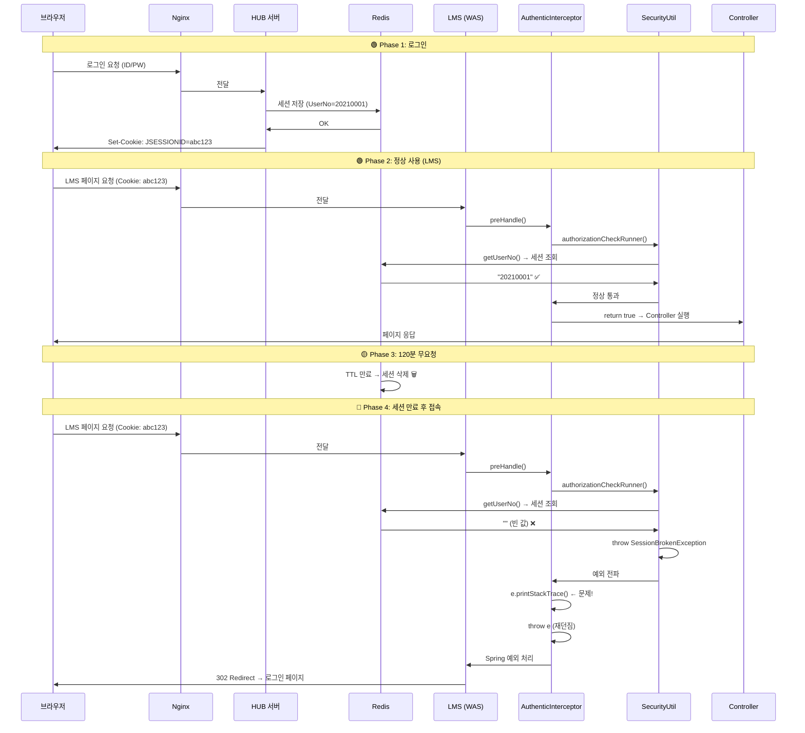

# 07. 세션 만료 전체 흐름

**난이도**: Delta | **예상 시간**: 30분

---

## 로그인부터 세션 만료까지

지금까지 배운 걸 전부 합쳐서, **로그인 → 정상 사용 → 세션 만료 → 로그인 리다이렉트**까지의 전체 흐름을 하나의 타임라인으로 정리한다.



---

## Phase별 상세 설명

### Phase 1: 로그인

| 단계 | 동작 | 참고 |
|------|------|------|
| 1 | 사용자가 HUB 로그인 페이지에서 ID/PW 입력 | HUB = KNU10WebService |
| 2 | HUB가 DB에서 사용자 인증 | ID/PW 검증 |
| 3 | HUB가 Redis에 세션 데이터 저장 | UserNo, UserType, OrgCd 등 |
| 4 | Redis가 TTL=7200초(120분)로 저장 | redis.expire=120 |
| 5 | 브라우저에 JSESSIONID 쿠키 설정 | Set-Cookie 헤더 |

### Phase 2: 정상 사용

| 단계 | 동작 | 코드 위치 |
|------|------|-----------|
| 1 | 브라우저가 쿠키와 함께 LMS 요청 | Cookie: JSESSIONID=abc123 |
| 2 | AuthenticInterceptor.preHandle() 실행 | line 39 |
| 3 | SecurityUtil.authorizationCheckRunner() 호출 | line 69 |
| 4 | SecurityUtil.authorizationCheck() 호출 | line 78 |
| 5 | UserBroker.getUserNo() → Redis에서 "20210001" 가져옴 | line 116 |
| 6 | 값이 있으니 권한 체크 통과 | - |
| 7 | preHandle() return true → Controller 실행 | line 74 |

!!! tip "요청할 때마다 Redis TTL이 갱신된다"
    매 요청마다 세션에 접근하면 Redis의 TTL이 리셋된다. 계속 쓰면 계속 살아있다.

### Phase 3: 세션 만료

사용자가 120분 동안 아무 요청도 안 보내면:

1. Redis의 TTL이 0이 된다
2. Redis가 해당 키를 자동 삭제한다
3. **서버 쪽에서는 아무 이벤트도 발생하지 않는다** - 그냥 조용히 사라짐

!!! note "세션 만료는 '이벤트'가 아니다"
    세션이 만료될 때 서버에 "세션이 만료됐습니다!" 같은 알림이 오지 않는다.
    다음 요청이 올 때 세션을 찾으려고 시도하고, 못 찾으면 그때 알게 되는 거다.

### Phase 4: 만료 후 접속 (문제 발생 지점)

여기가 핵심이다. 단계별로 정확하게 보자.

```
1. 브라우저: Cookie: JSESSIONID=abc123 과 함께 요청
   → 브라우저는 세션이 만료된 걸 모른다. 쿠키는 아직 있으니까.

2. AuthenticInterceptor.preHandle():
   → SecurityUtil.authorizationCheckRunner(request, response); 호출

3. authorizationCheckRunner():
   → authorizationCheck(request, response); 호출

4. authorizationCheck():
   → UserBroker.getUserNo(request) 호출
   → Redis에서 abc123 조회 → 없음 → "" (빈 문자열) 반환
   → 빈 값 감지 → throw new SessionBrokenException("system.fail.session.expire")

5. authorizationCheckRunner():
   → catch (Exception ex) { throw ex; }
   → 그냥 다시 던짐 (무의미)

6. AuthenticInterceptor.preHandle():
   → catch(Exception e) {
   →     e.printStackTrace();  // ← 여기서 35줄짜리 스택 트레이스가 찍힌다
   →     throw e;              // ← 다시 던짐
   → }

7. Spring ExceptionResolver:
   → SessionBrokenException → AuthorityException 계열 확인
   → 로그인 페이지로 302 Redirect

8. 브라우저:
   → 로그인 페이지 표시
```

---

## 핵심 통찰: 세션 만료는 에러가 아니다

!!! danger "가장 중요한 포인트"
    **세션 만료 → 로그인 리다이렉트는 100% 정상 흐름이다.**

    - 사용자가 2시간 동안 자리를 비웠다 → 세션 만료 → 다시 로그인 → 정상
    - 브라우저 탭을 오래 열어놨다 → 세션 만료 → 다시 로그인 → 정상
    - 수업 끝나고 다음 날 접속 → 세션 만료 → 다시 로그인 → 정상

    이건 **에러가 아니라 보안 기능**이다. 세션이 영원히 안 만료되면 그게 더 문제다.

그런데 우리 코드는 이 정상 흐름을 어떻게 처리하나?

```java
catch(Exception e) {
    e.printStackTrace();  // ← "에러가 발생했다!!!" 취급
    throw e;
}
```

**세션 만료를 에러처럼 취급**하고 있다. 매번 35줄짜리 스택 트레이스를 찍어댄다.

---

## 스택 트레이스 예시

```
egovframework.mediopia.lxp.common.comm.exception.SessionBrokenException:
    system.fail.session.expire
    at egovframework.mediopia.lxp.common.comm.util.security
       .SecurityUtil.authorizationCheck(SecurityUtil.java:150)
    at egovframework.mediopia.lxp.common.comm.util.security
       .SecurityUtil.authorizationCheckRunner(SecurityUtil.java:78)
    at egovframework.mediopia.lxp.common.comm.interceptor
       .AuthenticInterceptor.preHandle(AuthenticInterceptor.java:69)
    at org.springframework.web.servlet.HandlerExecutionChain
       .applyPreHandle(HandlerExecutionChain.java:134)
    at org.springframework.web.servlet.DispatcherServlet
       .doDispatch(DispatcherServlet.java:958)
    ... (약 30줄 더) ...
```

이게 **하루에 1,471번** 찍힌다. `1,471 x 35줄 = 51,485줄/일`.

!!! warning "08장 미리보기"
    이 51,485줄이 catalina.out에 쌓이고, 468일 동안 방치되면 어떻게 되는지. 서버가 죽는다. 09장에서 실제 사례를 본다.

---

## 핵심 정리

1. 로그인 → Redis 저장 → 쿠키 발급 (HUB에서)
2. LMS 요청 → 인터셉터 → SecurityUtil → UserBroker → Redis 조회
3. 120분 무요청 → Redis 자동 삭제 (조용히, 이벤트 없이)
4. 만료 후 접속 → UserBroker 빈 값 → SessionBrokenException → 로그인 리다이렉트
5. **세션 만료는 에러가 아니라 정상 흐름**인데, 코드가 `e.printStackTrace()`로 에러 취급
6. 하루 1,471회 x 35줄 = 51,485줄의 불필요한 로그

---

## 확인문제

### Q1. 세션 만료 시 브라우저 동작

!!! question "문제"
    세션이 만료된 후 사용자가 페이지를 요청할 때, 브라우저는 JSESSIONID 쿠키를 보내나? 이유는?

??? success "정답 보기"
    **보낸다.** 브라우저는 세션이 만료된 걸 모른다.

    쿠키는 브라우저에 저장되어 있고, 쿠키의 유효기간이 남아있으면 계속 보낸다. 세션 만료는 **서버(Redis)에서** 일어나는 일이다. 브라우저는 "abc123"이라는 쿠키를 평소와 똑같이 보내지만, 서버에서 해당 세션을 못 찾는 거다.

### Q2. authorizationCheckRunner()의 존재 이유

!!! question "문제"
    `authorizationCheckRunner()`는 `authorizationCheck()`를 감싸서 catch → throw만 한다. 이런 코드가 왜 존재하는 걸까? (정답이 없는 추론 문제)

??? success "정답 보기"
    여러 가능성이 있다:

    1. **과거에 로깅이나 전처리 로직이 있었을 수 있다**: 처음에는 catch에서 뭔가 했는데, 나중에 제거하고 빈 catch만 남은 것
    2. **추후 확장을 위해 남겨둔 것**: "나중에 여기에 뭔가 넣을 수도 있으니까"라는 의도
    3. **실수**: 의미 없는 코드인 걸 몰랐거나, 리팩토링하다 남겨둔 것

    어떤 이유든 **현재 상태에서는 무의미**하다. 이런 래퍼 메서드는 제거하는 게 맞다.

### Q3. 예외 전파 경로

!!! question "문제"
    SessionBrokenException이 발생한 후, 최종적으로 로그인 리다이렉트까지 예외가 전파되는 경로를 순서대로 적어봐.

??? success "정답 보기"
    1. `authorizationCheck()` → `throw new SessionBrokenException`
    2. `authorizationCheckRunner()` → `catch` → `throw ex` (그대로 전파)
    3. `AuthenticInterceptor.preHandle()` → `catch` → `e.printStackTrace()` → `throw e` (전파)
    4. `DispatcherServlet` → 예외 처리기(ExceptionResolver)에게 전달
    5. 예외 처리기 → SessionBrokenException 판별 → 로그인 페이지 302 Redirect

    예외가 **3단계를 거쳐서** Spring까지 올라간다. 그 중 2단계(authorizationCheckRunner, AuthenticInterceptor)는 잡아서 다시 던지기만 한다.

### Q4. 세션 만료 판별

!!! question "문제"
    서버 입장에서 "이 사용자의 세션이 만료됐다"를 어떻게 아나? 만료 시점에 알림이 오나?

??? success "정답 보기"
    **만료 시점에 알림이 오지 않는다.** Redis가 TTL 만료로 키를 삭제할 때 서버에 통보하지 않는다.

    서버는 **다음 요청이 올 때** 알게 된다:
    1. 요청과 함께 JSESSIONID 쿠키가 온다
    2. Redis에서 해당 세션 ID로 조회한다
    3. 결과가 null(없음)이면 → 세션이 만료됐구나

    "요청이 올 때까지는 모른다"가 핵심이다.

### Q5. 문제 코드 식별

!!! question "문제"
    다음 코드에서 불필요한 부분을 찾고, 왜 불필요한지 설명해봐.
    ```java
    // AuthenticInterceptor.java
    try {
        SecurityUtil.authorizationCheckRunner(request, response);
    } catch(Exception e) {
        e.printStackTrace();
        throw e;
    }
    ```
    ```java
    // SecurityUtil.java
    public static void authorizationCheckRunner(...) throws Exception {
        try {
            SecurityUtil.authorizationCheck(request, response);
        } catch (Exception ex) {
            throw ex;
        }
    }
    ```

??? success "정답 보기"
    **불필요한 부분 2개:**

    1. **`authorizationCheckRunner()` 전체**: catch에서 throw만 하는 래퍼. 이 메서드를 제거하고 `authorizationCheck()`를 직접 호출하면 된다.
    2. **`e.printStackTrace()`**: SessionBrokenException은 정상 흐름이다. 스택 트레이스를 찍을 이유가 없다. 특히 System.err에 찍는 건 로그 레벨 제어도 안 되고 파일 로테이션도 안 된다.

    개선하면:
    ```java
    try {
        SecurityUtil.authorizationCheck(request, response);
    } catch(SessionBrokenException e) {
        throw e;  // 정상 흐름, 로그 불필요
    } catch(Exception e) {
        log.error("Auth check failed: {}", e.getMessage());
        throw e;
    }
    ```
