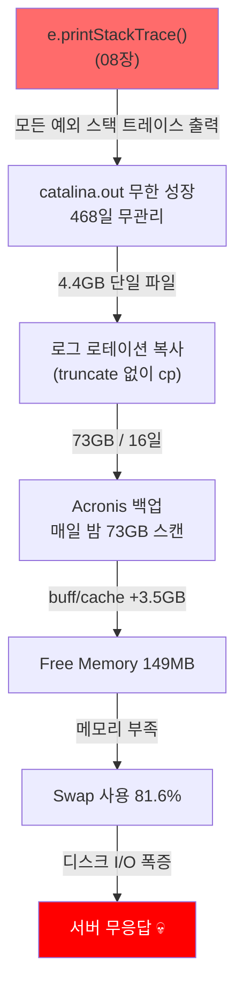
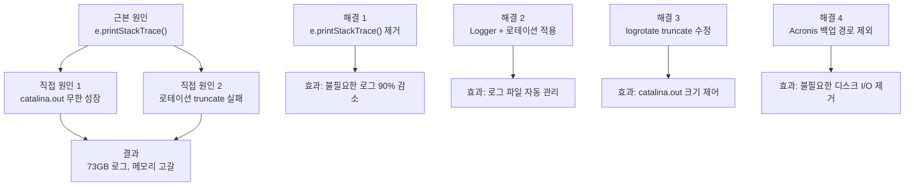

# 09. 실전: WAS02 로그 폭증 사고

**난이도**: Omega | **예상 시간**: 35분

---

## 사고 개요

!!! danger "실제 장애 사례"
    **일시**: 2026-03-15
    **대상**: WAS02 (Tomcat)
    **증상**: 서버 무응답, 접속 불가
    **원인**: `e.printStackTrace()` → catalina.out 폭증 → 디스크/메모리 고갈

이건 시뮬레이션이 아니다. 실제로 발생한 사고다. 01장부터 08장까지 배운 모든 것이 하나의 연쇄 반응으로 이어진 결과다.

---

## 사고 연쇄 반응



하나씩 뜯어보자.

---

## 1단계: e.printStackTrace()의 누적

08장에서 배운 그 코드다.

```java
// AuthenticInterceptor.java line 71
catch(Exception e) {
    e.printStackTrace();  // ← 이놈
    throw e;
}
```

**WAS01 (1일 기준) 예외 발생 현황:**

| 예외 | 발생 횟수 |
|------|-----------|
| SessionBrokenException | 1,471 |
| IOException | 432 |
| ClientAbortException | 216 |
| NullPointerException | 8 |

!!! note "확인 방법"
    ```bash
    grep -oP '\w+Exception' /data/tomcatlogs/catalina.out \
        | sort | uniq -c | sort -rn
    ```
    이 명령어로 catalina.out에서 예외별 발생 횟수를 집계할 수 있다.

---

## 2단계: 468일간의 catalina.out

WAS01은 **logrotate + truncate**가 정상 작동하고 있었다. 매일 로그를 백업하고, catalina.out을 비워줬다.

WAS02는? **truncate가 안 되고 있었다.** 468일 동안.

**WAS02 (468일 누적) 예외 현황:**

| 예외 | 누적 횟수 |
|------|-----------|
| SessionBrokenException | 318,316 |
| IOException | 353,943 |
| NullPointerException | 258,595 |
| ClientAbortException | 176,944 |

!!! danger "catalina.out 크기: 4.4GB"
    468일 x 매일 수천 건의 스택 트레이스 = **4.4GB 단일 파일**.
    이 파일 하나가 모든 문제의 출발점이다.

---

## 3단계: 로그 로테이션의 함정

서버에는 로그 로테이션 스크립트가 있었다. 근데 이 스크립트가 **복사만 하고 원본을 비우지 않았다**.

```
정상 동작 (WAS01):
  catalina.out → 복사 → catalina.out.2026-03-14
  catalina.out → truncate (비움) → 0바이트로 리셋

비정상 동작 (WAS02):
  catalina.out (4.4GB) → 복사 → catalina.out.2026-03-14 (4.4GB)
  catalina.out → truncate 실패! → 여전히 4.4GB
  다음날 또 복사 → catalina.out.2026-03-13 (4.4GB)
  ...
```

!!! warning "16일간의 로테이션"
    4.4GB x 16개 복사본 + 원본 = **약 73GB**의 로그 파일이 디스크에 존재.

---

## 4단계: Acronis 백업의 악순환

서버에는 **Acronis**라는 백업 소프트웨어가 매일 밤 실행되고 있었다.

| 항목 | 내용 |
|------|------|
| 백업 시간 | 매일 새벽 |
| 백업 대상 | 전체 디스크 |
| 문제 | 73GB 로그 파일을 **매일 밤 전체 스캔** |

Acronis가 73GB를 읽으면서:
- 디스크 I/O 폭증
- **buff/cache에 +3.5GB** 메모리 사용
- 파일 시스템 캐시가 메모리를 잡아먹음

---

## 5단계: 메모리 고갈 → Swap → 사망

```
메모리 현황:
  Total:     8GB
  Used:      4.2GB (Tomcat + 기타)
  buff/cache: 3.5GB (Acronis가 73GB 읽으면서)
  Free:      149MB ← 이 정도면 거의 없는 거다

Swap 현황:
  Total:     4GB
  Used:      3.26GB (81.6%)
```

!!! danger "죽음의 연쇄"
    1. Free Memory 149MB → 새 요청 처리할 메모리 부족
    2. OS가 **Swap 사용** 시작 (메모리 → 디스크로 데이터 이동)
    3. Swap은 디스크 기반이라 **메모리보다 수백 배 느림**
    4. Tomcat 쓰레드들이 Swap 대기하면서 응답 시간 폭증
    5. 응답 시간 폭증 → 요청 큐에 쌓임 → 쓰레드 풀 고갈
    6. **서버 무응답**

---

## 사고 타임라인 정리

| 시점 | 사건 |
|------|------|
| D-468 | WAS02 catalina.out truncate 중단 (원인 불명) |
| D-468 ~ D-16 | catalina.out이 매일 조금씩 성장 → 4.4GB |
| D-16 | 로그 로테이션이 4.4GB 파일을 복사하기 시작 |
| D-16 ~ D-1 | 매일 4.4GB 복사 → 16개 파일 → 73GB |
| D-1 (밤) | Acronis가 73GB 스캔 → buff/cache 3.5GB |
| D-Day | Free 149MB → Swap 81.6% → 서버 무응답 |

---

## 근본 원인과 해결



### 해결 1: e.printStackTrace() 제거 (08장)

```java
// 수정 전
catch(Exception e) {
    e.printStackTrace();
    throw e;
}

// 수정 후
catch(SessionBrokenException e) {
    throw e;
} catch(Exception e) {
    log.error("Authorization check failed: {}", e.getMessage());
    throw e;
}
```

→ SessionBrokenException 1,471회/일의 스택 트레이스가 **0**으로

### 해결 2: Logger + 로테이션 적용 (08장)

→ 날짜별 로그 분리, 30일 지난 파일 자동 삭제

### 해결 3: logrotate truncate 수정

→ 로테이션 후 원본 파일을 비우도록 수정

### 해결 4: 백업 경로에서 로그 디렉토리 제외

→ Acronis가 불필요하게 73GB를 스캔하지 않도록

!!! tip "4가지 해결이 각각 어떤 장에 대응하는지"
    | 해결 | 대응 장 | 배운 개념 |
    |------|---------|-----------|
    | e.printStackTrace() 제거 | 08장 | Logger vs printStackTrace |
    | Logger 로테이션 | 08장 | 로그 파일 관리 |
    | logrotate 수정 | 이번 장 | 운영 환경 관리 |
    | 백업 경로 제외 | 이번 장 | 시스템 운영 |

---

## 교훈

!!! abstract "이 사고에서 배울 것"
    1. **개발 습관이 운영에 영향을 준다**: `e.printStackTrace()` 한 줄이 468일 후 서버를 죽였다
    2. **정상 흐름을 에러 취급하면 안 된다**: 세션 만료는 에러가 아닌데 에러처럼 로깅하면 노이즈가 된다
    3. **모니터링이 중요하다**: 디스크 사용량, 로그 파일 크기를 주기적으로 확인해야 한다
    4. **연쇄 반응을 생각해야 한다**: 작은 문제(로그)가 큰 문제(서버 다운)로 이어질 수 있다

---

## 핵심 정리

1. `e.printStackTrace()` → catalina.out 468일 누적 → 4.4GB
2. 로그 로테이션이 truncate 없이 복사 → 73GB
3. Acronis 백업이 73GB 스캔 → buff/cache 3.5GB → Free 149MB
4. Swap 81.6% → 서버 무응답
5. 근본 원인: `e.printStackTrace()`로 정상 흐름을 에러 취급한 코드

---

## 확인문제

### Q1. 사고 연쇄 반응

!!! question "문제"
    이 사고의 연쇄 반응을 5단계로 요약해봐. 각 단계가 다음 단계를 어떻게 유발했는지.

??? success "정답 보기"
    1. **e.printStackTrace()**: 모든 예외의 스택 트레이스를 catalina.out에 출력 → 파일이 계속 커짐
    2. **468일 무관리**: truncate 실패로 catalina.out이 4.4GB까지 성장
    3. **로테이션 복사**: 4.4GB 파일을 매일 복사 → 16일간 73GB 축적
    4. **Acronis 백업**: 73GB를 매일 밤 스캔 → buff/cache로 3.5GB 메모리 사용 → Free 149MB
    5. **Swap 폭증**: 메모리 부족 → Swap 81.6% 사용 → 디스크 I/O 병목 → 서버 무응답

### Q2. WAS01 vs WAS02

!!! question "문제"
    WAS01과 WAS02는 같은 코드(e.printStackTrace())를 쓰고 있다. 그런데 WAS01은 정상이고 WAS02만 죽었다. 왜?

??? success "정답 보기"
    **logrotate의 truncate 동작이 달랐기 때문이다.**

    - WAS01: 로테이션 후 catalina.out을 **truncate(비움)** → 매일 작은 크기 유지
    - WAS02: 로테이션은 되지만 truncate가 **실패** → catalina.out이 468일간 누적

    같은 코드, 같은 e.printStackTrace()지만 **운영 환경의 차이**(truncate 설정)가 결과를 갈랐다. 즉, e.printStackTrace()는 두 서버 모두에서 문제이지만, WAS01은 truncate가 증상을 감추고 있었을 뿐이다.

### Q3. 예외 카운트 분석

!!! question "문제"
    WAS01(1일)과 WAS02(468일) 예외 수를 비교해봐.

    | 예외 | WAS01 (1일) | WAS02 (468일) |
    |------|-------------|---------------|
    | SessionBroken | 1,471 | 318,316 |

    WAS02의 468일 SessionBrokenException이 `1,471 x 468 = 688,028`이어야 하는데 실제는 318,316이다. 이 차이가 발생한 이유를 추론해봐.

??? success "정답 보기"
    여러 가능성이 있다:

    1. **사용량 변동**: 468일 동안 매일 같은 수의 사용자가 접속하지 않는다. 방학, 시험기간, 주말에 따라 접속자 수가 다르다. 1,471은 특정 날짜의 수치일 뿐 평균이 아니다.
    2. **서버 무응답 기간**: WAS02가 간헐적으로 느려지면서 요청 자체가 줄어들었을 수 있다.
    3. **로드밸런싱 가중치**: WAS02가 느려지면 Nginx가 WAS01로 더 많이 보냈을 수 있다.

### Q4. 해결 우선순위

!!! question "문제"
    4가지 해결책 중 가장 먼저 적용해야 하는 것과 그 이유를 말해봐.

    A. e.printStackTrace() 제거
    B. Logger 로테이션 적용
    C. logrotate truncate 수정
    D. 백업 경로에서 로그 제외

??? success "정답 보기"
    **C. logrotate truncate 수정**이 최우선이다.

    이유: 당장 서버가 죽어가고 있으니 **긴급 조치**가 먼저다. truncate를 수정하면 catalina.out이 비워져서 디스크 공간을 즉시 확보할 수 있다. 73GB의 복사본도 삭제해야 한다.

    그 다음 **A → B → D** 순서로 근본 원인을 해결한다. A가 근본 원인이지만, 코드 수정 → 빌드 → 배포가 필요하므로 긴급 조치보다 시간이 걸린다.

    장애 대응의 원칙: **1. 긴급 조치(증상 완화) → 2. 근본 원인 해결 → 3. 재발 방지**

### Q5. 모니터링

!!! question "문제"
    이 사고를 사전에 감지하려면 어떤 지표를 모니터링해야 했나? 3가지.

??? success "정답 보기"
    1. **디스크 사용량**: `/data/tomcatlogs/` 디렉토리 크기가 특정 임계치(예: 10GB)를 넘으면 알림
    2. **catalina.out 파일 크기**: 단일 파일이 1GB를 넘으면 알림
    3. **Swap 사용률**: Swap이 50%를 넘으면 경고, 80%를 넘으면 긴급 알림

    추가로 **Free Memory**, **예외 발생 빈도**(일별 SessionBrokenException 수)도 모니터링하면 좋다.
