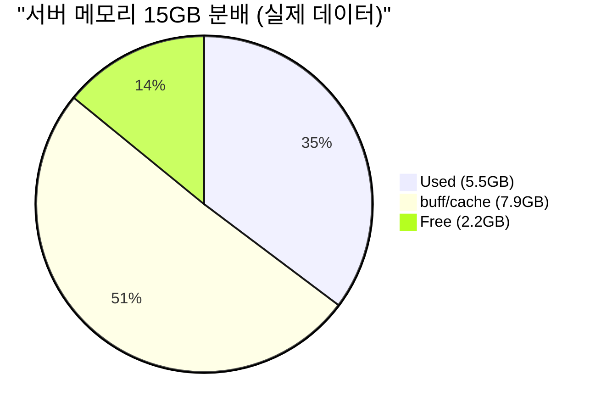
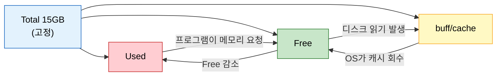
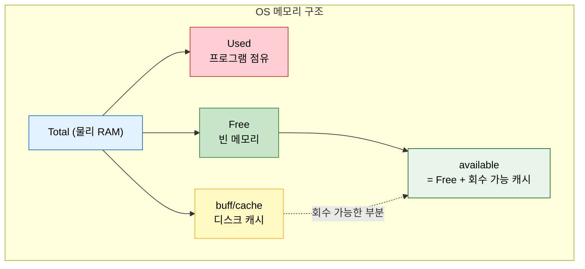

# 01. OS 메모리 구조

!!! info "난이도: :material-alpha-a-box: Alpha"

    서버 메모리의 기본 구조를 이해하는 단계야.
    이거 모르면 뒤에 나오는 거 하나도 이해 못 해. 확실히 잡고 가.

---

## 비유부터 시작하자

RAM 15GB짜리 서버가 있다고 해봐. 이걸 **15평짜리 방**이라고 생각해.

| 메모리 영역 | 비유 | 설명 |
|-------------|------|------|
| **Used** | 가구가 차지하는 공간 | 프로그램이 실제로 쓰고 있는 메모리. 못 치워. |
| **buff/cache** | 택배 임시 보관 공간 | OS가 성능 올리려고 디스크 데이터 캐싱해둔 거. 급하면 치울 수 있어. |
| **Free** | 완전히 빈 공간 | 아무도 안 쓰는 메모리. |

!!! tip "핵심"

    이 세 개를 다 합치면 **Total**이야. 그게 전부다.

---

## 공식: Total = Used + buff/cache + Free

이건 외워. **제로섬 게임**이야.

방 크기(Total)는 고정이니까, **하나가 늘면 다른 게 줄어든다.**



계산해봐:

```
5.5 + 7.9 + 2.2 = 15.6GB ≒ Total 15GB
```

!!! note "소수점 차이"

    `free -h` 출력은 반올림이라 딱 맞진 않아. 대략 맞으면 정상이야.

---

## `free -h` 명령어 읽는 법

서버에서 `free -h` 치면 이런 게 나와:

```
              total        used        free      shared  buff/cache   available
Mem:           15Gi        5.5Gi       2.2Gi       1.2Gi       7.9Gi       9.8Gi
Swap:         4.0Gi        1.2Gi       2.8Gi
```

!!! warning "주의"

    여기서 봐야 할 건 **Mem 줄**이야. Swap은 03장에서 다룬다. 지금은 무시해.

각 컬럼 뜻:

| 컬럼 | 값 | 의미 |
|------|-----|------|
| **total** | 15Gi | 물리 RAM 총량. 고정값. |
| **used** | 5.5Gi | 프로그램들이 실제 점유 중인 메모리 |
| **free** | 2.2Gi | 누구도 안 쓰는 완전한 빈 메모리 |
| **shared** | 1.2Gi | 여러 프로세스가 공유하는 메모리 (지금은 무시) |
| **buff/cache** | 7.9Gi | OS 디스크 캐시 (02장에서 자세히) |
| **available** | 9.8Gi | **실제로 쓸 수 있는** 메모리 |

---

## available이 뭔데?

여기가 제일 헷갈리는 부분이야.

!!! abstract "available의 정의"

    **available = Free + 회수 가능한 buff/cache**

    OS가 "급하면 buff/cache 치워서 여기까지 쓸 수 있어"라고 알려주는 값이야.

실제 데이터로 확인해보자:

```
Free(2.2GB) + buff/cache(7.9GB) = 10.1GB
available = 9.8GB
```

!!! question "왜 딱 안 맞아?"

    buff/cache 중에서도 **못 치우는 부분**이 있어서 그래.
    커널이 반드시 유지해야 하는 캐시가 일부 있거든.
    그래서 available은 Free + buff/cache보다 약간 작아.

---

## 제로섬: 하나가 늘면 다른 게 줄어든다



시나리오로 이해해봐:

| 시나리오 | Used | buff/cache | Free | 설명 |
|----------|------|------------|------|------|
| **서버 부팅 직후** | 2GB | 1GB | 12GB | 프로그램 거의 안 떠있어 |
| **WAS 올린 후** | 5GB | 1GB | 9GB | Used 증가, Free 감소 |
| **디스크 작업 발생** | 5GB | 7GB | 3GB | 캐시 증가, Free 감소 |
| **Free 부족해지면** | 5GB | 3GB | 7GB | OS가 캐시 회수해서 Free 확보 |

!!! danger "진짜 위험한 상황"

    Used가 계속 증가하면? Free도 줄고, buff/cache도 회수당하고...
    그래도 모자라면? 그때 **Swap**이 시작된다. (03장에서 다룸)

---

## 정리



| 핵심 | 내용 |
|------|------|
| 공식 | Total = Used + buff/cache + Free |
| 제로섬 | Total은 고정. 하나 늘면 다른 게 줄어 |
| available | Free + 회수 가능한 buff/cache |
| 명령어 | `free -h`로 확인 |

---

## 확인 문제

---

### Q1. 메모리 공식

`free -h`에서 Mem 줄의 total이 15GB다.
used가 6GB, buff/cache가 5GB라면, free는 얼마야?

??? success "정답 보기"

    **4GB**

    Total = Used + buff/cache + Free

    15 = 6 + 5 + Free

    Free = 4GB

    제로섬이야. 세 개 합치면 반드시 Total이 돼.

---

### Q2. available의 의미

`free -h` 결과가 이래:

```
              total    used    free    buff/cache   available
Mem:           15Gi    8Gi     1Gi        6Gi          6.5Gi
```

Free가 1GB밖에 없는데, 프로그램이 3GB를 새로 요청하면 어떻게 돼?

??? success "정답 보기"

    **available이 6.5GB니까 가능해.**

    1. 먼저 Free 1GB를 줌
    2. 나머지 2GB는 buff/cache에서 회수해서 줌
    3. buff/cache가 6GB에서 4GB로 줄어듦
    4. available은 "실제로 쓸 수 있는 양"이니까, 6.5GB 이내 요청은 처리 가능

    Free만 보고 "메모리 부족이다!" 하면 안 돼. **available을 봐야 해.**

---

### Q3. 제로섬 이해

서버에서 대용량 백업이 실행됐다. 디스크에서 파일을 엄청 읽고 있어.
이때 Used는 변함없다고 가정하면, buff/cache와 Free는 각각 어떻게 변해?

??? success "정답 보기"

    - **buff/cache: 증가**
    - **Free: 감소**

    디스크를 읽으면 OS가 읽은 데이터를 buff/cache에 저장해.
    그 공간은 Free에서 가져오니까, Free가 줄고 buff/cache가 느는 거야.

    Total은 고정이고 Used도 안 변한다고 했으니까:

    Total = Used(고정) + buff/cache(증가) + Free(감소)

    이게 제로섬이야.

---

### Q4. 진짜 위험 판단

아래 두 서버 중 더 위험한 건 어느 쪽이야?

| | total | used | free | buff/cache | available |
|---|---|---|---|---|---|
| **서버 A** | 15Gi | 10Gi | 0.3Gi | 4.7Gi | 4.5Gi |
| **서버 B** | 15Gi | 13Gi | 0.3Gi | 1.7Gi | 1.2Gi |

??? success "정답 보기"

    **서버 B가 훨씬 위험해.**

    서버 A는 Free가 0.3GB로 적어 보이지만, available이 4.5GB야.
    buff/cache 4.7GB 중 대부분을 회수할 수 있으니까 여유가 있어.

    서버 B는 available이 1.2GB밖에 안 돼.
    Used가 13GB로 너무 크고, buff/cache도 1.7GB밖에 없어서 회수할 게 별로 없어.
    여기서 프로그램이 메모리를 조금만 더 요청하면 **Swap이 발생**해.

    교훈: **Free만 보지 말고 available을 봐라.**

---

### Q5. 명령어

서버 메모리 상태를 사람이 읽기 쉬운 단위(GB, MB)로 확인하려면 어떤 명령어를 쳐야 해?

??? success "정답 보기"

    ```bash
    free -h
    ```

    `-h`는 human-readable의 약자야. 바이트 단위 대신 GB, MB로 보여줘.

    `-h` 안 붙이면 킬로바이트 단위로 나와서 읽기 힘들어.

---

다 맞혔으면 [02_buff_cache란.md](02_buff_cache란.md)로 넘어가.

틀린 게 있으면? **위에서부터 다시 읽어.**
