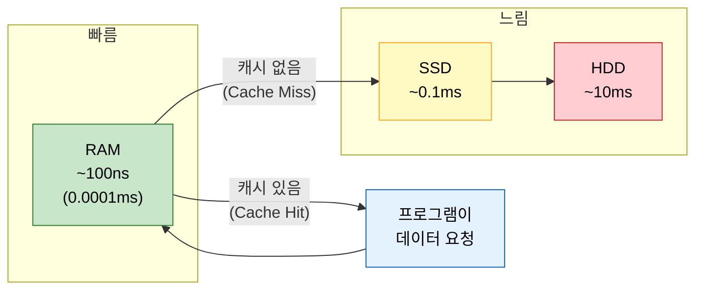
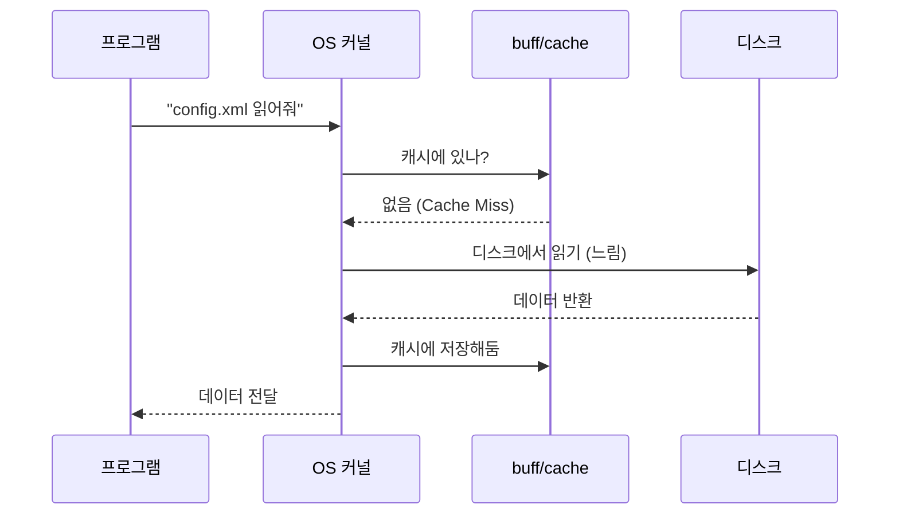
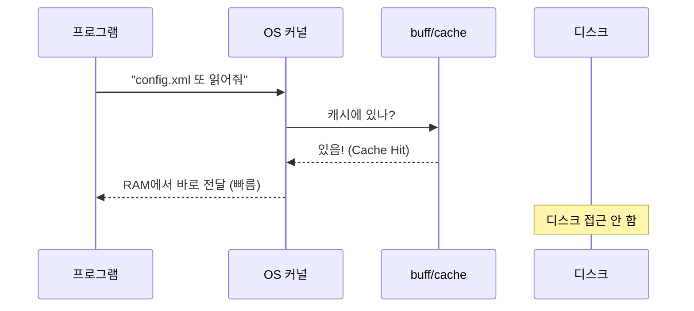
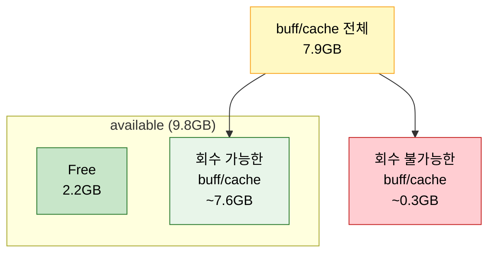

# 02. buff/cache란

!!! info "난이도: :material-alpha-a-box: Alpha"

    01장에서 "buff/cache는 디스크 캐시"라고만 했어.
    이번엔 **왜** OS가 그걸 하는지, **언제** 회수되는지까지 파고든다.

---

## 비유: 카페 메뉴 외우기

자주 가는 카페가 있어. 매번 메뉴판 들여다보는 건 귀찮잖아.
그래서 자주 시키는 걸 **외워버려**. 다음부터는 메뉴판 안 봐도 바로 주문해.

OS도 똑같아.

| 비유 | 실제 |
|------|------|
| 메뉴판 보기 | **디스크에서 읽기** (느림) |
| 메뉴 외우기 | **RAM에 캐싱** (buff/cache) |
| 외운 메뉴로 주문 | **RAM에서 읽기** (빠름) |
| 머리 용량 한계 | **RAM 용량 한계** |

!!! tip "한 줄 정리"

    buff/cache는 OS가 **디스크 데이터를 RAM에 미리 올려둔 것**이야.
    다음에 같은 데이터 필요하면 디스크 안 가고 RAM에서 바로 가져와.

---

## 왜 캐시를 하는가: 속도 차이

이게 제일 중요해. 디스크랑 RAM의 속도 차이가 얼마나 나는지 봐.

### 저장장치별 속도 비교

| 저장장치 | 읽기 속도 | 접근 시간 | 비유 |
|----------|-----------|-----------|------|
| **HDD** | ~200 MB/s | ~10ms | 도서관 가서 책 찾기 |
| **SSD (SATA)** | ~550 MB/s | ~0.1ms | 책상 서랍에서 꺼내기 |
| **SSD (NVMe)** | ~3,500 MB/s | ~0.02ms | 손에 들고 있는 노트 |
| **RAM** | ~50,000 MB/s | ~100ns | **이미 머릿속에 있는 것** |

!!! danger "핵심 숫자"

    RAM은 HDD보다 **약 10만 배** 빨라.
    NVMe SSD랑 비교해도 **약 15배** 빨라.

    OS 입장에서 디스크 접근을 줄이는 건 **엄청난 성능 이득**이야.



---

## buff/cache의 동작 원리

### 1단계: 디스크에서 처음 읽을 때



### 2단계: 같은 파일 다시 읽을 때



!!! note "이게 buff/cache의 전부야"

    - **처음 읽기**: 디스크 접근 (느림) + 캐시 저장
    - **다시 읽기**: 캐시에서 바로 (빠름)
    - 결론: 자주 읽는 파일일수록 성능 이득이 커

---

## buff/cache가 안 줄어드는 이유

01장에서 봤듯이 서버의 buff/cache가 7.9GB나 돼.
"이거 왜 이렇게 커? 문제 아니야?" 하고 물을 수 있어.

!!! abstract "OS의 판단 로직"

    OS는 이렇게 생각해:

    "RAM에 여유 있잖아. 캐시 지워봤자 Free가 늘어나는 것뿐이고,
    Free가 늘어봤자 어차피 안 쓸 거잖아.
    그럼 **캐시 유지하는 게 이득**이지. 나중에 또 읽을 수도 있으니까."

이걸 표로 정리하면:

| 상황 | OS 판단 | buff/cache |
|------|---------|------------|
| Free 충분함 | "캐시 유지가 이득" | 유지 또는 증가 |
| Free 약간 부족 | "아직 괜찮아" | 유지 |
| Free 위험 수준 | "이제 회수해야 해" | **감소 (강제 회수)** |
| Free 거의 0 | "긴급 회수!" | **급격히 감소** |

---

## 언제 회수되나: 실제 데이터

!!! example "실제 WAS02 서버 데이터"

    백업 작업으로 buff/cache가 10GB까지 치솟았어.
    Free가 얼마까지 떨어져야 OS가 캐시를 회수했을까?

| 시각 | buff/cache | Free | OS 행동 |
|------|-----------|------|---------|
| 02:00 | 6.5GB | 3.2GB | 캐시 유지 |
| 02:30 | 8.2GB | 1.5GB | 캐시 유지 |
| 03:00 | 10.0GB | 0.5GB | 캐시 유지 |
| 03:05 | 10.2GB | 0.3GB | 캐시 유지 |
| **03:10** | **7.5GB** | **192MB** | **드디어 회수 시작** |

!!! warning "192MB"

    Free가 **192MB**까지 떨어져서야 OS가 캐시 회수를 시작했어.
    15GB RAM 서버에서 192MB면 **1.3%**야.

    OS는 정말 끝까지 캐시를 안 놓아. "아직 괜찮아"가 OS의 기본 태도야.

---

## available vs Free: 다시 강조

01장에서도 했지만 중요하니까 한 번 더.



| 지표 | 의미 | 언제 봐야 해 |
|------|------|-------------|
| **Free** | 진짜 빈 메모리 | 참고용. 이것만 보면 안 돼 |
| **available** | 실제로 쓸 수 있는 메모리 | **이걸 봐야 해** |

!!! danger "실수 패턴"

    "Free가 300MB밖에 없어! 메모리 부족이야!" -- 이건 틀린 판단이야.

    available이 8GB면 **여유 있는 거야**. buff/cache가 크다는 건
    캐시를 많이 하고 있다는 뜻이지, 메모리 부족이 아니야.

---

## 정리

| 핵심 | 내용 |
|------|------|
| buff/cache가 뭐냐 | OS가 디스크 데이터를 RAM에 캐싱해둔 것 |
| 왜 캐시하냐 | RAM이 디스크보다 수만 배 빠르니까 |
| 왜 안 줄어드냐 | OS가 "여유 있으면 캐시 유지가 이득"이라고 판단 |
| 언제 줄어드냐 | Free가 위험 수준까지 떨어져야 강제 회수 |
| 뭘 봐야 하냐 | Free 말고 **available** |

---

## 확인 문제

---

### Q1. buff/cache의 정체

buff/cache가 7GB라는 건 무슨 뜻이야?

- A) 프로그램들이 7GB를 쓰고 있다
- B) OS가 디스크 데이터를 7GB만큼 RAM에 캐싱해두고 있다
- C) 7GB가 고장났다
- D) Swap이 7GB 발생했다

??? success "정답 보기"

    **B) OS가 디스크 데이터를 7GB만큼 RAM에 캐싱해두고 있다**

    buff/cache는 OS의 디스크 캐시야. 프로그램이 직접 쓰는 메모리(Used)와는 다르고,
    Swap과도 완전히 다른 개념이야.

---

### Q2. 속도 차이

OS가 디스크 캐싱을 하는 **근본적인 이유**는 뭐야?

??? success "정답 보기"

    **RAM이 디스크보다 수만 배 빠르기 때문**이야.

    - HDD: 접근 시간 ~10ms
    - RAM: 접근 시간 ~100ns (0.0001ms)
    - 차이: 약 **10만 배**

    한 번 디스크에서 읽은 데이터를 RAM에 올려두면,
    다음에 같은 데이터 요청이 올 때 디스크 접근 없이 바로 줄 수 있어.
    이게 성능에 **엄청난 차이**를 만들어.

---

### Q3. 회수 조건

buff/cache가 10GB인데 Free가 3GB야. OS가 캐시를 회수할까?

??? success "정답 보기"

    **안 해.**

    OS의 기본 정책은 "여유 있으면 캐시 유지"야.
    Free가 3GB면 OS 입장에서는 아직 여유 있어.

    실제 데이터에서도 Free가 **192MB(전체의 1.3%)** 까지 떨어져서야 회수를 시작했어.

    OS는 캐시를 최대한 오래 유지하려고 해. 성능상 이득이니까.

---

### Q4. 위험 판단

아래 서버 상태를 보고, 메모리가 부족한 상태인지 판단해봐.

```
              total    used    free    buff/cache   available
Mem:           15Gi    4Gi     0.5Gi      10.5Gi       10.2Gi
```

??? success "정답 보기"

    **메모리 부족 아니야.**

    Free가 0.5GB라서 "위험하다!" 할 수 있는데, **available이 10.2GB**야.
    buff/cache 10.5GB 중 대부분을 회수할 수 있으니까 실제로는 넉넉해.

    이 서버는 디스크 작업을 많이 해서 캐시가 크게 잡혀 있는 상태일 뿐이야.

    **Free가 아니라 available을 봐야 해.** 이건 몇 번을 강조해도 모자라.

---

### Q5. Cache Hit vs Cache Miss

프로그램이 같은 설정 파일을 1초에 100번 읽는다고 해봐.
buff/cache가 있을 때와 없을 때의 차이는?

??? success "정답 보기"

    **buff/cache 없을 때 (매번 디스크 접근):**

    - 100회 x 0.1ms(SSD) = 10ms
    - HDD면 100회 x 10ms = **1,000ms (1초)**

    **buff/cache 있을 때 (첫 번째만 디스크, 나머지 99번은 RAM):**

    - 1회 디스크 + 99회 RAM
    - 0.1ms + (99 x 0.0001ms) = **약 0.11ms**

    SSD 기준으로도 **약 90배** 빨라.
    HDD 기준이면 **약 9,000배** 빨라.

    이래서 OS가 캐시를 안 놓으려고 하는 거야.

---

다 맞혔으면 [03_Swap이란.md](03_Swap이란.md)으로 넘어가.

틀린 게 있으면? **위에서부터 다시 읽어.**
