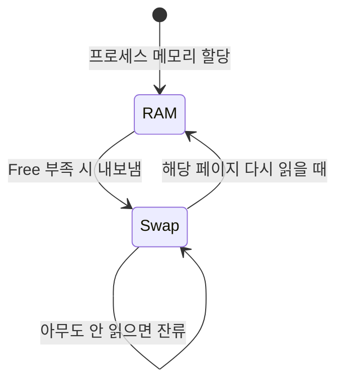

# 03. Swap이란

**난이도**: :material-beta: Beta
**선수 지식**: [01_OS_메모리_구조](01_OS_메모리_구조.md), [02_buff_cache란](02_buff_cache란.md)

---

## 한 줄 정의

> **Swap = 디스크의 일부를 RAM처럼 쓰는 것.**

RAM이 꽉 차면, OS가 디스크에 미리 잡아둔 공간(Swap 영역)에 메모리 내용을 임시로 내보내는 거야.

---

## 비유: 책상과 서랍

!!! note "이 비유 하나로 Swap의 본질을 잡아"

    **책상** = RAM. 작업할 때 펼쳐놓는 공간.
    **서랍** = Swap(디스크). 당장 안 쓰는 자료 넣어두는 곳.

    책상이 꽉 차면? 덜 쓰는 자료를 서랍에 넣어.
    다시 필요하면? 서랍에서 꺼내.

    **문제는 속도야.**
    책상 위에서 자료 집는 건 손 뻗으면 끝이야 → **나노초(ns)**.
    서랍 열고, 찾고, 꺼내는 건? → **밀리초(ms)**.

    그 차이가 **수만 배**야.

---

## Swap은 언제 발생하나

01장에서 배웠지? `free -h`로 보면 메모리는 이렇게 나뉘어:

```
              total    used    buff/cache   free
Mem:           15Gi    11Gi       3.5Gi     500Mi
Swap:         4.0Gi    150Mi
```

Free가 바닥나면, OS는 두 가지 선택지가 있어:

| 선택지 | 설명 | 속도 |
|--------|------|------|
| **buff/cache 회수** | 캐시는 "있으면 좋은" 데이터. 반납 가능 | 빠름 |
| **Swap 사용** | RAM의 페이지를 디스크로 내보냄 | 느림 |

!!! tip "핵심 포인트"

    OS는 둘 중 뭘 먼저 할지 **설정값**으로 결정해.
    그게 바로 다음 장에서 배울 `vm.swappiness`야.

---

## Swap 발생 흐름



이 다이어그램에서 핵심은 마지막 줄이야.
**"아무도 안 읽으면 잔류"** -- 이게 05장에서 배울 비가역성의 핵심이야.

---

## Swap 영역이란

Swap은 마법이 아니야. 디스크에 **미리 잡아둔 공간**이야.

```bash
# 우리 서버 기준
$ free -h
Swap:         4.0Gi   150Mi   3.8Gi
#             전체     사용중   남은양
```

!!! warning "Swap이 있다고 안심하면 안 돼"

    Swap 4GB가 있다고 "4GB 더 쓸 수 있네~" 이러면 안 돼.
    Swap을 쓰는 순간 이미 성능은 바닥이야.
    Swap은 **보험**이지, **여유 공간**이 아니야.

---

## 왜 위험한가: 속도 차이

이걸 숫자로 보면 아찔해:

| 저장 매체 | 접근 속도 | 비유 |
|-----------|-----------|------|
| **RAM** | ~100 나노초 | 책상 위에서 손 뻗기 |
| **SSD** | ~100 마이크로초 | 옆방 서랍 열기 |
| **HDD** | ~10 밀리초 | 1층 창고 다녀오기 |

!!! danger "RAM vs 디스크 = 수만 배 차이"

    RAM 접근: **100ns**
    디스크 접근: **100us ~ 10ms**

    **최소 1,000배, 최대 100,000배 느려.**

    프로세스가 메모리에 접근할 때마다 디스크 I/O가 발생하면?
    서버는 응답 불가 상태에 빠져.

---

## Swap 사용량이 늘어난다는 건

Swap 사용량이 늘어난다 = **RAM에 있던 페이지가 디스크로 밀려나고 있다**는 뜻이야.

```
시간       Swap 사용량     의미
22:00      100MB          아직 괜찮아
22:30      120MB          슬슬 밀려나기 시작
23:00      180MB          Free 부족해지고 있어
23:30      250MB          위험 신호
00:00      400MB          서버 느려지기 시작
```

!!! danger "Swap이 수백 MB 이상이면"

    프로세스가 메모리 접근할 때마다 디스크 I/O가 발생해.
    CPU는 놀고 있는데 I/O wait만 올라가.
    사용자 입장에서는 "서버가 멈췄다"랑 같아.

---

## 정리

| 개념 | 설명 |
|------|------|
| **Swap이란** | 디스크의 일부를 RAM처럼 쓰는 것 |
| **발생 조건** | Free 부족 시 OS가 선택 (캐시 회수 or Swap) |
| **Swap 영역** | 디스크에 미리 잡아둔 공간 (우리 서버: 4GB) |
| **위험한 이유** | RAM 대비 수만 배 느림 → 서버 응답 불가 |
| **핵심** | Swap은 보험이지 여유 공간이 아님 |

---

## 확인 문제

!!! question "문제 1: Swap의 정체"

    Swap이 뭔지 한 줄로 설명해봐.

??? success "정답 보기"

    **디스크의 일부를 RAM처럼 사용하는 것.**
    RAM이 부족하면 OS가 메모리 내용을 디스크의 Swap 영역으로 내보내서,
    물리 RAM 이상의 메모리를 사용할 수 있게 해주는 메커니즘이야.

!!! question "문제 2: Free 부족 시 OS의 선택지"

    Free가 바닥났을 때 OS가 할 수 있는 두 가지가 뭐야?
    그리고 둘 중 뭐가 더 빠르고, 왜 빠른 거야?

??? success "정답 보기"

    1. **buff/cache 회수**: 캐시는 "있으면 좋지만 없어도 되는" 데이터라서 즉시 반납 가능. → **빠름**
    2. **Swap 사용**: RAM의 페이지를 디스크로 내보냄. 디스크 I/O 발생. → **느림**

    buff/cache 회수가 빠른 이유: 메모리에서 메모리 작업이라 디스크 I/O 없이 바로 해제 가능하니까.
    Swap은 디스크에 써야 하니까 느려.

!!! question "문제 3: 속도 차이"

    RAM 접근과 디스크 접근의 속도 차이가 대략 몇 배야?
    그래서 Swap을 많이 쓰면 서버에 무슨 일이 벌어져?

??? success "정답 보기"

    **최소 1,000배, 최대 100,000배** 차이가 나.

    Swap을 많이 쓰면:

    - 프로세스가 메모리에 접근할 때마다 디스크 I/O 발생
    - CPU는 I/O 대기 상태로 놀고 있음
    - 사용자 요청 처리 속도가 급격히 느려짐
    - 결국 **서버 응답 불가** 상태에 빠짐

!!! question "문제 4: Swap 영역은 어디에 있어?"

    Swap 영역은 어디에 존재하고, 미리 설정하는 거야 동적으로 생기는 거야?

??? success "정답 보기"

    **디스크에 미리 잡아둔 공간**이야.
    서버 설정할 때 "Swap 파티션" 또는 "Swap 파일"로 미리 할당해 놓는 거지,
    RAM이 부족할 때 갑자기 생기는 게 아니야.

    우리 서버 기준으로 4GB를 미리 잡아둔 상태야.
    `free -h`의 Swap 줄에서 total이 그 크기야.

!!! question "문제 5: 이건 맞는 말이야, 틀린 말이야?"

    "Swap이 4GB 있으니까, RAM 16GB + Swap 4GB = 총 20GB 메모리를 쓸 수 있어서 여유롭다."

    이 말이 맞아? 틀려? 틀리면 뭐가 틀렸는지 설명해봐.

??? success "정답 보기"

    **완전히 틀렸어.**

    Swap 4GB를 "추가 메모리"로 생각하면 안 돼.
    Swap을 쓰는 순간 이미 성능은 수만 배 느려진 상태야.

    Swap은 **보험**이야. "RAM 부족해서 프로세스가 죽는 것"을 막아주는 안전장치지,
    "여유 공간이 더 있네~"라고 편하게 쓸 수 있는 게 아니야.

    Swap 사용량이 늘어나는 건 **"이미 문제가 발생하고 있다"**는 경고 신호야.

---

**다음**: [04_vm_swappiness.md](04_vm_swappiness.md) - OS가 캐시 회수와 Swap 중 뭘 먼저 할지 결정하는 설정값
