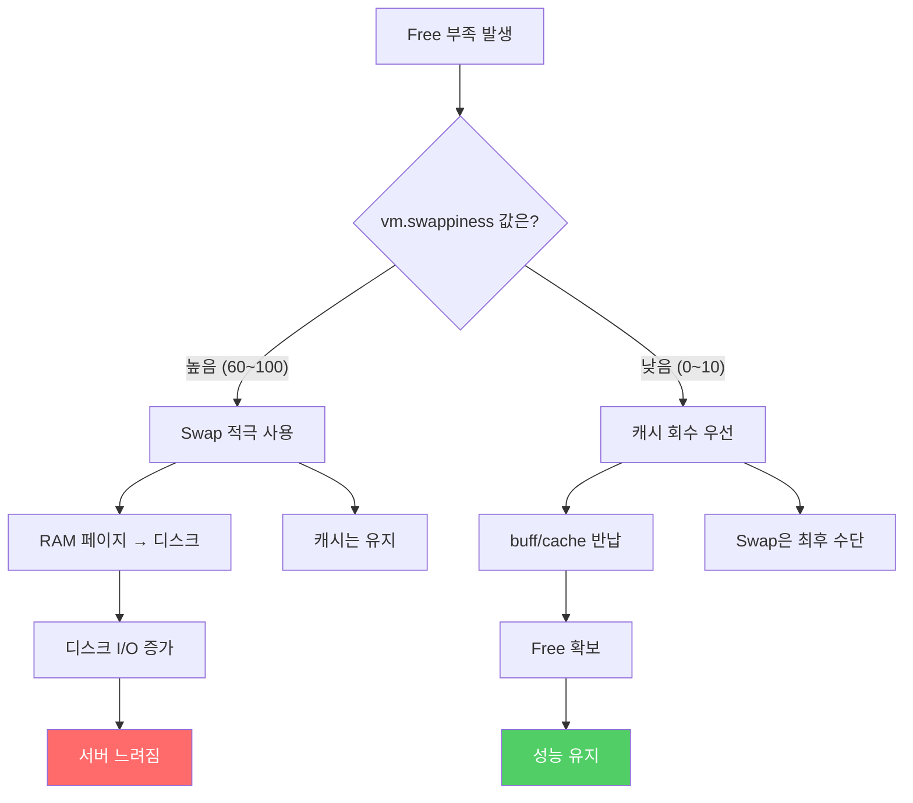

# 04. vm.swappiness

**난이도**: :material-beta: Beta
**선수 지식**: [03_Swap이란](03_Swap이란.md)

---

## 한 줄 정의

> **vm.swappiness = OS가 Free 부족할 때 "캐시 회수 vs Swap" 중 뭘 더 적극적으로 할지 결정하는 값.**

0에서 100 사이의 숫자 하나. 이 숫자 하나가 서버 생사를 가르기도 해.

---

## 비유: 에어컨 온도 설정

!!! note "이 비유로 직관을 잡아"

    추운 겨울, 방이 좀 춥다고 치자.

    **swappiness = 60 (기본값)**
    "좀 추우면 바로 히터 틀어!" → Swap을 적극적으로 써.
    전기요금(성능 비용)은 생각 안 해.

    **swappiness = 10 (권장값)**
    "담요부터 덮어. 이불도 덮어. 그래도 추우면 그때 히터." → 캐시 회수부터.
    Swap(히터)은 정말 급할 때만.

    **swappiness = 0**
    "히터 절대 안 켜. 얼어 죽어도 안 켜." → Swap 극단적 회피.
    진짜 죽을 것 같을 때만(OOM 직전) Swap 사용.

---

## 값의 의미

| swappiness 값 | OS의 전략 | 설명 |
|:-:|---|---|
| **0** | Swap 극단적 회피 | "캐시 회수 다 하고, 진짜 죽을 것 같을 때만 Swap 써" |
| **10** | 캐시 회수 우선 | "캐시부터 회수해. Swap은 정말 급할 때만" |
| **30** | 캐시 회수 중심 | "캐시 회수가 주력이지만, 필요하면 Swap도 좀" |
| **60** | 반반 (기본값) | "Swap도 적극 활용. 캐시도 유지하려고 노력" |
| **80** | Swap 적극 사용 | "캐시 유지가 더 중요해. Swap 많이 써도 괜찮아" |
| **100** | Swap 최대 활용 | "캐시는 최대한 지켜. RAM이 부족하면 다 Swap으로" |

!!! abstract "핵심 정리"

    **값이 높을수록** → Swap을 적극적으로 사용 (캐시 보존 우선)
    **값이 낮을수록** → 캐시를 먼저 회수 (Swap 회피)

---

## 왜 기본값이 60이야?

!!! warning "기본값 60은 범용 서버를 위한 값이야"

    **데스크톱/범용 서버에서는 합리적이야:**

    - 파일을 자주 읽고 쓰는 환경에서는 캐시가 중요해
    - 캐시를 유지하면서 Swap도 적절히 쓰면 전체 효율이 좋아
    - 다양한 작업을 하는 환경에 맞는 "중간값"이야

    **WAS 서버에서는 위험해:**

    - JVM이 12GB짜리 힙을 올려놓고 있어
    - 여기서 Swap 적극 사용? → JVM 힙 페이지가 디스크로 밀려나
    - 힙 접근할 때마다 디스크 I/O → 서버 죽어

---

## 실전: 우리 서버에서는

### WAS 서버 권장값: 10

| 항목 | 기본값 (60) | 권장값 (10) |
|------|:-:|:-:|
| Swap 사용 빈도 | 높음 | 낮음 |
| 캐시 유지율 | 높음 | 낮음 (회수 우선) |
| JVM 힙 안정성 | 낮음 | 높음 |
| WAS 서버 적합성 | 부적합 | 적합 |

!!! tip "왜 0이 아니라 10이야?"

    0으로 하면 캐시를 너무 공격적으로 회수해서, 디스크 I/O가 오히려 늘어날 수 있어.
    10이면 "캐시 회수 위주로 하되, 극단적이진 않게" 동작해.
    대부분의 WAS 서버 운영 가이드에서 10을 권장하는 이유야.

---

## 확인 방법

```bash
# 현재 swappiness 값 확인
cat /proc/sys/vm/swappiness
```

기본 설정이면 `60`이 나올 거야.

---

## 변경 방법

### 즉시 적용 (재부팅하면 초기화)

```bash
sysctl vm.swappiness=10
```

### 영구 적용 (재부팅해도 유지)

```bash
# /etc/sysctl.conf에 추가
echo "vm.swappiness=10" >> /etc/sysctl.conf

# 설정 즉시 반영
sysctl -p
```

!!! danger "주의: 프로덕션 서버에서 함부로 바꾸지 마"

    설정 변경은 반드시 **운영팀과 협의** 후에 해.
    변경 전 현재 값을 기록해두고, 변경 후 모니터링 필수야.

    이 문서는 "이해하기 위한" 문서야. 직접 바꾸라는 게 아니야.

---

## 전체 그림: swappiness와 메모리 전략



---

## 환경별 권장값 정리

| 서버 환경 | 권장 swappiness | 이유 |
|-----------|:-:|---|
| **데스크톱/개발 PC** | 60 (기본) | 다양한 앱 사용, 캐시 중요 |
| **파일 서버** | 60~80 | 파일 캐시가 성능의 핵심 |
| **WAS 서버 (JVM)** | 10 | JVM 힙을 Swap으로 내보내면 서버 죽음 |
| **DB 서버** | 1~10 | DB가 자체 캐시 관리. OS 캐시 불필요 |
| **Redis/Memcached** | 0~1 | 인메모리 DB는 Swap = 사망 |

!!! abstract "패턴이 보여?"

    **메모리에 큰 프로세스를 상주시키는 서버**일수록 swappiness를 낮춰야 해.
    JVM, DB, 인메모리 캐시 -- 전부 "RAM에 계속 있어야 하는" 녀석들이야.
    이런 환경에서 Swap을 적극 쓰면? 서버가 죽어.

---

## 정리

| 개념 | 설명 |
|------|------|
| **vm.swappiness** | OS의 "캐시 회수 vs Swap" 전략 설정값 (0~100) |
| **기본값 60** | 범용 서버용. WAS에서는 위험 |
| **권장값 10** | WAS 서버에서 캐시 회수 우선, Swap 최소화 |
| **확인 방법** | `cat /proc/sys/vm/swappiness` |
| **핵심** | 값이 높으면 Swap 적극 사용, 낮으면 캐시 회수 우선 |

---

## 확인 문제

!!! question "문제 1: swappiness의 역할"

    vm.swappiness가 뭘 결정하는 값인지 한 문장으로 설명해봐.

??? success "정답 보기"

    **Free가 부족할 때, OS가 "buff/cache 회수"와 "Swap 사용" 중 어느 쪽을 더 적극적으로 할지 결정하는 값이야.**

    0~100 사이의 값으로, 높을수록 Swap을 적극 사용하고, 낮을수록 캐시 회수를 우선해.

!!! question "문제 2: 기본값이 왜 문제야?"

    swappiness 기본값 60이 데스크톱에서는 괜찮은데,
    WAS 서버에서는 왜 위험한 거야?

??? success "정답 보기"

    WAS 서버에는 **JVM이 12GB짜리 큰 힙을 올려놓고 있어.**

    swappiness 60이면 OS가 Swap을 적극적으로 사용하는데,
    이때 **JVM 힙의 페이지가 디스크로 밀려날 수 있어.**

    JVM이 힙에 접근할 때마다 디스크 I/O가 발생하면
    애플리케이션 성능이 수만 배 느려지고, 결국 서버가 응답 불가 상태에 빠져.

    데스크톱은 다양한 앱이 번갈아 쓰이니까 Swap이 합리적이지만,
    WAS는 JVM 힙이 "항상 RAM에 있어야 하는" 메모리라서 Swap 되면 죽어.

!!! question "문제 3: 왜 0이 아니라 10이야?"

    WAS 서버에서 swappiness를 0이 아니라 10으로 권장하는 이유는?

??? success "정답 보기"

    0으로 설정하면 **캐시를 너무 공격적으로 회수**해.
    캐시가 너무 없어지면 디스크 읽기 요청이 매번 실제 디스크에서 읽어야 해서
    오히려 디스크 I/O가 증가할 수 있어.

    10이면 "캐시 회수를 우선하되, 최소한의 캐시는 유지하고,
    Swap은 정말 급할 때만 사용"하는 균형잡힌 전략이야.

    극단적인 값보다 약간의 여유를 두는 게 실전에서는 더 안정적이야.

!!! question "문제 4: 설정 변경"

    swappiness를 10으로 바꾸고 싶어. 두 가지 방법이 있는데, 차이가 뭐야?

    ```bash
    # 방법 A
    sysctl vm.swappiness=10

    # 방법 B
    echo "vm.swappiness=10" >> /etc/sysctl.conf
    sysctl -p
    ```

??? success "정답 보기"

    **방법 A: 즉시 적용, 재부팅하면 초기화.**
    커널 파라미터를 런타임에만 변경하는 거라, 서버 재부팅하면 다시 기본값(60)으로 돌아가.

    **방법 B: 영구 적용, 재부팅해도 유지.**
    `/etc/sysctl.conf` 파일에 설정을 기록해두면, 부팅할 때 이 파일을 읽어서 적용해.
    `sysctl -p`는 파일에 쓴 설정을 즉시 반영시키는 명령이야.

    실전에서는 **방법 A로 먼저 테스트**하고, 문제없으면 **방법 B로 영구 적용**하는 순서로 해.

---

**다음**: [05_Swap의_비가역성.md](05_Swap의_비가역성.md) - Swap이 한번 올라가면 왜 안 줄어드는지
