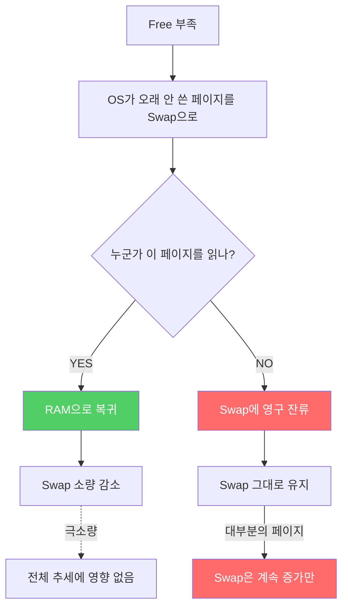
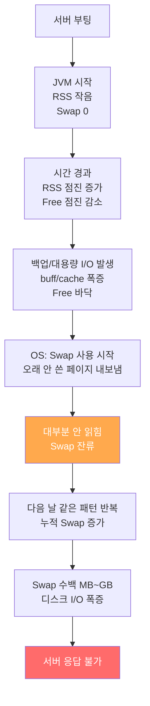

# 05. Swap의 비가역성

**난이도**: :material-gamma: Gamma
**선수 지식**: [03_Swap이란](03_Swap이란.md), [04_vm_swappiness](04_vm_swappiness.md)

---

## 한 줄 정의

> **Swap에 내보낸 페이지는 "누군가 다시 읽을 때만" RAM으로 돌아온다. 아무도 안 읽으면 영원히 Swap에 남아.**

이게 Swap이 줄어들지 않는 근본 원인이야.

---

## 메커니즘: 왜 Swap은 안 줄어들어?

단계별로 뜯어보자.

### Step 1: Swap으로 내보내기

Free가 부족해지면, OS는 "오래 안 쓴 페이지"를 골라서 Swap으로 내보내.

!!! note "OS가 고르는 기준"

    OS는 **LRU(Least Recently Used)** 방식으로 골라.
    "가장 오래 안 쓴 페이지"부터 Swap으로 밀어내.

    JVM 힙의 Old 영역에서 GC가 정리한 빈 공간?
    아무도 안 읽고 있으니까 LRU 상위 후보야.

### Step 2: 내보낸 페이지의 운명

내보낸 페이지에게 일어날 수 있는 일은 딱 두 가지야:

| 상황 | 결과 |
|------|------|
| 누군가 그 페이지를 다시 읽음 | RAM으로 복귀 (Swap 감소) |
| 아무도 안 읽음 | **Swap에 영구 잔류** |

### Step 3: 문제의 핵심

!!! danger "GC가 정리한 빈 Old 영역이 Swap으로 나가면?"

    1. Free 부족 → OS가 JVM 힙의 오래 안 쓴 페이지를 Swap으로 내보냄
    2. 이 페이지가 GC가 이미 정리한 **빈 Old 영역**이면?
    3. **아무도 읽지 않아.** 빈 공간이니까.
    4. RAM으로 돌아올 이유가 없어 → **영구 잔류**

    이게 Swap이 줄어들지 않는 근본 원인이야.

---

## 흐름도



---

## 실제 데이터로 증명

실제 서버 모니터링 데이터를 봐:

```
시간         Swap 사용량     변화       설명
────────────────────────────────────────────────────
22:40        144MB          -          기준점
23:10        143MB          -1MB       누군가 읽어서 복귀
23:40        146MB          +3MB       새로 밀려남
00:10        148MB          +2MB       계속 밀려남
01:10        149MB          +1MB       계속 증가
03:10        149MB           0         변화 없음
06:10        148MB          -1MB       소량 복귀
10:00        147MB          -1MB       소량 복귀
12:00        150MB          +3MB       다시 증가
```

!!! warning "패턴이 보여?"

    - 소량 복귀(-1MB, -2MB)는 간헐적으로 발생해
    - 하지만 **전체 추세는 항상 증가**야
    - 돌아오는 양보다 나가는 양이 항상 많아

---

## 누적 효과: 시간이 지날수록 가속

이게 진짜 무서운 부분이야. Swap 증가는 **선형이 아니라 가속**해.

| 경과 시간 | 일일 Swap 증가량 | 누적 Swap | 왜 가속되나 |
|:-:|:-:|:-:|---|
| **1일차** | +23MB | ~23MB | JVM RSS가 아직 작아서 Free 여유 있음 |
| **7일차** | +50~100MB | ~200MB | RSS가 커지면서 Free 줄어듦 |
| **14일차** | +100~200MB | ~500MB 이상 | Free가 거의 없어서 조금만 부족해도 Swap |
| **N일차** | 폭증 | GB 단위 | **서버 응답 불가** |

!!! danger "기하급수적 증가의 원리"

    시간이 지날수록 JVM의 RSS(실제 사용 메모리)가 점점 커져.
    JVM은 한번 잡은 메모리를 OS에 안 돌려주거든.

    RSS가 12GB로 성장하면?

    - 전체 RAM 16GB - RSS 12GB = Free + buff/cache에 4GB밖에 없어
    - 여기서 백업이라도 돌면? buff/cache 폭증 → Free 0
    - 같은 백업인데, 1일차보다 14일차에 **훨씬 많은 Swap**을 유발해

    **원인은 같은데 결과가 점점 커지는 거야.**

---

## 왜 "비가역"이야?


!!! abstract "비가역(irreversible)의 의미"

    화학에서 비가역 반응이란, **한번 일어나면 되돌리기 극히 어려운 반응**이야.

    Swap도 마찬가지야:

    - **정방향(RAM → Swap)**: Free만 부족하면 쉽게 발생
    - **역방향(Swap → RAM)**: 해당 페이지를 누군가 읽어야만 발생

    대부분의 Swap 페이지는 아무도 읽지 않는 "죽은 데이터"라서,
    역방향은 극소량만 일어나고, 전체 추세는 계속 증가만 해.

---

## Swap을 줄이는 유일한 방법

Swap이 알아서 줄어들지 않는다면, 줄이는 방법은?

| 방법 | 설명 | 부작용 |
|------|------|--------|
| **서버 재부팅** | 메모리 전체 초기화 | 서비스 중단 |
| **swapoff/swapon** | Swap 비우고 다시 활성화 | Swap 내용을 RAM으로 올려야 해서 일시적 부하 |
| **프로세스 재시작** | JVM 재시작으로 RSS 초기화 | 서비스 일시 중단 |

!!! warning "swapoff -a && swapon -a"

    이 명령은 Swap에 있는 **모든 페이지를 RAM으로 강제로 올린 다음** Swap을 비워.
    RAM에 여유가 없으면? **OOM Killer 발동**할 수 있어.

    프로덕션에서 함부로 쓰면 안 돼.

---

## 전체 타임라인



---

## 정리

| 개념 | 설명 |
|------|------|
| **비가역성** | Swap으로 나간 페이지는 읽히지 않으면 영구 잔류 |
| **핵심 원인** | GC가 정리한 빈 Old 영역 = 아무도 안 읽는 죽은 데이터 |
| **소량 복귀** | 간헐적으로 발생하지만 전체 추세에 영향 없음 |
| **누적 효과** | 시간이 지날수록 RSS 증가 → Free 감소 → 같은 이벤트에 더 큰 Swap |
| **해결 방법** | 재부팅, swapoff/swapon, 프로세스 재시작 (자동 복구 없음) |

---

## 확인 문제

!!! question "문제 1: Swap이 안 줄어드는 근본 이유"

    Swap 사용량이 한번 올라가면 왜 자동으로 줄어들지 않는 거야?
    메커니즘을 단계별로 설명해봐.

??? success "정답 보기"

    1. Free 부족 → OS가 오래 안 쓴 RAM 페이지를 Swap으로 내보냄
    2. Swap으로 나간 페이지가 RAM으로 돌아오려면 **누군가 그 페이지를 다시 읽어야** 함
    3. 내보내진 페이지 대부분은 GC가 정리한 빈 Old 영역 같은 "죽은 데이터"
    4. 아무도 읽지 않으니 RAM으로 돌아올 이유가 없음
    5. **결과: Swap에 영구 잔류**

    Free가 다시 여유가 생겨도, OS가 "여유 있으니까 Swap 비워야지" 같은 동작은 **안 해**.
    오직 "읽기 요청"이 있을 때만 RAM으로 복귀하는 거야.

!!! question "문제 2: 가속 현상"

    Swap 증가가 시간이 지날수록 빨라지는 이유는?
    1일차에 +23MB였는데, 14일차에 +200MB까지 늘어나는 원리를 설명해봐.

??? success "정답 보기"

    **핵심은 JVM의 RSS 성장이야.**

    - JVM은 한번 잡은 메모리를 OS에 잘 안 돌려줘
    - 시간이 지나면 RSS가 점점 커져 (예: 8GB → 10GB → 12GB)
    - RSS가 커지면 Free + buff/cache에 남는 공간이 줄어
    - **같은 백업 작업(같은 buff/cache 사용량)인데**, 남은 공간이 줄었으니까 Free가 더 빨리 바닥나
    - Free가 바닥나면 OS는 Swap을 더 많이 써야 해

    **원인(백업)은 같은데, 배경(RSS)이 바뀌어서 결과(Swap)가 점점 커지는 거야.**

!!! question "문제 3: GC가 정리한 빈 영역이 왜 문제야?"

    JVM GC가 Old 영역을 정리했어. 깨끗하게 비웠어.
    그런데 이 빈 영역이 왜 Swap 비가역성의 핵심 원인이야?

??? success "정답 보기"

    GC가 Old 영역을 정리하면 그 메모리 페이지는 **빈 상태**야.
    하지만 JVM은 그 메모리를 **OS에 반환하지 않아.** 힙으로 잡아두고 있어.

    OS 입장에서 보면:

    - JVM이 점유하고 있는 메모리인데, 오래 안 읽힌 페이지 → LRU 상위 후보
    - Free 부족 시 Swap으로 내보냄
    - 이 페이지는 빈 공간이라 **누구도 다시 읽지 않아**
    - 결과: Swap에 영구 잔류

    **빈 공간인데 Swap에 있고, 아무도 안 읽으니까 영원히 돌아오지 않는 거야.**

!!! question "문제 4: Swap을 줄이는 방법"

    Swap이 자동으로 줄어들지 않는다면, 줄이는 방법은 뭐가 있어?
    각 방법의 부작용도 같이 말해봐.

??? success "정답 보기"

    | 방법 | 부작용 |
    |------|--------|
    | **서버 재부팅** | 서비스 완전 중단. 가장 확실하지만 가장 비용 큼 |
    | **swapoff -a && swapon -a** | Swap 내용을 전부 RAM으로 올려야 해서 일시적 부하 급증. RAM 여유 없으면 OOM Killer 발동 가능 |
    | **JVM(WAS) 재시작** | 서비스 일시 중단. RSS가 초기화되면서 Free 확보 |

    **자동 복구는 없어.** 사람이 개입해서 위 방법 중 하나를 실행해야 해.
    그래서 Swap이 쌓이기 전에 **예방**하는 게 핵심이야
    (swappiness 조정, 메모리 모니터링, 정기 재시작 등).

!!! question "문제 5: 시나리오 분석"

    아래 데이터를 보고 질문에 답해봐.

    ```
    시간         Swap
    ──────────────────
    월요일 09:00   50MB
    화요일 09:00  120MB
    수요일 09:00  250MB
    목요일 09:00  480MB
    금요일 09:00  900MB
    ```

    1. 이 추세가 계속되면 주말에 무슨 일이 벌어져?
    2. 증가량이 70→130→230→420으로 점점 커지는 이유는?
    3. 수요일에 Swap을 0으로 비워도 금요일에 다시 쌓이는 이유는?

??? success "정답 보기"

    **1. 주말에 벌어지는 일:**
    Swap이 GB 단위에 도달하면 프로세스의 메모리 접근이 전부 디스크 I/O로 바뀌어.
    토요일~일요일 사이에 **서버 응답 불가** 상태에 빠질 가능성 높아.
    모니터링 안 하면 월요일에 출근해서 장애 발견하는 최악의 시나리오.

    **2. 증가량이 커지는 이유:**
    JVM RSS가 매일 조금씩 성장하면서 Free가 줄어들어.
    월요일에는 Free 여유가 있어서 +70MB로 끝났지만,
    목요일에는 Free가 거의 없어서 같은 이벤트에 +420MB가 Swap으로 밀려나.
    **같은 원인, 다른 배경, 더 큰 결과.**

    **3. 비워도 다시 쌓이는 이유:**
    Swap을 비워도 **근본 원인(JVM RSS 증가 + Free 부족)은 그대로**야.
    JVM을 재시작하지 않는 한 RSS는 줄어들지 않아.
    결국 다시 Free 부족 → Swap 발생 → 누적의 사이클이 반복돼.

---

**다음**: [06_백업과_메모리.md](06_백업과_메모리.md) - 디스크 작업이 메모리에 미치는 영향
