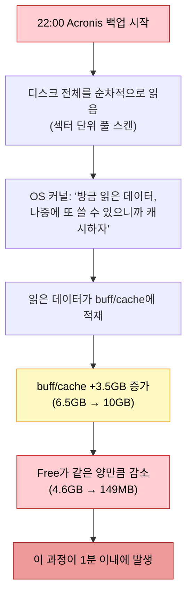
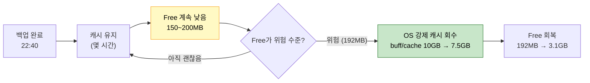
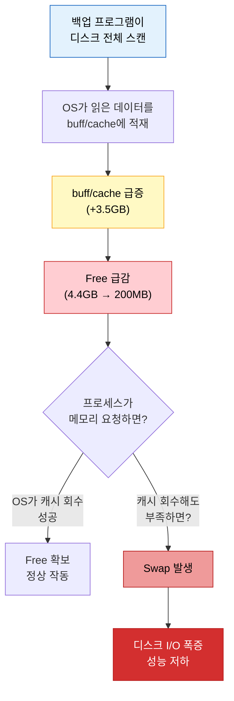

# 06. 백업과 메모리

!!! info "난이도: :material-gamma: Gamma"

    디스크 집중 작업이 메모리에 미치는 영향을 이해하는 단계야.
    01~05장을 이해 못 하면 여기서 막힌다. 특히 buff/cache와 제로섬 개념.

---

## 왜 백업이 메모리 문제야?

"백업은 디스크 작업이잖아. 왜 메모리 얘기가 나와?"

이거 당연한 질문인데, 이걸 이해 못 하면 실전에서 장애 원인 절대 못 찾아.

핵심부터 말해줄게:

!!! abstract "한 줄 결론"

    **백업 프로그램이 디스크를 스캔하면, OS가 읽은 데이터를 자동으로 buff/cache에 올린다.**

01장에서 배운 제로섬 기억나?

> Total = Used + buff/cache + Free

buff/cache가 올라가면? **Free가 내려간다.** 이게 전부야.

---

## 메커니즘: 백업이 메모리를 먹는 과정

Acronis 같은 백업 프로그램이 매일 22시에 실행된다고 해봐.



단계별로 뜯어보자:

| 단계 | 무슨 일이 벌어지나 |
|------|---------------------|
| 1 | Acronis 백업이 22시에 시작 |
| 2 | 디스크를 처음부터 끝까지 순차적으로 읽음 (전체 스캔) |
| 3 | OS가 읽은 데이터를 **자동으로** buff/cache에 적재 |
| 4 | buff/cache가 +3.5GB 증가 (6.5GB에서 10GB로) |
| 5 | Free가 같은 양만큼 감소 (4.6GB에서 149MB로) |
| 6 | 이 과정이 **1분 이내**에 벌어짐 |

!!! warning "OS가 캐시하는 건 자동이야"

    리눅스는 "디스크에서 뭔가 읽었으면 RAM에 캐시해두는 게 이득"이라고 판단해.
    백업 프로그램이 의도적으로 메모리를 먹는 게 아니야.
    OS가 **알아서** 캐시하는 거야. 이게 01장에서 배운 리눅스 메모리 철학이야.

---

## 실제 데이터: 30초 단위 관측

이건 실제 서버에서 `backup_mem.log`로 30초마다 `free -h`를 찍은 거야.

### 백업 시작 순간

| 시간 | buff/cache | Free | 상태 |
|------|-----------|------|------|
| 22:18:00 | 6.5GB | 4.4GB | 정상. 여유 있음. |
| 22:18:30 | 8.4GB | 1.9GB | 스캔 시작. 30초 만에 캐시 +1.9GB |
| 22:19:00 | 10GB | 203MB | 거의 전부 캐시에 올라감 |
| 22:19:30 | 10GB | 188MB | 더 이상 Free 없음 |

!!! danger "1분이야"

    22:18:00에 Free가 4.4GB였는데, 22:19:00에 203MB로 떨어졌어.
    **60초 만에 Free가 4.2GB 증발했다.**

이걸 제로섬으로 검증해봐:

```
22:18:00 기준 (Total ≒ 15GB)
Used: 약 4.1GB + buff/cache: 6.5GB + Free: 4.4GB = 15GB

22:19:00 기준 (Total ≒ 15GB)
Used: 약 4.8GB + buff/cache: 10GB + Free: 0.2GB = 15GB
```

Total은 변하지 않았어. buff/cache가 올라간 만큼 Free가 내려간 거야.

---

## 백업 끝나도 캐시는 안 내려온다

여기가 진짜 함정이야.

"백업 끝나면 캐시 돌아오겠지?" 라고 생각하지? **아니야.**

### 백업 종료 후 데이터

| 시간 | 이벤트 | buff/cache | Free |
|------|--------|-----------|------|
| 22:40 | 백업 완료 | 10GB | 149MB |
| 01:00 | 백업 끝나고 2시간 경과 | 10GB | 155MB |
| 03:00 | 백업 끝나고 5시간 경과 | 10GB | 192MB |
| 03:10 | OS 강제 회수 발생 | 7.5GB | 3.1GB |

!!! question "왜 캐시를 안 돌려줘?"

    OS 입장에서 생각해봐.

    "캐시에 있는 데이터를 굳이 버릴 이유가 없잖아.
    Free가 좀 적어도 아무도 메모리 달라고 안 하면
    캐시 유지하는 게 나중에 디스크 I/O 줄여주니까 이득이야."

    리눅스는 이렇게 판단해: **"여유 있으면 캐시 유지가 이득"**

    Free가 192MB까지 떨어져야 "이건 위험하다"고 판단해서 비로소 캐시를 회수해.
    그전까지는 캐시를 **절대 자발적으로 안 내놔.**



---

## 비유: 도서관 사서

비유로 정리할게.

도서관에서 매일 밤 10시에 **전 서가 장서 점검**을 해.

| 도서관 | 서버 |
|--------|------|
| 사서(OS)가 점검을 시작 | Acronis가 백업을 시작 |
| 책(디스크 데이터)을 한 권씩 꺼내서 확인 | 디스크를 순차적으로 읽음 |
| "방금 확인한 책은 데스크 위에 올려놓자" | OS가 읽은 데이터를 buff/cache에 적재 |
| 데스크(RAM)가 책으로 꽉 참 | buff/cache가 Free를 잡아먹음 |
| 점검 끝나도 "혹시 또 볼까봐" 데스크에 그대로 둠 | 백업 끝나도 캐시 안 내려옴 |
| 손님(프로세스)이 와서 "자리 없어요!" 하면 그때서야 치움 | Free가 위험 수준까지 내려가야 OS가 캐시 회수 |

!!! tip "비유의 핵심"

    사서는 책을 **버리는 게 아니라 데스크 위에 올려놓는 것**이야.
    치울 수 있지만 치우지 않는 거야. 누가 그 자리를 달라고 할 때까지.

---

## 디스크 크기와의 관계

"디스크가 크면 캐시도 더 많이 올라와?"

**당연하지.**

| 디스크 크기 | 스캔 데이터량 | buff/cache 증가량 | 위험도 |
|-------------|---------------|-------------------|--------|
| 50GB | 작음 | +1~2GB | 낮음 |
| 200GB | 보통 | +3~5GB | 중간 |
| 500GB+ | 많음 | +5~10GB | 높음 |

!!! note "RAM 대비가 핵심이야"

    디스크가 500GB이고 RAM이 64GB면 문제 없어.
    디스크가 200GB인데 RAM이 15GB면? 캐시가 Free를 다 잡아먹어.

    결국 **디스크 크기 / RAM 크기** 비율이 높을수록 위험한 거야.

---

## 백업 → 캐시 → Free → Swap 연쇄 반응

여기까지 이해했으면 전체 연쇄 반응을 봐.



!!! danger "05장에서 배운 Swap의 비가역성 기억나?"

    Swap에 한 번 내보내진 메모리는 **자동으로 안 돌아와.**
    백업 때문에 Swap이 발생하면, 그 Swap 사용량은 **서버 재시작 전까지 유지돼.**

    백업이 **매일** 돌면? 매일 Swap이 쌓여. 이게 07장에서 다룰 **WAS02 장애의 원인**이야.

---

## 정리

| 핵심 | 내용 |
|------|------|
| 백업 = 디스크 풀 스캔 | 디스크의 모든 데이터를 순차적으로 읽음 |
| OS가 자동 캐시 | 읽은 데이터를 buff/cache에 올림 (리눅스 철학) |
| 제로섬 | buff/cache 증가 = Free 감소 (1분 이내) |
| 캐시 미반환 | 백업 끝나도 캐시 안 내려옴 (OS가 "이득"이라 판단) |
| 강제 회수 | Free가 위험 수준까지 떨어져야 OS가 캐시 회수 |
| 연쇄 반응 | 백업 → 캐시 증가 → Free 감소 → Swap 발생 가능 |

---

## 확인 문제

---

### Q1. 백업과 캐시의 관계

Acronis 백업이 디스크를 스캔할 때, 왜 buff/cache가 증가하는지 설명해봐.
"백업이 메모리를 먹어서"라고 대답하면 틀린 거야.

??? success "정답 보기"

    백업 프로그램이 직접 메모리를 먹는 게 아니야.

    백업 프로그램이 디스크의 데이터를 **읽으면**, OS 커널이 읽은 데이터를
    **자동으로 buff/cache에 캐시**해. 이건 리눅스의 메모리 철학이야.
    "한 번 읽은 데이터는 RAM에 캐시해두면 다음에 또 읽을 때 디스크 안 가도 되니까 이득"이라는 판단.

    백업 프로그램의 프로세스 자체가 쓰는 메모리(Used)는 크지 않아.
    문제는 OS가 디스크 읽기 결과를 **캐시(buff/cache)로 쌓는 것**이야.

---

### Q2. 제로섬 계산

`free -h` 결과가 이래 (백업 시작 전):

```
total: 15GB  used: 4.1GB  buff/cache: 6.5GB  free: 4.4GB
```

백업이 시작되어 buff/cache가 10GB로 증가했다. Used는 4.8GB로 약간 올랐다.
Free는 얼마야? 계산 과정을 보여줘.

??? success "정답 보기"

    Total = Used + buff/cache + Free

    15GB = 4.8GB + 10GB + Free

    **Free = 0.2GB (200MB)**

    buff/cache가 6.5에서 10으로 3.5GB 증가하고,
    Used가 4.1에서 4.8로 0.7GB 증가했어.
    합쳐서 4.2GB가 늘었으니까, Free에서 4.2GB가 줄어든 거야.

    4.4GB - 4.2GB = 0.2GB. 제로섬.

---

### Q3. 백업 후 캐시가 안 내려오는 이유

백업이 22:40에 완료됐는데, 03:00까지 buff/cache가 10GB로 유지됐어.
왜 OS가 캐시를 바로 회수하지 않는지 설명해봐.

??? success "정답 보기"

    OS 입장에서 **캐시를 버릴 이유가 없기 때문**이야.

    1. 캐시에 있는 데이터를 누가 다시 읽을 수도 있어 (디스크 I/O 절약)
    2. 아무도 메모리를 달라고 요청하지 않으면 캐시를 유지하는 게 "이득"
    3. Free가 적어도 **프로세스의 메모리 요청이 없으면** 위험한 게 아니야

    OS가 캐시를 회수하는 조건은 **"Free가 위험 수준까지 떨어졌을 때"**야.
    실제로 Free가 192MB까지 내려가고 나서야 OS가 "이건 위험하다"고 판단해서
    캐시를 회수했어 (buff/cache 10GB에서 7.5GB로, Free가 192MB에서 3.1GB로 회복).

---

### Q4. 연쇄 반응

"백업 → buff/cache 증가 → Free 감소 → ??? → 서버 성능 저하"

???에 들어갈 단계를 말하고, 왜 그 단계가 성능 저하로 이어지는지 설명해봐.
(05장 내용이 필요해)

??? success "정답 보기"

    ???에 들어갈 건 **Swap 발생**이야.

    1. 백업으로 buff/cache가 증가하면서 Free가 바닥남
    2. 이 상태에서 프로세스(JVM 등)가 메모리를 요청하면
    3. OS가 캐시를 회수하려고 하지만, 그래도 모자라면
    4. **RAM에 있는 메모리 페이지를 디스크(Swap)로 내보냄**
    5. 프로세스가 Swap에 있는 데이터에 접근할 때마다 디스크 I/O 발생

    성능 저하 이유:
    RAM 접근은 ~100ns인데 Swap(디스크) 접근은 ~10ms야.
    10만 배 느림. 특히 JVM의 GC가 Swap에 있는 객체를 스캔해야 하면
    원래 50ms짜리 GC가 수십 초로 늘어나면서 애플리케이션이 멈춰.

    게다가 05장에서 배운 것처럼 **Swap은 비가역적**이야.
    한 번 Swap에 내려간 페이지는 자동으로 안 돌아와.
    백업이 매일 돌면? 매일 Swap이 쌓이는 거야.

---

### Q5. 디스크 크기와 위험도

아래 두 서버 중 백업 시 메모리 위험이 더 높은 건 어느 쪽이야? 이유도 말해봐.

| | 서버 A | 서버 B |
|---|---|---|
| RAM | 64GB | 15GB |
| 디스크 | 500GB | 200GB |
| 매일 전체 백업 | O | O |

??? success "정답 보기"

    **서버 B가 훨씬 위험해.**

    핵심은 디스크 크기 자체가 아니라 **RAM 대비 디스크 비율**이야.

    - 서버 A: 디스크 500GB / RAM 64GB = 비율 7.8
    - 서버 B: 디스크 200GB / RAM 15GB = 비율 13.3

    서버 B가 비율이 훨씬 높아. 이건 "디스크 스캔으로 생기는 캐시가
    RAM의 여유 공간을 초과할 확률이 높다"는 뜻이야.

    서버 A는 RAM이 64GB라 캐시가 5~10GB 올라와도 Free가 충분히 남아.
    서버 B는 RAM이 15GB인데 캐시가 3~5GB만 올라와도 Free가 바닥나.

    디스크가 작아도 RAM이 적으면 더 위험하다는 걸 알아야 해.

---

다 맞혔으면 [07_실전_WAS02_장애분석.md](07_실전_WAS02_장애분석.md)로 넘어가.

틀린 게 있으면? **위에서부터 다시 읽어.**
